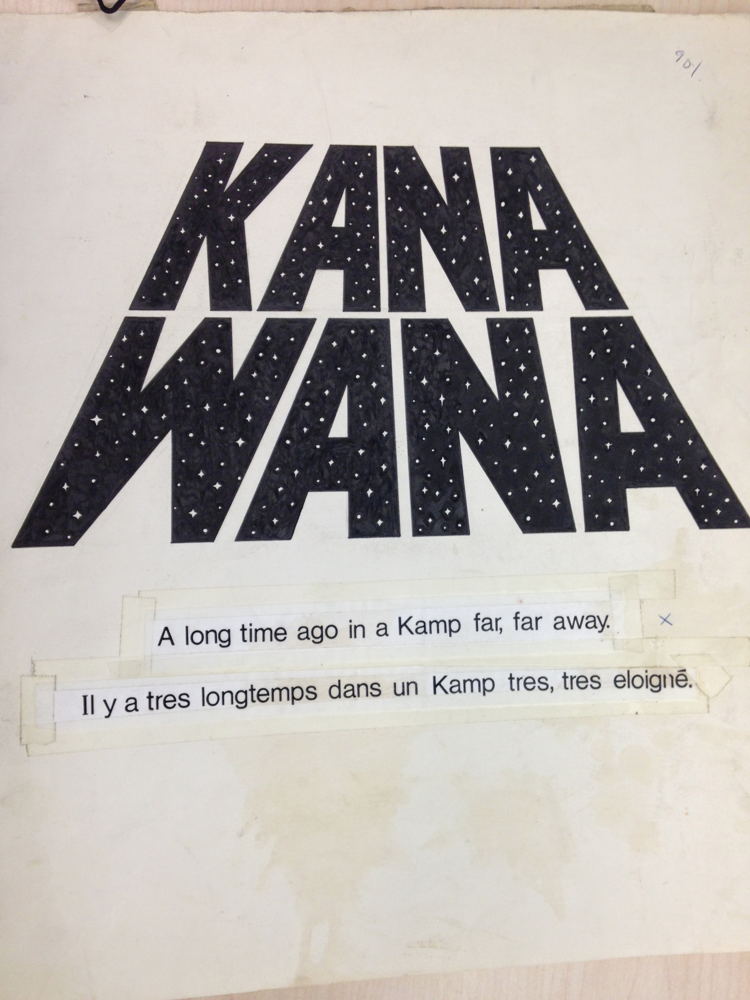
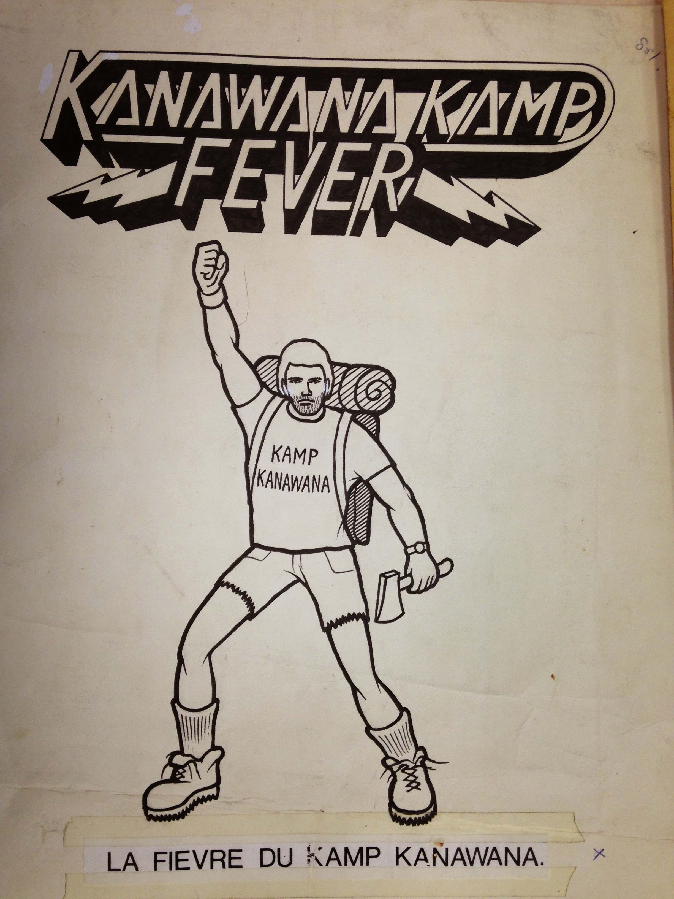
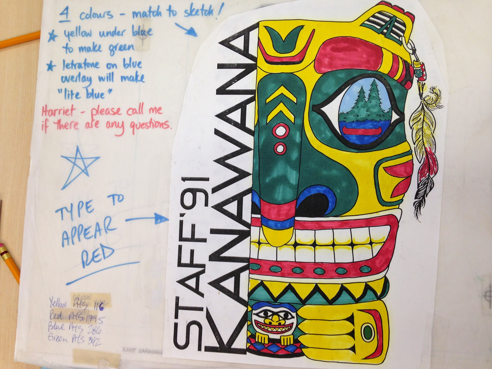
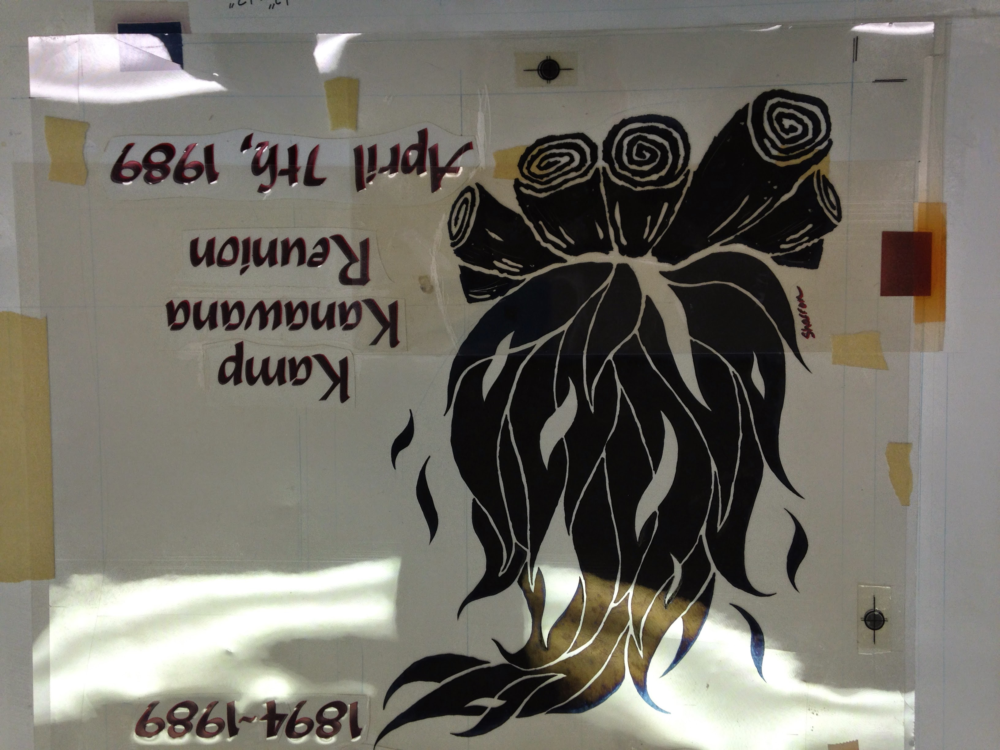
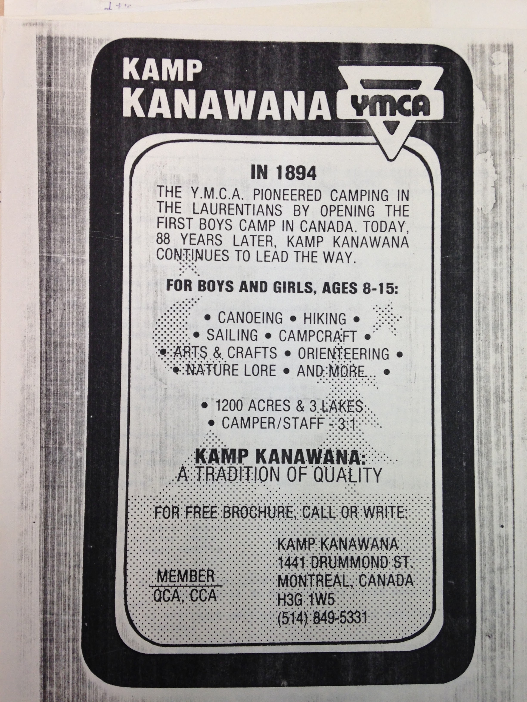
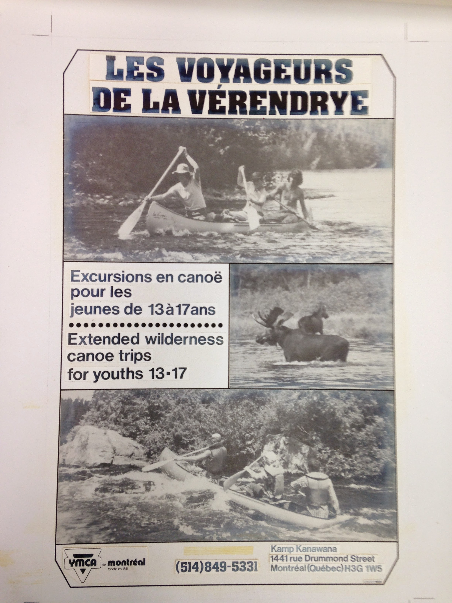

# Kanawana in Media and Culture

*Status: E1-reviewed | Sources: 19*
*Last Updated: 2026-07-11*

## Overview

Camp Kanawana has appeared in a range of media over its 130-year history, from promotional radio broadcasts in the 1930s and 1940s to a Governor General's Award-winning graphic novel in 2012. This article collects the camp's documented appearances in film, literature, journalism, and broadcast media.

## Film and Video

**1960s silent film.** A silent colour film of Kamp Kanawana from the 1960s survives in the Concordia University Archives (P0145-09-0087), showing swimming and diving activities. A YouTube access copy exists, confirmed 2026-07-09 at https://www.youtube.com/watch?v=ZrUuQ1SU7q8, titled "YMCA: Kamp Kanawana (no sound)," uploaded 2022-06-21 by Concordia University Records Management & Archives.^1

**1993 documentary.** *Kamp Kanawana: The Experience that Lasts a Lifetime* (9 minutes, colour) was produced by Laurentien Productions for the Montreal YMCA, directed by Cathy Reeves.^2 It describes Kanawana as the oldest camp in Quebec and second oldest in Canada. The film features "On My Way to Kanawana," a camp song composed and performed by Richard "Itch" Kerr (Pip Award 2007).^3 Originally released on VHS in 1996; a YouTube access copy exists.^3

## Literature

***Jane, le renard et moi*** **(2012).** The graphic novel *Jane, le renard et moi* (*Jane, the Fox and Me*) by Fanny Britt (text) and Isabelle Arsenault (illustration) is set partly at Camp Kanawana.^4 The protagonist, Hélène, dreads an English immersion class trip to Camp Kanawana (Lac Kanawana), where she faces social difficulties with her classmates. On the second-to-last evening, while sitting on the porch of her cabin, a fox approaches her — a pivotal encounter in the narrative. The book won the Governor General's Literary Award for Children's Illustration (French), the Joe Shuster Award (Writer and Artist), and was named a *New York Times* Best Illustrated Children's Book.^5 An English translation by Susan Ouriou was published by Groundwood Books in 2013. The camp's use as an English immersion destination in the novel reflects its real-world role hosting school groups.

## Radio

**CFCF broadcasts (1939, 1941).** Two promotional radio broadcasts survive as digitized audio, uploaded to the Internet Archive by Concordia University Records Management, both from CFCF Montreal — Canada's first radio station, established in 1919 from the Marconi Wireless experimental station XWA:^17
- June 10, 1939: Promoted the upcoming summer season, one of the last records of pre-war normalcy at Kanawana.^6
- June 26, 1941, 8:50 PM Thursday: Chief [[people/howie-langille|Howie Langille]] was interviewed by an announcer, promoting summer registrations and describing the 48th season, British evacuee children, 68 staff, and multi-generational attendance.^7 ^18

The Concordia Archives (P145/12B04, Communications sub-series) describe CFCF broadcasts promoting Kanawana as running from 1936 to 1941, suggesting further, not-yet-digitized broadcasts beyond these two surviving recordings.^19 See [[people/howie-langille|Howie Langille]] for the 1941 broadcast's fuller biographical context, and [[history/wartime-kanawana|Wartime Kanawana]] for its content in the camp's wartime narrative.

## Journalism

**1897 Montreal Gazette.** *The Montreal Gazette* published an article about YMCA Summer Camp Kanawana on July 7, 1897 — just three years after founding. This is the earliest known newspaper coverage of the camp.^13

**1913 Montreal Gazette.** On July 7, 1913, *The Gazette* reported two detachments of Montreal YMCA boys leaving for Kamp Kanawana, with programmes adapted for specific ages including instruction in athletics, educational subjects, and Bible study.^11

**1918 Montreal Gazette.** On July 11, 1918, *The Gazette* reported that Camp Kanawana had the largest attendance in its history with 110 members in camp, and that instruction included first aid work, basket-making, camp sanitation, wrestling, tumbling, and nature study.^13

**1942 Montreal Gazette.** On August 5, 1942, *The Gazette* reported "Y.M.C.A. Boys Stage Parade and Circus" with "Games of Luck and Skill" entertaining Kanawana campers at a week-end festival.^13 (See also [[people/rh-hanagan|R.H. Hanagan]].)

**1962 Montreal Gazette.** On November 17, 1962, *The Gazette* reported that citizenship training and educational programs for youth and young adults were planned at Kamp Kanawana.^13

**1967 Ottawa Journal.** The *Ottawa Journal* covered the arrival of Kanawana's CCA Centenary Journey paddlers on August 10, 1967, as the ten-month, 5,283-mile canoe relay reached the National Capital Region.^12

**2026 Postmedia feature.** "Rewilding childhood: How one summer camp is tackling nature-deficit disorder among Montreal youth," by Ursula Leonowicz (Postmedia Content Works, on behalf of YMCAs of Québec, March 4, 2026).^8 Featured camper Xavier Maclaren, who attended Kanawana for six summers.

## Social Media and Online Presence

**Flickr.** YMCA Camp Kanawana maintains an official Flickr photostream with over 4,400 photos documenting camp activities and history.^14

**YouTube.** The camp operates a YouTube channel ("Kamp Kanawana") with promotional and archival video content.^15

**COVID-19 coverage (CBC, 2021).** During the pandemic, Camp Kanawana's closure for 2020 and 2021 was covered extensively by CBC News. Sean Day, regional director of camps for YMCA Québec, told CBC that offering overnight services to more than 250 campers at once was not feasible with Kanawana's facilities under pandemic conditions.^16

## Stuart McLean and *The Vinyl Cafe*

Stuart McLean worked as a counsellor at Camp Kanawana for five summers beginning in 1969, eventually becoming assistant summer camp director.^9 He called it "the first place I ever felt I truly belonged." His personal and literary archive is housed at McMaster University, including manuscripts, correspondence, and photographs — a potential source for camp materials from his tenure.^10 After McLean's death in February 2017, his family established the Stuart McLean Camp Kanawana Fund to send children without financial means to camp. (See [[people/notable-alumni/stuart-mclean|Stuart McLean]].)

## Images

*“A long time ago in a Kamp far, far away” — a bilingual Star-Wars-parody t-shirt design, c.1980s. Copyright All rights reserved by Kanawana.*

*“Kanawana Kamp Fever / La fièvre du Kamp Kanawana” graphic art, c.1980s. Copyright All rights reserved by Kanawana.*

*Staff '91 t-shirt art with a Northwest-coast-style totem motif. Copyright All rights reserved by Kanawana.*

*A Kamp Kanawana Reunion silkscreen positive, 7 April 1989, marking the 95th anniversary (1894-1989). Copyright All rights reserved by Kanawana.*

*A 1982 Kamp Kanawana YMCA recruitment advertisement (“In 1894 ... 88 years later”). Copyright All rights reserved by Kanawana.*

*A “Voyageurs” program advertisement, c.1981. Copyright All rights reserved by Kanawana.*

## Open Questions

1. [Largely resolved 2026-07-09] Did Stuart McLean reference Camp Kanawana in any *Vinyl Cafe* stories or published work? A full retrieval of the McMaster fonds finding aid found two distinct camp-themed show files (Box 60/F.16 "Kamp Kanawana," Season 10 2004-05; Box 53/F.25 "Vinyl Cafe Show 2.10 Camp — Not Published," Season 2 1995-96), plus "A Letter from Camp" (already documented). No additional Dave-and-Morley narrative referencing camp was found beyond these. See [[people/notable-alumni/stuart-mclean|Stuart McLean]] for full detail.
2. Are there other published works of fiction or memoir set at or inspired by Kanawana?
3. Do any Montreal television news archives contain footage of camp events (e.g., centennial, Pip Award ceremonies)?
4. [Partially resolved, negative result 2026-07-09] The Concordia Archives hold photographs, slides, and film from multiple decades — have any been published or exhibited? Separately, the McMaster Stuart McLean fonds' own photo series (Box 97) was checked and confirmed to contain NO camp/Kanawana-tagged photographs — ruling out that specific archive as a source, though the original Concordia-held photographs remain unexamined for publication/exhibition history.

## Related Articles

- [[people/notable-alumni/stuart-mclean|Stuart McLean]]
- [[history/centennial-1967|Centennial Year (1967)]]
- [[connections/institutional-lineage/voyageur-canoe-pageant|The Voyageur Canoe Pageant]]
- [[history/founding-1894|Founding of Camp Kanawana (1894)]]
- [[people/notable-alumni/terry-mosher|Terry Mosher (Aislin)]]

## Sources

1. Concordia University Archives, P0145-09-0087 (YouTube access copy).
2. Concordia University Archives, P0145 finding aid; film listing.
3. Concordia Archives P145/SR0001 (audio recording, 4'30"); YouTube access copy.
4. Goodreads / publisher listing, *Jane, le renard et moi* (Fanny Britt & Isabelle Arsenault, La Pastèque, 2012).
5. Governor General's Literary Awards records; Joe Shuster Awards; *New York Times* Best Illustrated Children's Books list.
6. CFCF Radio Broadcast Script, June 10, 1939. Internet Archive (identifier: 1939-06-10-kamp-kanawana-broadcast-station-cfcf).
7. CFCF Radio Broadcast Script, June 26, 1941. Internet Archive (identifier: 1941-06-26-ymca-kamp-kanawana-broadcast-station-cfcf).
8. Leonowicz, Ursula. "Rewilding childhood." Postmedia Content Works, March 4, 2026.
9. Samaritanmag.com, Stuart McLean profile; CBC News, Stuart McLean obituary/fund.
10. McMaster University Library, Stuart McLean fonds.
11. "Kamp Kanawana." *The Montreal Gazette*, July 7, 1913.
12. McMorris, Grace (2023). "An Experience That Lasts a Lifetime." MA thesis, Concordia University. Figure 3.5 (Ottawa Journal coverage).
13. Montreal Gazette articles on Camp Kanawana (Newspapers.com collection): Jul 7 1897, Jul 11 1918, Aug 5 1942, Nov 17 1962. URL: https://www.newspapers.com/article/the-gazette-ymca-summer-camp-kanawana/35176458/
14. YMCA Camp Kanawana Flickr account. URL: https://www.flickr.com/photos/kanawana/
15. Kamp Kanawana YouTube channel. URL: https://www.youtube.com/c/KampKanawana
16. CBC News (April 2021). "Summer sleepaway camps in jeopardy." URL: https://www.cbc.ca/news/canada/montreal/pandemic-summer-camps-quebec-overnight-1.5995429
17. CFCF Radio Broadcast, June 26, 1941 — station history (Canada's first radio station, established 1919 from the Marconi Wireless experimental station XWA) [src_cfcf_1941].
18. CFCF Radio Broadcast, June 26, 1941 — broadcast timing (8:50 PM Thursday) and announcer interview format [src_cfcf_1941].
19. Concordia University Archives, YMCA of Montreal Fonds, sub-sub-series 12B04 (Communications) [src_concordia_atom_12B04].

## Research Notes

### Revision History

- **2026-07-11**: Enhanced the Radio section (Workstream C3) — corrected "broadcast scripts" to "digitized audio," per source records explicitly noting Internet Archive audio uploads; added CFCF station history, the 1941 broadcast's exact air time, and the archival note that CFCF-Kanawana broadcasts are documented running 1936-1941, beyond the two surviving digitized recordings. Cross-linked to the new [[people/howie-langille|Howie Langille]] article. No facts, sources, or open questions dropped.

<!-- RALPH process log (informal, not reader-facing). Considered spawning a standalone CFCF radio article per the Workstream C plan's C3 list, but the plan itself hedged this ("either its own short article or a section within Green Triangle's/here") and the material (9 KB facts) was already thin and already had a natural home in this article's existing Radio section, with fuller context already covered in wartime-kanawana.md and the new howie-langille.md -- a standalone article would have been a near-duplicate with little new value. Enhanced this section in place instead, per the same scope-discipline reasoning used for the quebec-camp-landscape.md satellite-hub decision earlier in Workstream B. -->

### R3 Verification Notes

1993 documentary confirmed via Concordia Archives finding aid and YouTube. 1960s film confirmed via Concordia P0145 fonds. *Jane, le renard et moi* Kanawana setting confirmed via publisher and reader descriptions. Awards verified via GG Awards database, Joe Shuster Awards site. CFCF broadcasts confirmed on Internet Archive. McLean camp tenure confirmed via multiple sources (Samaritanmag, CBC). McMaster archive confirmed via university library listing.

### E1 Review Notes

All claims sourced. No unsourced speculation. Encyclopedic tone. Cross-links to Stuart McLean article. Open questions specific and actionable. Film, literature, radio, and journalism sections provide comprehensive coverage of known media appearances.
