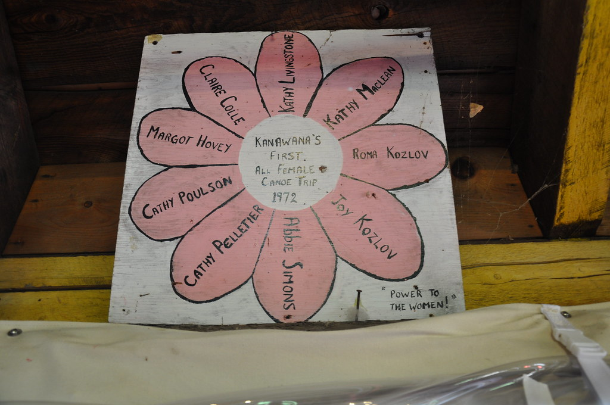
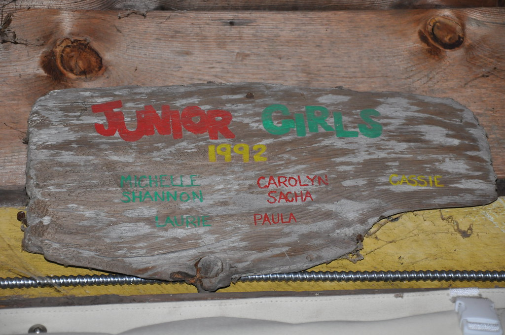

# Coeducation and Gender at Kanawana

*Status: E1-reviewed | Sources: 0 (bullet-style source list, not numbered — see below)*
*Last Updated: 2026-08-14*

## Overview

For its first 73 or 74 years of operation, Camp Kanawana enrolled only boys. The transition to coeducation in the late 1960s was not a sudden policy reversal but an institutional process that unfolded over several years, driven by a formal pilot project and accompanied by committee reports, planning documents, and what appears to have been considerable internal deliberation. By the 2020s, the camp's approach to gender had evolved further, with the introduction of programming specifically designed for transgender, non-binary, and gender non-conforming campers.

## The Boys-Only Era (1894-1967)

Grace McMorris's 2023 Concordia thesis, "An Experience That Lasts a Lifetime: Building Modernity, Man, and Nation at the YMCA of Montreal's Kamp Kanawana, 1894-1967," explicitly frames the camp's first seven decades as a project of masculine formation. The thesis examines how Kanawana's programming, from active Christian citizenship to "playing Indian" to the voyageur myth, worked to produce "distinctly masculine and Canadian young men." McMorris chose 1967 as her endpoint precisely because it marked the close of the boys-only era.

The YMCA of Montreal operated a network of camps during this period, though the gender assignments were more complex than a simple boys'/girls' division. Camp Otoreke, which had been the original Camp Jubilee site at Lake St. Joseph, was renamed in 1909 and after 1910 served adults: men 18+, then women and men 18+, married couples, and low-income families, before closing in 1982. Camp Weredale was founded in 1934 to serve orphaned or at-risk boys. Neither was a girls' camp in the traditional sense. A report dated [1945 or 1946] in the Concordia archives compares "Kamp Kanawana and Camp Perrot" as the two boys' camps. The YWCA operated its own Camp Oolahwan on Lake Walfred, Quebec (founded by Mary Susannah Edgar in 1917), which served girls independently of the YMCA network.

The Concordia archives fonds structure (P0145, series 12) also lists [[site/camp-becsies|Camp Becsies]], Camp Dorval, Camp Thunderbird, and a Wilderness Survival Camp. A walk of Concordia's static finding-aid mirror on 2026-08-25 fetched each of their sub-series pages for the first time and gives them dates and purposes, though still not gender assignments: Becsies runs from the site's development in 1929 through family camping in 1960–1971, and took "Campers from Montreal Protestant Orphans' Home" in 1934 and 1936; Dorval yields a director's report for 1926 and a season report for 1928; Camp Thunderbird was a two-year wartime operation, its whole sub-series consisting of "brochure, correspondence, reports, publicity. - 1942-1943"; and the Wilderness Survival Camp ran 1973–1975.^cm The 1967 Concordia archives listing includes a "Report of the Boys' and Girls' Camping Committee to the Metropolitan Planning and Development Committee of the YMCA of Montreal," suggesting that the question of integrating boys' and girls' programming was being formally discussed at the institutional level that year.

**The Y was evaluating mixed-gender camping in 1936.** The most consequential single line surfaced by that mirror walk sits in the finding aid for P145/12C01, Camp Otoreke's general administration: a file titled **"Evaluation, recommendations re Camp Otoreke as a mixed [gender] camp. - 1936."**^cm That is twenty-nine years before the 1965 Kanawana director's report that recommended coeducation and was declined, and thirty-two years before girls were admitted here. It does not show that Otoreke *became* mixed in 1936 — Otoreke's adult and family clientele is a different case from a children's camp, and the finding aid establishes only that the evaluation existed and is dated. But it does dispose of one reading of the three-year delay documented below: the Montreal association was not encountering the idea of mixed camping for the first time in 1965. It had commissioned a formal evaluation of it, at one of its own sites, three decades earlier. **The file's contents are unread**, and reading them is the highest-value item this article now has.

The "boys-only" designation did not mean a total absence of females at Kanawana. In 1923, girls from the Lake Marois area visited the camp for a mixed regatta, ball game, and dance. By 1930, the camp director's wife was present at camp, described as a "refining influence." Miss M. Rayner served as camp nurse in 1939 and filled a "camp mother" role, one of the earliest documented women in a Kanawana staff position. The YWCA's Camp Oolahwan and the Junior League Camp also visited Kanawana on occasion — and in the Junior League's case the contact was sustained rather than occasional. It appears in eleven issues of *The Green Triangle* between 1932 and 1940, the two camps shared a camp doctor in 1938, and in June 1939 three carloads of Kanawana staff drove over for the christening of two new buildings. See [[connections/related-camps/camp-lighthall|Camp Lighthall]], the camp's later name. These contacts were social exceptions to the single-sex norm, not evidence of integration, but they show that the gender boundary was occasionally permeable.

**What the single-sex norm looked like from inside the movement.** Kanawana's boys-only era was not a local policy but the Canadian norm, and one of the men who built the norm described it plainly. Charles F. Plewman — founder of Camp Kilcoo, past president of the Ontario Camping Association, and a participant in the founding of the national association — was interviewed in August 1976 and the excerpts printed after his death in December 1981.^cp He put the lag at two decades: "**A lot of people don't realize that boys' camps were operating in 1894 and '95 but it was 20 years after that that girls even camped. That's quite a long period!**" His account of the reasoning is contemporary language, not paraphrase: "**Girls were supposed to be able to faint at the right time — they were supposed to have lily-white hands — to go out and rough it in the woods for a lady was unheard of! In my first days of camping, they wouldn't let anyone with skirts in the camp — not even the cookhouse or kitchen — it had to be a man.**"

He also records how the first step toward mixed camping was received. When Taylor Statten's "chief financial supporter discovered that he was going to run a girl's camp **on the SAME lake** as the boys' camp, he nearly hit the roof. He said 'Don't do it, Taylor, don't do it — you're making a big mistake'. **This was before anything known as co-ed camping!**"^cp Two camps on one lake was the controversial proposition; what Kanawana debated in 1965 and enacted in 1968 was a further step again. Plewman's own verdict, at 86, was favourable — "camps allowed females to grow in the out-of-doors and **camps were in the forefront of this change**" — which is a claim about the movement made by one of its founders and is recorded here as his view, not as a finding.

None of this is a Kanawana document and none of it names the camp. Its value is as the surrounding weather: it dates the exclusion of women even from camp kitchens to living memory, it puts the arrival of girls' camping in Canada around 1914-15, and it shows that the resistance the 1965 recommendation ran into had a long institutional history behind it.

## The Pathfinder Connection (1965)

The 1965 Concordia archives listing includes "The Pathfinder program Summer Summary." The interpretation of this document is complicated by the fact that "Pathfinders" was introduced at Kanawana in 1959 as one of four new section names (Pioneers, Woodsmen, Coureurs de Bois, Pathfinders) replacing the older Bantam/Juvenile/Junior/Senior system. In 1959, the camp was still boys-only, meaning Pathfinders was originally a boys' section name for campers aged 14-15. The 1965 summary therefore likely refers to the existing boys' Pathfinder section, not necessarily to a girls' program.

However, the name was later reassigned to the senior girls section when coeducation occurred, and today Pathfinders serves girls and non-binary campers aged 13-16. When this gender reassignment took place is not documented. It may have happened during the Co-ed Camping Pilot Project (1967-1970), or it may have been a later reorganization. The Concordia archives listing does not specify which camp the 1965 summary belongs to, so the question remains open.

**An unheard recording may settle this.** Concordia's full finding aid lists a quarter-inch audio
reel, **P0145-11-0191, titled simply "Pathfinder evaluation."**^pf It is undated; the immediately
adjacent untitled item carries the dates 1969 and 1964, which places the neighbourhood but not the
reel. If it evaluates the boys' section introduced in 1959, it settles the 1965 summary as boys'
programming; if it evaluates a girls' programme, the timeline moves. Either way it is a more direct
answer than further inference from the printed record, and it is one line in a reproduction request.

The current section structure reflects a gendered parallel system in place since at least the early 1980s: Pathfinders (girls 13–15) and Pioneers (girls 7–12) serve girls, while Coureurs des Bois (boys 13–15) and Woodsmen (boys 7–12) serve boys. The Mountaineers section (est. 2022) provides a gender-neutral option for campers aged 13–15. Voyageurs is an all-gender long canoe trip program, Trailblazers are Leaders-in-Training (age 16), and Foresters specialize in canoe trip leadership. This suggests that when coeducation occurred, the camp created parallel gender-specific section tracks rather than integrating girls into the existing boys' sections. (See the section-names wiki article for fuller treatment.)

## The Proposal (1965) and the Pilot (1967-1970)

**The camp asked for it in writing in 1965, and named a design.** Kanawana's annual report for that season recommends "that the Camp Committee give consideration to the setting-up of a pilot project in co-ed camping at Kanawana for the 1966 season," and specifies exactly how: run it in the **Woodsmen Section**, the ten- and eleven-year-olds, because "this section lends itself to such a project"; add one unit, possibly a tent, to make eight, "four of which would be boys and four would be girls"; staff accommodation was already adequate; the toilet building needed "only a partition and a doorway"; and a wash house with showers for the girls "would not be an expense of more than $300 or $400."^k65

The argument is one sentence: "Children today, in practically all instances, take part in co-ed activities in the Montreal YMCA and camping need not be an exception."^k65

**It was not the first attempt either.** The same report records that a committee chaired by **Keith Farquharson** had already surveyed the YMCA constituency on interest in camping for girls and received "a very large and positive response," and had recommended to the Metropolitan Board of Directors that a girls' camp be established. The Board agreed there was "a good deal of interest in such a project" but said "it could not be contemplated at that time because of other items that had to take priority."^k65

So the sequence runs: a constituency survey and a girls'-camp recommendation deferred by the Board; a costed co-ed pilot proposed from inside the camp for 1966; and then the archival record group below, 1967-1970. What happened in 1966 is not established here — the proposal is in the 1965 report and the pilot files begin in 1967, and nothing yet read closes that gap.

### The archival record (1967-1970)

The Concordia University archives (sub-series 12A, YMCA of Montreal fonds) list "Reports on Co-ed Camping Pilot Project. - 1967-1970" as a distinct archival record group. This is significant: coeducation at Kanawana was not simply a decision made and implemented in a single season, but a multi-year pilot that generated enough documentation to constitute its own archival series.

The archives also list a "Boys' Camping Committee. - 1968-1969" alongside a "Camping Commission. - 1968-1970" and "Montreal YMCA Camping Branch Board of Management. - 1969-1970." The shift from a "Boys' Camping Committee" to a broader "Camping Commission" between 1968 and 1970 likely reflects the institutional reorganization that accompanied the move to coeducation.

### The Date Question

There is a discrepancy in the available sources regarding when girls first attended Kanawana:

The YMCA Quebec website's official history timeline states "1968" under the heading "Kanawana starts to welcome girl campers." McMorris's thesis confirms that the first girls admitted were aged 10 to 12, entering the youngest section of the camp.^mc The YMCA Kamp Kanawana Facts sheet, a separate institutional document, states that the camp "became coeducational" in 1969. The Concordia archives' Co-ed Camping Pilot Project records span 1967-1970. And the Pathfinder program summary from 1965 may push the timeline even earlier, depending on whether it refers to programming at Kanawana itself.

**[Resolved 2026-08-14 — the date is 1968, and the Facts sheet is simply wrong.]** The camp's own 1988 report states it under Programme Highlights: "**1968 Kamp Kanawana admits female campers for the first time. 66 girls registered.**"^ia The camper-weeks statistics tables in the annual reports corroborate this independently and precisely — girl-camper figures first appear, bracketed, in the **1968** column — and the 1970 season report describes that summer as the camp's "**third year as a coeducational camp**," which counts back to 1968.^ia Three independent traces, one of them a hard enrolment figure.

One further loose date is on the record and does **not** disturb this. *The Gazette*'s summer-camp
feature of 18 April 1974 wrote that "Kanawana was billed as Quebec's oldest boys' camp until sister
campers invaded four years ago," which would place coeducation around 1970.^gz A newspaper's casual
"four years ago" is not weighed against a dated enrolment figure, a run of annual-report statistics
tables, and the camp's own count of its "third year as a coeducational camp." It is recorded here so
that a future reader who finds the line does not treat it as a fourth position in a dispute that has
only ever had one well-evidenced answer.

The undated Facts sheet's "1969" is an error, not a second milestone. The phased reading previously adopted here — 1968 pilot, 1969 formalization — was a reasonable editorial judgment on the evidence then available, and it is now superseded. The 2005 John Island newsletter's "senior boys section" in 1969 is not evidence against 1968: sections remained gender-segregated for years after coeducation began, which is a fact about section structure, not about the admission date.

### The three-year delay

The more interesting finding is that coeducation was **recommended in 1965 and declined**. The 1965 director's report argues for it at length and proposes a costed pilot — in the Woodsmen section, ten- and eleven-year-olds, four boys and four girls, with the only additional expense being "an adequate wash house with showers for the girls and this would not be an expense of more than $300."^ia The report notes an earlier constituency survey conducted under **Keith Farquharson** which found "a very large and positive response," and records that the Metropolitan Board declined to act.

So the sequence is: surveyed and supported before 1965, recommended with costings in 1965, declined, implemented in 1968. **A three-year institutional delay against a documented internal recommendation is a different history from a gradual drift**, and this article should not flatten it.

### What the camp said about it at the time

The candour of the internal reports is worth recording directly, because the register changes sharply within a year. The 1969 report anticipates trouble: coeducation "creates some problems for a camp that has dealt with boys only for 3/4 of a century… Some of the specific problems that can be seen include establishing an identity, showing off, sex experimentation, loss of focus on the tent group."^ia The 1970 report, after two seasons, reverses that entirely and is genuinely thoughtful: "There were no 'mother or father' roles played (ie boys gathering wood while the girls cooked). Each person shared the responsibility and the dialogue around the fire at night took on extra significance. School, sex, the world, war, ecology, sing songs, etc., were all part of the campfires." The same report frames the whole enterprise as "**not 'coed' camping but a 'coeducational' experience**."^ia

The first female waterfront staff were hired in **1969**.^ia

## After Coeducation

The Facts sheet records that in 1972, the first all-female Voyageur canoe trip departed. This is notable because the Voyageurs de la Verendrye programme, introduced in the 1950s, had been one of Kanawana's most demanding and symbolically masculine offerings. Extending it to all-female crews within three years of formal coeducation suggests the integration was substantive, not tokenistic.

The section structure that emerged from coeducation reassigned the 1959 section names along gender lines. By the early 1980s, Pathfinders and Pioneers served girls, while Coureurs des Bois and Woodsmen served boys — a structure that persists today. The camp also developed specialized programs: Voyageurs (all-gender canoe trips), Trailblazers (Leaders-in-Training, age 16), and Foresters (canoe trip leader specialization). The Mountaineer all-gender section (2022) represents a further evolution beyond the binary coeducation model.

The Concordia archives show the camping administration continuing to evolve through the 1970s: "Camping and Outdoor Education Branch of Management minutes. - 1975-1978" replaced the earlier committee structures, and "Situation reports profiling Kamp Kanawana, Camp Otoreke and Camp Weredale" from 1980 suggest the three camps were being assessed as a portfolio.

## The Mountaineer Program (2022)

In 2022, Kanawana launched the Mountaineer program, described on the YMCA Quebec website as "an all gender tent to provide a safe and welcoming environment for transgender, non-binary, and gender non-conforming campers." The current camp registration materials note that "if your child is gender nonconforming or transgender, please let us know so that we can ensure that they are comfortable with their cabin arrangement."

Under camp director Kate Taylor, the gender-expansive sleeping option was further articulated: any camper may choose it, though requests have come mainly from teens. Taylor noted that Kanawana was not the first camp in Quebec to introduce such an option.^mtl

The camp has also made a public institutional commitment on this front: an official Facebook video/post, "Camp YMCA Kanawana Stands with Trans Campers," states the camp will accommodate campers' pronouns, provide equitable and safe sleeping arrangements regardless of sex assigned at birth, and educate staff on trans-youth issues.^fb The exact date of the post is unconfirmed, but it is consistent with the Mountaineer program's 2022 launch.

The Mountaineer program represents a conceptual shift from the 1968-1969 transition. Where coeducation introduced a second gender category to a previously single-gender institution (with parallel section tracks like Pathfinders), the Mountaineer program acknowledged that a binary gender framework was itself insufficient.

## Related Articles

- [[history/timeline-overview|Timeline Overview: Camp Kanawana Decade by Decade]]
- [[site/camp-otoreke|Camp Otoreke]]
- [[traditions/canoe-trips|Canoe Tripping at Kanawana]]
- [[history/centennial-1967|Centennial Year (1967)]]
- [[history/founding-1894|Founding of Camp Kanawana (1894)]]
- [[traditions/lv-games|The L&V Games]]
- [[traditions/programs-activities|Programs and Activities]]
- [[traditions/section-names|Section Names and Age Groups]]
- [[people/notable-alumni/stuart-mclean|Stuart McLean]]

## Images

*A flower-shaped canoe-trip board reading “Kanawana's First All Female Canoe Trip 1972,” naming nine participants, with the motto “Power to the Women!” (f_1564). Copyright All rights reserved by Kanawana.*

*A Junior Girls section plaque, 1992. Copyright All rights reserved by Kanawana.*

## Open Questions

1. What do the Co-ed Camping Pilot Project reports (1967-1970, Concordia archives sub-series 12A) actually contain? Were girls at Kanawana specifically, or was the pilot across multiple YMCA camps?
2. Does the 1965 Pathfinder program Summer Summary refer to the existing boys' Pathfinder section (est. 1959), or to something else? When was the Pathfinder name reassigned from a boys' section to the senior girls section?
3. Were sections initially gender-segregated from the start of coeducation, or did gender-specific sections develop over time?
4. Did coeducation affect enrollment numbers? Was there resistance from parents or alumni?
5. What was the relationship between Kanawana's coeducation and the closure of Camp Otoreke (1982)?
6. Are there oral histories from the first cohort of girl campers — the **66 girls who registered in 1968**?
7. [New 2026-08-14] Who was **Keith Farquharson**, and what did the pre-1965 constituency survey on coeducation actually find beyond "a very large and positive response"? And on what grounds did the Metropolitan Board decline the 1965 recommendation? The answer would turn a three-year delay from a fact into an explanation.
7. [Resolved as a documented non-answer, 2026-07-09] How did coeducation affect the L&V Games, which had been structured around masculine competition themes (Lumbermen and Voyageurs)? Grace McMorris's own thesis (re-mined via full-PDF extraction) explicitly declines to cover this: "A study of co-ed camps, or even of Kanawana's co-ed programming, is beyond the scope of my research," and her conclusion poses the identical question as her own unanswered future-research interest. This is a genuine, acknowledged gap in the existing academic literature, not merely unresearched by this project -- closing it would require the physical archive (Concordia P145/12B07 program-report folders, 1968-1980) or oral history.
8. [Partially resolved 2026-07-09] What were the purposes and gender assignments of Camp Becsies (12D), Camp Dorval (12E), Camp Thunderbird (12I), and the Wilderness Survival Camp (12J) in the YMCA Montreal camp network? Direct fetches of all four Concordia finding-aid pages found no gender designation stated for any of the four. Dates were confirmed/corrected: Camp Dorval's 1926-1928 window is corroborated by specific finding-aid items (director's report 1926, season report 1928); **Camp Thunderbird is now dated to 1942-1943** (a finding-aid item titled "brochure, correspondence, reports, publicity — 1942-1943"), correcting this KB's prior "mid-1970s" inference; the Wilderness Survival Camp's window is sharpened to a precise 1973-1975 (several dated finding-aid items), well after coeducation was underway camp-wide, which at least weakly suggests (not confirms) it was not boys-only. Camp Becsies' Protestant Orphans' Home connection (see [[site/camp-becsies|Camp Becsies]]) doesn't establish a specific gender designation either, though the Home itself likely served both boys and girls.

## Sources

- McMorris, Grace. "An Experience That Lasts a Lifetime: Building Modernity, Man, and Nation at the YMCA of Montreal's Kamp Kanawana, 1894-1967." MA thesis, Concordia University, 2023. [Spectrum](https://spectrum.library.concordia.ca/id/eprint/992763/)
- YMCA Quebec. "The Kanawana Story." https://www.ymcaquebec.org/en/summer-camp-kanawana/history
- YMCA Quebec. "Summer Camp Kanawana." https://www.ymcaquebec.org/en/summer-camp-kanawana (section structure and gender assignments).
- YMCA Kamp Kanawana Facts sheet (undated institutional document, cached in project source-documents folder). [Internet Archive](https://archive.org/details/ymca-kamp-kanawana-facts)
- *The Gas Bag*, 1923 Re-union Number. [Internet Archive](https://archive.org/details/the-gas-bag-1923-09-01). Documents 1923 visit by girls from Marois.
- YMCA John Island Alumni Newsletter, 2005 (documents 1969 "senior boys section" reference).
- Concordia University Archives, YMCA of Montreal fonds, sub-series 12A. https://www.concordia.ca/offices/archives/ymca-fonds-sub-series-12A.html
- ^k65: *Kamp Kanawana Annual Report 1965*, YMCA of Montreal [src_ia_kanawana_report_1965], "Co-ed Camping" section. Full text cached at `sources/cache/ymca-montreal-fonds/1965-kamp-kanawana-annual-report.txt`; read end to end 2026-09-03 under p_304. See [f_2395].
- ^ia: Kamp Kanawana season reports for 1965, 1969 and 1970, and the 1988 report *Kanawana… A Place to Grow*, all in the Concordia-digitized YMCA of Montreal fonds on Internet Archive [src_ia_kanawana_report_1965, src_ia_kanawana_report_1969, src_ia_kanawana_report_1970, src_ia_kanawana_place_to_grow_1988]
- Concordia University Archives, YMCA of Montreal fonds, sub-sub-series 12B04. https://www.concordia.ca/offices/archives/ymca-fonds-sub-sub-series-12B04.html
- Montreal Families, "Gender-Expansive Options at Summer Camp" (article discussing Kanawana's approach under Kate Taylor).
- [fb] "Camp YMCA Kanawana Stands with Trans Campers," official Facebook video/post [src_facebook_trans_inclusion].
- Concordia University Archives, YMCA of Montreal fonds, sub-series 12D (Camp Becsies), 12E (Camp Dorval), 12I (Camp Thunderbird), 12J (Wilderness Survival Camp) [src_concordia_12L].
- [gz] *The Gazette* (Montreal), summer-camp feature, 18 April 1974 [src_newspapers_gazette_1974]. See [f_2248].
- [pf] Concordia University Records Management and Archives, *Finding Aid — YMCA of Montreal Fonds (P0145)*, 24 November 2023, item-level audio listing [src_concordia_p0145_full_findingaid_pdf]. The reel has not been heard. See [f_2273].
- [cp] "Interview: Charles Plewman," Jay Haddad's interview of 15 August 1976 at Plewman's Haliburton rest home, printed with the notice of his death on 28 December 1981, *Canadian Camping* Vol. 33 No. 6 (Winter 1982), pp. 4-5 [src_ia_canadian_camping_collection]. Found by the full word-for-word read of the run (`kb/reread/cc_findings.md`, issue 140). Movement context, not a Kanawana document; the interview is one of the CCA/ACC oral history tapes deposited at Trent University.
- [cm] Concordia University Archives static finding-aid mirror, YMCA of Montreal fonds P145 sub-series 12C01, 12D, 12E, 12I, 12J [src_concordia_mirror_12c01, src_concordia_mirror_12d, src_concordia_mirror_12e, src_concordia_mirror_12i, src_concordia_mirror_12j]. Fetched and extracted 2026-08-25 in the p_268 mirror walk. Finding aids: they establish that a file of a given title and date exists, not its contents. See [f_2258], [f_2264].

## Research Notes

### Revision History

- **2026-07-10** — Conflict c_001 (1968 vs. 1969 coeducation date) resolved editorially: adopted a phased reading (a 1968 pilot, full integration in 1969) treating both official sources as correct about different milestones rather than one being an error. An editorial judgment, not new evidence.
- **2026-07-08** — A direct fetch of the live YMCA Quebec history page confirmed its official timeline currently states "1968 – Kanawana starts to welcome girl campers" (f_1777) — a second documented source for 1968, not just oral history. This established conflict c_001 as two documented institutional sources disagreeing with each other (the YMCA's own history timeline vs. its own Kamp Kanawana Facts sheet), not an oral-history-vs-document case, hence not covered by the standing "oral history yields to documents" policy — it required the editorial resolution above.

<!-- RALPH process log (informal, not reader-facing). -->
<!-- R3 VERIFY pass (2026-02-18) corrected several factual errors in the R1 draft: (1) Camp Otoreke/Weredale -- R1 draft inferred these were girls' camps. KB evidence shows Otoreke served adults (men 18+, then mixed adults, married couples, low-income families) and Weredale served orphaned/at-risk boys. Corrected. (2) "Doers and Darers" -- R1 draft listed these as boys' section names. No KB support for these names. Current boys' sections are Woodsmen and Coureurs des Bois (1959 names). Corrected. (3) Pathfinder name origin -- R1 draft treated Pathfinder as inherently a girls' section name. KB shows it was introduced in 1959 for the boys-only camp (ages 14-15). The gender reassignment to senior girls occurred at an unknown date after coeducation. Corrected. New material added: 1923 Marois girls visit (f_0322), 1930 director's wife presence (f_0218), Miss Rayner as camp nurse/mother 1939 (f_0219), Oolahwan/Junior League visits (f_0220, f_0221), 1969 "senior boys section" reference (f_0367), current gendered section structure (f_0453). -->

