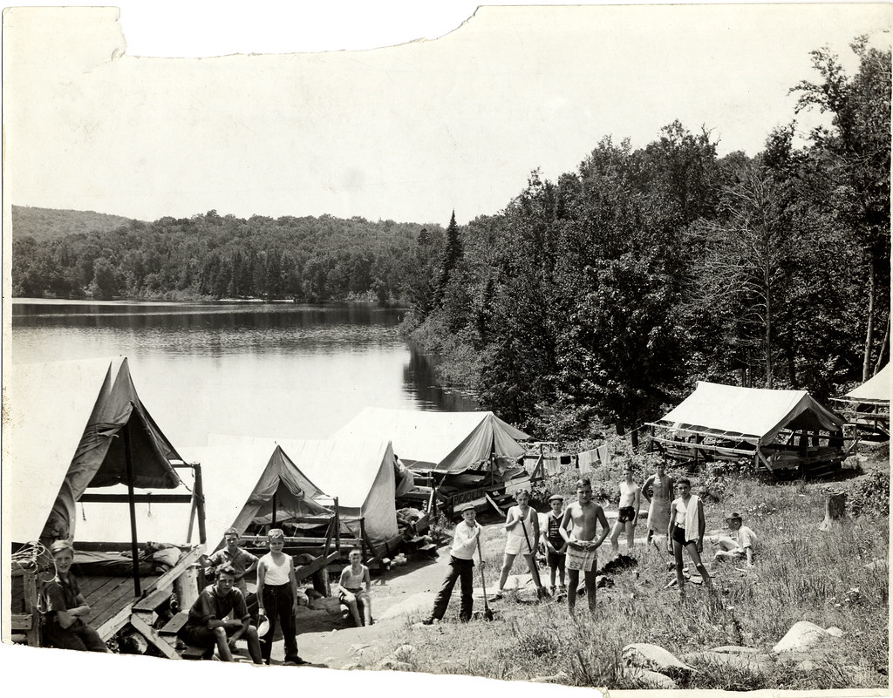
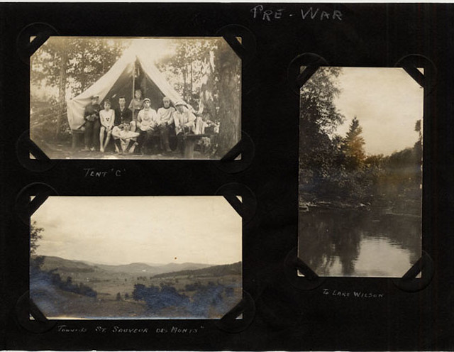
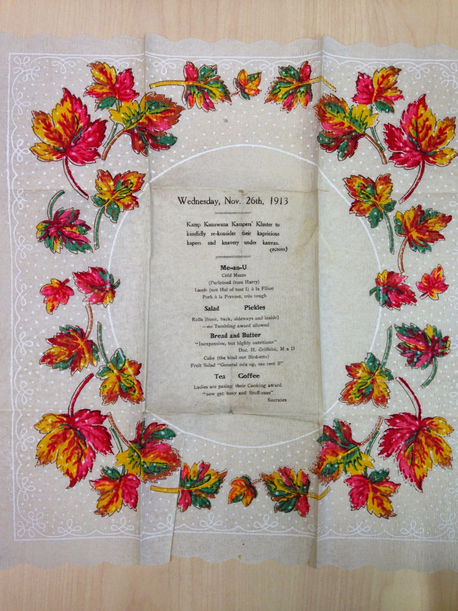

# Camp Kanawana: Founding and Early History (1892-1923)

*Status: E1-reviewed | Sources: 0*
*Last Updated: 2026-07-10*

## Summary

The origins of Camp Kanawana involve two distinct sites and a founding sequence that spans at least three years. In 1892, [[people/cushing-family|Lemuel Cushing]] of the Montreal YMCA brought a group of boys to Lake Saint-Joseph in the Township of Howard (now Saint-Adolphe-d'Howard), near Sainte-Agathe. By 1893, organized camping activity was underway there, with camper lists, fishing rights, and financial records documented in the Concordia archives. In the summer of 1894, [[people/billy-ball|Billy Ball]] formally established Camp Jubilee at the same lake, taking approximately 20 campers to islands in Lake St. Joseph. The name "Jubilee" commemorated the YMCA's fiftieth anniversary (founded 1844, jubilee year 1894). The YMCA subsequently purchased the main island and two others for leadership training.

Around 1910, seeking a larger site, the YMCA acquired land at Saint-Sauveur-des-Monts (near Piedmont) from the Page family. This became the permanent Camp Kanawana and has operated continuously since. A 1935 document describes Kanawana as being in its "twenty-sixth year of existence," counting from the 1910 site acquisition. A 1941 CFCF radio broadcast by Chief Howie Langille describes it as the camp's "48th season," counting from the 1894 founding. Both countings were used contemporaneously, which explains the ongoing ambiguity about whether the camp was "founded" in 1894 or 1910.

## Precursors: Cushing and the Lake St. Joseph Trips (1892-1893)

According to the Quebec Anglophone Heritage Network (QAHN), Lemuel Cushing brought a group of boys to Lake Saint-Joseph in Saint-Adolphe-d'Howard in 1892. The Concordia archives (fonds P145, sub-series 12L) contain camper lists, financial records, and fishing rights documentation dating to 1893, confirming organized activity at the site a full year before the conventional 1894 founding. Separately, sub-series 12A holds a "Report — trip to St. Agathe" dated 1893/1895, described as the "Journal of the first Montreal YMCA venture to explore the country round about St. Agathe with the view of securing a lake on which to establish a Summer Camp." This document confirms the YMCA was actively scouting the Laurentian territory for a permanent camp site as early as 1893. Whether 1893 represents a continuation of Cushing's initiative or a separate test run by Ball is not established. A colonization map of the area north of Montreal was archived from 1894, suggesting continued scouting activity.

The relationship between Cushing's 1892 trip and Ball's 1894 Camp Jubilee remains unclear. They may represent successive stages of the same initiative, with Cushing's trip being an informal precursor and Ball's the formal institutional launch. A direct re-read of the QAHN article (2026-07-09) confirms this ambiguity is real, not a research gap: the article treats the two as separate, non-linked mentions with no stated causal or organizational relationship, and does not mention Billy Ball at all. The only material that could resolve this — W.E. Cushing's 1943 "Historical sketches — Lake St. Joseph" and R.L. Charlton's 1943 "Notes re Early Days," both in Concordia Box HA2307 — exist only as physical, non-digitized items.

Two YMCA institutional publications confirm — by their silence — that no permanent camp existed before 1894. The 41st Annual Report of the YMCA of Montreal (published May 19, 1892) states the Association had no suitable grounds: "The Out-door Work suffers from the disadvantage of not owning suitable grounds," with land priorities centred on an athletic ground at Point St. Charles rather than a rural camp.^br Likewise, the 1901 *Historical Sketch of the YMCA of the City of Montreal, 1851-1901*, prepared for the YMCA's own jubilee, contains no reference whatsoever to summer camping — all of its "camp" references concern militia camps.^br That a 50-year retrospective written in 1901 omits the camp suggests that, even seven years after Camp Jubilee's 1894 founding, summer camping was not yet regarded as a significant institutional program. The Cushing family appear in both documents as YMCA officers (Charles, Walter, and P.H. Cushing in 1891-92), but in connection with governance, not camping.^br

## Camp Jubilee at Lake St. Joseph (1894-c.1910)

In the summer of 1894, Billy Ball of the Montreal YMCA took approximately 20 campers to Lake St. Joseph in the Township of Howard (now Saint-Adolphe-d'Howard), near Sainte-Agathe. The camp was situated on islands in the lake, with a landing area on the shore. Fifty-three members used the site that first summer.^mc The YMCA subsequently purchased the main island — part of a 33-acre property acquired in 1898 at a cost of one dollar per acre — along with two other islands for continued use.^mc

The early camp was primitive: half a dozen sleeping tents, a dining marquee, and a small fleet of basic boats rented from local farmers.^mc Campers took the train to Sainte-Agathe, then endured a two-hour drive by horse and springless buckboard to reach the site.^mc By 1903, 210 campers attended, a fourfold increase from the first year.^mc

Camp Jubilee operated at this location for roughly fifteen years. By 1895, promotional letters were being distributed and the camp had established rules for activities including a Labour Day fishing competition. By 1897-1898, the operation had grown substantially: brochures were being printed, architectural plans for permanent buildings were being drawn up, and the camp had accumulated a scrapbook of materials (the Concordia archives confirm it contains a promotional brochure from the 1897 season, though the full date range of the scrapbook is uncertain and its start date of "1880" may reflect general YMCA history rather than camp-specific records).

An 1898 photograph from the archives names four individuals at the camp: W. N. Cunningham, Jim Brown, Frank L. Benedict, and [[people/ralph-dawson|Ralph H. Dawson]]. Dawson would later author a history of the camp in 1933, suggesting decades of personal involvement.

**John Roy** served as camp director by at least 1901, as evidenced by his letters to a Mr. Budge preserved in the Concordia archives (sub-series 12L). Roy is the earliest identified director of the camp, filling a gap that had long puzzled the project: who ran Camp Jubilee between its founding and the emergence of named leaders in the 1920s? Roy's correspondence with Budge suggests a formal reporting relationship; Budge is now identified as [[people/da-budge|Daniel Andrew Budge (1851-1933)]], General Secretary of the Montreal YMCA from 1874 to 1913 — a tenure that brackets the entire Camp Jubilee era. No other directors between Roy and Philip Paterson (documented in 1923) have been identified, though Concordia's finding aid for sub-series 12L lists a specific, as-yet-unread "Director's report (1908)" (Box HA2312) — a dated record from the middle of this 22-year gap that would very likely name whoever was director that year if physically consulted.

## Acquisition of the Saint-Sauveur Site (c.1910)

Seeking a larger site, the YMCA acquired land at Saint-Sauveur-des-Monts (near Piedmont) from the [[people/page-family|Page family]] around 1910. The camp was situated among trees on the high sloping shores of a lake that would become known as Lake Kanawana, approximately 45 miles from Montreal and 6 miles from the Piedmont train station. A second lake, Lake Wilson, was within the property, with a dam controlling water levels between the two. A third lake, Round Lake, was also part of the camp property.

McMorris confirms 1910 as the first season at the new site: during the first summer at Saint-Sauveur, sixty-six members attended camp between June 19 and July 17.^mc The 1910 date is further supported by the 1935 History, which describes the camp as being in its "twenty-sixth year of existence." The exact terms of the Page family acquisition, including price, acreage, and precise date, remain unknown. McMorris's archival figure of 66 attendees is weighted over the YMCA's own current website, which states 85 (read as imprecise institutional narrative copy, possibly conflating registrations with attendance or including Camp Otoreke, which continued operating at Lake St. Joseph that same season) — an editorial call between two documented sources, not new evidence; see Revision History.

The Pagé family were not the only pre-camp landowners at the site. Olivier Charron (1830-1902) became owner of lot 280, described as "located at Lac Kanawana," in 1887 -- seven years before the YMCA's 1894 founding of the camp (at that point still Camp Jubilee, on a different lake) and roughly 23 years before the 1910 Saint-Sauveur acquisition. Charron's holding is documented on the same Ville de Saint-Sauveur pioneer-families page used for the Pagé genealogy, citing Lorraine Dagenais and Carmelle Huppé's local history book.^charron See [[people/page-family|The Pagé Family of Saint-Sauveur]] for the family whose land the YMCA did acquire.

Separately, a Quebec government cultural-heritage registry entry for the YMCA (Répertoire du patrimoine culturel du Québec, id 8364) independently corroborates the 1894 founding date, describing Kanawana as the YMCA's first vacation camp located outside the city.^rpcq

## Early Organization at the Saint-Sauveur Site (1910s-1920s)

McMorris confirms 1910 as the first season at the new site, with sixty-six members attending between June 19 and July 17. Of those sixty-six, thirty-one boys "decided for the Christian life," reflecting the YMCA's evangelistic mission.^mc By 1912, Kanawana served boys from four YMCA branches: Westmount, Point St. Charles, North, and Central.^mc

A July 7, 1913 article in the Montreal Gazette reported two detachments of Montreal YMCA boys leaving for Kamp Kanawana, with a programme adapted for specific ages including instruction in athletics, educational subjects, and Bible study. Speakers included M.F. Furey (physical director) and Dr. Hamilton.

A Montreal Gazette article from July 7, 1897, titled "YMCA Summer Camp Kanawana," is the earliest known newspaper reference to the camp — three years after founding.^gaz1897 By 1918, the camp had its largest attendance to that date (110 members). Activities that year included first aid, basket-making, camp sanitation, wrestling, tumbling, and nature study. In July 1918, the camp was visited by Mr. and Mrs. Frank Lawes of London, England, who were touring the world filming YMCA work; a reel of Kanawana activities was added to their collection, potentially the earliest film footage of the camp if it survives.

By 1923, the camp was a sophisticated operation with a staff hierarchy reflecting the broader YMCA organizational structure. Philip G. Paterson, B.A., who served as Boys' Work Secretary at the Westmount YMCA, led the camp. Two divisions, Younger boys (12-15) and Older boys (16-18), offered 32 subjects for Honour Awards, from Bible Study and Nature Study to Swimming, Canoeing, and Life Saving.

Staff in 1923 included connections to McGill University: the Camp Doctor was a McGill medical student, the Senior Division head was a McGill theology student, the entertainment director was editor of the McGill Daily. These ties point to the camp's deep roots in Montreal's Anglo-Protestant educational institutions.

Notable is the longevity of camp connections even at this early date: Reg Cowan, the Business Manager, had eight years of Kanawana experience by 1923, meaning his involvement dated to approximately 1915 or 1916. Allan B. Cornell, the Educational Director, was in his sixth year, dating to approximately 1918.

The cost in 1918 was $8.00 per week, rising to $8.50 per week by 1923, including one return trip between Montreal and camp.^mc In 1922, 391 campers attended, including 16 "unattached" non-YMCA members — an early sign of the camp's gradual opening beyond its institutional base.^mc By the 1930s, Kanawana was fully open to non-YMCA members.^mc

## Physical Plant by the 1920s-1930s

The 1923 brochure and 1935 history together describe a camp that had grown into a substantial physical operation. Two large pavilions served dining and recreation (the latter equipped with a fireplace). The waterfront featured a flotilla of boats and canoes, four diving boards, and a zinc slide into the lake. Elsewhere on the property stood an open-air chapel, a [[site/council-ring|Council Ring]] for woodcraft meetings, an icehouse, a hospital building, and a golf course. Water came from two mountain spring wells. Boys slept in tents with wood floors, each housing 8-10 campers with a counsellor.

## Images

*Early tent camp on the lakeshore, one of the oldest surviving photographs of the site. Pre-1949 photograph — public domain in Canada.*

*Camp staff, 1915 — the earliest dated staff photograph in the archive, from the period after founding-era director John Roy. Pre-1949 photograph — public domain in Canada.*

*Camp Kanawana in its first years, 1900-1914. Pre-1949 photograph — public domain in Canada.*

*Menu and placemat from a 1913 reunion banquet. Copyright All rights reserved by Kanawana.*

## Open Questions

- [Re-confirmed dead end 2026-07-09] What were the terms of the Page family land acquisition (date, price, acreage)? See [[people/page-family|The Pagé Family]] for the fullest treatment; Quebec's Registre foncier (requires a specific lot number plus a paid account) and direct SHGPH contact remain the only unexhausted paths.
- ~~When was the name "Kanawana" adopted?~~ [Resolved] The name "Kanawana" was adopted around 1910 when the camp moved to the Saint-Sauveur site. Camp Jubilee at Lake St. Joseph was never called Kanawana.^mc
- [Re-confirmed dead end 2026-07-09] What is the exact relationship between Cushing's 1892 trip and Ball's 1894 Camp Jubilee? A direct re-read of the QAHN article confirms the two are presented as separate, non-linked mentions — this is a genuine documentation gap, not an under-researched question. Resolvable only via physical access to two undigitized 1943 manuscripts in Concordia Box HA2307.
- [Advanced 2026-07-09] Who was camp director between John Roy (1901) and Philip Paterson (1923)? Still unidentified, but a specific new archive target now exists: Concordia sub-series 12L, Box HA2312, "Director's report (1908)" — a single dated record squarely in the gap, not previously logged.
- ~~What happened to the Lake St. Joseph islands after the move to Saint-Sauveur?~~ [Resolved, cross-referenced 2026-07-09] The site was renamed Camp Otoreke in 1909 and continued operating independently as a YMCA family/low-income camp; it closed in 1982 and the property was sold in 1987. See [[site/camp-otoreke|Camp Otoreke]] for the full chain of facts; a single uncorroborated post-1987 ownership claim remains disputed/low-confidence.
- ~~What was Mr. Budge's full name and role in the YMCA camping program?~~ [Resolved, cross-referenced 2026-07-09] Daniel Andrew Budge (1851-1933), General Secretary of the Montreal YMCA, 1874-1913. See [[people/da-budge|D.A. Budge]] for his full biography; his specific role in the decision to acquire the Saint-Sauveur site remains a separate, still-open question tracked on that article.

## Related Articles

- [[history/timeline-overview|Timeline Overview: Camp Kanawana Decade by Decade]]
- [[people/directors-index|Directors and Staff of Camp Kanawana]]
- [[site/the-kanawana-site|The Kanawana Site]]
- [[connections/institutional-lineage/canadian-camping-movement|The Canadian Camping Movement]]

## Sources

- YMCA Quebec official history page (ymcaquebec.org/en/summer-camp-kanawana/history)
- QAHN article: "The YMCA Camp of Saint-Adolphe d'Howard" (qahn.org)
- Concordia University Archives, YMCA of Montreal fonds P145, sub-series 12L (Lac St-Joseph/Camp Jubilee)
- Concordia University Archives, YMCA of Montreal fonds P145, sub-series 12B (Kamp Kanawana)
- 1923 Kanawana brochure (previously extracted)
- 1935 History of Kamp Kanawana (Internet Archive, djvu.txt extraction)
- 1941 CFCF radio broadcast script (Langille)
- Montreal Gazette, July 7, 1897: "YMCA Summer Camp Kanawana" — earliest known newspaper reference [src_gazette_1897]
- Montreal Gazette, July 11, 1918: "At Camp Kanawana" — record 110 attendance, YMCA London filming [src_gazette_1918]
- ^br: YMCA of Montreal 41st Annual Report (1892) and Historical Sketch of the YMCA of Montreal 1851-1901, both on Internet Archive; retrieved via operator browser research, June 2026 [src_ia_ymca_annual_1891_92, src_ia_historical_sketch_1901]
- ^charron: Ville de Saint-Sauveur, "Les familles pionnières de Saint-Sauveur," citing Dagenais, Lorraine and Carmelle Huppé, *Saint-Sauveur: Son histoire, notre patrimoine* [src_vss_familles_pionnieres]
- ^rpcq: Répertoire du patrimoine culturel du Québec, "Young Men's Christian Association" (id 8364) [src_rpcq_ymca_8364]

## Research Notes

### Revision History

- **2026-07-10** — Conflict c_005 (1910 attendance: 66 vs. 85) resolved editorially in favour of McMorris's archival figure (66), weighted over the YMCA's own promotional website (85, read as imprecise institutional copy). An editorial call between two documented sources, not new evidence.
- **2026-02-05** (v3, E1 review) — Qualified the scrapbook date range claim (1880 start date likely reflects general YMCA history, not camp-specific). Expanded John Roy section with analysis of the Budge correspondence and its implications. Added Budge as an open question. Tightened prose in Physical Plant section. Promoted 1893 evidence significance in Precursors section.
- **2026-02-05** (v2, R3 verification) — Corrected a critical geographic error: the article previously implied Camp Jubilee was near the current Saint-Sauveur site. In fact, Camp Jubilee operated at Lake St. Joseph in Saint-Adolphe-d'Howard (near Sainte-Agathe), a completely different location roughly 40km north of the current Kanawana site; the move to Saint-Sauveur occurred around 1910. This revision also added Lemuel Cushing as a 1892 precursor figure, John Roy as earliest known director (1901), clarified the island-based nature of the original Camp Jubilee site, and removed an unverified 85-camper claim (the same claim later reconsidered, with sourcing, as conflict c_005 above).
- **2026-02-05** (v1) — Initial draft from KB synthesis.
