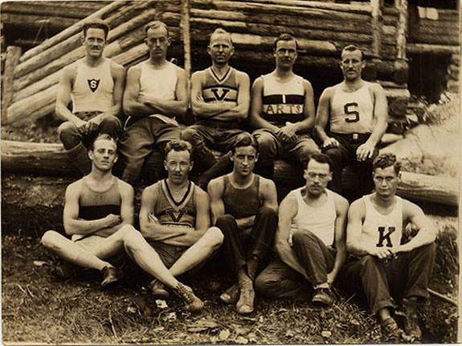
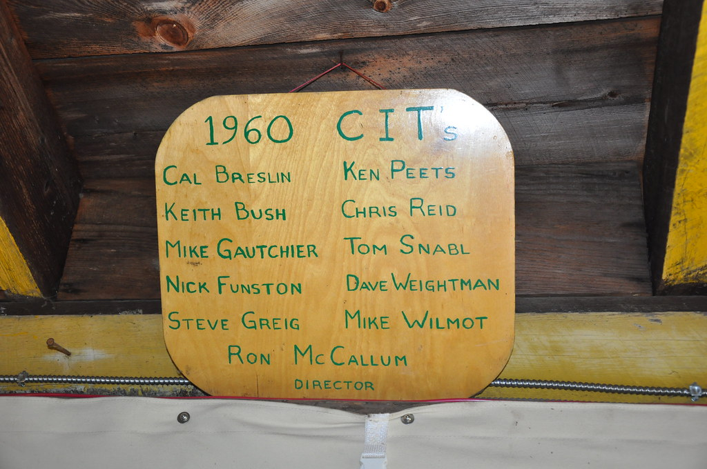
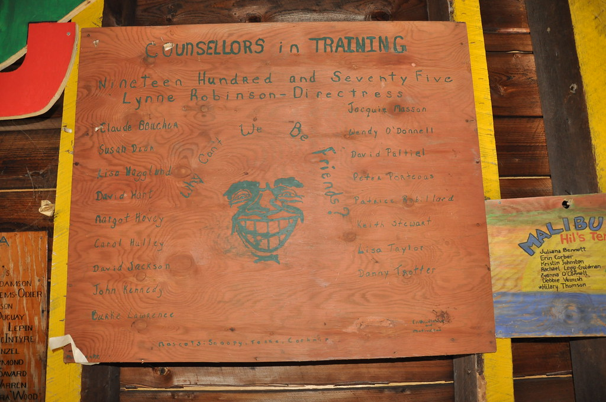
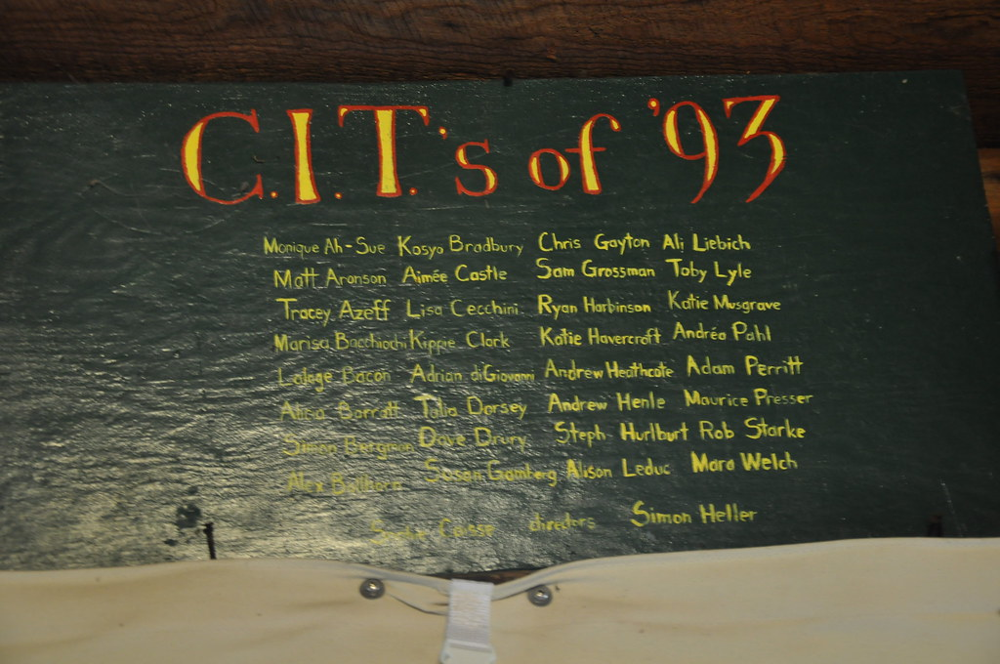
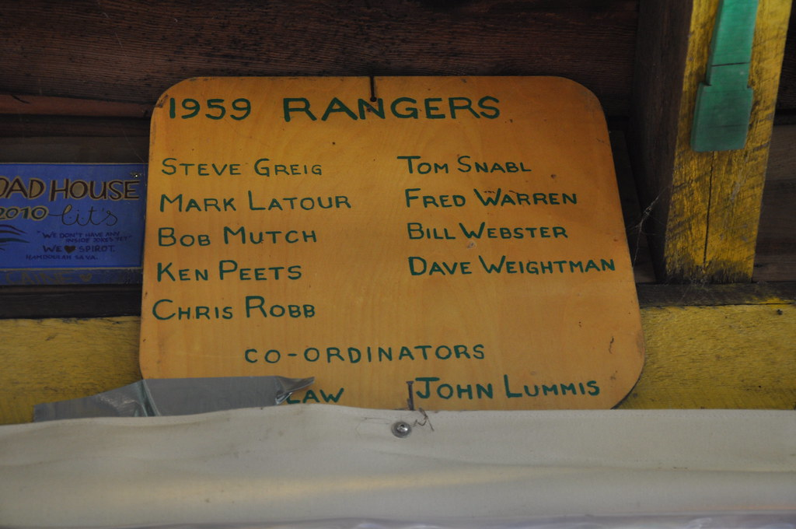
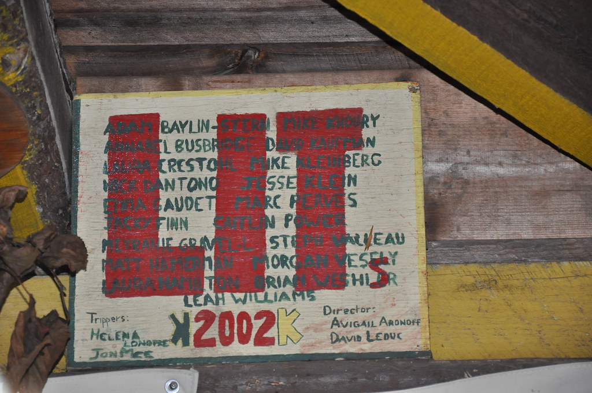
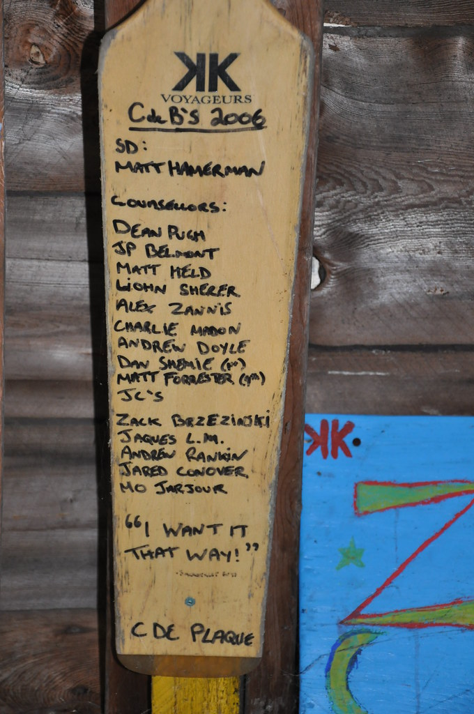
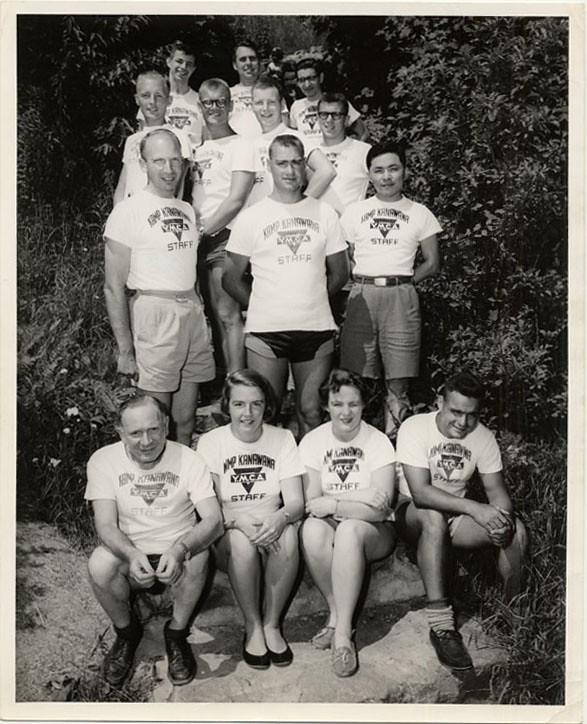

# Directors and Staff of Camp Kanawana

*Status: E1-reviewed | Sources: 25*
*Last Updated: 2026-07-11*

## Summary

This index compiles all known directors of Camp Kanawana (originally Camp Jubilee) from its founding in 1894 to the present, along with documented staff from seasons where source records survive. The directorship has been documented through camp brochures, season reports, YMCA correspondence, oral history, and secondary sources. Detailed staff rosters survive for 1921-1923 (brochures and the *Gas Bag*), 1935 (season chronicle), 1938 (*Green Triangle*), 1939-1941 (McMorris thesis and CFCF broadcast), and 1980 (*Ka-News*). Significant gaps remain, particularly for the 1894-1920 and 1947-2003 periods.

The title "Director" was applied at more than one level: the **Camp Director** (also styled "Camp Chief" in earlier eras) was in charge of the whole camp, while a **section or program director** — Juvenile/Junior/Senior section, Educational, CIT/leadership, etc. — was subordinate to the Camp Director and responsible for one part of the operation. The two roles are tabulated separately below; assistant/deputy camp directors (a camp-wide, not section-specific, subordinate role) remain in the Camp Directors table with an "(Asst.)" qualifier.

## Camp Directors

| Director | Years | Notes | Source |
|----------|-------|-------|--------|
| Billy Ball | 1894 | Led first organized trip to Lake Saint-Joseph; full name and role title unknown | YMCA Quebec website; QAHN |
| John Roy | 1901 | Earliest identified director by name; wrote letters from Camp Jubilee. Possibly (unconfirmed) the same person as "John W. Ross," credited as volunteer chairman of a mid-1890s Junior Department camp committee in the YMCA of Montreal's own annual reports -- see [[people/billy-ball|Billy Ball]] Open Question #8. | Concordia Archives 12L |
| G.D. Brandon | 1921 | Named in 1921 brochure | 1921 brochure |
| Lemuel P. Ereaux | 1922 (documented) | The 1922 brochure's "eleven summers" describes his cumulative prior camp experience (as camper/counsellor, back to roughly 1912), not eleven years as director -- the 1921 brochure separately and explicitly names G.D. Brandon as that year's director, with no mention of Ereaux. 1922 is his only documented directorship year; also served as Camp Doctor, 4th year McGill Medicine. A possible identity lead (unconfirmed): a "Lemuel Price Ereaux, MD" (1898-1967) memorialized in a 1968 *Archives of Dermatology* obituary -- age/timeline fit, but the full text is paywalled and no camp connection could be confirmed. | 1921/1922 brochures |
| Philip G. Paterson | 1923 | Camp Chief; Boys' Work Secretary, Westmount YMCA; presided over "complete rebrand in tone" | 1923 brochure |
| Harold C. Cross | ~1925-1928 | Added totem pole to Council Ring (1927); later wrote YMCA history (1951) | McMorris thesis |
| Nelson McEwen | c. 1927–1947 | Born c.1897 Charlottetown, PEI; died 1956 in active YMCA service. Boys' Work Secretary, Montreal YMCA. Previously Assistant Boys Work Secretary, Winnipeg YMCA (1919); directed Camp Stephens (1924-1927); founded the Order of the Triangle at Camp Stephens, recruiting Mitchel Sharp and Bill Master. Co-founded Canadian Camping Association with Taylor Statten (blog says 1946; CCA official founding was 1936 — role may relate to 1946 reorganization). Developed Hi-Y program in Montreal; two National Assemblies at Geneva Park (1940, 1946). Left Montreal in 1947 for General Secretary of Saint John YMCA (NB), where he recruited Ross Bannerman. In 1951 became first Metropolitan General Secretary, Winnipeg YMCA, serving until his death in 1956. McMorris thesis documents 1930-1931 only as on-site director; extended tenure (c.1927-1947) as administrative overseer from Camp Stephens Alumni blog.^11 ^18 ^19 | McMorris thesis; Concordia fonds 14D; Camp Stephens Alumni blog; CCA history |
| Ralph Dawson | 1933? | Wrote "History of Kamp Kanawana" (1933); in 1898 Camp Jubilee photo; McMorris's 2023 thesis characterizes him as "an alumnus" (former camper) rather than a director or committee member -- an inference from her reading of his manuscript, not a self-identification, so treat as a lead rather than confirmation | Concordia Archives 12A; McMorris thesis |
| Greig Macdiarmid | 1935-1938+ | Camp Chief in 1935 and confirmed again in July 1938; also listed as "W.J.G. MacDiarmid" (1936) in McMorris; recorded weight statistics | 1935 History; Green Triangle 1938; McMorris thesis |
| Howie Langille | 1941 | Led 48th season (Camp Chief) with 68 staff and 30+ British evacuees; previously **Senior [section] Director** in 1935, subordinate to Camp Chief Macdiarmid — see the Section and Program Directors table | CFCF 1941 broadcast; 1935 History |
| R.H. Hanagan | 1942, 1946 | Camp Director; wrote detailed season reports; managed 1946 polio outbreak (6 cases); listed as "Montreal YMCA camp director."^10 A 1942 Gazette article describes him "in Indian garb on horseback" at a camp parade. | McMorris thesis; Concordia fonds; Gazette 1942-08-05 |
| A. Ross Seaman | 1959-1967 | Director of Kamp Kanawana; oversaw 1959 section renaming and La Vérendrye expansion; career in community work preceded directorship; became SGW faculty 1963; later chaired Dawson CRLT dept 1974-84; died 1987 | McMorris thesis; Concordia Seaman Fund^15 |
| Ross Bannerman | 1969 | Directed Camp Pascobac (1951, recruited by Nelson McEwen) and Camp Stephens, Winnipeg (1956); authored "Report on Kamp Kanawana" (1969) in Concordia Archives; YMCA International Branch file (c. 1968-1970) at Concordia; later CEO of the Montreal YMCA (late 1970s). Role title at Kanawana unconfirmed but report authorship and career trajectory suggest senior position | Concordia Archives 12B01 |
| Derek Walsh | 1974-1975 (and CCA Centenary Journey planning 1967) | Camp Director during Stuart McLean's assistant-directorship; McLean later sublet his Westmount/Dorchester apartment to Walsh when McLean moved to Toronto — matching the previously anonymous Westmount Magazine commenter. Represented Kamp Kanawana in 1967 CCA Centenary Journey planning; received CCA Award of Excellence 1983. | McMaster Stuart McLean fonds; oral history; Trent CCA fonds |
| Stuart McLean (Asst.) | 1974-1975 | Assistant Summer Camp Director; first hired as counselor 1969, worked 5 summers. His camp director in 1974-75 is now identified as **Derek Walsh** (McMaster fonds). | OurKids interview; Samaritan Mag; McMaster fonds |
| Dave Twynam | 1979-1980 | Camp director; correspondence dated 1979 in Concordia Archives (12B01 finding aid, confirmed via direct reading — an earlier 1976 date drawn from search-engine snippets is superseded, see Revision History). Full name G. David Twynam, PhD. Career after Kanawana: faculty at Lakehead University, School of Outdoor Recreation, Parks & Tourism (by late 1990s); Dean, School of Tourism, University College of the Cariboo / Thompson Rivers University (~1999-2009, 10+ years); Dean, Faculty of Management, Vancouver Island University (post-2009); now retired. Published widely on volunteer motivation, sustainable tourism, and event management (723 citations, 10 works on ResearchGate). Co-developed the Special Event Volunteer Motivation Scale (SEVMS). Received BC Transfer & Articulation Community Leadership Award for 15 years of tourism education leadership. | Concordia Archives 12B01; ResearchGate; VIU News; TRU Newsroom |
| Nancy Sawyer (Asst.) | 1980 | Assistant Director under "Dave" (likely Twynam); named in Ka-News | Ka-News 1980 |
| Peter Goddard | ~1981–1985? | Full name: Peter Gilling Goddard (1953–2016). Identification confirmed via obituary condolence mentioning "Kamp Kanawana." Career in outdoor education: Boy Scouts of Canada (40+ years), Bill Mason Center, Rideau Valley Conservation Authority (Baxter Conservation Area). Died October 15, 2016, while walking Shaw Woods trails. Exact Kanawana years uncertain; served between Twynam and Jay Netherwood.^12 ^18 | Oral history (M. Aronson); Goddard obituary and condolences |
| Jay Netherwood | 1986-1987 | Brother of Bruce Netherwood | Oral history (M. Aronson) |
| Bruce Netherwood | 1988-1994 | Brother of Jay Netherwood. Now VP Camping Services, South Shore YMCA, Massachusetts; 30+ years in YMCA camping | Oral history (M. Aronson) |

When Netherwood left at the end of 1994, the YMCA restructured Kanawana's leadership into two parallel roles — see "The Two-Tier Era" below.

## The Two-Tier Era (1995–present): Executive Director and On-Site Director

Beginning in 1995, the single Camp Director role was split into two: a year-round **Executive Director**, headquartered in Montreal and responsible for the organization overall, and a three-season **on-site Director** who ran the camp itself each summer. The on-site role was colloquially called "**Chief**" — a title dating to the camp's "playing Indian" era — until it was retired in the early 2020s as part of Kanawana's reconciliation efforts, after which the role was simply called the "on-site Director" (oral history, M. Aronson; f_1728).

### Executive Directors

| Director | Years | Notes | Source |
|----------|-------|-------|--------|
| Arleen Boyer | 1995-2000 | The Montreal YMCA's FY2003-2004 annual report lists her among Kamp Kanawana's local volunteer advisory committee, consistent with a former director staying connected to the camp after her paid tenure ended. Document-author metadata on the 2005 Parent Handbook ("aboyer") is a possible further trace, though it postdates her documented tenure by about five years and is unconfirmed. | Oral history (M. Aronson); Montreal YMCA annual report FY2003-2004 (Wayback); 2005 Parent Handbook metadata (Wayback) |
| Gary White | 2001-2002 | Director, YMCA Kamp Kanawana, per the Montreal YMCA's own FY2001-2002 annual report. Moved to the Westmount YMCA branch by FY2002-2003, documented there through at least 2007; Morgan Carter succeeded him as Interim Director, YMCA Kamp Kanawana, from FY2002-2003. Whether the annual reports' single "Director" listing tracks the Executive or on-site tier remains an open structural nuance (see Open Questions). | Montreal YMCA annual reports FY2001-2002 through 2007 (Wayback) |
| François Dauphin | 2007 | Senior Management listing, "Directeur YMCA Kanawana," in the Montreal YMCA's 2007 annual report; moved to "Directeur, Centre Y Guy-Favreau" by the 2008 report. Read as a head-office administrative designation held concurrently with Sean Day's on-site directorship that year (see Sean Day's row and Open Questions), rather than a separate on-site directorship. No further biographical detail found despite an extensive search; one unconfirmed lead, a login-walled LinkedIn profile matching on name and city only. | Montreal YMCA annual reports 2007-2008 (Wayback); ymcakanawana.com 2005-2007 (Wayback) |
| Sean Day | 2005-2023 (spring) | Regional Director of Camps for the Quebec YMCAs and Executive Director of Camp YMCA Kanawana (dual title — the regional role sits *above* camp level, not below); grew up at Camp Kanawana; led pandemic response (closed overnight 2021, pivoted to day camps); navigated 2022 staff shortages; now Director of Fund Development at Tyndale St-Georges Community Centre. By 2011-2012 his portfolio had expanded to "Directeur, Camp YMCA Kanawana et École de ski." The camp's own public website (Wayback-archived) names him continuously as director from December 2005; this is weighed above the Montreal YMCA's 2007 annual report, which instead names François Dauphin in Senior Management that year (see his row) — an editorial reading between two documented sources rather than new evidence, open to revision (see Revision History and Open Questions). | Oral history (M. Aronson); CBC 2017, 2021, 2022; LinkedIn; Montreal YMCA annual reports 2007-2012 (Wayback); ymcakanawana.com 2005-2007 (Wayback); 2006 staff application form (Wayback) |
| Marie-Pierre Lacasse | 2023 (spring)– | Executive Director / Directeur principal, Camp YMCA Kanawana, succeeding Sean Day. BA Leisure Sciences (Concordia, 2004-2006); also studied at Université Laval. Certified Leave No Trace Master Educator, WFR, Red Cross First Aid Monitor. Career: Wilderness Safety Systems (Asst. Dir., 2007-2012), Camp Boisjoli (DG, 2011-2014), Camp Odyssée/Minogami (Dir., 2014-2015), Camp Portneuf (DG, 2015-2018), and roles at Loisirs Saint-Sacrement, Domaine du Lac bleu, Unité de loisir et de sport de la Capitale-Nationale. At Camp Portneuf (2018) launched the first ADHD-adapted summer camp in the greater Quebec City region. Oversaw the launch of "Aventure à Kanawana" day camp (2024) — the first day camp in Kanawana's 130-year history: English-immersion, ages 5-12, max 48 children, shuttle from Saint-Sauveur. Earlier held a Kanawana role as director of expeditions, 2007-2010, developing the current expedition program, with a break from Kanawana between 2010 and February 2023 (her own YMCA Quebec team-page bio). That bio and byline title her "Director, Camp YMCA Kanawana" — a Kanawana-specific role, distinct from the org-wide "Directeur principal, Les YMCA du Québec" title seen on LinkedIn; the discrepancy between the two titles is unexplained. | Oral history (M. Aronson); YMCA Quebec website (team page); LinkedIn; RocketReach; Nouvelles Laurentides 2024; La Tribune 2018; Radio-Canada 2018 |

### On-Site Directors ("Chief" until the early 2020s)

| Director | Years | Notes | Source |
|----------|-------|-------|--------|
| [[people/joanna-hoad\|Joanna A.A. Hoad]] | 1995-2000 (Kanawana); 2000-c.2007-2009 (Lower Canada College) | Under Executive Director Arleen Boyer. Her Kanawana tenure itself is not independently corroborated by any source found (two full research passes across 9+ surfaces). Her subsequent career is well corroborated: Lower Canada College's own Wayback-archived staff records confirm "Hoad, Joanna — Director of Community Programs" from 2000 (the same year her Kanawana tenure ended) through at least 2007, with an email prefix ("jaahoad") that independently confirms the "A.A." middle initials. See her standalone article for full detail. | Oral history (M. Aronson); Lower Canada College staff records (Wayback) |
| Morgan Carter | 2001-2003 | Montreal architect; co-founded Atelier Schleiss Carter (2018). Worked "extensively in the non-profit sector for agencies including the YMCA and Canada World Youth" before architecture. Has served on the Board of Directors of YMCA Kanawana. Adjunct faculty at McGill (since 2011), UdeM (since 2013), and has taught at Dalhousie, Harvard, and Carleton. OAQ since 2022. A 2003 JBC dining-hall plaque naming "Camp Director: Morgan" confirms his tenure extended into 2003. Under Executive Director Gary White; the Montreal YMCA's FY2002-2003 annual report lists him as "Interim Director, YMCA Kamp Kanawana," though that report's own org chart shows him as the branch's sole listed "Director" that year rather than explicitly subordinate to an Executive Director — an open structural nuance (see Open Questions). The 2011 annual report's Kanawana local advisory committee lists him again, a decade after his directorship, consistent with the same former-director-stays-connected-as-volunteer pattern seen with Arleen Boyer. | Oral history (M. Aronson); Schleiss Carter team page; Montreal YMCA annual reports FY2002-2003 and 2011 (Wayback) |
| Dave Leduc | 2004 (one summer) | Managed all Kanawana summer/winter programs (75 employees, 800 participants), all operational budgets, safety/security of 800 participants, strategic business planning, developed intensive youth leadership program, reported to Board of Directors. BA International Development (Dalhousie); MBA (McGill, 2006-2011). Later: Oxfam-Quebec Lebanon coordinator (2000-2002), McGill ICAN director of operations, Exec. Dir. of Development and Peace (2015-2020), Director of Philanthropy (Quebec) at Pathways to Education. Succeeded Morgan Carter. Under Executive Director Gary White. | Oral history (M. Aronson); LinkedIn (davidgleduc); Dev. & Peace press release 2015 |
| Nicolas Garcia | June 2009-March 2014 | Under Executive Director Sean Day. Documented as "Chef de Camp" / "Coordonnateur du camp de vacances" throughout, per the camp's 2009 French-language Parent Guide (signed "Sean Day / Nicolas Garcia / Roxanne Martel — Directeur du Camp / Chef de Camp / Coordonnateur administratif") and the camp's "Contact Us" page, archived continuously June 2010-March 2014. Correct spelling is "Nicolas" (no "h"). By April 2015 he had been replaced by Kristen Whitelaw. Roxanne (also spelled "Roxane") Martel, his 2009 administrative-coordinator colleague, appears again on the 2011 Kanawana local advisory committee, the same former-staff-to-volunteer pattern seen with Morgan Carter and Arleen Boyer. His start date is undocumented before June 2009; oral history recalls an earlier 2005 start, which no source confirms or contradicts (see Open Questions). | Oral history (M. Aronson); Camp YMCA Kanawana Parent Guide 2009 (Wayback); Camp YMCA Kanawana "Contact Us" page, 2010-2014 snapshots (Wayback); Montreal YMCA annual report 2011 (Wayback) |
| Kate Taylor | 2013–2023 (3rd session) | Alias "Wawa." Honours BA Psychology (Trent University). Previously directed Camp Ta-Wa-Si Inc. (Johnston's Point, NB). Led introduction of gender-expansive tent option for transgender, non-binary, and gender-questioning campers. Also served as Consultant & Graphic Designer at Stephane Richard Development Consulting. Three camping industry podcast appearances: Go Camp Pro "Beyond Camp" #18 (Social Media Advocacy), CampHacker #147 (Summer Self-Care for Camp Directors), Camp Code #95 (Learning Loss in Staff Teams). Director during both 2020 and 2021 COVID closures; quoted in 2021 Gazette on closure decision. Left partway through the 2023 season, after the third session. Under Executive Director Sean Day, then Marie-Pierre Lacasse. | Oral history (M. Aronson); Go Camp Pro podcast; CampHacker #147; Camp Code #95; MSN/Gazette 2021; Montreal Families (gender-expansive); LinkedIn; YMCA Quebec website |
| Kevin Slezak | 2023 (4th session)–2024 | Previously Assistant Director under Kate Taylor; later Special Projects Consultant at YMCA Quebec. Participated in Jan 27 Zoom town hall alongside Kate Taylor and Sean Day. Promoted to on-site Director for the 4th session of 2023 after Taylor's early departure, and served the full 2024 summer. Under Executive Director Marie-Pierre Lacasse. | Oral history (M. Aronson); YMCA Quebec website; LinkedIn |
| Justin Caldwell | 2025– | Under Executive Director Marie-Pierre Lacasse. The camp's own team page lists him as "Summer Camp Director," with a bio stating "Part of the Kanawana family since: 2004" and a career progression of "Junior Counsellor, Counsellor, Section Director, Canoe Guide, Camping Programs Coordinator, (Guide Again), Summer Camp Assistant Director." A July 2018 Facebook video documents his prior Tripper staff history, and ZoomInfo/Datanyze aggregator listings are consistent with the same role. | Oral history (M. Aronson); YMCA Quebec website (team page); Camp YMCA Kanawana Facebook (2018); ZoomInfo; Datanyze |
| Quinn Durand | 2025– | Assistant Summer Camp Director, per the YMCA Quebec team page: "part of the Kanawana family since: 2025," professional journey "Counsellor, Fall Camp Facilitator, Spring Camp Facilitator, Hike Guide, Sea Kayak Guide, Nature Specialist, Section Director, Program Director." Serves under on-site Director Justin Caldwell, in the same Director/Assistant Director pairing pattern as Kate Taylor/Kevin Slezak. | YMCA Quebec website (team page) |

The current (2026) management team's fourth member, **Amy Thomson** ("Assistant to the directors," part of the Kanawana family since 2008, with camp-industry experience 2002-2008 and a return in 2023; f_1745), holds a general administrative support role rather than a section, program, or on-site directorship, so she is not given her own table row above.

## Section and Program Directors

These roles carried the title "Director" but reported to the Camp Director above and were responsible for one section (an age group like Juvenile/Junior/Senior), one program area (Educational, CIT/leadership), or one camp zone — not the whole camp. Several are pulled from the "Staff by Era" rosters below, where a full-camp director for the same season is separately documented.

| Director | Years | Section / Program | Notes | Source |
|----------|-------|--------------------|-------|--------|
| F.H. Spinney | ~1917-1922+ | Educational | Documented in his 5th year (1921) and teaching basketry (1922); overall director that era was Brandon (1921)/Ereaux (1922) | 1921/1922 brochures^3 |
| Hay Finlay | 1922 | Senior section | Ex-Central YMCA Boys' Physical Director, then at McGill Physical Education; overall director that year was Lemuel P. Ereaux | 1922 brochure^3 |
| Edwin M. Crawford | 1922 | Junior section | Ex-Westmount YMCA Boys' Work Secretary; overall director that year was Lemuel P. Ereaux | 1922 brochure^3 |
| Allan B. Cornell | ~1918-1923+ | Educational | Held the Large K badge, the camp's highest honour award | Brochures^3, Gas Bag^7 |
| Howard Ellis | 1923 | Junior | Boys' Physical Director, Central YMCA; overall director/"Camp Chief" that year was Philip G. Paterson | 1923 brochure^3 |
| Howie Langille | 1935 | Senior section | Went on to become overall Camp Chief in 1941 — see Camp Directors table above | 1935 History^8 |
| Ernie Taylor | 1935 | Junior section | Overall Camp Chief that year was Greig Macdiarmid | 1935 History^8 |
| Lorne Hamilton | 1935 | Juvenile section | Overall Camp Chief that year was Greig Macdiarmid | 1935 History^8 |
| "Mr. Brute" | 1938 | Section director, Mount Ritz | Full name not documented; overall Camp Chief that year was Greig Macdiarmid | Green Triangle 1938^9 |
| E.E. Smee (Edgar E. Smee) | 1939, 1942 | Juvenile section (1939); "Resident Director" (1942) | Full name Edgar E. Smee (b. c.1912-13 Hamilton ON, d. Feb 7 2002 Ottawa, age 89). Juvenile section director (1939);^1 Resident Director (1942), explicitly distinct from Camp Director R.H. Hanagan that year.^10 Left Hamilton c.1938; 30-year absence aligns with Montreal/YMCA service. Later became founding Chair of Conserver Society of Hamilton (est. 1969); Environmentalist of the Year 1983. Ed Smee Fund est. 1999 in his honour. Wife: Frieda; daughters: Linda, Susan, Sydney, Sonia. | Gazette 1942-08-05; McMorris thesis; Globe and Mail obit 2002; EOY Awards 1983; Conserver Society |
| Ron McCallum | 1960 | CIT / leadership program | Listed as "Director" on a 1960 CIT (Counsellor-in-Training) dining-hall plaque (Flickr). Overall camp director that year was A. Ross Seaman (1959-1967); McCallum most likely directed the CIT/leadership program specifically (conflict c_013). | Flickr "Plaque" album |
| John Lummis | 1959 | Rangers | Named "co-ordinator" on the 1959 Rangers plaque; a second co-ordinator's name is obscured on the same plaque (f_1671). Overall camp director that year was A. Ross Seaman. | Flickr "Plaque" album |
| Lynne Robinson | 1975 | CIT / leadership program | Credited "Directress" on the 1975 CIT plaque (f_1607). | Flickr "Plaque" album |
| Reiko Webster | 1992 | CIT / leadership program | Credited "Our Beloved Director" on the 1992 CIT paddle (f_1613); the same Reiko Webster appears as a named CIT on the 1986 CIT plaque (f_1612), documenting a camper/CIT-to-CIT-director career path. | Flickr "Plaque" album |
| Sophie Caisse & Simon Heller | 1993 | CIT / leadership program | Named "directors" on a 1993 dining-hall plaque ("C.I.T.'s of '93"), alongside 32 named CITs (f_1568). Overall camp director that year was Bruce Netherwood (1988-1994); as with Ron McCallum (1960), Caisse and Heller most likely directed the CIT/leadership program specifically, not the camp as a whole. | Flickr "Plaque" album |
| Simon Heller, Paula Cussen & Wendy | 1995 | CIT / leadership program | Credited as "Directors" on the 1995 CITS plaque (f_1614); Heller had already co-directed the CIT program with Sophie Caisse in 1993, showing continuity of leadership across at least two seasons. | Flickr "Plaque" album |
| Rick Cordi | 1997 | CIT / leadership program | Credited "CIT Director" on the 1997 CITS plaque (f_1616). | Flickr "Plaque" album |
| Maria English | 1999-2000 | CIT / leadership program | Credited "Director" (1999 plaque, f_1618) and "CIT Director" (2000 plaque, f_1620); a companion 2000 plaque separately credits a "CIT Program Director: Manuel" (f_1619) -- close re-examination of the photo (previously obscured by a strap) plus an external instructor bio plausibly identify him as **Manuel Quiroga**, an Argentine canoe guide who "worked as a Canoe Guide and Program Director at YMCA Camp Kanawana" 1998-2000 per pureexploration.com. Not a title conflict with English: complementary program-specific vs. season-wide roles the same year. | Flickr "Plaque" album; pureexploration.com |
| Avigail Aronoff & David Leduc | 2002 | LIT (Leaders-in-Training) program | Credited as "Directors" on the 2002 LIT plaque (f_1650). Leduc's LIT directorship immediately preceded his one-summer on-site Camp Directorship in 2004 (see the On-Site Directors table above) — a leadership-pipeline pattern consistent with Reiko Webster's CIT-to-CIT-director trajectory. | Flickr "Plaque" album |
| Louis Lessard & Hélène Longpré | 2002 | Rangers | Named "co-ordinators" on the 2002 Rangers plaque (f_1677). | Flickr "Plaque" album |
| François Goulet-Lessard & [-] Tanguy | 2003 | Rangers | Named "co-ordinators" on the 2003 Rangers plaque; Tanguy's surname is only partly legible (f_1678). | Flickr "Plaque" album |
| Jen Kaufman & Liz Kolinski | 2004 | Rangers | Credited "Masters" on the 2004 Rangers plaque (f_1679). | Flickr "Plaque" album |
| Julian Dobie, Hannah S-Paris & Matt Iviott | 2005 | Rangers | Credited "Masters" on the 2005 Rangers paddle (f_1680). | Flickr "Plaque" album |
| Lorna McNeish | 2000 | Voyageurs | Credited "Capitaine" on "The Year 2000 Was the Year of the Voyageurs" plaque (f_1719). | Flickr "Plaque" album |
| Matt Hamerman | 2006 | Voyageurs | Named "Section Director" on a 2006 Voyageurs plaque (f_1603); also listed among the 2002 LIT cohort under Aronoff/Leduc (f_1650), another leadership-pipeline case. Also on the 2011 Kanawana local advisory committee (f_1764) as "Hammerman, Matt," five years after his section directorship. | Flickr "Plaque" album; Montreal YMCA annual report 2011 (Wayback) |
| Durga Chew-Bose | 2007 | JBC (Junior Boys' Camp) | Credited "S.D." (Section Director) on the 2007 JBC plaque (f_1633). | Flickr "Plaque" album |
| Bex Finnigan Reisler | 2008 | Senior Girls / Lookout | Credited "S.D." on the 2008 "Senior Girl Staff" plaque (f_1692). | Flickr "Plaque" album |

A 2003 JBC plaque (f_1638; also the source for conflict c_014's resolution) names "Section Directors: Matt, Laurie" by first name only — too little information to identify with confidence, though the "Matt" is a plausible but unconfirmed match for Matt Hamerman, who held a Voyageurs section directorship three years later (2006). Not treated as a positive identification.

**Audrey Dowse** was inducted into the Camp Administrator Hall of Fame (nominated 2022) for her work with Camp YMCA Kanawana and YMCA Day Camps. Her exact role (Camp Director, section/program director, or another administrative position) and dates of service are not yet documented.^22

## Staff by Era

### The 1920s: Brochure and Gas Bag Staff (1921-1923)

The 1921, 1922, and 1923 camp brochures and the 1923 *Gas Bag* reunion newsletter provide the most detailed early staffing records. Several individuals served across multiple seasons, indicating a stable core staff during this period.

**Long-serving staff.** Harry Smith served as camp chef from approximately 1913, documented through his 9th year (1921) and 10th year (1922).^3 Johnston W. Abraham served as Business Manager from approximately 1914, documented through his 9th year (1922).^3 F.H. Spinney served as Educational Director from approximately 1917, documented in both 1921 (his 5th year) and 1922 (teaching basketry).^3 Allan B. Cornell served as Educational Director from approximately 1918 through at least 1923 (his 6th year), and held the Large K badge, the camp's highest honour award.^3 ^7 Reg Cowan served as Business Manager from approximately 1915 through at least 1923 (8 years), and also held the Large K badge.^3 ^7

**1921 season.** Under director G.D. Brandon, the documented staff included H.H. Hart (Camp Doctor), F.H. Spinney (Educational Director), and Harry Smith (Chef).^3

**1922 season.** Under director Lemuel P. Ereaux, the documented staff included Hay Finlay (Senior Section Director; ex-Central YMCA Boys' Physical Director, then at McGill Physical Education), Edwin M. Crawford (Junior Section Director; ex-Westmount YMCA Boys' Work Secretary), F.H. Spinney (Educational Director), Harry Smith (Chef), and Johnston W. Abraham (Business Manager).^3

**1923 season.** The 1923 season under Camp Chief Philip G. Paterson is the best-documented early year. The 1923 brochure names Howard Ellis (Junior Director; Boys' Physical Director, Central YMCA), L.P. Little ("Bones"; Camp Doctor, 6th year McGill Medical, and separately titled **Assistant Chief of the Junior Division** -- the only use of "Chief" terminology in the 1921-1923 brochures for a subordinate, section-specific role rather than the overall camp head), Allan B. Cornell (Educational Director), H.K. Ashdown (Senior Division; McGill Theology), and Reg Cowan (Business Manager).^3 The *Gas Bag* adds R.E.G. Davis ("Chief Davis") as Camp Chief, Doc Ross as Camp Doctor, and counsellors Hardie, Sunny (kitchen), Bill Steeves, Dave Hart, Wilf Eagle, and Guiton (assigned to North Branch).^7 The apparent overlap between Paterson (brochure) and Davis (Gas Bag) as "Camp Chief" in 1923 may reflect a seasonal handoff or different titles for different periods -- Little's section-specific "Chief" title shows the word wasn't used exclusively for the top job that year, though Davis's camp-wide activities in the Gas Bag (dining hall, staff-vs-world game, camp auction, regatta) read more like an overall head than a Junior-only role, so this doesn't cleanly resolve the question either way.

### The Mid-1930s (1935-1938)

**1935 season.** The season chronicle names Camp Chief Greig Macdiarmid, Senior Director Howie Langille, Junior Director Ernie Taylor, Juvenile Director Lorne Hamilton, and camp doctors Dr. Weavers (later replaced by Dr. Eardley).^8 There were 35 counsellors on staff.^8 A "Mr. Buckley" was also associated with Kanawana during this period: the *Westmount Examiner* of March 29, 1935, described him as having "many years experience in camping, both at Kanawana and at other camps in Canada and the United States."^17 His specific role and exact dates of service are not documented; the characterization suggests he may have been a director or senior staff member, but this remains unconfirmed.

**1938 season.** The *Green Triangle* newsletter of July 29, 1938 confirms Chief Macdiarmid still in charge, extending his documented tenure to at least four seasons (1935-1938).^9 Staff included Doc Cooper (Camp Doctor, shared between Kanawana and the Junior League camp), Dox Wims (tent leader), "Mr. Brute" (section director, Mount Ritz), Benny Lashley (choir organizer), Morrey Cross (Tent 3 Juvenile), Shrivell (telegraph/radio operator), Clark Merritt, Brock Brace (Junior section), and a staff member named Smith.^9

### The War Years (1939-1941)

**1939 season.** Edgar E. Smee (b. c.1912-13 Hamilton, Ontario; d. Feb 7, 2002 Ottawa, age 89) served as Juvenile section director.^1 Originally from Hamilton, Smee left his hometown around 1938 — a timeline consistent with his appearance at Kanawana in 1939. By 1942 he had risen to "Resident Director," a distinct role from Camp Director R.H. Hanagan, documenting a two-tier directorship structure during wartime.^10 After his YMCA career (the details of which remain untraced), Smee returned to Hamilton in 1968, where he became a prominent environmentalist. He founded the Conserver Society of Hamilton (originally "Clear Hamilton of Pollution" / CHOP, 1969), helped create the first action plan for Hamilton Harbour, and was named Environmentalist of the Year in 1983. The Ed Smee Conserver Society Environmental Fund was established in his honour in 1999. He was survived by his wife Frieda, daughters Linda, Susan, Sydney, and Sonia, and brothers Norman and Leonard.

Miss M. Rayner served as camp nurse and filled a "camp mother" role — one of the earliest documented women in a Kanawana staff position.^1

**1941 season.** The 48th season under Camp Chief Howie Langille was the best-documented wartime year, thanks to a CFCF radio broadcast on June 26, 1941.^4 Total staff numbered 68.^4 Of 58 trained counsellor applicants, 45 were selected.^4 Fourteen counsellors formed an advance party to prepare camp before the season opened on June 28 with approximately 100 campers.^4 J.W. Perks, Assistant Superintendent of the Protestant School Board, chaired the Personnel Committee overseeing staff selection.^4 Over 30 evacuees from England, Scotland, and continental Europe attended camp that year.^4 Registrations were 30% higher than the previous year.^4 A farewell letter from junior counsellors Dave and Don from the 1940 season survives in the broadcast transcript.^4

### Pre-War Staff: The SGW-Kanawana Bridge (1930s)

**Harold H. Potter (1914-2004)** attended Sir George Williams College (B.A. 1935-1939) and worked summers as camp counsellor at Kamp Kanawana during those years.^20 In 1947, he became the first Canadian-born Black sociologist hired by a Canadian post-secondary institution when appointed lecturer in Sociology at SGW College. He set up the Department of Sociology and Anthropology at SGW in 1960 and maintained YMCA ties throughout his career. Potter's trajectory from Kanawana counsellor to academic pioneer exemplifies the deep institutional bridge between the YMCA camp and Sir George Williams University.

### Post-War Staff (1943-1961)

**Camp historians.** R.L. Charlton authored "Notes re Early Days of YMCA Camps at Lake St. Joseph and Kanawana" in 1943. Charlton was a Montreal independent marine surveyor, Treasurer of the Canadian Board of Marine Underwriters, and an "ardent YMCA worker" who went to France with the YMCA during WWI to serve Canadian troops.^13 W.E. Cushing wrote "Historical sketches — Lake St. Joseph" in the same year. Both manuscripts are held in Concordia Archives sub-series 12A.^2

**Staff development.** Hedley G. Dimock, Coordinator of Staff Development and Training for the Montreal YMCA and lecturer at Sir George Williams University, conducted research at Kamp Kanawana on camp counsellor effectiveness in 1960-1961.^2 In 1963, Dimock became the first Chairman of the Department of Applied Social Science and Director of the Centre for Human Relations and Community Studies at Sir George Williams University.^14 He collaborated extensively with Dr. Raye Kass on group development publications at Concordia University from 1972 onward.^14

**Ross Bannerman.** Before authoring his 1969 report on Kamp Kanawana, Ross Bannerman had a long career in YMCA camping. In 1951, Nelson McEwen — by then serving as National Council Boys' Work Secretary — recruited Bannerman to direct Camp Pascobac. Bannerman went on to direct Camp Stephens in Winnipeg in 1956.^2 His YMCA International Branch file (c. 1968-1970) and his "Report on Kamp Kanawana" (1969) are both held at Concordia Archives (sub-series 12B01).^2 Bannerman later became CEO of the Montreal YMCA in the late 1970s, placing him in a senior organizational role overseeing Kanawana during the same period as Richard Patten's tenure as Executive Director (1976-1979).^2

### The 1980 Season

The May 1980 issue of *Ka-News* provides the most complete modern staff snapshot. Under director "Dave," the staff included Nancy Sawyer (Assistant Director), Julian and Yves (maintenance), Chris Adams of Vanier (nature program), Dave O'Donnell (Master Canoeist), Kevin Forster (who later became Director of Camp Glenburn, New Brunswick), Dave Bennett, Dave Scammell, Bob Woodhouse, Sue Armstrong, Jeff Surette, Johanna, Doug Peets, Rosemary, Lynn Pryer, Steve Wells, Kitti Luce, and Lisa Crocker.^6

## Notable Alumni

The "Pip" Alumni Award, named after Philip "Pip" Caddell (1913-2004, camper 1928), recognizes former Kanawana campers and staff for their achievements.

| Name | Camp Years | Achievement | "Pip" Award |
|------|-----------|-------------|-------------|
| Richard "Itche" Kerr | unknown | Volunteer working with the physically challenged | 2007 |
| Richard Patten | 1960s (day camps) | Ontario MPP, YMCA Executive Director Montreal 1976-79 | 2008 |
| Stuart McLean | 1969-1975 | Author, CBC radio host (*Vinyl Cafe*) | 2009 |
| Bruce Netherwood | late 1980s-1990s | VP Camping Services, South Shore YMCA; YMCA leader and author | 2011 |
| John Cleghorn | ~1950s | Former CEO Royal Bank of Canada | 2012 |
| Sam Lazarus (posthumous) | camper + staff | Died 2004 (age 25) of cerebral malaria in Ghana while working at orphanage. SAM JAM annual fundraiser at Kanawana (17+ years). | 2013 |
| Jeniene Phillips Birks | unknown | Former broadcaster, community volunteer | 2014 |
| Terry "Aislin" Mosher | 1952-1953 | Montreal Gazette editorial cartoonist | 2015 |
| Carol Skinner | 1990-1995 | ALS advocate | 2016 |
| Chris Adam | unknown | Environmentalist, teacher | 2017 |
| Marina Sharpe | unknown | Refugee advocate | 2018 |
| Dr. James Orbinski | 1980s-1990s | Humanitarian physician, MSF president | 2024 |

**[[people/rob-braide|Rob Braide]]** (camper for 9 summers, ending by 1967; President of Standard Broadcasting Corporation and Montreal radio stations CHOM, MIX 96, and CJAD) is a notable alumnus documented via a 2007 camp testimonial, though not (so far as documented) a Pip Award recipient.

### Memorials and Endowments

The **A. Ross Seaman Memorial Fund** was established in 1987 at Concordia University to honour Seaman's dedication to Concordia, Dawson College, Kamp Kanawana, and the YMCA. The fund provides annual awards for leadership and scholarship.^15

## Gap Periods

The following periods have no confirmed camp director:

- **1895-1900**: Between Billy Ball's first trip and John Roy's 1901 letters
- **1902-1920**: Between John Roy and G.D. Brandon
- **1924**: Between Paterson and Cross
- **1929**: Between Cross and McEwen (Note: McEwen's extended tenure c. 1927-1947, if correct, could close this gap — the Camp Stephens Alumni blog source dates his Montreal arrival to c. 1927, while McMorris documents him only in 1930-1931)
- **1943-1945**: Between Hanagan's documented years
- **1947-1958**: Post-war to late 1950s. Nelson McEwen left for Saint John, NB in 1947 (later became first Metropolitan General Secretary of Winnipeg YMCA in 1951; died in active service 1956). A. Ross Seaman's directorship began by 1959, but neither the transition nor any interim director is documented.
- **1963-1973**: A. Ross Seaman transitioned to SGW faculty in 1963, so the directorship became vacant around that date. The 1972 "Camping and Outdoor Education Branch Director's Report" in Concordia Archives may name the director for that year.
- **1976-1978**: Between McLean's assistant directorship and Dave Twynam (~1979). The director who worked alongside Stuart McLean (1974-1975) is now identified as **Derek Walsh** (McMaster Stuart McLean fonds confirms McLean was assistant director "under director Derek Walsh"; McLean sublet his apartment to Walsh, matching the anonymous Westmount Magazine commenter).^16 Note: Richard Patten was Executive Director of YMCA Montreal 1976-1979, so while not the camp director himself, he would have been the organizational head overseeing Kanawana during this transition. Twynam's start is documented as 1979 (Concordia 12B01 finding aid, confirmed via direct reading — an earlier 1976 date drawn from search-engine snippets is superseded, see Revision History), so this gap is not closed by his arrival.
- **1981-1985**: Between Twynam (~1980) and Jay Netherwood (1986). Peter Gilling Goddard (1953-2016) served as director during some or all of this period. His Kanawana connection is confirmed via an obituary condolence, but exact years require Concordia Archives confirmation.

## Images

*The earliest dated staff photograph in the archive, 1915. Pre-1949 photograph — public domain in Canada.*

*A dining-hall plaque naming Ron McCallum as "Director" of the 1960 CIT program, alongside the ten named Counsellors-in-Training (CITs) of summer 1960 (f_1544). Copyright All rights reserved by Kanawana.*

*A CIT dining-hall plaque from 1975. Copyright All rights reserved by Kanawana.*

*"C.I.T.'s of '93" — a dining-hall plaque naming Sophie Caisse and Simon Heller as the two directors of the 1993 CIT program, with 32 CITs listed by name (f_1568). Copyright All rights reserved by Kanawana.*

*The 1959 Rangers plaque, naming co-ordinator John Lummis (f_1671). Copyright All rights reserved by Kanawana.*

*The 2002 Leaders-in-Training plaque, crediting Directors Avigail Aronoff and David Leduc (f_1650) the year before Leduc's on-site Camp Directorship. Copyright All rights reserved by Kanawana.*

*A 2006 Voyageurs plaque naming Matt Hamerman as Section Director (f_1603). Copyright All rights reserved by Kanawana.*

*A staff photograph, 1960-1980. Copyright All rights reserved by Kanawana.*

## Open Questions

1. ~~[Critical] Who directed the camp during the 1947-2003 gap?~~ [Largely resolved] Oral history (2026-06-12) filled 1986-2003 completely. Peter Goddard now confirmed as Peter Gilling Goddard (1953-2016). Remaining gaps: 1947-1958 (between McEwen's departure and Seaman's arrival), and exact Goddard dates (~1981-1985?). McEwen's newly documented departure date of 1947 refines the post-war gap.
2. [Critical, advanced 2026-07-09] Was Ralph Dawson a camp director or just a historian/alumnus? He was at Camp Jubilee in 1898 and wrote the 1933 history. McMorris's 2023 thesis (read as a full PDF for the first time this pass) characterizes him as "an alumnus" -- a lean toward "former camper who wrote the history," but her own inference from his manuscript, not a self-identification, so still not confirmed. No source names him on any committee or as a directorship holder.
3. [Important] The Permanent Camp Committee minute book (1911-1926) in Concordia Archives should list directors by year.
4. [Important] Concordia sub-series 12B01 holds season reports — these would name directors for gap years.
5. ~~[Important] Is "Greig Macdiarmid" (1935 History, Green Triangle) the same as "W.J.G. MacDiarmid" (McMorris)?~~ [Resolved] Yes — same person. "Greig" maps to the "G" initial in "W.J.G. MacDiarmid." McMorris uses the archival form "W.J.G. MacDiarmid" while primary camp documents use "Greig Macdiarmid."^1
6. [Nice-to-have, largely resolved 2026-07-09] What was Lemuel Ereaux's full tenure? Re-read of the 1921 and 1922 brochures together shows Ereaux's only *documented directorship* year is 1922 (Brandon held 1921); "eleven summers" in the 1922 brochure describes his cumulative camp experience since roughly 1912, not eleven years as director. A possible identity (unconfirmed): "Lemuel Price Ereaux, MD" (1898-1967), memorialized in a 1968 dermatology-journal obituary — age fits, but full text is paywalled and no camp mention could be confirmed.
7. [Nice-to-have, advanced 2026-07-09] Were Paterson (brochure) and Davis (Gas Bag) both Camp Chiefs in 1923, or did they serve different roles? The 1923 brochure separately titles L.P. Little "Assistant Chief of the Junior Division" -- the only other use of "Chief" that year, and a subordinate/section-specific one — showing the title wasn't reserved exclusively for the top job. This doesn't resolve whether Paterson and Davis overlapped, though Davis's camp-wide activities in the Gas Bag still read more like an overall head than a Junior-only role. Still genuinely open; the Permanent Camp Committee minute book (#3 above) remains the most likely definitive source, and that's physical-archive-only.
8. [Nice-to-have, downgraded from Important] Is Marie-Pierre Lacasse's role Kanawana-specific or organization-wide? Largely resolved 2026-07-07: the camp's own team page bylines her as "Director, Camp YMCA Kanawana" (Kanawana-specific), matching the French-press "directrice du Camp" reading against the org-wide "Directeur principal" title seen only on LinkedIn — see her table row for details. The LinkedIn discrepancy remains unexplained but no longer looks like the stronger reading.
9. [Important, substantially advanced 2026-07-07, re-checked 2026-07-09] Independent corroboration status for the four Two-Tier Era names, after a direct-fetch re-verification pass once network access was fixed: **Gary White** — corroborated as Kanawana director for FY2001-2002, but the Montreal YMCA's own annual reports show him moving to a different branch (Westmount) by FY2002-2003, years earlier than his oral-history-recorded 2005 end date (conflict c_015, resolved editorially in favour of the documented dates — see Revision History; re-tested 2026-07-09 via Wayback CDX, still no pre-2009 snapshot of ymcaquebec.org exists, no change). **Nicholas/Nicolas Garcia** — strongly corroborated as on-site Director under Sean Day, but only for June 2009-March 2014, not the oral-history-recorded 2005-2012 (conflict c_016, resolved editorially in favour of the documented end date — see Revision History); correct spelling is "Nicolas" per every primary source. Re-tested 2026-07-09: the camp's own contact page turns out to be Wayback-archived back to December 2005 after all (the "no snapshot before 2009" premise was wrong), but Garcia's name doesn't appear in any 2005-2007 snapshot — only Sean Day is named throughout. This is new negative evidence against, not proof against, a 2005-2008 Garcia start; the date range itself remains unconfirmed either way. **Arleen Boyer** (name corrected 2026-07-07 on both first name and surname, was misrecorded as "Arlene Boyle") — the "Arleen Boyer" committee-volunteer lead found in the FY2003-2004 annual report turns out to have been spelled correctly all along, and is now a confirmed positive identification per the operator's correction. **Joanna A.A. Hoad** (name corrected 2026-07-07, was misrecorded as "Johanna A.A. Hoade") — her *Kanawana* tenure specifically remains genuinely exhausted (zero corroboration on any surface or spelling tried, including the corrected spelling). But an operator follow-up note (her post-Kanawana career at Lower Canada College) immediately produced strong independent identity confirmation via LCC's own Wayback-archived staff records — see her new standalone article, [[people/joanna-hoad|Joanna A.A. Hoad]].
10. ~~[Important] Resolve conflicts c_015 (Gary White's actual Kanawana tenure length) and c_016 (Nicolas Garcia's tenure boundaries)~~ [Resolved 2026-07-07, per the operator's standing policy that documented sources take precedence over oral history in direct conflicts] Gary White's documented Kanawana tenure narrowed to FY2001-2002; Nicolas Garcia's documented end date corrected to March 2014 (spelling corrected from "Nicholas" to "Nicolas"). The superseded oral-history dates are preserved in the KB, not deleted; undocumented spans no document covers (e.g. Garcia's possible 2005-2008 start) remain open, unconfirmed oral history. See Revision History and the two directors' table rows.
11. [Nice-to-have, re-examined 2026-07-09] Who are "Matt" and "Laurie," the two Section Directors named by first name only on the 2003 JBC plaque (f_1638)? Full-resolution re-examination confirms the plaque itself never recorded surnames for these two roles (unlike the counsellors below them, given first-name-plus-initial) — this isn't an illegibility problem, the information simply isn't there. "Matt" remains a plausible but unconfirmed match for Matt Hamerman, whose independently documented Kanawana roles span 2000-2011.
12. [Nice-to-have, largely resolved 2026-07-09] What is "CIT Program Director" Manuel's surname (2000 plaque, f_1619), and how did that role relate to the season-specific "CIT Director" title held by Maria English the same year? Close re-examination (the original photo crop had a strap obscuring the signature) plus an external instructor bio plausibly identify him as **Manuel Quiroga**, an Argentine canoe guide who worked at "YMCA Camp Kanawana" 1998-2000 per pureexploration.com. His role reads as complementary to, not confused with, Maria English's broader CIT Directorship that year.
13. ~~[Important] Resolve conflict c_017 (Sean Day's actual Kanawana directorship start date)~~ [Resolved editorially 2026-07-10] 2005, favouring the camp's own contemporaneous public website over the annual report's internal Senior Management listing — see Sean Day's and François Dauphin's rows, and Revision History. Flagged explicitly as editorial judgment, not new evidence; open to revision.
14. [Nice-to-have, exhausted 2026-07-09] Who is François Dauphin, Kanawana's documented 2007 director? 22 queries across 6+ surfaces (LinkedIn, Facebook, French and English news archives, obituary/genealogy databases, business-intelligence aggregators) found no confirmed biographical detail. One unconfirmed lead: a LinkedIn profile ("Francois Dauphin - YMCA," Montreal) matches on name, city, and org, but could not be fetched (login wall) or tied to Kanawana specifically. All other same-name individuals found (an IGOPP governance-institute president, a French neuropharmacology researcher, a Collège de Maisonneuve administrator, others) were confirmed to be different people.

## Related Articles

- [[people/harold-cross|Harold C. Cross]]
- [[people/billy-ball|Billy Ball]]
- [[people/da-budge|D.A. Budge]]
- [[people/stuart-mclean|Stuart McLean]]
- [[people/edgar-smee|Edgar Smee]]
- [[people/joanna-hoad|Joanna A.A. Hoad]]
- [[people/dave-twynam|Dave Twynam]]
- [[people/sean-day|Sean Day]]
- [[people/terry-mosher|Terry Mosher (Aislin)]]
- [[people/rh-hanagan|R.H. Hanagan]]
- [[people/a-ross-seaman|A. Ross Seaman]]
- [[people/hedley-dimock|Hedley Dimock]]
- [[people/cushing-family|The Cushing Family]]
- [[chronology/founding-1894|Founding of Camp Kanawana (1894)]]
- [[chronology/wartime-kanawana|Wartime Kanawana]]
- [[programs/traditions-and-culture|Traditions and Culture at Kanawana]]

## Sources

1. McMorris, Grace (2023). "An Experience That Lasts a Lifetime." MA thesis, Concordia University.
2. Concordia University Archives, YMCA of Montreal Fonds P145 (sub-series 12A, 12B, 12L, 14D).
3. 1921, 1922, 1923 Camp brochures (Internet Archive).
4. CFCF Radio Broadcast, June 26, 1941.
5. YMCA Quebec, "The Kanawana Story," https://www.ymcaquebec.org/en/summer-camp-kanawana/history
6. *Ka-News*, May 1980, YMCA Camp Kanawana newsletter.
7. *The Gas Bag*, 1923 Re-union Number (Internet Archive).
8. "A History of Kamp Kanawana" (1935 Season Chronicle), Internet Archive.
9. *The Green Triangle*, Vol. VII No. 1, July 29, 1938, Internet Archive.
10. R.H. Hanagan, camp director report (c. 1946), Concordia Archives.
11. Nelson McEwen, National Council Boys' Work correspondence (1941-1945), Concordia Archives sub-series 14D.
12. Oral history, Matt Aronson.
13. Canadian Board of Marine Underwriters records; R.L. Charlton biographical references.
14. Concordia University Archives, YMCA of Montreal Fonds P145/12B05 (Staff); Hedley G. Dimock publications.
15. Concordia University, "A. Ross Seaman Memorial Fund" (est. 1987). URL: https://www.concordia.ca/artsci/applied-human-sciences/about/funding.html
16. Richard Andrew Patten obituary, HP McGarry Funeral Home, 2021; Wikipedia article on Richard Patten; Westmount Magazine, "A fond farewell to Stuart McLean" (March 2017), comments section.
17. *The Westmount Examiner*, March 29, 1935. BAnQ numérique.
18. Camp Stephens Alumni Blog, 2013 posts on Nelson McEwen and Ross Bannerman careers (campstephensalumni.blogspot.com); Peter Gilling Goddard obituary and condolence messages (C.R. Gamble Funeral Home, Legacy.com, 2016).
19. Canadian Camps Association, "Our History," https://www.ccamping.org/history — past presidents list, founding date. Doug McEwen (Ontario) served as CCA President 1967-1969. Concordia University Archives, sub-sub-series 14D10: National Council Boys' Work Secretary Nelson McEwen correspondence (1941-1945).
20. Wikipedia, "Harold H. Potter," https://en.wikipedia.org/wiki/Harold_H._Potter; Jean-Philippe Warren et al., "Reflections: Sociology and Anthropology at Concordia."
21. Sam Lazarus Fund, Zeffy fundraising page (https://www.zeffy.com/fundraising/8bc0b92d-1ae8-4791-8eeb-d890713c2360); Legacy.com obituary.
22. Camp Administrator Hall of Fame, campadmin.org — Audrey Dowse inductee (nominated 2022), Camp YMCA Kanawana/YMCA Day Camps.
23. "Reportage vécu," Camp YMCA Kanawana recruitment document, 2007 (Wayback, predecessor ymcakanawana.com domain) — Rob Braide testimonial [src_reportage_vecu_2007].
24. 2006 Camp YMCA Kanawana staff application form (Wayback, predecessor domain) [src_application_2006].
25. 2005 Camp YMCA Kanawana Parent Handbook, English (Wayback, predecessor domain) — document-author metadata [src_ymcakanawana_2005_handbook].

## Research Notes

### Revision History

- **2026-07-10** — Conflict c_017 (Sean Day's Kanawana directorship start date) resolved editorially in favour of 2005, weighing the camp's own contemporaneous public website (naming Day continuously from December 2005) above the 2007 Montreal YMCA annual report's separate François Dauphin "Directeur YMCA Kanawana" Senior Management listing. This is an editorial judgment between two documented sources, not new evidence, and remains open to revision.
- **2026-07-07** — Operator directive: oral history yields to documented facts when the two directly conflict. Applied to resolve c_004 (Sean Day's post-Kanawana employer corrected from "Rossy Foundation," per oral history, to "Tyndale St-Georges Community Centre," per LinkedIn), c_015 (Gary White's documented Kanawana tenure narrowed to FY2001-2002, from an oral-history-recalled 2001-2005; his subsequent move to the Westmount YMCA branch by FY2002-2003 is now documented), and c_016 (Nicolas Garcia's documented end date corrected to March 2014, from an oral-history-recalled 2012; his name spelling corrected from "Nicholas" to "Nicolas"). The superseded oral-history figures are preserved in the KB, not deleted, per the no-silent-overwrite rule; undocumented spans not covered by any document (e.g. Garcia's possible 2005-2008 start) remain open, unconfirmed oral history rather than resolved.
- **2026-07-07** — Two name corrections, both originating with the operator: "Johanna A.A. Hoade" (itself a 2026-07-05 miscorrection of "Joanna Hode") corrected to Joanna A.A. Hoad; "Arlene Boyle" corrected to Arleen Boyer, confirming that an FY2003-2004 annual-report committee listing found the same day, previously flagged only as a phonetically-close unconfirmed lead, had the name right all along.
- **2026-07-07** — A direct-fetch re-verification pass (after an egress-proxy fix unblocked ymcaquebec.org, cbc.ca, and concordia.ca) upgraded several findings from lead to primary-source confirmation: Justin Caldwell's current on-site directorship (YMCA Quebec team-page bio), Marie-Pierre Lacasse's previously undocumented 2007-2010 stint as director of expeditions (same page), and conflict c_007 (Dave Twynam's Concordia correspondence date resolved to 1979, superseding an earlier snippet-derived 1976 reading).
- **2026-07-05** — Operator oral history revealed that Kanawana's directorship split into two parallel roles beginning in 1995 (Executive Director and on-site Director, the latter colloquially "Chief" until the early 2020s), resolving conflict c_014 and substantially expanding the post-1994 record: Dave Leduc's directorship corrected from 2003 to a single summer, 2004; Morgan Carter's extended to 2001-2003; and Arleen Boyer, Gary White, Nicolas Garcia, and Justin Caldwell added as named directors, all initially oral-history-only pending the corroboration work logged above.

<!-- RALPH process log (informal, not reader-facing). -->
<!-- R1 compiled from KB facts. 13 named directors spanning 1894-2023. -->
<!-- R2 RALPH loop 2026-02-14: Web research found Stuart McLean as asst. director 1974-1975, "Dave" as director 1980 (Ka-News), Kate Taylor as current director 2020s. Also discovered "Pip" Alumni Award program and notable alumni (Aislin Mosher, James Orbinski, Carol Skinner). Gap narrowed from 57 years to four sub-gaps. Key archival leads: 1972 Director's Report, 1947-1950 brochures, Permanent Camp Committee minutes. Contact Bruce Netherwood at South Shore YMCA for exact tenure dates. -->
<!-- R4 David Leduc deep search 2026-03-15: 8 web searches conducted. LinkedIn profile (davidgleduc) confirmed: managed all Kanawana summer/winter programs (75 employees, 800 participants), all operational budgets, strategic business planning, developed intensive youth leadership program, reported to Board of Directors. Career timeline from other sources: BA International Development (Dalhousie), MBA McGill (2006-2011), Oxfam-Quebec Lebanon coordinator (Mar 2000-Jun 2002), McGill ICAN director of operations (11+ years ending ~2015), Executive Director of Development and Peace (Jul 2015-~2020, $40M budget, 80 employees), currently Director of Philanthropy (Quebec) at Pathways to Education Canada, based in Montreal (Outremont). Kanawana dates still not confirmed — LinkedIn does not show exact years. The Oxfam-Quebec role starting Mar 2000 provides a terminus ante quem: Leduc left Kanawana by early 2000 at the latest. Given Bruce Netherwood served in late 1980s-1990s and Sean Day began 2004, Leduc likely served in the late 1990s, possibly overlapping with or succeeding Netherwood. Languages: English, French, Spanish, functional Arabic. -->
<!-- R5 Sean Day deep research 2026-03-15: 8 web searches conducted. CBC News articles (2017, 2021, 2022) confirm dual title "Regional Director of Camps for the Quebec YMCAs and Director of Camp YMCA Kanawana." Day grew up at camp (CBC 2017 Stuart McLean Fund article). Led COVID-19 decisions: closed Kanawana overnight 2021 (250+ campers infeasible), pivoted to 10 day camps (up from 3). In 2022 reported 75% counsellor hiring by late April (normally 100%), YMCA made "huge salary increases." Anti-bullying advocacy on camp Facebook. LinkedIn title now "Director of Fund Development" (ca.linkedin.com/in/sean-day-13811132), corroborating KB v3.3 note of move to Rossy Foundation post-April 2023. Town Hall with Kate Taylor and Kevin Slezak (Jan 27, year uncertain). 6 new facts (f_0856-f_0861), 3 new sources added. -->
<!-- R3 Staff expansion 2026-02-17: Integrated 55+ orphan staff facts from brochures (1921-23), Gas Bag (1923), 1935 History, Green Triangle (1938), McMorris thesis (1939), CFCF broadcast (1941), Ka-News (1980), and Concordia fonds (Dimock 1960-61). Macdiarmid tenure extended from 1936 to 1935-1938+. Gap period "1937-1940" eliminated (Macdiarmid confirmed through 1938). Miss Rayner (1939) noted as earliest documented woman in staff role. Article restructured from flat table to chronological era sections. -->
<!-- R7 Director gap research 2026-03-17: 30+ web searches conducted. KEY FINDINGS: (1) Richard Patten (1942-2021), Pip Award recipient 2008, worked YMCA Montreal summer day camps while at SGW in 1960s, then Director of International Programs at Metropolitan YMCA Montreal 1971-76, then Executive Director YMCA Montreal 1976-79. As Exec Dir he was the organizational superior overseeing Kanawana during Twynam's directorship. (2) Anonymous commenter on Westmount Magazine confirmed being camp director alongside Stuart McLean as assistant director in summers 1974 and 1975 — same person sublet McLean's flat on Dorchester. Identity still unknown. (3) Ben T. Hannah wrote "Kanawana Reminiscence (of 1948)" in 1989 — placed at camp 1948, may help fill 1947-1958 gap. (4) John Cleghorn (b.1941), former RBC CEO, Pip Award 2012, born Montreal, Westmount High School, McGill 1962 — likely camper ~1950s. (5) Concordia archives confirm 1972 "Camping and Outdoor Education Branch Director's Report" (5 copies) and 1975-1978 management minutes — physical archival access required to extract director names. (6) Brian Langille search returned no results. (7) Sean Day LinkedIn now shows "Director of Fund Development" confirming departure from Kanawana. (8) Kate Taylor confirmed as current camp director (COVID decisions, gender-inclusive tent initiatives). New facts f_1089-f_1096. Pip Award table expanded with full chronological list. -->
<!-- R6 Dave Twynam deep research 2026-03-15: 11 web searches conducted across 8 query variations. Full name confirmed as G. David Twynam, PhD. Career trajectory reconstructed: Camp Kanawana director (~1979, Concordia Archives 12B01) → Lakehead University faculty, School of Outdoor Recreation, Parks & Tourism, Thunder Bay (by late 1990s; author affiliation on 1998 and 2002 publications) → Dean, School of Tourism, University College of the Cariboo / Thompson Rivers University, Kamloops (~1999-2009, 10+ years; confirmed still Dean March 2008 per TRU Newsroom, replaced by Harold Richins per June 2009 announcement) → Dean, Faculty of Management, Vancouver Island University, Nanaimo (post-2009) → Retired. Key publications: Farrell, Johnston & Twynam (1998) Journal of Sport Management 12(4):288-300; Johnston, Twynam & Farrell (1999) Leisure/Loisir 24(1-2); Twynam, Farrell & Johnston (2002) Leisure/Loisir 27:363-377. Co-developed Special Event Volunteer Motivation Scale (SEVMS). Also published on WWF Arctic Tourism Guidelines with M.E. Johnston, marine tourism at HMS Erebus/Terror site, residents' perceptions of sporting events. 10 works, 723 citations on ResearchGate. Received Transfer & Articulation Community Leadership Award (BC Council on Admissions and Transfer) for 15 years as SLP on Tourism Management Articulation Committee. Involved in Heart of Gold Project (VIU-Costa Rica sustainability collaboration). Twitter handle @dtwynam. Two LinkedIn profiles found. Nancy Sawyer confirmed as Assistant Director under "Dave" (Ka-News 1980) — now firmly linked to Twynam. 8 new sources, 15 new facts (f_0856-f_0870) added. Remaining unknowns: exact Kanawana start/end dates, PhD-granting institution, when he moved from Kanawana to Lakehead (gap of ~15-20 years in career record). -->
<!-- R8 People+Dimock+Events research RALPH 2026-06-22: Peter Goddard CONFIRMED as Peter Gilling Goddard (1953-2016) via obituary condolence mentioning "Kamp Kanawana." Full biography documented. Nelson McEwen tenure extended from 1930-1931 to c.1927-1947 per Camp Stephens Alumni blog — he was Boys' Work Secretary of Montreal YMCA for ~20 years, co-founded CCA with Taylor Statten, directed Camp Stephens (Winnipeg) 1924-1927 before Montreal. Ross Bannerman: St. James YMCA branch Winnipeg confirmed. Derek Walsh: 32+ searches exhausted, zero new info. Gap periods updated. 12 new KB facts (f_1340-f_1344, f_1359-f_1362, f_1374, f_1378-f_1379). 3 new sources. -->
<!-- R9 McEwen deep biographical RALPH 2026-06-22: 20+ web searches across 8+ surfaces. KEY FINDINGS: (1) McEwen died 1956 in active YMCA service — confirmed via Camp Stephens Alumni blog search snippets. (2) Full career: Charlottetown PEI (b.c.1897) → Winnipeg Asst Boys Work Sec (1919) → Camp Stephens director (1924-1927) → Montreal Boys Work Sec / Kanawana (c.1927-1947) → Gen Sec Saint John YMCA (1947-1951) → first Metropolitan Gen Sec Winnipeg YMCA (1951-1956, died in service). (3) Founded 'Order of the Triangle' at Camp Stephens, recruited Mitchel Sharp and Bill Master. (4) CCA founding date discrepancy: blog says 1946, official CCA says 1936 — McEwen's role likely relates to 1946 reorganization/national assembly, not original founding. (5) Doug McEwen (Camp Stephens director 1966-70, CCA President 1967-69) may be Nelson's son — confirmed at YMCA Camp Wa-Sa-Ah-Dun, St. Catharines. (6) Concordia 14D10 confirms McEwen-E.M. Nelson correspondence 1941-1945. (7) No obituary text, photograph, exact birth/death dates, or family details found — research requires physical archives (Winnipeg Free Press microfiche, PEI vital records). 9 new facts (f_1381-f_1389), 2 new sources. -->
<!-- R10 Two-tier era correction 2026-07-05: Operator oral history (unprompted, provided in response to conflict c_014 flagged during the photo-mining VERIFY pass) revealed that Kanawana's directorship split into two parallel roles starting in 1995. See Revision History above for the reader-facing summary; full detail preserved here: added Arlene Boyle (Exec. Dir. 1995-2000), corrected "Joanna Hode" to Johanna A.A. Hoade (on-site 1995-2000), added Gary White (Exec. Dir. 2001-2005), added Nicholas Garcia (on-site 2005-2012), corrected Sean Day to Executive Director 2005-2023 (was recorded as 2004-2023 general "Director"), refined Kate Taylor to on-site Director 2013 through 3rd session 2023 (was "2020s"), promoted Kevin Slezak from "(Asst.)" footnote to a full on-site Director row (4th session 2023-2024), corrected Marie-Pierre Lacasse's start to spring 2023 (was "2024-"), and added Justin Caldwell (on-site 2025-present). 12 new KB facts (f_1728-f_1739), all sourced to oral history (M. Aronson), confidence user_knowledge. -->
<!-- R11 Two-tier era verification RALPH 2026-07-05: 5 parallel research agents, ~130 queries total across web/LinkedIn/Facebook/Instagram/news/YMCA-site/genealogy surfaces, verifying the R10 oral-history corrections. Arlene Boyle, Johanna A.A. Hoade, and Nicholas Garcia: zero independent corroboration found (27, 13+, and 24 queries respectively) -- true null results, no contradictions either, remain oral-history-only. Gary White: found an ambiguous, unconfirmed lead (a Westmount YMCA branch director 2012-2018, different role/decade) -- not verified as the same person. Justin Caldwell: partially corroborated -- a July 2018 Kanawana Facebook video confirms genuine Tripper staff history (f_1741); ZoomInfo/Datanyze list a "Summer Camp Director at YMCA of Quebec" by that name (f_1742), though no LinkedIn primary source was found to confirm it. Sean Day: independently corroborated as holding a director-level Kanawana role by 2005 via a CBC News article on the Stuart McLean fund (f_1740), upgrading the vaguer pre-existing f_0046 ("was present"). Marie-Pierre Lacasse: found a title-scope discrepancy (LinkedIn "Directeur principal" of Les YMCA du Québec org-wide vs. French press "directrice du Camp") -- flagged as an open nuance (Open Question 8), not escalated to a formal conflict since it's ambiguous rather than a clean contradiction. Kevin Slezak and Kate Taylor: general title/era corroborated by aggregators and prior news coverage, but no source confirms the exact promotion/departure dates from the oral history. 3 new facts added (f_1740-f_1742), 2 new sources (src_fb_kanawana_tripper_caldwell_2018, src_zoominfo_justin_caldwell). No stub articles created for the four uncorroborated/ambiguous names -- single-source oral history does not meet the bar for a standalone biography per CLAUDE.md's formal-RALPH requirement for people stubs. p_192 marked completed in priorities.json. Environment note: WebFetch/curl returned HTTP 403 for nearly every direct-page target this pass (ymcaquebec.org, linkedin.com, facebook.com, concordia.ca, CBC, web.archive.org) -- all findings above come from WebSearch snippet extraction only; a follow-up pass with working page-fetch access is recommended before concluding any of the four null results are truly exhausted. -->
<!-- R13 Direct-fetch re-verification (network-access fix) 2026-07-07: the egress-proxy 403 blocking direct page reads throughout Campaigns 22-23 was fixed (root cause: claude.ai Settings > Capabilities > Domain allowlist, not the environment-level Network Access setting originally suspected -- see project-docs/SESSION-HANDOFF.md). First direct fetches of ymcaquebec.org, cbc.ca, and concordia.ca this project has ever made. Concrete results: (1) YMCA Quebec's "Our Team" page, read directly for the first time, gave Justin Caldwell's own bio ("Summer Camp Director," Kanawana family since 2004, full career progression) -- upgrades him from partially-corroborated to fully corroborated by a first-party primary source (f_1744). (2) The same page surfaced Marie-Pierre Lacasse's own bio disclosing a previously undocumented 2007-2010 stint as "director of expeditions" at Kanawana before a break and her 2023 return (f_1743) -- also explains an earlier search agent's discarded "director of expeditions 2007-2010" fragment (that was Lacasse's bio all along, not Nicholas Garcia, whom it had been mistakenly associated with). (3) The page's own byline for Lacasse ("Director, Camp YMCA Kanawana") tips Open Question 8 toward a Kanawana-specific role. (4) Two new current staff, Quinn Durand (Assistant Summer Camp Director, f_1746) and Amy Thomson (Assistant to the directors, f_1745), added. (5) The Concordia 12B01 finding aid, read directly for the first time (previously only seen via search-engine snippets), settles conflict c_007: its own text reads "Camp director Dave Twynam-correspondence. - 1979," confirming 1979 over the 1976 snippet-based alternative -- c_007 marked resolved. (6) The YMCA's own history page confirms the "85 campers" 1910 figure (conflict c_005) is the YMCA's own institutional claim, not a Postmedia invention (f_1747) -- c_005 remains unresolved (McMorris's 66 vs. the YMCA's 85), just better sourced on one side. (7) Direct fetches of the Concordia 12A, 12B01, and 12B04 finding aids confirm their described holdings stop around 1983-1990 -- a genuine, now-confirmed dead end for the 1995-2012 gap, not merely an untried lead. (8) linkedin.com and facebook.com remain effectively unreadable even with network access open -- anonymous requests hit login-walls/redirects, so WebSearch snippets remain the only view into those two platforms specifically. Four parallel research agents were also dispatched with direct-fetch access to re-run RALPH verification on Arlene Boyle, Johanna A.A. Hoade, Gary White, and Nicholas Garcia specifically -- see the following note for their results. -->
<!-- R14 Campaign 25: four-name direct-fetch RALPH re-verification 2026-07-07: dispatched 4 parallel research agents (Boyle, Hoade, White, Garcia) with direct-fetch access, per R13. Results: JOHANNA A.A. HOADE -- genuinely exhausted (18 WebSearch queries + 12 direct fetches across 9 surfaces including two new-to-this-project surfaces, Newspapers.com and Google Books; confirmed the YMCA's own site and Concordia finding aids hold nothing for this era). NICHOLAS/NICOLAS GARCIA -- major reversal from the 2026-07-05 null result: the agent found the camp's own archived 2009 French parent guide and 2010-2014 official contact-page snapshots (via Wayback CDX search of the camp's old microsite domains, never indexed by any search engine) naming "Nicolas Garcia" (correct spelling, no "h") as Chef de Camp/Coordonnateur du camp de vacances under Sean Day continuously June 2009-March 2014 -- strong primary-source corroboration of identity and role, but the confirmed window doesn't match the oral-history-recalled 2005-2012 (new conflict c_016). Also surfaced two previously undocumented names: Roxanne Martel (administrative coordinator, 2009) and Kristen Whitelaw (Garcia's successor by April 2015). GARY WHITE -- the dispatched agent found and read in full a real 2011 Westmount Independent newspaper item confirming him as Westmount YMCA director that year (upgrading the 2026-07-05 "ambiguous LinkedIn/aggregator lead" to a dated primary source), but still found no document connecting him to Kanawana. Separately, the orchestrating session's own follow-up dig into the Montreal YMCA's Wayback-archived annual reports (surfaced by the Boyle agent, then pursued further directly) found something bigger: the FY2001-2002 report names White as "Director, YMCA Kamp Kanawana" (corroborating his Kanawana tenure's start), but the FY2002-2003 and FY2003-2004 reports instead show him as "Director, Westmount YMCA" with Morgan Carter as "Interim Director, YMCA Kamp Kanawana" -- meaning the Westmount move happened by 2002-2003, roughly a decade earlier than the newspaper-confirmed 2011 sighting, and contradicting the oral-history-recorded 2001-2005 Kanawana tenure (new conflict c_015). ARLENE BOYLE -- the same annual-report research surfaced "Arleen Boyer" on Kamp Kanawana's FY2003-2004 local volunteer advisory committee -- phonetically close but not a spelling match, flagged as a promising unconfirmed lead. The orchestrating session also independently verified two threads the Boyle agent had flagged as blocked at its own sandbox's network layer: Wayback Machine snapshots of ymcaquebec.org for 2001-2005 (confirmed to not exist at all -- the domain wasn't archived until 2009, a genuine dead end, not a tooling gap) and the Newspapers.com Gazette clipping the White agent found (confirmed still paywalled/403 even from the main session, not agent-specific). 9 new facts total (f_1749-f_1753 from the annual-report/parent-guide/contact-page finds; the Boyle/Hoade/White/Garcia agents' other findings were WebSearch-only null results already covered inline above), 5 new sources, 2 new conflicts (c_015, c_016). No stub articles created; Garcia and White's directors-index rows updated with corroboration + conflict flags rather than silently changing their recorded dates, per the no-silent-overwrite rule. -->
<!-- R15 Name correction 2026-07-07: Matt corrected "Johanna A.A. Hoade" (recorded in R10/R11/R13/R14 above) -- the correct spelling is "Joanna A.A. Hoad." This was itself a correction of the original "Joanna Hode" (see R10), so the name has now been through two rounds of spelling correction: Joanna Hode -> Johanna A.A. Hoade -> Joanna A.A. Hoad. Updated f_1730, her table row, and Open Question 9. Ran one final targeted check under the newly-corrected spelling before updating the "genuinely exhausted" claim (2 WebSearch queries, 1 archive.org full-text search) -- still zero corroboration; every "Joanna Hoad" surfaced is a distinct UK-based person. Does not change the exhaustion assessment. -->
<!-- R16 Lower Canada College breakthrough 2026-07-07: immediately after R15, Matt volunteered that Hoad worked at Lower Canada College (LCC) after leaving Kanawana -- a lead never tried in any of the four prior research passes (all of which focused on Kanawana-, YMCA-, and general-web-specific searches). Wayback-CDX-searching lcc.ca for "hoad" surfaced three matches within minutes: a 2001 internal staff phone list ("Hoad, Joanna -- Director of Community Programs -- Administration -- ext. 204 -- jaahoad", f_1755), a full staff-directory profile from the same period (education: BSc Health, Christ Church UK; BA Geography and Hons Bac Outdoor Recreation, Lakehead; "Years at LCC: 1" as of April 2001, meaning her LCC tenure began in 2000, the same year her Kanawana directorship ended -- f_1756), and a 2004 staff-photo filename plus 2007 photo-gallery caption bracketing her confirmed LCC presence, absent from 2008-2009 staff listings (f_1757). The "jaahoad" email prefix independently confirms the "A.A." middle initials against the oral-history name -- the first non-oral-history confirmation of her identity found anywhere, after two exhausted research passes. Created a new standalone article, wiki/people/joanna-hoad.md (status: draft, registered in articles.json), and cross-linked it from this index. Her Kanawana-specific tenure (1995-2000) remains unconfirmed by any independent source -- only her post-Kanawana LCC career is corroborated -- so Open Question 9's assessment of the Kanawana research as "genuinely exhausted" stands unchanged; this is a different, later chapter of her life becoming documented, not new evidence about her camp directorship itself. Lesson for future sessions, logged in the new article's own research notes: targeted operator memory can succeed where broad multi-surface web search cannot, even after that search is genuinely exhausted -- worth asking "did you know them from anywhere else?" before closing out a null result as final. -->
<!-- R17 Name correction 2026-07-07: Matt corrected "Arlene Boyle" (recorded since R10 on 2026-07-05) to "Arleen Boyer" -- both the first name and surname were wrong, not just one. This confirms the "Arleen Boyer" name found in R14 on Kamp Kanawana's FY2003-2004 volunteer advisory committee (f_1751), then flagged only as a "promising but unconfirmed lead" because it didn't exactly match the recorded "Arlene Boyle," was in fact spelled correctly the whole time -- the annual report had it right, the oral-history transcription didn't. Updated f_1729, f_1730, f_1731, f_1751, f_1758, her directors-index.md table row, Open Question 9, and the joanna-hoad.md cross-reference. Lesson: when a lead is "phonetically close but not an exact match" to a name sourced only from memory, don't discount it too quickly -- the mismatch may be in the memory, not the lead. -->
<!-- R18 Systematic annual-report sweep 2026-07-07: at Matt's request, extended the annual-report mining beyond the four FY2001-2004 Montreal YMCA reports already covered (R14) to a full pass through every YMCA Montreal/Quebec annual report findable on the Wayback Machine: 2007, 2008, 2009, 2011, 2012 (all substantively Kanawana-relevant, fetched and pypdf-extracted in full), plus 2015 and 2019 (checked, confirmed low-yield -- one passing mention each, not further mined). Enumerated via Wayback CDX search of both ymcamontreal.qc.ca (no further PDFs beyond the three already known) and ymcaquebec.org (the successor domain, which publishes "rapport annuel"/"rapport a la communaute"/"rapport d'impact" series from 2007 through the present -- no 2005-2006 report found despite searching, a real gap). Key finds: (1) Francois Dauphin, a completely new name, held the Senior Management "Directeur YMCA Kanawana" title as of the 2007 report (f_1759) -- fills part of the post-Gary-White gap. (2) Sean Day's first documented appearance in that specific role is the 2008 report, not 2005 as oral history and a CBC 2017 profile state -- new conflict c_017. (3) Gary White's Westmount YMCA tenure (already confirmed FY2002-2004) extends to at least 2007 (f_1760). (4) Rich cross-corroboration via each year's Kanawana local volunteer advisory committee roster: Morgan Carter (2011), Matt Hamerman (2011, as "Hammerman"), Roxanne/Roxane Martel (2011), plus Evan Frankel and Adrian Maas (2011, both previously known only from plaque photos) all appear as post-tenure committee volunteers -- the same pattern first noticed with Arleen Boyer. Also notable: Matt Aronson (this KB's own oral-history source) appears on the 2009 committee roster himself, per the report text -- consistent with, and helping explain, the depth of his institutional knowledge as an oral-history source throughout this project. (5) Substantial environmental "green camp" project detail (2007-2012, ~$5M budget, phased construction, a 2010 municipal environmental award) folded into wiki/context/environmental-history.md rather than duplicated here. (6) The 2012 report's quick-facts infobox states "Date de creation: 1912" for Kanawana -- almost certainly an error given overwhelming corroboration for 1910 elsewhere, noted but not escalated to a formal conflict. 8 new facts (f_1759-f_1766), 7 new sources, 1 new conflict (c_017). No stub articles created for Dauphin given the single-fact/single-source depth (consistent with how Boyer and other thinly-documented committee names are handled) -- flagged as Open Question 12 instead. -->
<!-- R12 p_191 ENRICH pass (informal RALPH -- facts already extracted and cited, no new research) 2026-07-05: Network-access retest (curl + WebFetch against ymcaquebec.org, linkedin.com, facebook.com, concordia.ca, cbc.ca, web.archive.org) confirmed all six hosts still return HTTP 403 at the egress proxy -- an organization policy denial per /root/.ccr/README.md, not re-attempted. Proceeded to the lower-priority queue item instead: cross-checked the 158 photo-mined facts (f_1569-f_1739) against this index's Section and Program Directors table and found 16 titled section/program-director facts that had been extracted into the KB and mentioned narratively in research-log.md Campaign 22 but never actually added as table rows. Added: CIT directors Lynne Robinson (1975, "Directress"), Reiko Webster (1992, "Our Beloved Director" -- also a named 1986 CIT, showing a camper-to-CIT-director path), Simon Heller/Paula Cussen/Wendy (1995), Rick Cordi (1997, "CIT Director"), Maria English (1999-2000, alongside a separately-titled "CIT Program Director: Manuel," surname undocumented); LIT directors Avigail Aronoff & David Leduc (2002, preceding Leduc's 2004 on-site Camp Directorship by two years); Rangers co-ordinators/Masters John Lummis (1959), Louis Lessard & Hélène Longpré (2002), François Goulet-Lessard & [-] Tanguy (2003), Jen Kaufman & Liz Kolinski (2004), Julian Dobie/Hannah S-Paris/Matt Iviott (2005); Voyageurs Lorna McNeish ("Capitaine," 2000) and Matt Hamerman ("Section Director," 2006); JBC Section Director Durga Chew-Bose (2007); Senior Girls/Lookout Section Director Bex Finnigan Reisler (2008). Also flagged an unresolved first-names-only lead (2003 JBC plaque names "Section Directors: Matt, Laurie," f_1638 -- "Matt" is a plausible but unconfirmed match for Hamerman) as new Open Question 10, and Manuel's undocumented surname as Open Question 11. No new facts, sources, or conflicts -- this pass only added already-extracted, already-cited plaque facts into article prose per the CLAUDE.md rule that facts landing in facts.json but never propagating into article text is a real gap worth closing. p_191 marked completed in priorities.json. -->
<!-- R19 Prose-sediment REVIEW pass 2026-07-11 (Workstream A, Wave 1): standardized the header (two-line Status/Sources + Last Updated, replacing 12 stacked dated HTML comments plus separate status/confidence/last_editor/ralph_loops comments); moved dated correction/conflict-resolution narrative out of the Camp Directors, Executive Directors, and On-Site Directors table cells into a new visible Revision History section above; corrected a stale reference to conflict c_007 as "unresolved" in the Dave Twynam row and the 1976-1978 Gap Periods entry (it was resolved to 1979 back in R13, but the prose here still described it as open). No facts or open questions were dropped or altered -- this is a presentation-only REVIEW pass per CLAUDE.md, not new research. Renumbered the Sources list's trailing "HOF." lettered entry into numbered position 22 (shifting the three sources after it to 23-24-25) for a consistent 1-25 numbering matching the new header's "Sources: 25"; updated the one inline citation that pointed to it (the Audrey Dowse sentence, ^HOF -> ^22) so the cross-reference still resolves. All other citation markers (^1-^21) were left untouched since their source-list positions didn't move. -->
