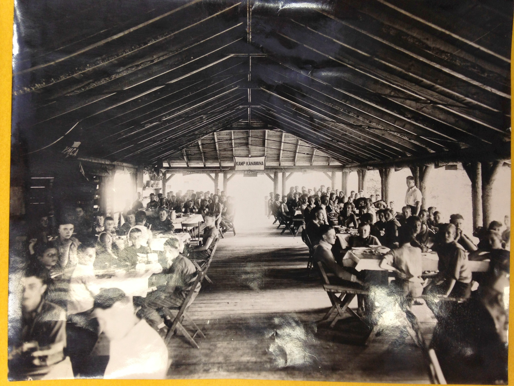
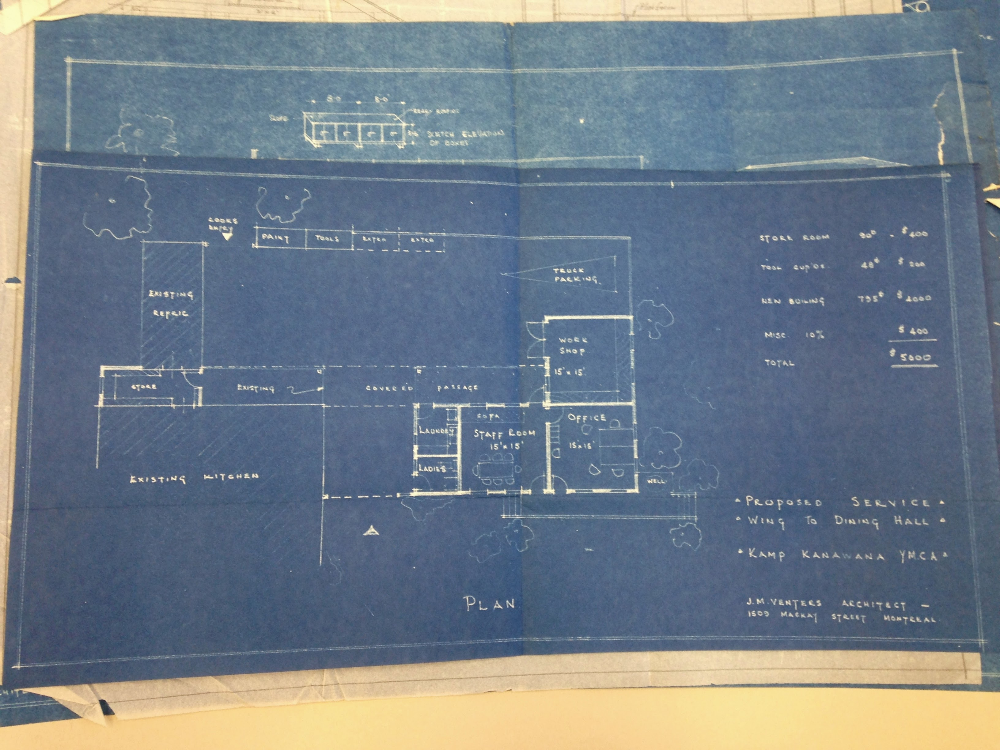
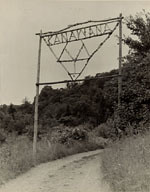
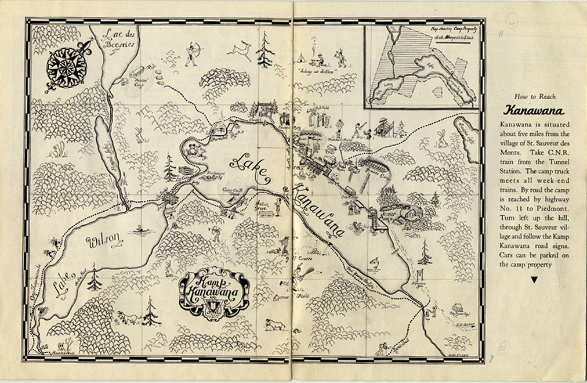

# The Kanawana Site

*Status: E1-reviewed | Sources: src_ymca_website, src_kanawana_facts, src_brochure_1921, src_brochure_1922, src_gas_bag_1923, src_green_triangle_1938, src_mcmorris_thesis, src_concordia_fonds, src_wikidata_lac_kanawana, src_lapresse_ymca_2018, src_weredale_camp, src_mysummercamps_kanawana, src_crel_lac_kanawana, src_postmedia_nature_deficit_2026, src_ymca_kanawana_groups_rentals, src_ymca_kanawana_hebergement_fr, src_bonjour_quebec_kanawana, src_clivus_multrum_projects, src_morin_heights_indigenous, src_wikipedia_mille_isles, src_banq_lovell_1976, src_journal_acces_fire_2023*
*Last Updated: 2026-07-10 (Batch 7 correction: the Kanawana-Weredale plan was not simply "abandoned" -- a real signed 1979 lease and joint files through 1981-82 existed; see camp-weredale.md)*

## Overview

Camp Kanawana occupies a 550-acre site in Saint-Sauveur, in the Laurentian Mountains approximately 90 km north of Montreal.^1 (Wikimapia's entry for the camp independently states 455 acres in near-identical promotional phrasing — an unresolved discrepancy that could reflect a stale scraped description rather than an independent figure; see Open Questions.)^30 The Laurentians lie within the traditional territory of the Anishinaabe (Algonquin) peoples; unlike much of Ontario and the Prairies, Algonquin territory in this region has never been covered by a land-sharing treaty.^25 The camp has three private lakes — Lake Kanawana, Lake Wilson, and Round Lake — connected by a dam between Lake Kanawana and Lake Wilson that is ceremonially opened at the end of each season.^2 Lac Kanawana is located at coordinates 45°51'6.01"N, 74°11'40.99"W, at an elevation of 319 metres above sea level.^3 The YMCA purchased the current site near Saint-Sauveur in 1910,^1 acquiring it from the Page family after Camp Jubilee had operated at Lake Saint-Joseph since 1894.

## Location and Access

The camp is situated at 673 Saint-Elmire Street in Saint-Sauveur-des-Monts,^17 approximately 90 km (45 minutes) north of Montreal by road,^1 or about 45 miles (72 km) by the historical railway route.^4 ^5 The broader region has deep colonial roots: the neighbouring municipality of Mille-Isles was created on July 1, 1855, after detaching from the parish of Saint-Jérôme, and takes its name from the Mille-Isles Seigneury, originally granted in 1683 to Michel-Sidrac Dugué de Boisbriand.^26 Early European settlement in the area dates to the 1830s.^26 The nearest railway station was historically at Piedmont on the CPR Sainte-Agathe line. In 1922, campers took the 7:30 AM train from Place Viger Station, disembarking at Piedmont and traveling 6 miles to the camp.^5 Hike destinations from camp in 1923 included Val Morin, Lac Hughes, Sainte-Agathe, Sixteen Island Lake, Lac Wilson, Pages, and Sainte-Adolphe.^6

The camp was administered from the YMCA Montreal's central branch downtown. Lovell's Montreal City Directory for 1976 listed "Kamp Kanawana" at 1441 Drummond Street, Montreal (H3G 1WS), telephone 849-5331 — the address of the YMCA's Drummond Street building. A second directory listing appeared under Châteauguay with telephone 692-2801.^27

## The Three Lakes

### Lake Kanawana
The camp's main lake, used for swimming, boating, and waterfront activities. The sand beach has a marked swimming area with canoes, kayaks, paddleboards, a water trampoline, a barge, and a rescue boat.^7 The camp beach is formally listed on Swim Guide (ID 5490) and the Great Lakes Guide as "Plage du camp Kanawana YMCA camp Beach," indicating ongoing water quality monitoring for swimming safety.^29

Environmental monitoring data from the Conseil régional de l'environnement des Laurentides (CREL) records the lake's surface area as 0.2388 km², maximum depth 12.4 metres, mean depth 5.2–5.4 metres, volume 1,273,000 m³, altitude 318.4 metres above sea level, watershed area 5.17 km², and a water renewal time of 0.43 years.^16 ^29 The lake has RSVL monitoring station number 573, with data since at least 2013.^29 Lac Kanawana is in the Rivière du Nord watershed; the associated watershed organization is ABRINORD (Organisme de bassin versant de la rivière du Nord).^29

### Lake Wilson
Described as "one of the most beautiful parts of the site," noted for its views, sunsets, and opportunities for stargazing.^8 Year-round private camp sites are available at Lake Wilson, providing a more secluded experience than the main site.^1 In 1923, Lac Wilson was among the hike destinations from camp.^6 According to oral history, the lake was originally called **Lac Desjardins** and was renamed after J.W. McConnell bought and donated it to the camp.^23 Pagé family genealogy research (2026) revealed that Magloire Pagé fils — whose family sold land to the YMCA circa 1910 — married **Olivine Desjardins** in 1875, providing a plausible genealogical origin for the "Desjardins" name as a reference to the landowner's family.^24 The Commission de toponymie du Québec established the name "Lac Wilson" by resolution in 1978. See [[people/j-w-mcconnell|J.W. McConnell]] for the donation history and [[people/page-family|the Pagé family]] for the genealogical connection.

### Round Lake
The camp's third private lake. Limited documentation of its use beyond the geographic fact of its presence within the property.

## Camp Layout

The site is organized into distinct areas:

### Centre Camp
Small cabins without electricity or plumbing, along with platform tents — the traditional camping experience.^1 The camp has 12 cabins with electricity in the Woodsmen and Pioneers sections, 14 prospector tents in the Coureurs des Bois and Pathfinders sections, and 3 rooms in the Rose des Vents Pavilion.^9

### Front Camp
Contains the Farmhouse and Blockhouse, both winterized facilities with fully equipped kitchens, living space, bathrooms, showers, and electricity.^9

### Lake Wilson Area
Private campsites available for rental.^1

### Outpost Camps
In 1923, outpost camps included Otoreke (the senior camp) and Lake Marois.^6

## Facilities

### Current Facilities
The modern camp includes:^7 ^9

- **Dining Hall/Cafeteria**: Capacity over 300 people
- **Katimavik**: Indoor gymnasium^10
- **Rose des Vents Pavilion**: Kitchen with wood-burning stove, common area, 3 rooms (maximum 16 people)^9
- **Arts and Crafts Pavilion**
- **Beach Lodge**
- **Nature Nook / Nature Interpretation Area**
- **Activity Lodge**
- **Gaga Ball Pit**
- **Low Ropes Course** (team-building)
- **Archery Range**
- **Activity/Sports Field**
- **Fire Bowls** for campfires and cookouts

### Historical Facilities
Facilities documented from the 1920s through the 1970s include:^5 ^11

- **The Lookout**: A pre-existing structure on the site before Kanawana was founded — the oldest structure on the property^23
- Two pavilions (a Dining Pavilion and a lakeside Pavilion, both new as of 1922)
- **Dining Hall** (1911)^23
- **Infirmary** (1920s?)^23
- **Grand Portage**: One of the oldest cabins, built after the Lookout, Dining Hall, and Infirmary. Located just north of the Senior Parking Lot, west of the Dining Hall. Served as CIT director's cabin in the 1980s-90s. According to oral history, the end of WWII was heard on the radio here. Demolished c. 2006 for the green shift washroom buildings, which now bear its name.^23
- **The Longhouse**: A large 2-3 story pavilion/boathouse on the Boating Waterfront (due south of the Dining Hall), right at the shoreline. Used for large group gatherings and dances; the Boating Director ("the Admiral") had living quarters in it. Demolished by controlled fire c. 1979 due to irreparable condition.^23
- Hospital (new as of 1922)
- Fenced swimming pool (1922)
- Boats and canoes
- Four diving boards and a zinc slide
- Chapel (outdoor, with an organized choir documented in 1938)
- Council Ring
- Icehouse
- Golf course
- Tents with wood floors
- Lacrosse field
- An "Indian Grave" marking on the camp map
- A totem pole (added 1927 under Harold C. Cross; still visible in 1970s photos)
- **"The Cave"**: The Hike and Trip Department's equipment room^23

A 1928 Kanawana map and a 1962 Kanawana map were both analyzed in the McMorris thesis.^12 A 1974 orienteering map (6 photocopies) is held in the Concordia Archives.^13

### Desjardins Pavilion (2018)
In 2018, Desjardins donated $1 million to the YMCA for renovations at Camp Kanawana, including a new community pavilion described as the "new heart of Kanawana" to increase the camp's capacity and expand its environmental education mission.^14

### 2023 Fire
On May 16, 2023, the superintendent's house at Camp YMCA Kanawana was destroyed by fire. The isolated building, located on Montée Sainte-Elmire in the Spring Valley sector, was a total loss. No one was inside at the time. Twenty-five firefighters from Saint-Sauveur, Morin-Heights, and Sainte-Anne-des-Lacs responded to the blaze. Other camp buildings were unaffected. The cause of the fire was not determined.^28

## Year-Round Use

Although primarily a summer camp, Kanawana operates as a "3-season outdoor and environmental education centre"^18 and is listed on Bonjour Québec as a "holiday centre" with a primary season of May 15 to October 15.^20 The camp has five distinct seasonal rental windows:^19

- **Spring** (May 21–June 23): Full camp package for groups of 6–250 persons
- **Summer** (June 23–August 20): Summer camp in session; limited rental for 6–26 persons only
- **Fall** (August 20–October 14): Full camp package
- **Winter refuge** (October 15–May 20): Rose des Vents Pavilion available in "refuge mode" without running water, by reservation only^19
- **Winter experience** (January 6–March 7): Structured winter package including snowshoeing, outdoor games, campfire snack, and raclette/fondue dinner^19

The Farmhouse and Blockhouse in Front Camp are winterized facilities.^9 Lake Wilson private campsites are available year-round.^1 Corporate retreats of 3+ days are offered at $643.75 per person per night, including meeting room, Wi-Fi, projector, and custom food services.^19 Meal services for group rentals require a minimum of 75 persons.^19

The Concordia Archives hold records of a winter ski camp at Kanawana from 1945 to 1947, documenting the camp's earliest known winter use.^13

## Environmental Character

The camp's 550 acres of Laurentian forest and three private lakes provide the setting for environmental education and conservation programming. The YMCA positions Kanawana as "Quebec's environmental education leader"^21 and emphasizes stewardship values, with youth participating in community-based conservation projects implemented throughout the year.^1 ^7

### Environmental Infrastructure

The camp has replaced its entire septic system with 16 commercial Clivus Multrum composting units accommodating 22,500 uses each per year, plus 32 dry toilets saving 576,000 gallons of water annually. Two central buildings contain all bathroom and shower facilities. The system was installed specifically to keep Lake Kanawana safe from pollution.^22

### Lake Monitoring

Lac Kanawana is monitored by the Conseil régional de l'environnement des Laurentides (CREL), which classifies it within the municipality of Saint-Sauveur in the MRC Les Pays-d'en-Haut.^16 The lake participates in Quebec's Réseau de surveillance volontaire des lacs (RSVL) as station 573, with Secchi disk transparency measured every two weeks from June to October and water samples analyzed for phosphorus, dissolved organic carbon, and chlorophyll a.^16 ^29 Monitoring data has been available since at least 2013; technical support reports for Saint-Sauveur lakes exist for years 2013-2024.^29 The lake's watershed of 5.17 km² and rapid water renewal time (0.43 years) place it within the Rivière du Nord watershed, administered by the ABRINORD watershed organization.^29 No formal ecological survey or environmental designation has been identified in public records, though the City of Saint-Sauveur's draft 2024 Plan d'urbanisme states directly that "le camp Kanawana présente également une valeur environnementale méritant d'être reconnue au sein de la présente planification" — naming the camp specifically, though without conferring any formal legal designation.^31 A "récréative et de conservation (RC)" zoning category in the city's Règlement 222-2008 names a "camp de vacances" as a qualifying example use, and a "RC 123" zone code appears near a côte Sainte-Elmire road reference, but the camp parcel's actual zoning could not be confirmed from the regulation's text (zone boundaries are shown only on graphical maps).^31 Separately, Concordia's finding aid for sub-sub-series 12B01 lists an item titled "Proposed wildlife sanctuary, bird and game sanctuary — 1847, 1954-1960" whose connection (if any) to the camp property itself is undetermined without physical examination.^33

## Proposed Two-Site Operation

From 1977 to 1980, plans existed for a proposed two-site operation using Kanawana and Camp Weredale.^13 Camp Weredale was founded in 1934 to serve orphaned or at-risk boys and is now an independent non-profit operated by the Weredale Foundation, serving ages 6–17 in foster care or youth protection services.^15 A direct fetch of Batshaw Centres' own institutional history pages for Camp Weredale (2026-07-09) confirms they make zero mention of the YMCA, Kanawana, or any two-site plan at all.^32 **Correction (2026-07-10):** this was not simply a proposal that "was abandoned" — Concordia's finding aid for sub-series 12F documents an actual signed 1979 lease between the Weredale Foundation and the Montreal YMCA, plus joint files running through 1981-1982 (a day-camp proposal, a "YMCA staff cottage rental," a "Comité Weredale"). See [[context/camp-weredale|Camp Weredale and Its Relationship to Kanawana]] for the full finding. Both camps operate independently today; why and when the 1979-1982 arrangement ended remains undocumented online.^34

## Images

*The dining hall, c.1920s. Copyright All rights reserved by Kanawana.*

*Architectural drawing for a proposed dining-hall extension that was never built. Copyright All rights reserved by Kanawana.*

*The camp's front gate, 1940-1960. Copyright All rights reserved by Kanawana.*

*A 1941 map of the camp property. Pre-1949 photograph — public domain in Canada.*

## Open Questions

1. ~~[Important] The YMCA Kanawana Facts sheet dates the site purchase to 1910. Was the first season at Saint-Sauveur in 1910 or 1911?~~ [Resolved] McMorris confirms 1910 as the first season at the Saint-Sauveur site. The 1935 History's reference to the camp's "twenty-sixth year of existence" counts from 1910.^12
2. ~~[Critical] Who was the Page family who sold/donated the land?~~ [Substantially resolved] The Pagé family were pioneer settlers of Saint-Sauveur: Magloire Pagé (1826–1901) owned lot 43, côte Saint-Elmire. His son Magloire fils married Olivine Desjardins (1875). Grandson Édouard became the village baker. See [[people/page-family|The Pagé Family]]. Remaining: which specific parcel(s) went to the YMCA and under what terms.
3. [Important, re-confirmed dead end 2026-07-09] Has the camp acreage changed over time? A direct full-text read of the McMorris thesis confirms it contains exactly two acreage figures, neither for the Saint-Sauveur site itself (33 acres for the original Camp Jubilee/Lake St-Joseph property, 1898; a 25-acre lease at Lac Landron, 1950s) — the thesis's own passages on the 1928-1962 property growth give no acreage figure for either the Lake Becsies or Pagé-farm expansions. This is now confirmed as a genuine absence in the primary academic source, not an extraction gap. Separately, Wikimapia states 455 acres vs. the YMCA's own 550 — unresolved discrepancy, unconfirmed whether stale copy or genuine change.
4. [Important, re-confirmed dead end 2026-07-09] What was the specific reason the Kanawana–Weredale two-site plan was abandoned? Batshaw Centres' own Weredale/Youth Horizons institutional history pages (fetched directly) make zero mention of the YMCA or Kanawana at all — ruling out that source. Concordia's AtoM system is now bot-walled and blocks all automated access; only the item titles ("Proposed two-site operation," 1977; "Plans–Kanawana and Weredale," 1980) are known, with no scope/content notes. Resolvable only via physical archive access.
5. [Nice-to-have] Are the 1928 and 1962 maps accessible in the Concordia Archives?
6. [Nice-to-have, advanced 2026-07-09] Is there any ecological or conservation designation on the property? No formal registry designation confirmed, but two new leads found: the city's 2024 draft Plan d'urbanisme explicitly names Kanawana's environmental value (without conferring a designation), and Concordia's 12B01 finding aid references an unexamined "Proposed wildlife sanctuary, bird and game sanctuary" file (1847, 1954-1960) of undetermined relevance to the camp property.

## Related Articles

- [[chronology/founding-1894|Founding of Camp Kanawana (1894)]]
- [[places/council-ring|The Council Ring]]
- [[places/lake-wilson|Lake Wilson]]
- [[people/harold-cross|Harold C. Cross]]
- [[people/j-w-mcconnell|J.W. McConnell]]
- [[programs/canoe-trips|Canoe Tripping at Kanawana]]
- [[places/camp-otoreke|Camp Otoreke]]
- [[places/places-and-locations|Places and Locations at Camp Kanawana]]
- [[programs/traditions-and-culture|Traditions and Culture at Kanawana]]
- [[people/page-family|The Pagé Family of Saint-Sauveur]]

## Sources

1. YMCA Quebec, "Camp YMCA Kanawana," https://www.ymcaquebec.org/en/summer-camp-kanawana
2. YMCA Kamp Kanawana Facts sheet; 1922 brochure, Internet Archive.
3. Wikidata - Lac Kanawana (Q22660425).
4. 1921 brochure, Internet Archive.
5. 1922 brochure, Internet Archive.
6. The Gas Bag, 1923 Re-union Number, Internet Archive.
7. YMCA Quebec, Camp Kanawana facilities page.
8. MySummerCamps.com - YMCA Kamp Kanawana listing.
9. YMCA Quebec, Camp Kanawana accommodations page.
10. YMCA Quebec, Camp Kanawana website.
11. 1938 Green Triangle; McMorris thesis analysis of camp maps.
12. McMorris, Grace (2023). "An Experience That Lasts a Lifetime." MA thesis, Concordia University.
13. Concordia University Archives, YMCA of Montreal Fonds P145.
14. La Presse, "Un million pour les YMCA" (May 15, 2018).
15. Camp Weredale, https://weredalecamp.com/
16. Conseil régional de l'environnement des Laurentides (CREL), Lac Kanawana environmental data. URL: https://crelaurentides.org/lake/kanawana/
17. Leonowicz, Ursula. "Rewilding childhood: How one summer camp is tackling nature-deficit disorder among Montreal youth." Postmedia Content Works (on behalf of YMCAs of Québec), March 4, 2026.
18. McConnell Foundation, "The YMCAs of Quebec" funding database. URL: https://www.mcconnellfoundation.ca/funding-database/the-ymcas-of-quebec/
19. YMCA Quebec, Camp Kanawana Groups & Rentals. URL: https://www.ymcaquebec.org/en/find-a-y/camp-ymca-kanawana/groups-rentals; YMCA Quebec, Camp Kanawana Hébergement (French). URL: https://www.ymcaquebec.org/fr/camp-vacances-kanawana/hebergement-location-equipements
20. Bonjour Québec, "YMCA Kanawana Holiday Centre." URL: https://www.bonjourquebec.com/en-us/listing/accommodation/ymca-kanawana/0i7c
21. YMCA Quebec, Program Specialists job posting (via The Ladders).
22. Clivus Multrum, Parks & Recreation projects. URL: https://clivusmultrum.com/parks-recreation-toilet-system-projects.php
23. Oral history, Matt Aronson (2026) [src_oral_aronson].
24. Ville de Saint-Sauveur, "Les familles pionnières de Saint-Sauveur"; Société d'histoire et de généalogie des Pays-d'en-Haut, "Édouard Pagé, boulanger à Saint-Sauveur."
25. Morin-Heights, "Indigenous History"; cf. historical treaty maps for Quebec.
26. Wikipedia, "Mille-Isles, Quebec."
27. Lovell's Montreal City Directory (1976), "Kamp Kanawana" listing. BAnQ numérique.
28. Journal Accès, report on superintendent's house fire at Camp YMCA Kanawana (May 16, 2023).
29. CRE Laurentides Atlas des lacs — Lac Kanawana (RSVL 573), https://crelaurentides.org/lake/kanawana/; Swim Guide beach ID 5490, https://theswimguide.org/beach/5490; Great Lakes Guide listing.
30. Wikimapia, "Kamp Kanawana" entry [src_wikimapia_kanawana]. States 455 acres; page content could not be directly fetched/dated to resolve the discrepancy with the YMCA's own 550-acre figure.
31. Ville de Saint-Sauveur, draft Plan d'urbanisme (March 2024) [src_vss_plan_urbanisme_2024]; Règlement de zonage 222-2008 (consolidated) [src_vss_reglement_zonage_222_2008]. Both downloaded and full-text searched directly, 2026-07-09.
32. Batshaw Centres History, Camp Weredale / Youth Horizons institutional history pages [src_batshaw_camp_weredale]. Direct fetch 2026-07-09.
33. Concordia University Archives, finding aid for sub-sub-series 12B01 (Kamp Kanawana General Administration) [src_concordia_atom_12B01].
34. Concordia University Archives, static finding-aid page for sub-series 12F (Camp Weredale) [src_concordia_atom_12F]. Direct fetch 2026-07-10: 1979 lease agreement, 1980-82 joint files.
