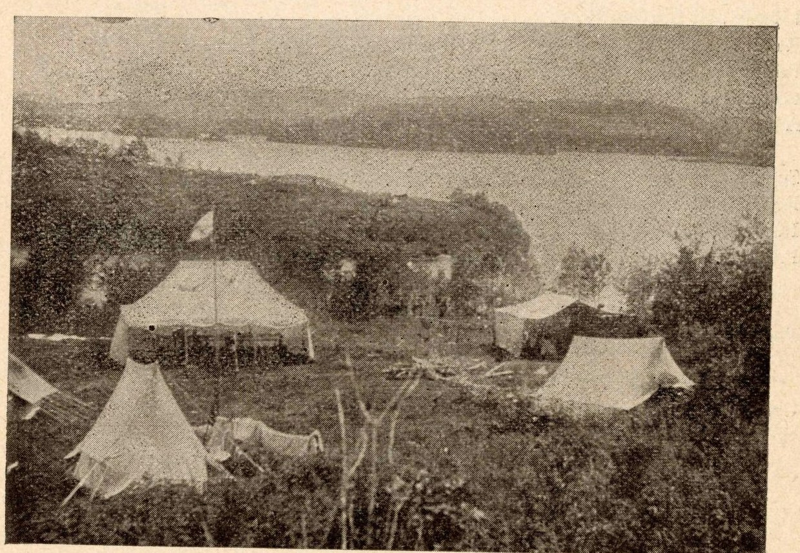
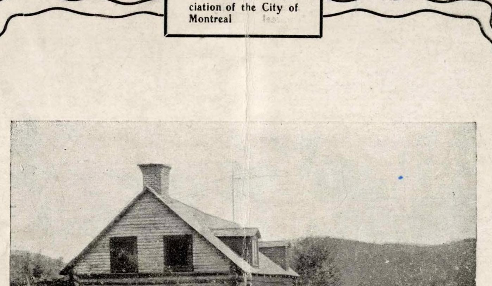

# Camp Otoreke

*Status: E1-reviewed | Sources: 34*
*Last Updated: 2026-09-06 (in 1967 it became a department of Downtown Branch)*

## Overview

Camp Otoreke was the YMCA of Montreal's original camping site, located on islands in Lake Saint-Joseph in Saint-Adolphe-d'Howard, Quebec. Originally established as Camp Jubilee in 1894, it was renamed Camp Otoreke (Iroquoian for "north") in 1909, and the main YMCA boys' camp relocated to the new Kanawana site in Saint-Sauveur the following year.^1 Camp Otoreke continued operating for more than seven decades afterward, evolving from a boys' camp into an adult and family operation before closing in 1982 after nearly 90 years of continuous use.^1

## Site and Geography

Lake Saint-Joseph is located in the Township of Howard (now Saint-Adolphe-d'Howard).^2 The lake measures approximately 3 km long by 1 km at maximum width.^2 The YMCA purchased three islands in the lake for the camp, which had a landing area on the shore.^1 A historical postcard titled "A View of The YMCA Camp Landing, Otoreke, Quebec" shows a developed landing dock and waterfront facilities.^3

Saint-Adolphe-d'Howard is a municipality in the Laurentians region of Quebec, in the Pays-d'en-Haut Regional County Municipality.^2 The Township of Howard was created in 1873, named after Frederick Howard, 5th Earl of Carlisle, a Commissioner of the Colonies during the American Revolution.^15 The municipality changed its name from Howard Township to Saint-Adolphe-d'Howard in 1939; the area was popularly known as "Villa Howard" and earned the reputation "Miami of the Laurentians" in the 1950s.^11

## Founding as Camp Jubilee (1894)

*A note on the name: "Camp Jubilee" is the archival name for this site, used by Concordia's description of the YMCA of Montreal fonds and by QAHN, but never by the association itself while the camp ran — its own reports say simply "the Summer Camp at Lake St. Joseph." **Otoreke is the earlier-attested proper name of the two**, appearing in the annual reports from 1921-22. See [[history/founding-1894|The Founding of Camp Kanawana]] for the full explanation.*

In 1892, Lemuel Cushing of the Montreal YMCA inaugurated the camping program by bringing a group of boys to Lake Saint-Joseph.^1 In 1893, YMCA staff conducted an exploration trip to the area, described as "the first Montreal YMCA venture to explore the country round about St. Agathe with the view of securing a lake on which to establish a Summer Camp."^4 Billy Ball formally established Camp Jubilee in summer 1894, bringing 20 campers to the Lake Saint-Joseph site.^5 ^6 The camp was named to commemorate the YMCA's 50th anniversary (founded 1844).^6

A BaladoDiscovery heritage tour states that the YMCA acquired the island in 1897 and accommodated 80 campers.^14 This differs from the QAHN account of "three islands" total (conflict c_008). "Three islands" is retained as the total count, consistent with this KB's existing "main island plus two others" framing; BaladoDiscovery's "two islands acquired in 1897" is read as describing a specific, later, formal transaction — plausibly the acquisition of two additional islands in 1897 to supplement an original island already in informal use since 1894 — rather than a competing total-count claim (an editorial reconciliation, not new evidence; see Revision History). The "80 campers" figure, if accurate, would indicate rapid growth within the program's first three years.

The same BaladoDiscovery source, re-mined in 2026-07-09, adds construction detail not previously extracted: a local entrepreneur named **Victor Bergeron** was hired to build a two-story log cabin able to house 25 young men, and the early camp purchased staples "from the Bergin and Corbeil General Store."^14

## 1900: the camp described by the men who used it

The single richest document this project has for the Lake Saint-Joseph camp is the **"Seventh Annual
Report of the Current Camp Committee," dated 10 December 1900** — eight handwritten pages, addressed "To
the Chairman Permanent Camp Committee" and signed by Frank Benedict as Chairman and a Dawson as
Secretary.^19 It sat unread in this project for years because the Internet Archive scan has no OCR text
layer; that is not a defective scan but a cursive manuscript, which no OCR was going to read. The page
images were read by eye and transcribed on 6 September 2026.^19

*Two committees, not one.* The report's address establishes that the association ran a **Permanent Camp
Committee** and a **Current Camp Committee**, the second reporting annually to the first — and that the
series was already in its seventh year in 1900, which puts its first at 1894.^19

*Three committees, and two clienteles on one site.* The other 1900 report digitized from this fonds is
the **Report of the Junior Camp Committee, 30 November 1900**, and the two are complementary rather than
duplicates. The Junior committee ran the **boys' camp** — 28 June to 14 July, 45 boys, 6 leaders and 17
visitors under Mr. Calhoun and Mr. Brown, six tents, eleven wet days out of sixteen, and a closing
balance of $5.05. The Current committee ran the **adult members'** camping in the other weeks of the same
summer. So one lake carried two programmes with two committees and two annual reports, six seasons after
the association's first report shows the same two-stream shape — which is the real reason a single
attendance number for these years is the wrong question to ask.^19 ^20 Both committees complained about
the cook, independently, in the same season.

**"We think we have come through the banner year in the Camp's history."** Three parties went out. The
**24 May party** was twenty-four of the association's most prominent men, "including the President,
Treasurer and four Directors," for four days; the committee expected the camp to profit "very
materially" because the impression formed by the "Fathers of the Association" was favourable. Then the
regular summer season. Then a **fall party of twelve**, out 21 to 26 September, photographed "in duck
suits" for the next prospectus.^19 An **Annual Regatta** was already a camp fixture, and campers went to
the **Sainte-Agathe Regatta** in a body, taking the chef with them, and came home with **eleven
prizes** — more, the committee thought, had they owned skiffs to enter the rowing events.^19

**The attendance figure is a blank.** The manuscript reads "The attendance of __ members shows an
increase of __ over last season": two gaps the writer never filled. The obvious place to look for a 1900
number does not have one. It does establish that attendance rose over 1899.^19

### The 1900 survey, and what the campers asked for

**On 20 October 1900 the committee wrote to every member who had been to camp that year**, "calling for
criticisms favorable or otherwise and also suggestions," and printed about thirty-five of the replies
verbatim, underlining those that several letters repeated.^19 That is a dated, designed consultation of
camp users, with a stated method, in 1900. The replies were "almost without exception favorable," except
on the food: late-summer campers complained about how meals were cooked and served but insisted the fault
was the chef's, not the committee's — "the food supplied was of the best." One man reported that when he
remonstrated with the chef about dishes coming to the table unwashed, "it almost came to blows." The
committee's own recommendation is to **"Get an older Cook, a man who has passed thirty-five and one who
knows his place."**^19

The suggestions describe the physical camp better than any other source here:^19

- A **house with a gallery** and a **kitchen**; an **ice-house** badly built and blocking the view from
  the gallery, to be moved nearer the kitchen and lined with six inches of sawdust, the ice raised a
  foot off the floor, "this would make a genuine refrigerator."
- A **kitchen wharf**, and a demand for a permanent one: "Where is the one advertised in the accompanying
  prospectus?"
- **Tents on prepared ground**, with a named site — **"High Bluff"** — where blocks were set in the
  ground for the poles so they could not sink and put the tents out of shape. All the tents were leaking.
- A **spring**, whose water they wanted pumped to the house.
- **Rock Island**, wanted for a lean-to "to rough it in while fishing," and wanted bought outright.
- **Corbett Island**, wanted for an athletic field — and one writer asks the question that dates the
  place names themselves: **"Why not name the camp island & also the one opposite, that is now 'called'
  'Corbett Is'?"** So in 1900 the island the camp stood on had no name.
- **Diving Rock**, "an ideal swimming place," wanting a spring board.
- A **Lumbermen's Shanty at the Rapids**, wanted purchased, along with "all the Islands in Lac St.
  Joseph."
- Equipment: a couple of canoes **and a full sized war canoe**; diving boards bought in town; aluminium
  spoons and forks, because the silver plate was worn through and "brass spoons is now more applicable";
  dinner plates as well as soup plates; white oilcloth for the tables; two blankets a man; four boats
  repaired that "leaked all the past season"; indoor games for wet days; and **a dark room at camp**.

**Two local suppliers are named, and both names are already in this article.** Milk arrived so late that
breakfast waited until half past nine — "Bergeron fault" — and the committee reports flatly, "We are
informed that **Bergin** the carter sells liquor."^19 The heritage-tour account above names **Victor
Bergeron** as the builder of the camp's two-storey log cabin and has the camp buying staples from the
**Bergin and Corbeil General Store**. The 1900 report is an entirely independent source, written by the
camp itself, and it puts the same two families in the same relationship to the camp. It also raises a
possibility this article states as a question rather than a finding: whether **"Corbett Island" is an
anglicisation of Corbeil**. Nothing here settles that.

*None of this is Kanawana.* Kanawana's first season was 1910. Rock Island, Corbett Island, High Bluff,
Diving Rock and the Rapids are features of Lake Saint-Joseph, and should not be attached to the
Saint-Sauveur site.

## Transition to Camp Otoreke (1909-1910)

In 1909, Camp Jubilee was renamed Camp Otoreke. The following year, in 1910, the YMCA purchased the current Kanawana site near Saint-Sauveur,^7 and the main boys' camping program relocated there. Camp Otoreke continued operating on the original islands, but its purpose evolved: it served men aged 18 and over, women and men, married couples, and low-income families.^1

## Post-War and Later Decades

Camp Otoreke remained an active YMCA facility through the mid-twentieth century. A 1944 photograph of the camp is held by the Quebec Anglophone Heritage Network (QAHN).^8 In 1967, Camp Otoreke hosted a Young Adult Centennial Conference, held July 8-15, 1967 (records in Concordia Archives P0145/14D10).^4 Planning and development reports were also prepared for the site that year.^4

The Concordia Archives hold dedicated Camp Otoreke records in sub-series P0145/12C, including situation reports (1977-1980) that profiled Otoreke alongside Kanawana and Camp Weredale as part of the YMCA's camping operations.^4 The sub-series is organized into seven sub-sub-series: 12C01 (General administration), 12C02 (Financial administration), 12C03 (Land/facilities/equipment/supplies), 12C04 (Communications), 12C05 (Staff/counsellors), 12C06 (Campers), 12C07 (Program).^4 The finding aid confirms the *existence*, though not the online content, of 1982 revenue/expenditure and tax-status records within 12C02 -- suggesting the closure year's finances were documented, though only a physical archive visit can retrieve them.^4

Two cataloguing ambiguities surfaced in 2026-07-09 research, both unresolved without a physical visit: (1) two separate 1967 catalog entries — "Report of the Boys' and Girls' Camping Committee to the Metropolitan Planning and Development Committee of the YMCA of Montreal" (Box HA1881) and "Camp Otoreke report — Planning and Development" (Box HA2367) — may be the same document cross-referenced or two distinct related documents; (2) W.E. Cushing's 1943 manuscript appears under two variant titles/locations, "Early Days at Lake St. Joseph" (Box HA1881) and the previously-cited "Historical sketches — Lake St. Joseph" (Box HA2307) — possibly the same manuscript catalogued twice, or two distinct short pieces.^4

### 1935: the camp goes coeducational, and the staff proposed it

By the mid-1930s Otoreke was emptying, and the association said so: "**For several years past the
attendance of young men at Otoreke has steadily declined**, and the question of what might be done
to make greater use of the three beautiful islands in the Laurentians comprising our camp site has
been given very careful consideration. It has been apparent that the camp, however effective in past
years, **does not attract the interest and support of an adequate number of young men today**."^32

The remedy came from below: "**From the young men members and the staff came the suggestion that the
Association should experiment in running the camp for not only young men but also young women and
married couples.** In view of the successful experience of several other Associations in conducting
this kind of camp, and because of the decreasing attendance at our own camp in recent years, it was
decided to make the change."^32

And it worked. After the summer of 1935, "it was the unanimous conclusion of those who attended or
visited the camp that the experiment was a success… **One hundred and fifteen young men and women
attended** for periods varying from a week-end to two weeks, this being an **increase of 53% over
the previous year**. The programme proved more interesting and attracted the participation of
campers in a way not achieved for many years." The camp ran "under the leadership of Mr. **C. J.
McGerrigle** of North Branch with **Mrs. McGerrigle** acting as hostess" — the same McGerrigle who a
decade later helped choose the ski lodge site at Christieville.^32

**This matters beyond Otoreke.** This wiki treats coeducation as a Kanawana question of the late
1960s and 1970s. The same association had been running a coeducational camp since 1935, on the very
islands Kanawana came from.

**In 1967 it stopped being its own unit.** "Camp Otoreke **became a department of Downtown Branch**. It continued to operate a weekend Ski Lodge for young adults and a vacation centre during the summer."^34 Eleven years earlier the association had listed Otoreke among its *branch* chairmen, alongside Central, Westmount and Lachine; now it was a department inside one of them. The report gives no reason and records no change to what the site actually did.

**And by 1947 it was the association's largest camp operation, with women slightly outnumbering men.** The annual report for the year ending 31 March 1948: "The registration was **475 young men, 482 young women and 49 married couples**, a total of **1,055 persons for 11,942 camper-days**. The camp period extended from **June first to September first**, with a daily average of 160 persons during the mid[-season]."^33 Twelve years after the 115 young men and women of that first mixed summer, Otoreke was running a three-month season for over a thousand people, and the women's registration had passed the men's. Kanawana in the same season took 320 boys for 1,394 camper-weeks and would remain boys-only for another twenty years.

*Two seasons earlier*, in the summer of 1933, Otoreke ran six weeks from 8 July under shared
secretarial responsibility — "Messrs. **George Porteous** of the North Branch and **Harold E.
Smith** of the Mount Royal Avenue Branch, **who gave up part of their holidays** to render this
service" — with attendance of **128 camper weeks** and a surplus of $11.00.^32 Porteous had been
Kanawana's Chief Director in 1929; see [[people/directors-index|Directors and Staff of Camp
Kanawana]].

### The 1928 season in figures

The association's report for the year ending 31 March 1929 gives Otoreke a paragraph of its own.
Attendance of young men reached **211 against 160 the previous year** — "within five of the record
attendance in the year 1920," which is the only reference this project has to Otoreke's peak year.
Receipts were **$4,492.44** against expenditures of **$4,407.83**, and the Metropolitan Board
**loaned $2,000.00** to the camp committee "for the purpose of increasing the accommodation and
modernizing the [equipment], some of which has been in use since the camp was organized."^31

That last clause is worth noticing on its own: in 1928 the camp was still using gear from its
founding.

## The Ski Lodge and Winter Operations (1940–1961 or later)

Otoreke was not only a summer site. Concordia's finding aid gives the ski lodge an entire sub-series
of its own — **P145/12H, "Ski lodge"** — running from 1929 to 1959 and fetched for the first time in
the 2026-08-25 mirror walk.^17 Its contents show a sustained winter operation with its own governance:
a **"Ski lodge-H. C. Cross' file. - 1929-1946"**; a **"Memorandum proposing ski club. - 1941"**;
**"Correspondence, memoranda, reports on ski facilities. - 1946-1950"**; a **"Ski program-
correspondence. - 1948-1949"**; annual reports for **1954-1955** and **1955-1956**; and a file
recording **"What the Otoreke Ski Lodge Committee wants in facilities at the Mainland Inn"** — so
there was a standing Ski Lodge Committee with stated requirements. Ski lodge photographs survive,
dated only to the 1940s, 1950s or 1960s.^17

The sub-series also documents a property purchase this wiki had no record of: **"Purchase by YMCA of
Christieville property. - 1948-1951,"** with related files on a "Friendly Home-Christieville rental"
(1948), the "Christieville site" (1949), and "Christieville ski lodge correspondence" (1959).^17 The
Y appears to have acquired a separate winter property and run it for at least a decade.

Two consequences for the rest of this wiki. First, the H. C. Cross file spanning **1929-1946** is the
longest single documented span for [[people/harold-cross|Harold C. Cross]] anywhere in the archive,
and it ties him specifically to winter programming. Second, CLAUDE.md's Phase 2 mandate lists
"Winter Programming (if evidence found)" as an article to spawn conditionally. **The evidence is
found** — though it is winter programming at Otoreke, not at Kanawana, which is a distinction the
eventual article will have to hold onto.

**None of these files has been read.** The finding aid establishes that they exist, with those titles
and those dates. It says nothing about what is in them.

### The lodge itself, from a 1961 review

*Most of the paragraph above is now answered.* "The Otoreke YMCA Ski Lodge: A Review," an internal
paper of the 1961-62 winter, was read whole on 2026-09-06 and tells the whole story of the
property.^30 *(The section heading above formerly read "1929-1959," which was the finding aid's
span. The lodge was still running when this review was written.)*

**It began in rented houses.** "The Otoreke YMCA Ski Lodge was set up on its present site in 1945.
Earlier, **in 1940 at Ste. Adèle, in 194[1] at Piedmont**, the Otoreke Committee had rented houses
for use as winter lodges."^30 The committee's own criteria for a permanent one, recorded in 1945:
"**handy to the railroad, immediately upon skiable hills, and away from towns**."

**Three men found the site**, and the review names them: "Frank B. Peterson, Chairman of the
Otoreke Committee, **Bud Horton**, an ardent skier, and **C. J. McGerrigle**, Executive Secretary
of North Branch and also Director of Otoreke, sought out and recommended the site on **Elder's
Farm, Christieville**."^30 The old house was rented for two seasons, purchase was recommended, and
"a couple more years were to pass before clear title could be secured" — which is exactly the
1948–1951 span the finding aid gives for "Purchase by YMCA of Christieville property." Then a
kitchen, washrooms and sleeping quarters were added; the next year the men's house and dining room;
later the front room. **The "Friendly Home-Christieville rental" of the finding aid is a tenant**:
it "rented the house from **John Elder** for the summer in the years before we took over, [and]
continues to rent from us. The rent is $400 … the same as paid to Mr. Elder."^30

**The money.** Capital expenditure to 1961 totalled **$31,550** — $8,500 for the property, $5,000
for the men's house, $4,000 each for the kitchen addition, the dining room, the new lounge and the
septic tanks, and smaller sums for a stove, furnaces, wiring, a roof and washroom fittings. Who
paid matters: "the purchase price of the property may have come from the Metropolitan Finance
Committee. **All other expenditures have been taken care of out of Otoreke Camp and Ski Lodge
income**."^30 The summer camp and the winter lodge built the plant between them.

Income peaked at **$10,345 in 1959** and fell to **$6,200 in 1961**. The review sets 1954-55
against 1960-61 itself: membership **143 against 45**, meals served **8,999** against a figure the
scan destroys, bed occupancy **2,513 against 1,361**. It is fair about the season — "the 1960-61
season saw poor snow conditions… The Otoreke Lodge was not alone in showing a falling off in
income last winter" — and then spends its closing pages explaining the real reasons.^30

### Why it was failing: the car and the chairlift

The lodge had been sited in 1945 to be *handy to the railroad*. Sixteen years later:

> "Private cars now supply transportation to and from the Laurentians. When the committee case for
> buying the property was presented to the Metropolitan Board, the Director of Otoreke spoke of the
> **'forest of skis stretching from the station gate away back to Jean Talon Street.' One does not
> hear of ski 'specials' today**."^30

The Autoroute had changed the shape of a ski day — "more of these occasional skiers ski one day
only … and return home" — and was about to arrive, "extended through St. Sauveur and … within three
miles of Christieville." The rope tows at **Mont Christie** were to be replaced "by a T-Bar or Chair
Lift shortly." And a group of skiers including several Otoreke campers had organised to weekend at
Jay Peak, Mount Washington, Stowe and Tremblant instead: "To the question, 'Why not spend a weekend
at the "Y" Lodge?' **the answer was, 'What with rope tows!'**"^30

Two institutional customers are named — the **Montreal West High School Ski Club**, five Christmas
holidays running, and the **McGill School of Physical Education**, whose Ski School had been held
there four years. The reason its directress gave for choosing it is worth keeping: "**We would like
accommodation where the bar is not the centre of entertainment hours.**"^30

The review also records the Laurentian rental market around the lodge in 1961 prices: houses "all
rented by the end of October," the better ones $500–$600 for the season and "shacks" $350–$400 —
"one shack which rented last winter had no inside toilet; one in St. Sauveur, which had no hot water
tank, rented to six girls at $500. One shack near the Lodge with no water supply at all has been
rented for this season."^30

## Newly Read Finding Aids for Otoreke Itself

The same walk fetched six sub-sub-series covering Otoreke's own administration, none previously held:
general administration (12C01), finance (12C02), land and facilities (12C03), communications (12C04),
staff (12C05), and programme (12C07).^18 Items worth naming: a **1921 surveyor's blueprint of Lacs
St-Joseph, Ste-Marie and Théodore**; the **"Dedication service of the chapel. - 1941"**; a
**"Submarine telephone cable across Lake St. Joseph. - 1963"**; **"Camp Otoreke songs. - 1941"**; a
**1938 "Campers' petition re director's re-appointment"**; and, in Box HA160, HA2321 and HA2652,
**film reels and sound recordings** related to the camp — the only known moving-image and audio
material for either site. The 1936 mixed-gender evaluation from 12C01 is treated in
[[history/coeducation-gender|Coeducation and Gender at Kanawana]].

### The 1898 season, and the man who founded the camp next door

The same report's Permanent Camp Committee narrative gives the season in detail.^24

**The Log Club house.** "The Log Club house at Lake St. Joseph was **completed in September**, and has
been greatly admired by all who have seen it" — built on member subscriptions and **free of debt**, with
furnishing and "a number of needed improvements" planned for the next season. *A caution on the date:
this report covers the year ending 30 April 1899, so its "September" is **September 1898**, while
[[meta/attendance-series|the attendance series]] carries "Log clubhouse opened, cost $700" against 1899.
Those may be the completion and the opening, or the series may be a year out. Not resolved here.*

**The senior season** ran "from the 9th of July to the 4th of September," with parties out in May and
September: "first week 19, second 11, balance of summer 42, May and September 13, **total 85**." The
committee also prints a **length-of-stay breakdown** that nothing else in this project has — "two, four
weeks; one, three weeks; three, two and one half weeks; one, two weeks; **twenty-eight, between one and
two weeks**; fifteen, one week; **twenty-eight, odd days**" — which accounts for 78 men against a stated
total of 85, and shows that more than a third of the camp's use was measured in days rather than weeks.
Receipts $984.32 against expenditures $939.71, with the balance printed as $41.62; *the difference is
$44.61, so either the report or its OCR has transposed a figure.*

**And the camp had four men in charge: "Messrs. A. Mackellar, C. B. POWTER, A. R. Ross, and W. H.
Ball."**^24

*The first of them is **Archibald McKellar**, an Assistant Secretary of the Montreal YMCA in 1898 [f_4980]. In the same 1898 roster **Powter is Assistant Physical Director under Ball**, so three of these four men are the association's paid staff, listed in the same eight lines.* This wiki holds thirteen facts about **C. B. Powter** and not one of them connects him to the
YMCA's camp. They are all about **Powter's Camp**, "Sans Egal," which his son's 1962 account says began
in June 1902 when "a group of 50 boys from the Montreal area under the leadership of the late
C. B. Powter arrived on the shores of Lac St. Joseph." **The same lake.** The man who founded the
neighbouring camp in 1902 was running the YMCA's camp on that water in 1898, beside the association's
own Physical Director. See [[connections/related-camps/quebec-camp-landscape|The Quebec Camping
Landscape]], which has treated the two as parallel institutions.

**The junior camp** was open "from the 23rd of June to the 7th July," with **20 boys** and "a party of
five visitors [who] spent **Dominion Day** with them," under **W. F. Chapman** and **C. S. Paterson** —
Paterson also sitting on both the Permanent Camp Committee and the Junior Department that year. They had
with them "for a short time, **Drs. Harry Shaw and Charles Ogilvy**, who are **old members of the Junior
Department**": the earliest evidence in this record of camp alumni coming back.^24

### Who actually ran the camp in 1899

The annual report for the year ending 30 April 1899 prints the committee structure in full, and it names
the men the 1900 report is signed by:^23

- **Permanent Camp Committee** — **Chas. Cushing**, Chairman; John W. Ross, **W. E. Cushing**,
  C. S. Paterson, **F. L. Benedict**.
- **Summer Camp** — **F. L. Benedict**, Chairman; R. C. Paterson, F. S. Macfarlane, A. G. Burton,
  G. A. Gatehouse, Jas. Greig.
- **Junior Department** — R. B. Ross Jr., Chairman; F. A. Crowe, Secretary; **R. L. Charlton**,
  Geo. Lyman, Harold Beall, **W. E. Cushing**, L. Cushing, F. M. H. Cushing, Geo. C. Wells,
  C. S. Paterson, A. L. Paterson, E. C. Budge.

**The 1900 report is addressed "To the Chairman Permanent Camp Committee." This names him:
Charles Cushing** — the same Charles Cushing the North American Year Books record as the International
Committee's Corresponding Member for Quebec in 1893–95 [f_4837]. And it settles a reading left open a
day earlier: the 1900 report's signature was transcribed with its chairman's middle initial marked
uncertain, "L or B." The 1899 report prints **F. L. Benedict** twice in type. It is **Frank L.
Benedict**, and he chaired the Summer Camp committee the year before he signed.^23

**Two of the camp's later historians were sitting in these rooms.** **W. E. Cushing**, who wrote
"Historical sketches — Lake St. Joseph" in 1943, was on both the Permanent Camp Committee and the Junior
Department in 1899. **R. L. Charlton**, who wrote "Notes re Early Days" the same year, was on the Junior
Department — his second documented seat, and this one in boys' work. Neither wrote as a later compiler.

**And there is a photograph, now looked at.** The same report carries a plate captioned "**THE
ASSOCIATION SUMMER CAMP, LAKE ST. JOSEPH.**", printed on page 13 below the year's list of members who
died and the signatures of C. T. Williams, President, and D. A. Budge, Secretary. **It is the earliest
known photograph of this site**, four or five seasons after the first camp, and it was invisible to
every text search this project has ever run, because the OCR preserves the caption and not the
picture.^23

*"THE ASSOCIATION SUMMER CAMP, LAKE ST. JOSEPH." Halftone from the YMCA of Montreal's annual report for
the year ending 30 April 1899, p. 13. Published 1899; public domain in Canada.*

**What it shows.** A view from above and behind the camp, out over the lake. **Four tents.** Left of
centre and largest, a **wall tent or marquee with its side walls raised**, and immediately in front of
it **a flagpole with a flag flying**. Lower left foreground, a pale **conical or bell tent** on guy
ropes. Right of centre, a smaller wall tent half screened by brush. Right foreground, an **A-frame tent**
seen side on. Between them what looks like stacked cut poles or a woodpile. The ground is rough scrub
with low bushes and a bare sapling in front; it falls away through brush to the shore, and the lake runs
across the frame with a long low wooded far shore behind.

**No permanent building appears in the frame.** That is a statement about the image and not about the
site: the Log Club house was completed in the September of the year this report covers, and it may
simply be out of shot.

### Who was Corbett? A lead, not an answer

The 1900 report names **Corbett Island** as an established name and nothing read here explains it. The
association's own annual reports carry three Corbetts, and one of them is interesting.^22

**D. W. Corbett** was the Montreal YMCA's assistant secretary with charge of the boys' department. The
1892-93 report records that he "**has accepted the position as secretary of the Honolulu**" association;
the 1893-94 report twice laments "**the departure of Mr. D. W. Corbett in June, 1893**," who "**was the
main-stay of this work**," with **P. H. Cushing** secured as his successor. He also appears beside
Patton: on 22 March in the 1890-91 report, "our old friends, **Messrs. Corbett and Patton**, with Mr.
W. H. Davis, of the Springfield School, spoke on 'The Race of Life'."^22

**The hypothesis is that the island is his.** He ran boys' work in the years immediately before the camp
began. **What is against it:** he left Montreal in June 1893, a year before the 1894 camp, so if the
island carries his name it was given in his memory rather than during his tenure — and nothing read here
says so. There is also an **E. M. Corbett** in an 1893-94 list and a **John Corbett** subscribing in
1900. This is recorded so a later pass can test it, not as an answer.

### 1904: the camp describes itself, and the club house is photographed

The YMCA of Montreal's 1904 report is titled **"MEN OF MONTREAL — Fifty-Third Annual Report and Summer
Camp Number, 1904"**, and its front cover is a halftone captioned **"CAMP CLUB HOUSE, LAKE ST.
JOSEPH."**^26

*"CAMP CLUB HOUSE, LAKE ST. JOSEPH." Cover halftone, YMCA of Montreal, *Men of Montreal*, 1904.
Published 1904; public domain in Canada.*

A gable-ended two-storey building with a masonry chimney, a **wide covered veranda** across the front
and down the side on posts, a canvas blind let down at its left end, and steps from the middle of the
veranda to a path. **A dozen or more boys and young men** are on the veranda, the steps and the path,
several in bathing dress; the lake shows at the right with a low wooded hill beyond. This is the **Log
Club House completed in September 1898**, and that veranda is the "gallery" the 1900 campers complained
the ice-house spoiled the view from.^19

**"The Eleventh Annual Summer Camp."** The number opens: "On July 16th, **the Eleventh Annual Summer
Camp** of the Association for senior members will open at Lac St. Joseph, in charge of **Mr. H.
Ballantyne, Educational Secretary**."^26 An eleventh annual camp in 1904 counts the first at **1894** —
the association's own ordinal, contemporaneous and arithmetically checkable, against the 1931 report's
later claim that the first camp opened in 1898 [f_2146]. It then tells the founding story at ten years'
remove: "**Ten years ago** a small party of our members, after preliminary exploration, **pitched their
tents on one of the islands in Lac St. Joseph**… led to the acquiring of the islands for the Association
and to the establishment of the summer camp at that spot."^26

**The whole plant, in one sentence.** "The Association now has in addition to the club house, **a well
furnished log kitchen adjoining, an ice house, pump, small camp library, eight large tents equipped with
fly and board floor, ten boats, fishing and swimming wharves**."^26 The enlarged kitchen and the new
ice-house are the two things the campers asked for in 1900 and the committee built by 1902, now standing;
the tents that "all leaked" in 1900 now have flies and board floors. And: "Through the generosity of
**Mr. Jas. W. Tester**, a **gasoline launch** will be at the disposal of the members this year."

**What it cost and how you got there.** Sixty-four miles by rail to Ste-Agathe, then **eight miles by
road**. One week, railway fare and the drive both ways included, **$10.00**; subsequent weeks $5.00;
Saturday to Monday $4.00 — "a member's privilege," the rates representing "the actual cost of operation
with a small margin to maintain the camp property." Out Saturday afternoon, back Monday morning. The
camp closed **6 September**. Programme: "Tenting, boating, bathing, fishing, exploring… tennis, base
ball, basket ball, quoits," and, drily, "**A camera adds greatly to the pleasure of a visit.**" The camp
committee that year: **B. S. R. Watson**, chairman, with Jas. R. Greig, W. Jarrett, C. D. Tweedie and
H. G. Beall.^26

**And the islands were still being bought.** "On a large well-wooded island in the lake the camp is
situated. **The Association also owns several islands immediately adjoining.**"^26 Against the 1902
report's single island plus the small one bought at auction in November 1901, that gives a sequence —
one through 1901, two from that November, **several** by 1904 — which is very likely why the two
secondary accounts behind `c_008` cannot be reconciled. They are fixing a number on a holding that was
still growing.

### 1901: one island, then two, and a survey that worked

The annual report for the year ending 30 April 1902 does two things this article has wanted.^25

**It dates an island purchase, and counts what the association already had.** "On **Nov. 26th, 1901**,
three islands in Lac St. Joseph were **sold by public auction**, and the Committee purchased **a small
one adjoining our present island, for $50**." That is a primary source with a date and a price, and it
says the association held **one** island before that day — "our present island," singular — and **two**
after. It fits neither of the secondary accounts behind conflict `c_008`, the "three islands" of QAHN
and the "two islands acquired in 1897" of BaladoDécouverte, neither of which could be quoted cleanly
when re-checked in July 2026. **It does not resolve the count**: a third island could have been bought
at any point after 1901, and nobody here has read the later reports for it. The other two islands sold
that day went to buyers the report does not name.

**And it shows the campers' survey of October 1900 changing the camp.** The Permanent Camp Committee
"has to report the most successful year since its opening… **The committee enlarged the kitchen and
built a new ice-house.**"^25 Read that against what the campers had asked for fourteen months earlier: "a
proper pantry & Ice-house built near kitchen," "Shelves are needed in the worst way in the kitchen," and
an ice-house "not built properly" that "now spoils view from gallery."^19 **The two things the committee
reports building are the two things the campers asked for.** It is the clearest evidence in this record
that the 1900 circular was more than a gesture.

*The season's money, for the record:* the Junior Committee took $617.26 and spent $478.67; the Senior
Camp took $1,306.85 and spent $1,106.96; both handed their balances up to the Permanent Camp Committee;
$490.89 went on "needed improvements and permanent equipment"; and the camp owed the Association a loan
of $384.27, "should be repaid next year."^25

### The islands are not on the official map

Quebec's toponymic register carries **120 official names in Saint-Adolphe-d'Howard, of which exactly one
is an island**: **Île Christie**, at 45.974066 / -74.384710, officialised in 1985. Lac Saint-Joseph
itself is registered at 45.974310 / -74.331879.^21

Searched province-wide, **there is no Corbett anything in the Laurentians** — Quebec's only two Corbett
toponyms are lakes at Senneterre and Lac-Nilgaut, hundreds of kilometres away — and no island of any
name is registered within six kilometres of Lac Saint-Joseph other than Île Christie.^21

So the names the camp itself used in 1900 — **Rock Island**, **Corbett Island**, and the camp's own
island, which one correspondent complained had no name at all — never entered the provincial register.^19 ^21
That bears on Open Question 2 below: the three islands are **not identifiable by name from the official
record**. Whether Île Christie is one of them is not established here, and this article does not assume
it.

## Relationship to Kanawana

Camp Otoreke remained connected to Kanawana as an outpost and trip destination throughout its history:

- In 1923, Otoreke served as the senior camp outpost, alongside Lake Marois.^9
- In 1935, a four-day trip to Otoreke was made from Kanawana.^10
- Otoreke was a regular canoe trip destination from Kanawana.^10

### A published history says this camp *is* Kanawana, and a reader will meet that before they meet this

*Le Québec en plein air* (Québec Amérique, 2016), a general history of Quebec outdoor recreation by Paul
Larue and Pierre Bélec, describes the YMCA's first Laurentian camp and then says: "**Connu longtemps sous
le nom d'Otoreke, ce camp existe toujours: c'est maintenant le camp Kanawana.**"^27

**It is right about the institution and wrong about the site.** The camping enterprise that began on
these islands does continue as Kanawana. But Kanawana is at Saint-Sauveur and Mille-Isles, about thirty
kilometres away, and the sentence as written says the island site is now Kanawana. It also erases
seventy-two years: the main boys' camp moved to the Kanawana site in 1910, and **Otoreke went on
operating at Lac Saint-Joseph until 1982** — through the ski lodge years, the adult and family camp, and
everything else in this article. A reader of that book would conclude that Otoreke closed in 1910 and
that Kanawana stands on the islands, and both are false.

This is recorded here rather than ignored because *Le Québec en plein air* is a mainstream Quebec press
title and is the kind of book a researcher reaches first. The correction should travel with the sentence.

*One thing from the same page worth checking rather than correcting.* Larue and Bélec date **Camp
Nominingue to 1911** and call it "le premier camp francophone", while the Quebec Camping Association's
own 1974-75 directory gives Nominingue's founding as **1925** (see
[[connections/related-camps/quebec-camp-landscape|The Quebec Camp Landscape]]). The two may be measuring
different things — a site occupied against a camp incorporated — and neither is preferred here.

### The Otoreke Hike, and the year it ended

Otoreke's name outlived the move north in an unexpected place: a Kanawana walking tradition named
after it. The "Come to Kanawana" brochure for 1928 announces its replacement, and in doing so gives
the only date this article has for the thing: "**A Gypsy Hike is planned to take the place of the
old Otoreke Hike.** A waggon will convey our outfit, and we will cook and sleep as we trek from
lake to lake. This should prove a very popular event."^29

Two things follow. Eighteen years after the main camp left Lake Saint-Joseph, boys at Saint-Sauveur
were still doing something called the Otoreke Hike, and it was old enough by 1928 to be called
old. And **1928 is when it stopped**, replaced by a wagon-supported trek between lakes. What the
hike actually was — a walk to Otoreke, a walk in Otoreke's manner, or a name that had outlived its
meaning — is not stated, and nothing else in this project mentions it.

## Regional Camping Context

Camp Otoreke was not the only organized camp in the Saint-Adolphe-d'Howard area. In 1926, Msgr. McShane founded Camp Kinkora on 3 km² of private land nearby for Irish Catholic youth from Montreal — establishing a Catholic counterpart to the YMCA's Protestant camping operation.^12 The Pripstein family also operated a Jewish camp in the vicinity, making Saint-Adolphe-d'Howard a rare intersection of Montreal's three major confessional camping traditions.^12 The area's appeal for camping was reinforced by its accessibility: the municipality was approximately 11 km from the train station in Sainte-Agathe-des-Monts, which had been served by the Canadian Pacific Railway since 1892.^13

## Closure

Camp Otoreke closed in 1982 after nearly 90 years of continuous operation.^1 The YMCA sold the property in 1987.^1 The reasons for closure remain undocumented in any source found (see Open Question #1). A systematic 2026-07-09 search across Google Books, HathiTrust, Internet Archive full text, BAnQ-style newspaper queries, and Quebec's Commission de toponymie confirmed this is a genuine dead end for online sources, not just an unindexed gap — resolution requires a physical Concordia Archives visit (sub-series 12C, especially 12C01-12C03).

**Low-confidence lead on post-closure status (flag, not confirmed fact):** a self-published, anonymous-commenter alumni blog ("Camp Otoreke Blog," established 2005) suggests the main island is still informally called "Otoreke Island" and was privately owned by multiple co-owners by 2008; a 2005 visitor comment describes the buildings as derelict by that year (mould, rot, neglect from disuse) rather than redeveloped. No official toponymic source confirms "Otoreke Island" as a recognized place name, and no independent corroboration exists for any claim on this blog — treat as an unverified lead only.^16 The same blog names a sequence of directors (Ron and Valma Huppfield during WWII; Rev. and Mrs. McGerrigle afterward; Colin and Mrs. Mackay in the early 1960s) that do not appear elsewhere in this KB and are not independently corroborated — flagged for verification, not treated as confirmed.^16

## The Otoreke camp song

Otoreke had its own song, and it was set to a borrowed tune — the same habit this project has documented over and over at Kanawana.^28

> **OTOREKE CAMP SONG** *(To tune of "Sierra Sue")*
>
> Oh! Lake so blue at Otoreke,
> And Suez too, so clear and cool,
> I long for you dear Otoreke
> Where fun and frolic is the rule,
> The sunny days and evening coolness,
> Are such a boon from city heat,
> I'll go each year to Otoreke,
> And love it more each time we meet.

"Sierra Sue" is a 1916 American popular song that Bing Crosby revived in 1940, so the borrowing was about a year old when this book was printed. That places it exactly alongside [[traditions/camp-songs-cheers|Kanawana's own borrowings]] — "Dear Old Kanawana" to the *Battle Hymn of the Republic*, the Marching Song traced to "Alabama Jubilee", "Johnny Verbec" to the Dunderbeck folk song, the ice-cream parody to "Yes, We Have No Bananas". **The two camps wrote their songs the same way**, which is what one would expect of two camps run by the same association, and is now attested rather than assumed.

The song names two lakes: Otoreke's own, and **Suez**.

Elsewhere in the same book, a local verse is fitted into the widely sung "You can't go to heaven" chain song — and it is a joke at the expense of the camp's own fleet:

> You can't go to heaven in an Otoreke boat,
> 'Cause the goll-darn things don't stay afloat.
> You can't go to heaven on a pair of skis…

*A note on proportion.* The songbook runs to 64,000 characters and **five lines of it are about the camp**. The rest is the general repertoire of Canadian community singing in 1941 — "There'll Always Be an England", Kipling's "Mandalay" — and is not extracted here. The book had been in this repo's cache, labelled *skimmed*, cited by nothing.^28

## Open Questions

1. ~~[Critical] Why did Camp Otoreke close in 1982? Was the property sold, donated, or abandoned? Concordia Archives sub-series P0145/12C may contain relevant records.~~ [Confirmed genuine dead end for online sources, 2026-07-09] 22 queries across 10+ surfaces found no reason for the closure. Requires a physical Concordia Archives visit.
2. [Important] What happened to the three islands after 1982? Are they still identifiable? A low-confidence, uncorroborated blog lead suggests informal private ownership and derelict buildings as of 2005-2008 (see Closure section) — not yet independently verified.
3. [Important] How many campers/families used Otoreke annually during its later decades? Confirmed genuine dead end for online sources (2026-07-09) — likely only recoverable from Concordia sub-sub-series 12C06 (Campers).
4. [Important] What was discussed in the 1967 Planning and Development reports? Were there expansion plans? Confirmed genuine dead end online — only bare archival titles found, no content descriptions (see the two-catalog-entries ambiguity above).
5. [Nice-to-have] What can be learned from the 1944 QAHN photograph about camp facilities?
6. [Nice-to-have] Is the postcard of the camp landing datable? It would show the physical infrastructure. Re-checked 2026-07-09: the actual eBay dealer listing (item 333130004877) gives no date estimate or postmark, only the "RPPC" (real photo postcard) format designation, which loosely implies pre-1950s. Confirmed dead end for precise dating.
7. [Important] What does W.E. Cushing's 1943 "Historical sketches—Lake St. Joseph" (Concordia Archives P0145/12A) reveal about the original Camp Jubilee/Otoreke site? See the title-discrepancy note above ("Early Days at Lake St. Joseph" vs. "Historical sketches") — confirmed no secondary source anywhere quotes or summarizes this manuscript; a physical archive visit is required.
8. [Important] Do the six earlier reports in this series survive — the first through sixth Current Camp Committee reports, 1894 through 1899 — and the replies to the circular letter of 20 October 1900? Two of the series are digitized, both from 1900. Concordia holds Permanent Camp Committee minutes for 1895-96 and correspondence for 1899-1901 (Box HA2307 area, sub-series 12A); that is where to ask. Added to the standing Concordia letter (p_282).
9. [Important] Whose Dawson signed the 1900 report as Secretary? The surname is plain; the initials are a monogram this scan cannot resolve. The 1898 Camp Jubilee photograph names Frank L. Benedict and Ralph H. Dawson together, and Ralph H. Dawson wrote the 1933 history of Kanawana — so the two signatures are very likely those two men, but the page does not prove it. The Permanent Camp Committee minutes would.

## Related Articles

- [[history/founding-1894|Founding of Camp Kanawana (1894)]]
- [[site/the-kanawana-site|The Kanawana Site]]
- [[people/billy-ball|Billy Ball]]
- [[people/cushing-family|The Cushing Family and YMCA Camping]]
- [[traditions/canoe-trips|Canoe Tripping at Kanawana]]
- [[history/centennial-1967|The 1967 Centennial and Kanawana]]

## Sources

1. QAHN, "The YMCA Camp of Saint-Adolphe d'Howard," https://qahn.org/article/ymca-camp-saint-adolphe-dhoward
2. Wikipedia, "Saint-Adolphe-d'Howard."
3. eBay postcard listing: "A View Of The YMCA Camp Landing, Otoreke, Quebec" (RPPC).
4. Concordia University Archives, YMCA of Montreal Fonds P145, sub-series 12C (Camp Otoreke).
5. YMCA Kamp Kanawana Facts (undated fact sheet), Internet Archive.
6. McMorris, Grace (2023). "An Experience That Lasts a Lifetime." MA thesis, Concordia University.
7. YMCA Kamp Kanawana Facts: "1910: The YMCA purchases the current site near St-Sauveur, Quebec."
8. QAHN photograph: Camp Otoreke 1944, https://qahn.org/image/camp-otoreke-ymca-camp-saint-adolph-dhoward-1944
9. The Gas Bag, 1923 Re-union Number, Internet Archive.
10. "A History of Kamp Kanawana" (1935 Season Chronicle), Internet Archive.
11. BaladoDecouverte, "Saint-Adolphe-d'Howard History" heritage tour. URL: https://baladodecouverte.com/circuits/900/poi/10164/saint-adolphe-d-howard-history
12. BaladoDecouverte heritage tour: Camp Kinkora and regional camping context.
13. BaladoDecouverte heritage tour: CPR railway access since 1892, distance to Sainte-Agathe station.
14. BaladoDecouverte, Saint-Adolphe-d'Howard heritage tour: YMCA island acquisition 1897, 80 campers. (Note: conflicts with QAHN on island count — see c_008.)
15. Phase 2 research (recovered June 2026): Township of Howard created 1873, named for Frederick Howard, 5th Earl of Carlisle.
16. "Camp Otoreke Blog" (self-published alumni blog, est. 2005) [src_otoreke_blog_2005]. Low reliability — single uncorroborated source with anonymous commenters.
17. Concordia University Archives, YMCA of Montreal fonds P145/12H — Ski lodge (finding aid) [src_concordia_mirror_12h]. Static-HTML mirror, fetched and extracted 2026-08-25. See [f_2259].
18. Concordia University Archives, YMCA of Montreal fonds P145/12C01–12C07 (finding aids) [src_concordia_mirror_12c01, src_concordia_mirror_12c02, src_concordia_mirror_12c03, src_concordia_mirror_12c04, src_concordia_mirror_12c05, src_concordia_mirror_12c07]. Same walk. See [f_2258].
19. "Seventh Annual Report of the Current Camp Committee," YMCA of Montreal, 10 December 1900, 8 pp. manuscript [src_ia_seventh_annual_report_current_camp_1900]. Digitized in the `ymca-montreal-fonds` collection with no OCR layer, because it is cursive; the page images were read by eye and transcribed 2026-09-06 (p_288), cached at `sources/cache/ymca-montreal-fonds/1900-12-10-seventh-annual-report-current-camp-committee.txt`. Leaves 3, 4, 6 and 8 of the scan are inverted 180 degrees. See [f_4879], [f_4880], [f_4881], [f_4882], [f_4883], [f_4884].
20. "Report of the Junior Camp Committee, 1900," YMCA of Montreal, 30 November 1900 [src_ymf_1900_11_30_report_of_the_junior_camp_committee]. Typed, with an OCR layer, and already in this project's knowledge base; read here beside the Current Camp Committee report of ten days later. See [f_4848], [f_4885].
21. Commission de toponymie du Québec, *Toponymes officiels* and *Toponymes désofficialisés* [src_donneesquebec_bnlq_2026]. Queried 2026-09-06 for every named feature in Saint-Adolphe-d'Howard and for "Corbett" province-wide. See [f_4892].
22. YMCA of Montreal Annual Reports for 1890-91, 1892-93 and 1893-94, and the subscriber list in the report for 1900 [src_ia_ymca_montreal_annual_reports_collection], [src_ymf_sgw_ymca_annual_report_1990_1991]. Read for Corbett 2026-09-06 (p_253). See [f_4903].
23. YMCA of Montreal, **Annual Report for the year ending 30 April 1899** [src_ia_ymca_montreal_annual_reports_collection]. The Permanent Camp Committee, Summer Camp and Junior Department lists, and the plate captioned "The Association Summer Camp, Lake St. Joseph." Read 2026-09-06. See [f_4908], [f_4909], [f_4910].
24. The same report's **Permanent Camp Committee** narrative (leaf 32 of the Internet Archive scan) [src_ia_ymca_montreal_annual_reports_collection]. The Log Club house, the senior and junior seasons, the length-of-stay breakdown and the men in charge. Read 2026-09-06. See [f_4911], [f_4912], [f_4913]. *This passage is in the cached OCR text and has been since the file was ingested; it had not been read.*
25. YMCA of Montreal, **Annual Report for the year ending 30 April 1902**, section "SUMMER CAMP, ST. AGATHE" [src_ia_ymca_montreal_annual_reports_collection]. The island auction of 26 November 1901, the kitchen and ice-house, and the season's finances. Read 2026-09-06. See [f_4915], [f_4916]; and `c_008` for the island count.
26. YMCA of Montreal, ***Men of Montreal*: Fifty-Third Annual Report and Summer Camp Number, 1904** [src_ia_ymca_montreal_annual_reports_collection] — the cover halftone and the senior-camp description, pp. 1-3. Read 2026-09-06. See [f_4918], [f_4919], [f_4920], [f_4921]. The cover image is filed at `assets/images/documents/1904-camp-club-house-lake-st-joseph.jpg`, the whole cover beside it.
27. Paul Larue and Pierre Bélec, *Le Québec en plein air* (Montréal: Québec Amérique, 2016), Internet Archive scan leaf 310 [src_larue_belec_quebec_plein_air_2016]. **One passage plus two stray sentences**, reconstructed 2026-09-06 from eight overlapping Open Library search-inside queries; the book is lending-restricted and has not been read, and the printed page number is unknown. The reconstruction, the queries, and a statement of what is wrong with the passage are cached at `sources/cache/openlibrary-search-inside/2026-09-06-larue-belec-quebec-en-plein-air.txt`. See [f_4939].
28. Camp Otoreke songbook, 1941 [src_ymf_1941_camp_otoreke_songs], Concordia-digitized YMCA of Montreal fonds. **64,000 characters, of which five lines are about the camp**; the rest is the general community-singing repertoire of 1941 and is not extracted. The book had been in this repo's cache labelled *skimmed* and cited by nothing, and was read on 2026-09-06 under p_441. See [f_5004].
29. "Come to Kanawana" brochure, 1928 season, YMCA of Montreal fonds [src_ymf_1928_come_to_kanawana_brochure]. See [f_5031].
30. "The Otoreke YMCA Ski Lodge: A Review", internal paper of the 1961-62 winter, YMCA of Montreal fonds [src_ymf_1961_the_otoreke_ymca_ski_lodge_a_review]. Cached at `sources/cache/ymca-montreal-fonds/1961-the-otoreke-ymca-ski-lodge-a-review.txt`. See [f_5040], [f_5041] and [f_5042]. Read whole 2026-09-06 under p_441. **The scan damages numerals badly** — it renders 4 as *h* and confuses 3 with 5 — so several figures in the income series and the capital table are given here only where unambiguous, and the damaged ones are flagged in the facts rather than reconstructed.
31. YMCA of Montreal, 78th Annual Report, for the year ending 31 March 1929 [src_ymf_sgw_ymca_annual_report_1929] — camping season the summer of **1928**. See [f_5066].
32. YMCA of Montreal annual reports for the years ending 31 March **1934** and **1936** [src_cache_sgw_ymca_annual_report_1934, src_cache_sgw_ymca_annual_report_1936] — camping seasons 1933 and 1935. See [f_5071].
33. YMCA of Montreal annual report for the year ending 31 March **1948** [src_ymf_sgw_ymca_annual_report_1948], camps section — the 1947 season. Read 2026-09-06 under p_441. See [f_5079].
34. YMCA of Montreal annual report for **1967** [src_cache_sgw_ymca_annual_report_1967], camping section. Read 2026-09-06 under p_441. See [f_5096].

## Research Notes

### Revision History

- **2026-07-10** — Conflict c_008 (two vs. three islands) resolved editorially: "three islands" retained as the total, with BaladoDiscovery's "two islands acquired in 1897" read as a specific later transaction rather than a competing total-count claim. An editorial reconciliation, not new evidence.
