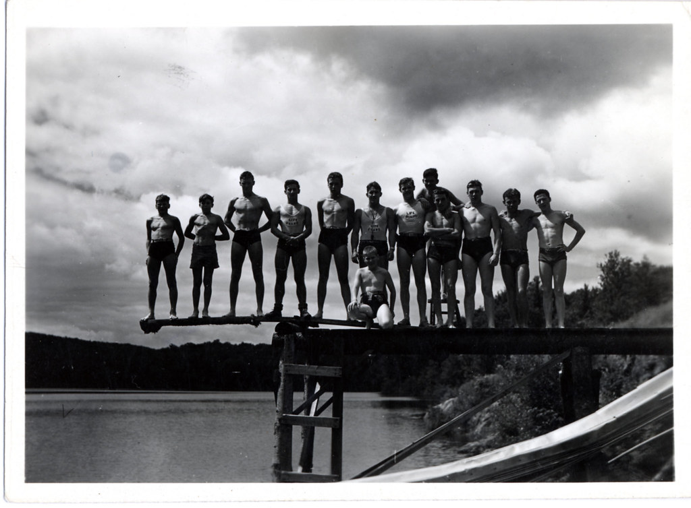
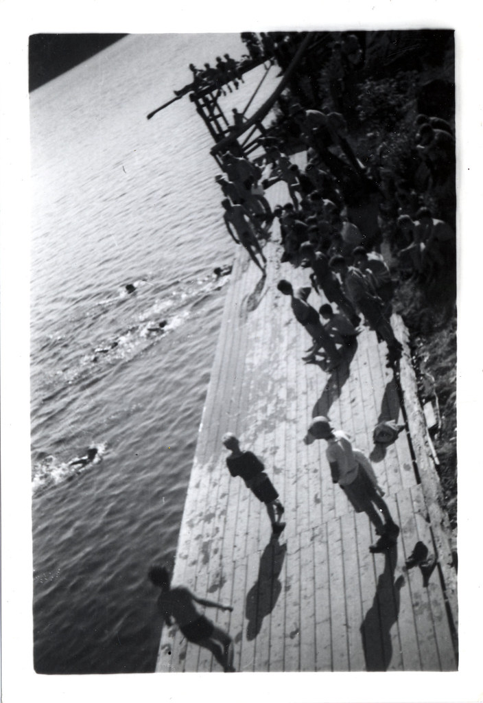
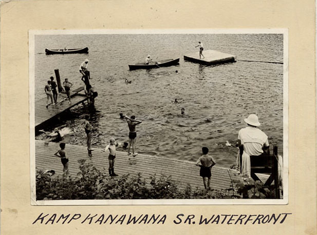

# Lake Wilson

*Status: E1-reviewed | Sources: 13*
*Last Updated: 2026-09-06 (Fong's 2008 biography of McConnell, read past a dead end)*

## Overview

Lake Wilson is one of the three private lakes on the Camp Kanawana property, alongside Lake Kanawana and Round Lake.^1 ^2 It is connected to Lake Kanawana by a dam whose ceremonial opening marks the end of each summer season.^3 The lake is described as "one of the most beautiful parts of the site," noted for its views, sunsets, and opportunities for stargazing.^1

## Geography

Lake Wilson is located within Camp Kanawana's 550-acre property in the municipality of Mille-Isles (historically associated with Saint-Sauveur), in the Laurentian Mountains of Quebec.^1 The camp's main lake, Lake Kanawana, is located at coordinates 45°51'6.01"N, 74°11'40.99"W, at an elevation of 319 metres above sea level; Lake Wilson lies nearby, connected by the dam.^4

There is a separate, unrelated lake also named Lac Wilson in the municipality of Saint-Adolphe-d'Howard, approximately 20–30 km to the northwest.^5 That lake has its own residents' association (Les Amis du Lac Wilson, est. 2002) and should not be confused with the Camp Kanawana lake.

## Historical References

The earliest known reference to Lake Wilson in camp publications is in the 1923 *Gas Bag* (the 14th season chronicle), which lists "Lac Wilson" as a hike destination alongside Val Morin, Lac Hughes, Sainte-Agathe, Sixteen Island Lake, Pages, and Sainte-Adolphe.^6 Its inclusion alongside external locations has led to speculation that the name may have predated the YMCA's acquisition of the property circa 1910.

By 1935, the lake is clearly described as a camp lake. The *History of Kamp Kanawana* (1935 season chronicle) describes the end-of-season dam ceremony: the dam "which had kept the water in Lakes Kanawana and Wilson at a desirable height was let out before the eyes of the assembled campers."^3

## Current Use

Lake Wilson serves as a destination for overnight camping excursions. Two-week campers have overnight trips to Lake Wilson as part of their program.^2 Year-round private campsites are available at the lake, providing a more secluded experience than the main camp site.^2

## Naming Origin

**The camp answered this itself in 1951, and this project had the document.** "Kamp Kanawana History," read to a staff training course on 6 June 1951, states it in one sentence:^11

> "A short time later Mr. J. W. McConnell purchased the land around Lake Desjardins. This he presented to the Y.M.C.A., and the lake was renamed 'Lake Wilson' after Mr. McConnell's son."

That is a primary in-house document, and it confirms both halves of what this article had held as unverified. The lake **was** formerly Lac Desjardins; it **was** bought and given to the YMCA by J.W. McConnell; and it **was** named for his son — Wilson Griffith McConnell (1908–1966), on the identification argued at [[people/j-w-mcconnell|J.W. McConnell]]. The oral history recorded here was right, and a document independently reached the same account.

Two things about how this was missed are worth keeping. The source has been in the knowledge base since July 2026 marked as read; what "read" meant was that a previous pass had quoted the passages it went looking for. And this section previously named the 1933 Dawson history and the 1943 Charlton account as "the most likely sources, but confirmed archive-only" — treating the answer as out of reach while it sat in a cached document nobody had read through.^12

### An outside source says the same thing, and puts a year on it

Everything above comes from inside the institution — the camp's own 1951 history and operator oral
history. **There is now a source from outside it.** William Fong's biography of McConnell, published by
McGill-Queen's University Press in 2008, contains this sentence:^13

> "… 1912, in that year he also bought a site at **Lake Desjardins, near Saint-Sauveur, for a new Camp
> Kanawana, which was renamed Lake Wilson after his first son**. [F]urther, the YMCA campaign provided
> the model for a fundraising campaign of McGill University, also in …"

Three things it settles and one it does not.

**Lake Desjardins was real.** This wiki has carried conflict `c_006` since June 2026 on the ground that
no lake of that name is documented anywhere near the site. A university-press biography naming it, in a
sentence about the purchase, fills that absence.

**The renaming is independently attested**, by an author with no stake in the camp, working from
McConnell's own papers rather than from the camp's.

**There is a date: 1912.** The 1951 history said only "a short time later" than the 1910 purchase of
the main site.

**It does not name the son.** Fong writes "his first son", and the identification of Wilson Griffith
McConnell (1908–1966) still rests on the family record set out at [[people/j-w-mcconnell|J.W.
McConnell]] — but "first son" and "Wilson" agree, which is one more coincidence than the identification
had before. Nor does the passage say whether McConnell bought the lake or the whole site, or whether
the purchase and the renaming fell in the same year.

*On how it was found, because it matters more than the finding.* The book is lending-restricted on the
Internet Archive, and this project recorded on 2026-07-09 that searching inside it was impossible — the
Archive's own search-inside API returns 403 for every query against a print-disabled item, and the note
concluded "only physical/operator access to the book remains." That was true of the route tried. Open
Library's own search-inside endpoint answers the same corpus, restricted books included, and the
passage above was assembled from seven overlapping phrase queries against it. The full method is at
[f_4933]; what it says about this article is that a dead end recorded fourteen months ago was a fact
about one API.

### What the alternatives were, and why they now fall away

The alternatives previously canvassed here were a pre-existing settler-family name, J.W. McConnell's own middle name ("Wilson," his mother's maiden name), and an unrelated YMCA Wilson. The pattern evidence that favoured a settler origin is real and is retained below, because it explains why the *other* Quebec Lac Wilsons are named as they are — it simply does not govern this one, which has a documented naming of its own.

The Commission de toponymie du Québec has no entry for this specific Lac Wilson, which is consistent with the 1951 account: a private lake renamed by its owner has no reason to enter the official register under either name. A full-text extraction of the complete McMorris thesis (129 pages) found zero mentions of "McConnell" and exactly two trivial mentions of "Wilson" — the thesis is not a source for this question.

Pattern evidence on comparable toponyms, retained: three further official Quebec "Lac Wilson" entries beyond Sainte-Lucie-des-Laurentides — Brownsburg-Chatham (fiche 451695, named for a landowning family who also built a dam to create the lake), Saint-Théophile (fiche 67250, named for a man named Wilson who built a fishing camp there) and others — all favour settler-family origins in the general case.

## The Dam

The dam between Lake Kanawana and Lake Wilson is a longstanding camp feature.^3 Its ceremonial opening at the end of each season was documented as early as 1935. The dam controls water levels between the two lakes.

## Images

*The swim and diving team on the waterfront tower. Pre-1949 photograph — public domain in Canada.*

*The waterfront at swim time. Pre-1949 photograph — public domain in Canada.*

*Senior waterfront, 1940-1960. Copyright All rights reserved by Kanawana.*

## Open Questions

1. ~~[Critical] What is the naming origin of Lake Wilson?~~ **[Resolved 2026-09-02]** The 1951 "Kamp Kanawana History" states it: J.W. McConnell bought the land around Lac Desjardins, gave it to the YMCA, and the lake was renamed for his son.^11 What remains open is narrower and worth separating — whether "Mr. McConnell's son" is specifically Wilson Griffith McConnell (the identification rests on the name and the dates, not on this document), and exactly when the purchase and renaming happened; the 1951 text places it only "a short time later" than the 1910 site purchase. The 1933 Dawson history and 1943 Charlton account may still add detail and remain archive-only. 3 of 4 comparable Quebec "Lac Wilson" toponyms favour a settler-family origin over the McConnell hypothesis.
2. [Important, confirmed dead end 2026-07-09] When was the dam between Lake Kanawana and Lake Wilson constructed? Not found in any online source; Quebec's CEHQ Répertoire des barrages does not list this dam at all.
3. [Important, confirmed dead end 2026-07-09] What is the surface area and depth of Lake Wilson? Does not appear in any public lake/GIS database (checked GPS Nautical Charts, which does list neighbouring Lac Kanawana at 57.97 acres) — likely because it is a small, private, unofficial-toponymy lake.
4. ~~[Important] Does the McMorris thesis discuss Lake Wilson's history or naming?~~ [Resolved 2026-07-09] No — full-text search found only two trivial mentions (see above).
5. [Nice-to-have] Are there historical photographs of Lake Wilson in the Concordia Archives?
6. [Nice-to-have] What species of fish, if any, are present in Lake Wilson?

## Related Articles

- [[site/the-kanawana-site|The Kanawana Site]]
- [[people/j-w-mcconnell|J.W. McConnell]]
- [[history/founding-1894|Founding of Camp Kanawana (1894)]]
- [[traditions/traditions-and-culture|Traditions and Culture at Kanawana]]

## Sources

1. MySummerCamps.com, "YMCA Kamp Kanawana." URL: https://www.mysummercamps.com/rentals/Detailed/YMCA_Kamp_Kanawana_L170.html
2. YMCA Quebec, "Camp YMCA Kanawana." URL: https://www.ymcaquebec.org/en/summer-camp-kanawana
3. "A History of Kamp Kanawana" (1935 Season Chronicle), Internet Archive.
4. Wikidata, Lac Kanawana (Q22660425).
5. Research finding: CRE Laurentides atlas, Les Amis du Lac Wilson registry, Mapcarta geographic database.
6. The Gas Bag, 1923 Re-union Number, Internet Archive.
7. Oral history, Matt Aronson (2026).
8. McMorris, Grace (2023). "An Experience That Lasts a Lifetime." MA thesis, Concordia University — full-text search, 2026-07-09 [src_mcmorris_thesis].
9. Additional Commission de toponymie du Québec "Lac Wilson" fiches: Brownsburg-Chatham (451695), Saint-Théophile (67250), Grenville-sur-la-Rouge (67246) [src_toponymie_lac_wilson_additional].
10. Concordia University Archives, YMCA of Montreal fonds sub-series 12A/12L (Dawson 1933, Charlton 1943 box locations) [src_concordia_12L].
11. "Kamp Kanawana History," presented at a staff Training Course, 6 June 1951 [src_ia_kanawana_history_1951]. Internet Archive, `1951-kamp-kanawana-history`; full text cached 2026-09-02 at `sources/cache/src_ia_kanawana_history_1951.txt`. See [f_2371].
12. The reading history of that document is itself recorded at [f_2376]: it carried read_state "extracted" on the strength of quoted passages, with no cached text, from July 2026 until it was read end to end on 2026-09-02.
13. William Fong, *J.W. McConnell: Financier, Philanthropist, Patriot* (Montreal: McGill-Queen's University Press, 2008), Internet Archive scan leaf 766 [src_fong_mcconnell_2008]. **One passage only**, reconstructed 2026-09-06 from seven overlapping Open Library search-inside queries; the book is lending-restricted and has not been read, and the printed page number is unknown. The reconstruction, with the queries that produced it, is cached at `sources/cache/openlibrary-search-inside/2026-09-06-fong-mcconnell-lake-wilson.txt`. See [f_4934], [f_4933].

## Research Notes

<!-- RALPH R1 completed 2026-02-26. Two parallel research agents. Key findings: Lake Wilson is one of 3 private lakes on Kanawana's 550-acre property. Connected to Lake Kanawana by a dam (ceremonial opening since at least 1935). First documented reference 1923 (Gas Bag — as hiking destination). TWO separate Lac Wilsons exist in the region — one at camp (Mille-Isles area), one in Saint-Adolphe-d'Howard 20-30 km away. Commission de toponymie has no entry for camp's Lac Wilson. Naming origin: UNKNOWN — no source found. McConnell connection is plausible but unverified. Highest-priority sources for naming: Dawson 1933, Charlton 1943, McMorris thesis full text. Research SATURATED for online sources. -->
