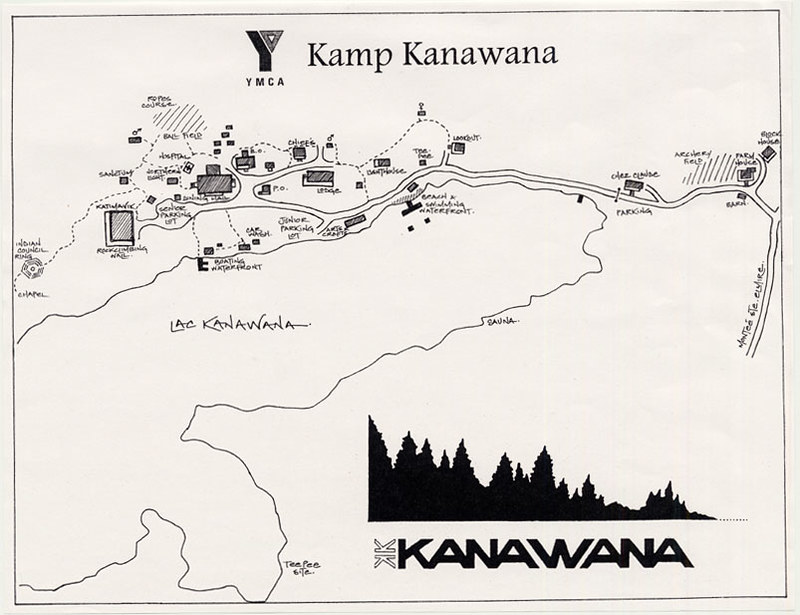
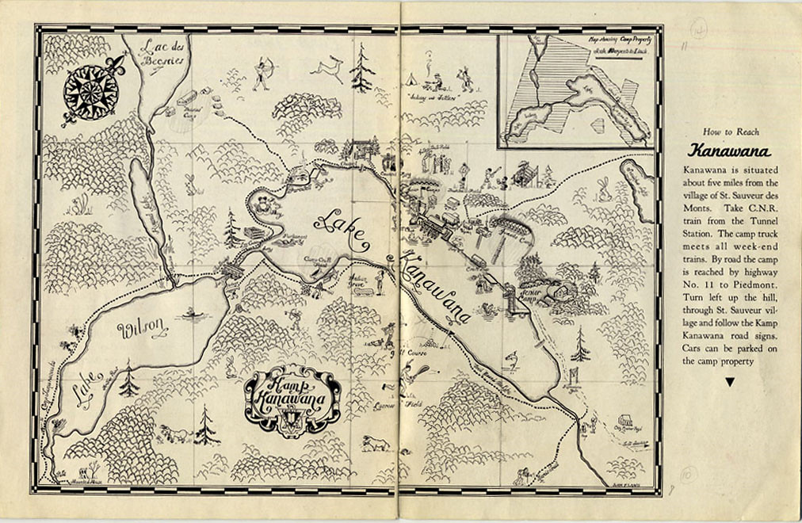
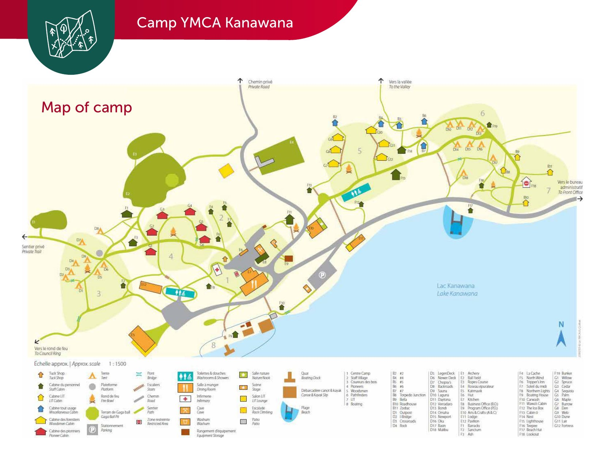
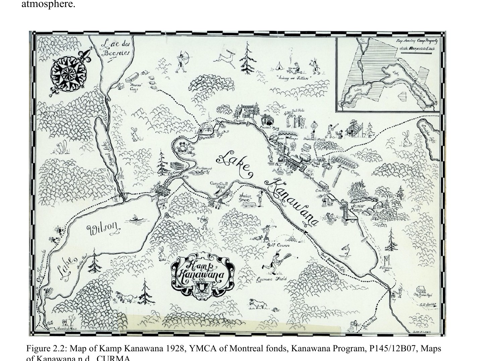
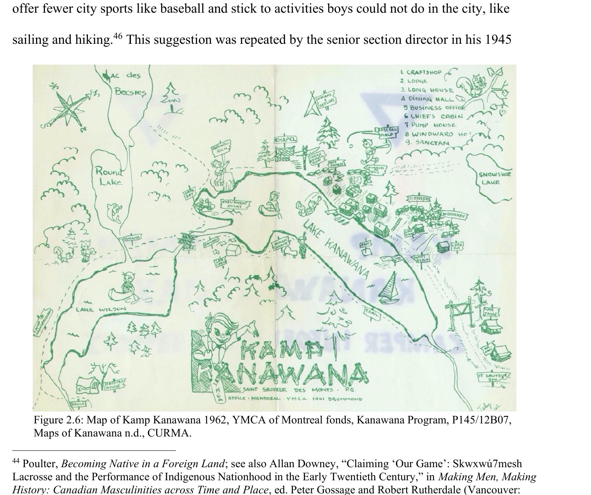

# Places and Locations at Camp Kanawana

*Status: E1-reviewed | Sources: 21*
*Last Updated: 2026-08-14*

## Overview

Camp Kanawana occupies a 550-acre site in Saint-Sauveur (municipality of Mille-Isles), in the Laurentian Mountains approximately 90 km north of Montreal [src_ymca_website, src_kanawana_facts]. Over more than a century of continuous operation since 1894, the site has accumulated a complex built landscape: buildings erected and demolished, areas renamed and repurposed, and infrastructure adapted to evolving programming needs. This article inventories the named places, buildings, structures, and features of the Kanawana site, both current and historical.

For the overall site description, lakes, and general geography, see [[site/the-kanawana-site|The Kanawana Site]]. For the Council Ring specifically, see [[site/council-ring|The Council Ring]]. For Lake Wilson, see [[site/lake-wilson|Lake Wilson]].

## Camp Areas and Sections

### Centre Camp

The traditional residential core of the camp, consisting of small cabins without electricity or plumbing, along with platform tents [src_ymca_website]. Centre Camp accommodates campers in the four age-based sections:

- **Woodsmen** (ages 10–11): 12 cabins with electricity, shared with Pioneers [src_ymca_website]
- **Pioneers** (ages 8–9): Same cabin area as Woodsmen [src_ymca_website]
- **Coureurs des Bois** (ages 12–13): 14 prospector tents [src_ymca_website]
- **Pathfinders** (ages 14–15): Same tent area as Coureurs des Bois [src_ymca_website]

These section names date to 1959, when they replaced the earlier Junior, Juvenile, and Senior designations used since at least 1938 [f_0216]. The 1959 names remain in use today [f_0217].

In the camp's earliest years, boys slept in tents with wood floors, each housing eight to ten boys under a tent leader [src_brochure_1923].

### Front Camp

Front Camp contains the **Farmhouse** and the **Blockhouse**, both winterized buildings with fully equipped kitchens, living space, bathrooms, showers, and electricity [src_ymca_website]. These are the camp's most substantial year-round accommodation facilities.

### Lake Wilson Area

Private campsites available for rental at Lake Wilson, providing a more secluded experience than the main camp site [src_ymca_website]. Two-week campers use the Lake Wilson area for overnight trips as part of their program.

### Outpost Camps (Historical)

In 1923, outpost camps included **Otoreke** (the senior camp, on islands in Lake Saint-Joseph) and **Lake Marois** [src_gas_bag_1923]. Both served as destinations for extended trips from the main Kanawana site. See [[site/camp-otoreke|Camp Otoreke]] for details on the original Camp Jubilee/Otoreke site.

## Current Buildings and Structures

### Dining Hall (Cafeteria)

The camp dining hall has a capacity of over 300 people [src_ymca_website]. The 1938 *Green Triangle* refers to both a "dining pavilion" and a "dining hall" in the same issue, suggesting the terms were used interchangeably [src_green_triangle_1938]. The original Dining Pavilion was built as a new facility in 1922 [src_brochure_1922]. By 1950, a **Lumberman–Voyageur mural** was displayed in the dining hall [f_0196].

### Katimavik (Gymnasium)

The camp's indoor gymnasium is named the **Katimavik** [src_ymca_website]. The word "katimavik" is Inuktitut for "meeting place." No documentation has been found for when the Katimavik was constructed or named, but it appears by name and location (west side of camp, near the Rock Climbing Wall, Indian Council Ring, and Chapel) on both the 1980-2001 site map and the current 2025 official map, showing at least 40+ years of continuous use [f_1791, f_1800].

### Millen Memorial Craft Shop (dedicated 1960)

The Craft Shop / Arts & Crafts building (labeled on both the 1980-2001 and 2025 maps) was dedicated in 1960 as the "Millen Memorial Craft Shop," per a record in Concordia Archives P145/12B03 — memorializing someone surnamed Millen, whose connection to the camp is not otherwise documented [f_1788].

### Rose des Vents Pavilion

An accommodation and gathering facility with a kitchen equipped with dishes and pots for a maximum of 16 people, a wood-burning stove, and a common area [src_ymca_website]. The pavilion contains 3 rooms. The name means "compass rose" in French.

### Farmhouse

Located in Front Camp, the Farmhouse is a winterized building with a fully equipped kitchen, living space, bathrooms, showers, and electricity [src_ymca_website]. It appears by name on the 1980-2001 and 2025 maps at the east end of the property, paired with a Barn and adjacent to the Block House [f_1791, f_1800] — a farmhouse-and-barn pairing consistent with an annexed working farm.

Grace McMorris's thesis (read as a full PDF for the first time 2026-07-09) substantially reframes this question: rather than predating the YMCA's original 1910 purchase, the "Pagé farm" — described as "the building just outside the camp gate" — was acquired **separately, in 1960-1961**, "in order to assure Kanawana many years of camping on the site without cottage country encroaching" [f_1807, f_1808]. Concordia's P145/12B03 finding aid independently corroborates a distinct 1960-1961 land-purchase file for the Pagé farm, separate from the original 1910-1927 purchase records. It's plausible, though not directly confirmed by any single source, that today's "Farmhouse" building is this former Pagé farmhouse [f_1809] — see also [[people/page-family|The Pagé Family of Saint-Sauveur]].

### Blockhouse

Also located in Front Camp, the Blockhouse is a winterized facility with similar amenities to the Farmhouse [src_ymca_website]. The name evokes frontier architecture. Its construction date is still undocumented, but the 1980-2001 map pins its exact location: at the property's eastern boundary corner, immediately next to the Farm House, Barn, and Archery Field, near Chez Claude [f_1791].

### Camp Cliff

A named location on the shoreline/peninsula between Lake Wilson and Lake Kanawana, labeled on the 1941 camp map immediately next to the "Indian Grave" marking (above) [f_1789]. Nothing further is documented about it.

### Mountain House

A building labeled at the southwest corner of the property, near the camp's entrance road, on the 1941 map [f_1789]. Not identifiable with any building named on later maps — possibly renamed, demolished, or simply outside the area later maps cover.

### The c.1978 building legend — 32 named structures

A camp orienteering map in the digitized fonds carries the fullest building legend the project has, thirty-two numbered structures plus named natural features:^21

> 1 SANCTUM · 2 BATHROOM · 3 COMPASS · 4 KATIMAVIK · 5 GRAND PORTAGE · 6 NORTHERN LIGHT · 7 INFIRMARY · 8 LA CACHE · 9 NORTH WIND · 10 TRIPPERS' INN · 11 MIDI DU SOLEIL · 12 DINING HALL · 13 CAR WASH · 14 B.O./MAINTENANCE SHED · 15 WASHUM · 16 PROGRAMMING OFFICE · 17 CHIEF'S CABIN · 18 LODGE · 19 BATHROOM · 20 SOUTH WIND/ICEBOX · 21 ARTS & CRAFTS · 22 LIGHTHOUSE · 23 LADIES SHOWER · 24 BATHROOM · 25 TEPEE · 26 LOOKOUT · 27 WATERFRONT CABIN · 28 CARETAKER'S HOME · 29 CABOOSES · 30 FARMHOUSE · 31 BLOCKHOUSE · 32 BARN

Plus, as separate labels: FIELD, ARCHERY FIELD, SWIMMING, BOATING WATERFRONT, CHAPEL, SAUNA, WOODSMAN'S POINT, FAREWELL ROCK, SUNSET, KAMPSITE.

A **compass-and-light naming scheme** is visible here — North Wind, South Wind, Northern Light, Midi du Soleil, Lighthouse, Compass — and the 1979 director's report confirms it was live, listing "pioneer cabins and Lighthouse," "Southwind," "Grande Portage," "Northern Wind" and "Cabooses" among buildings needing work.^21

**A dating warning.** This map is catalogued as **1974** and cannot be. It shows **Katimavik**, which the 1978 director's report calls "the new recreation hall"; the **sauna**, built in summer 1974; and the **Grand Portage**, first named in 1976. The map is **c. 1978–1982 at the earliest**. The "1974" is Internet Archive metadata, not the document's own date — the same class of error as the two annual reports in that collection misdated by a century.

Two earlier undated hand maps give an older set — CRAFTSHOP, LODGE, **LONG HOUSE**, DINING HALL, BUSINESS OFFICE, CHIEF'S CABIN, PUMP HOUSE/CARWASH, WINDWARD HO!, COMPASS, HOSPITAL, TEE PEE, LOOKOUT, plus SNOWSHOE as a lake name. Because they show the Long House, they must date between **1952 and 1978**.^21

### Named Places on the 1928 and 1962 Maps

Direct examination of the McMorris thesis's embedded map figures (2026-07-09) — the first time this project has viewed the 1928 and 1962 maps directly rather than through her prose description — surfaces many names not otherwise documented:

- **1928 map:** Farewell Rock, Parliament Rock, Camp Cliff Point, Frenchie Camp, Craft House, Senior Camp, Junior Camp, Birchbark Field, Ball Field, and an "Indians and Settlers" vignette (tepee/campfire scene) matching the one independently noted on the 1941 map [f_1811].
- **1962 map:** a numbered legend reading 1 Craftshop, 2 Lodge, 3 **Long House**, 4 Dining Hall, 5 Business Office, 6 Chief's Cabin, 7 Pump House, 8 Windward Ho!, 9 Sanctan — plus Snowshoe Lake (a lake name not documented anywhere else in this KB), Frog Bay, Look Out, and Sandy Beach [f_1812]. The 1962 map's "Long House" is a candidate for the same building already documented elsewhere in this article as demolished by controlled fire c. 1979 (see below) — both are lakeside gathering/dance halls — though this identification isn't explicitly confirmed by any single source.

### Other Buildings Identified from Map Sources (1941–2025)

Direct re-examination of the 1941, 1980-2001, and 2025 camp maps (2026-07-09) identified additional named buildings and facilities not otherwise documented in text sources:

- **Chief's** — a small building near the Lodge and Post Office/Program Office on the 1980-2001 map, evidently the on-site director's residence or office, continuing the historic "Camp Chief" title used for directors as far back as 1923 [f_1791].
- **Lodge** — a large building near the Post Office/Program Office [f_1791, f_1800].
- **Bunkhouse** — near the Tee Pee building and the Lookout [f_1791].
- **Tee Pee** — a specific building on a hill near the Lookout on the 1980-2001 map, distinct from a separately labeled "Tee Pee site" nearer the south shore [f_1791]; the 2025 map lists a "Teepee" building in its F-series (waterfront cluster), suggesting continuity of the name if not necessarily the exact structure [f_1801].
- **Business Office (B.O.)** and **Program Office (P.O.)** — both appear, unlabeled beyond their initials, on the 1980-2001 map; the 2025 map's fuller legend confirms "B.O." = Business Office and "P.O." = Program Office, correcting an earlier assumption that "P.O." meant Post Office [f_1791, f_1800].
- **Sanctuary**, **Softball Diamond**, **Car Wash** — all labeled on the 1980-2001 map, in the same western cluster as Katimavik and the Rock Climbing Wall [f_1791].
- **Reseau épurateur** (water-treatment/purification network) — a large building shown on the 2025 map near the Staff Village, part of the camp's environmental infrastructure [f_1800].

### Grand Portage (Demolished c. 2006)

One of the oldest cabins at Camp Kanawana, built after the Lookout (pre-existing), the Dining Hall (1911), and the Infirmary (1920s?).^15 It was situated just north of the Senior Parking Lot, to the west of the Dining Hall.^15 The cabin served as the **CIT (Counsellor-in-Training) director's cabin** in the 1980s and 1990s.^15 According to oral history, the **end of World War II was heard on the radio** in this cabin.^15

Grand Portage was demolished around 2006 to make way for the new washroom buildings constructed as part of the green shift / Clivus Multrum composting toilet installation.^15 The new washroom buildings bear the Grand Portage name. The name references the fur-trade portage tradition central to Kanawana's French-Canadian wilderness identity.

### Longhouse (Demolished c. 1979)

A large **2- or 3-story pavilion/boathouse** on the Boating Waterfront (due south of the Dining Hall), right at the shoreline of Lake Kanawana.^15 It was used for **large group gatherings and dances**, and the **Boating Director** — at one point known by the title "**the Admiral**" — had living quarters in it.^15

**The Longhouse is now dated precisely at both ends: built 1952, demolished 1978.**^21 The Montreal YMCA's 1952 Annual Report announces it: "Campers and staff will look back on 1952 as the year of the '**Long House**'. Officially opened and dedicated in mid-July, this spacious waterfront recreation hall was a great asset, especially for rainy weather program, with its **large stone fireplace and stage**. It also provides winter storage space for the entire camp fleet of **50 boats and canoes**, and quarters for the waterfront directors." It needed roof work by 1969, ranked second only to the dining hall among capital priorities that year, was still on the 1976 major-concerns list, and the 1978 director's report records "**demolition of the old 'Longhouse' (32' x 70')**" — giving both the year and the building's dimensions.

That supersedes the "c. 1979, controlled fire" account below, at least as to date. This article previously said the Longhouse was demolished by **controlled fire** around 1979 because it was in an irreparable condition.^15 The demolition falls within the Dave Twynam directorship era. A "Long House" also appears, numbered, on the 1962 camp map [f_1812] — plausibly the same building at an earlier point in its history, though this hasn't been explicitly confirmed by any single source connecting the two.

### The Lookout (Pre-1894)

A structure that pre-existed the camp's founding — it was on the site before Kanawana was established, making it the oldest structure on the property.^15 Its original purpose and builder are unknown. Whether it survives today is undocumented.

### "The Cave" (Hike and Trip Equipment Room)

The equipment room of the **Hike and Trip Department**, known as "the Cave."^15 Referenced in the Chopsy legend as the location from which axes were stolen. Its location and construction date are undocumented.

### Arts and Crafts Pavilion

A dedicated facility for arts and crafts programming [src_ymca_website]. Construction date unknown.

### Beach Lodge

Located at the waterfront on Lake Kanawana [src_ymca_website]. Construction date unknown.

### Nature Nook (Nature Interpretation Area)

A dedicated area for nature and environmental education programming [src_ymca_website]. The 1980 *KA News* describes plans to "set up a nature trail" complementing nature programming, suggesting the nature interpretation area was formalized around that period [src_ka_news_1980].

### Activity Lodge

An indoor activity space [src_ymca_website]. Construction date and history undocumented.

### Infirmary

The camp infirmary has 5 beds and a private washroom [src_ymca_website]. An emergency oxygen tank and AED are available. The original camp hospital was a new building in 1922 [src_brochure_1922]; whether the current infirmary occupies the same structure or a replacement is unknown.

### Pavilion for Workshops and Training

A separate pavilion dedicated to workshops and training sessions, listed as a distinct facility from the other named pavilions [src_ymca_website].

### Rock Climbing Wall

A 30-foot rock climbing wall is among the camp's current facilities [src_ymca_website].

### Desjardins Pavilion (2018)

In 2018, Desjardins donated $1 million to the YMCA for renovations at Camp Kanawana, including a new community pavilion described as the "new heart of Kanawana" to increase the camp's capacity and expand its environmental education mission [src_lapresse_ymca_2018]. The McConnell Foundation provided $700,000 (2023–2027) for major renovations at the camp [f_0575]. Whether the Desjardins Pavilion was constructed as announced has not been confirmed in subsequent reporting.

## Current Outdoor Facilities

- **Gaga Ball Pit**: An octagonal court for the gaga ball game [src_ymca_website]
- **Low Ropes Course**: Team-building activity course [src_ymca_website]
- **Archery Range**: Also documented historically — the camp had an archery range [f_0230]
- **Rock Climbing Wall**: 30-foot climbing wall [src_ymca_website]
- **Activity/Sports Field** [src_ymca_website]
- **Fire Bowls**: For campfires and cookouts, part of the camp's outdoor program [src_ymca_website]
- **Sand Beach**: On Lake Kanawana, with a marked swimming area, canoes, kayaks, paddleboards, a water trampoline, a barge, and a rescue boat [src_ymca_website]
- **6 Overnight Campsites** [src_ymca_website]

## Historical Buildings and Structures

### The Lakeside Pavilion (1922)

A second pavilion built alongside the Dining Pavilion in 1922, described as a "lakeside Pavilion" that "takes care of the campers" in rainy weather and "provides accommodation for indoor games and recreation" [src_brochure_1922]. The 1923 brochure describes two "spacious pavilions, one for dining and one for recreation in wet weather — the latter having a large open fireplace" [src_brochure_1923]. Whether this structure survives in some form (as the Activity Lodge, the Beach Lodge, or another building) or was demolished is unknown.

### Ross & Macdonald Buildings (1913–1921)

The **Canadian Centre for Architecture (CCA)** holds architectural drawings in the **Ross & Macdonald fonds** (AP013) for **three** Kanawana projects, not one — a fact established by operator browser research in 2026 [f_1530]:

1. **YMCA Boy's Camp buildings**, 1913–1914 (AP013.S1.D37, CCA #48095) — 5 working drawings, the firm's earliest Kanawana work;
2. **Dining and Kitchen Pavilion**, 1919 (AP013.S1.D46, CCA #48710) — 6 drawings, "Dining and Kitchen Pavilion for YMCA Boy's Camp, Saint-Sauveur-des-Monts";
3. **Doctor's Cottage**, 1921 (AP013.S1.D67, CCA #50576) — 3 drawings (ARCH25242 preliminary, ARCH25243 working, ARCH25244 structural details) [f_0573].

Fourteen drawings in total, all client = YMCA, location = Saint-Sauveur-des-Monts, described as "executed (?)". Ross & Macdonald was one of Canada's most prominent architectural firms (active 1904–1946), responsible for the Château Laurier, Royal York Hotel, Mount Royal Hotel, and Maple Leaf Gardens [f_0574]. The 1919 dining/kitchen pavilion drawings likely correspond to the dining pavilion documented in the 1922–1923 brochures, and the 1921 Doctor's Cottage may relate to the 1922 Hospital (below). The CCA drawings have not been examined page by page.

### Hospital (1922)

A new hospital building was erected in 1922, which "assures comfortable quarters should any boy become ill" [src_brochure_1922]. The 1923 brochure describes it as "a well equipped hospital building where any sick are taken care of" [src_brochure_1923]. Whether the original hospital building still exists or has been replaced is unknown. The Ross & Macdonald "Doctor's Cottage" architectural drawings (above) may refer to this building or an earlier structure.

### Outdoor Chapel

The outdoor chapel was in use by at least 1922, when the brochure describes "Sunday services in the open-air chapel" [src_brochure_1922]. The first service of the 1935 season was held on June 30 in "our beautiful open air chapel" [src_history_1935]. By 1938, Benny Leshley, organist of Christ Church Cathedral in Montreal, had organized a choir at the chapel to lead singing [src_green_triangle_1938]. The chapel was located near the Council Ring — the Council Ring was described as being "between the cabins and the chapel" [f_0232]. Whether the outdoor chapel remains in active use in its historic location is undocumented.

### Council Ring (1922)

The Council Ring was built by senior campers in 1922, located between the cabins and the chapel [f_0231, f_0232]. It served as the camp's ceremonial amphitheatre for campfire programs, tribal ceremonies, and community gatherings. Under Harold Cross's directorship in 1927, a **totem pole** and a **teepee** (constructed from old canvas) were added [f_0233, f_0234]. The ring was substantially rebuilt in 1929 to seat 325 people [f_0235]. The totem pole was still visible in photographs from the 1970s [f_0227]. See [[site/council-ring|The Council Ring]] for full details.

### Icehouse

An icehouse was part of the camp facilities by 1923, described as "kept well filled" [src_brochure_1923]. The icehouse would have been essential for food preservation before electric refrigeration. Its fate is undocumented.

### Golf Course

A golf course was present at Kanawana by 1935. The *History of Kamp Kanawana* describes that "the golf course was conditioned" during the early rainy period of the 1935 season [src_history_1935]. It's independently confirmed on both the 1928 and 1941 camp maps (the latter labeling it in the wooded area near the Junior Camp building cluster) [f_1789, f_1811] — but it is **absent from the 1962 map**, which shows the same lake and section clusters in detail but no golf course or lacrosse field [f_1812]. This narrows the decommissioning window to sometime between 1941 and 1962, though no exact date is documented. The golf course is not listed among current camp facilities.

### Fenced Swimming Pool (1922)

A fenced swimming pool was among the new facilities in 1922 [src_brochure_1922]. This appears to have been a roped or fenced-off area in the lake rather than a built pool structure, consistent with early twentieth-century camp practices. Four diving spring-boards (two high and two low) and a "long zinc 'chute the chutes' into the lake" were associated with the waterfront area [src_brochure_1923].

### "The Haunted House"

A building known as "the haunted house" existed at Kanawana by 1935. The 1935 season history describes an "eating-out day, when every camper went over to the haunted house and cooked his own supper" [src_history_1935]. Direct examination of the McMorris thesis's embedded map figures (2026-07-09) resolves *where*: both the 1928 and 1962 official camp maps explicitly draw and label a "Haunted House" building at the same spot — the property's southwest corner, next to a labeled waterfall ("Falls"), near Round Lake — showing the building (and presumably its name) persisted for at least 34 years [f_1810]. This is distinct from the 1941 map's separately-labeled "Mountain House," near the main entrance road, which is not the same place. What stories attached to the building, why it was called "haunted," and whether any structure survives there today all remain undocumented — a dedicated 2026-06-11 web campaign and a direct 2026-06-13 oral-history question to the operator both found nothing further. See also [[traditions/myths-and-legends|Kanawana Myths and Legends]].

### Lacrosse Field

A lacrosse field was among the historical camp facilities [f_0230]. The sport reflects early twentieth-century YMCA athletic programming. It appears on the 1928 map (near the Golf Course) and the 1941 map (south of the Kamp Kanawana crest, with a figure holding a stick-like implement) [f_1789, f_1811], but — like the golf course — is absent from the 1962 map [f_1812]. McMorris's thesis notes lacrosse is "rarely mentioned in the archives" and that a 1927 suggestion proposed dropping "city sports like baseball" in favour of activities "boys could not do in the city, like sailing and hiking" — repeated again in 1945 by the senior section director, suggesting a gradual de-emphasis of team sports like lacrosse in favour of wilderness programming [src_mcmorris_thesis]. Lacrosse is not listed among current camp activities.

### "Indian Grave" Marking

An "Indian Grave" marking existed on the Kanawana camp map [f_0226]. Direct re-examination of the 1941 map (2026-07-09) locates it precisely: on the shoreline/peninsula between Lake Wilson and Lake Kanawana, immediately next to a place labeled "Camp Cliff" [f_1789]. This resolves *where* the marking sits on camp maps, but not what it refers to — no documentation has been found explaining whether this referred to an actual burial site, a naturalistic feature given a romantic name, or a campfire-story location. The marking is consistent with the early camp's broader engagement with romanticized Indigenous imagery documented in the McMorris thesis [src_mcmorris_thesis].

### Superintendent's House (Destroyed by Fire, 2023)

On May 16, 2023, a fire completely destroyed the **maison du surintendant** (superintendent's house) at Camp Kanawana [src_journal_acces_fire_2023]. The building was isolated from the campers' area, located on Montée Sainte-Elmire in the Spring Valley sector. A passerby called firefighters at 6 AM; when they arrived, the blaze was generalized and part of the building had collapsed. Twenty-five firefighters from Saint-Sauveur, Morin-Heights, and Sainte-Anne-des-Lacs responded. No injuries occurred (the camp was unoccupied). The cause was undetermined. The building was a total loss. The YMCA stated only one building was affected, and the camp opened as planned that summer.

### KoiNobori (1935)

In 1935, Mr. Ernest Trueman presented the camp "on behalf of the youth of Japan a goodwill offering in the shape of a 'KoiNobori' or huge flag-effigy of a Carp such as are common in Japan" [src_history_1935]. This Japanese carp streamer flag was a cultural exchange gift reflecting the international YMCA movement. Its fate is unknown.

### Composting Toilet System (Clivus Multrum)

Camp Kanawana replaced its old septic system with a **Clivus Multrum** composting toilet installation to protect Lake Kanawana from pollution [f_0572]. The system consists of **16 commercial composters** accommodating 22,500 uses each per year, **32 dry toilets**, and **2 central buildings** containing all bathroom and shower facilities. The installation saves an estimated 576,000 gallons of water annually [f_0572]. The installation date has not been documented.

## Cabin and Tent Inventory (2025)

The current (2025) official camp map gives, for the first time in this KB, a comprehensive list of individually named cabins and tents by zone [f_1798, f_1802, f_1803]:

- **Zone 3 (Coureurs des bois):** Outpost, I-Bridge, Crossroads, Rock, LegenDeck, Newer Deck, **Chopsy's**, Backroads, Sauna, Laguna, Daytona, Verardaro, Bondi, Omaha, Newport, Oka, Basin, Malibu — many following a beach/surf-destination naming pattern (Malibu, Newport, Bondi, Daytona, Laguna).
- **Zone 5 (Woodsmen):** cabins #2, #4, #5, #6, #7, Torpedo Junction, Bella, Roadhouse, Zodiac.
- **Zones 4/3 (Pioneers/Coureurs des bois):** Willow, Spruce, Cedar, Sequoia, Palm, Maple, Burrow, Den, Web, Dune, Lair, Fortress — tree and animal-den names.
- **Waterfront cluster:** Barracks, Sanctum, Ash, La Cache, North Wind, Tripper's Inn, Soleil du midi, Northern Lights, Boating House, Carwash, Wawa's Cabin, The Ice Box, Cabin 0, Nest, Lighthouse, Teepee, Beach Hut, Lookout, Bunker.

One cabin, **"Chopsy's,"** is the only documented institutional trace of the "Chopsy" legend name found anywhere outside oral history — see [[traditions/myths-and-legends|Kanawana Myths and Legends]]. Another, **"Wawa's Cabin,"** plausibly references Kate Taylor's camp alias "Wawa" (on-site Director, 2013–2023) — see [[people/directors-index|Directors and Staff of Camp Kanawana]] — though this connection is not confirmed by any source explicitly.

The camp's numbered zones are: 1 Centre Camp, 2 Staff Village, 3 Coureurs des bois, 4 Pioneers, 5 Woodsmen, 6 Pathfinders, 7 LIT, 8 Boating [f_1798]. No zone is separately numbered for the gender-neutral "Mountaineers" section (established 2022) — it may be integrated into an existing zone. The 2025 guide's own text uses "Woodsy"/"Woodsies" for the youngest boys' section, while the map itself still labels the zone "Woodsmen" — possibly a newer camper-facing term not yet reflected in official cartography [f_1799].

## Infrastructure

### The Dam

A dam connects Lake Kanawana and Lake Wilson, controlling water levels between the two lakes. Its ceremonial opening at the end of each summer season is a longstanding Kanawana tradition, documented as early as 1935: "the dam which had kept the water in Lakes Kanawana and Wilson at a desirable height was let out before the eyes of the assembled campers" [src_history_1935]. The dam's construction date is unknown. See [[site/lake-wilson|Lake Wilson]].

### Water Supply

The camp's water supply in 1923 was "obtained from two mountain spring wells" [src_brochure_1923]. The current water supply system is undocumented.

### Trails and Paths

- **Trail to the Council Ring**: "Senior Camp fixes the trail to the Council Ring" — recorded in the 1923 *Gas Bag* [src_gas_bag_1923]
- **Trail to Marois**: "Buve Hart breaks the trail to Marois" (1923) [src_gas_bag_1923]
- **Nature Trail**: Plans for a nature trail complementing the nature program were discussed in the 1980 *KA News* [src_ka_news_1980]

## Maps, Photos, and Architectural Records

### Known Maps

| Date | Description | Location | Source |
|------|-------------|----------|--------|
| 1915 | Hand-drawn, coloured property/lot-transaction sketches | Concordia Archives P145/12B03, Box HA2694 | [f_1785] |
| 1928 | Illustrated camp map | Concordia Archives P145/12B07, "Maps of Kanawana n.d." | Reproduced in full in McMorris thesis, Figure 2.2 [f_1810, f_1811] |
| 1937 | Trail mapping | Concordia Archives P145/12B03, Box HA2313 | [f_1786] |
| 1941 | Hand-drawn illustrated camp map (3 near-identical copies) | Flickr, official Kanawana Concordia historical album | [f_1789, f_1790] |
| 1962 | Illustrated camp map | Concordia Archives P145/12B07, "Maps of Kanawana n.d." | Reproduced in full in McMorris thesis, Figure 2.6 [f_1810, f_1812] |
| 1974 | Orienteering map (6 photocopies) | Concordia Archives P0145 | [src_concordia_fonds] |
| 1980-2001 | Site map with full building legend | Flickr, official Kanawana Concordia historical album | [f_1791] |
| 2025 | Official current site map with full building/cabin legend | YMCA Quebec preparation guide | [f_1798, f_1800, f_1801, f_1802, f_1803] |

**Update 2026-07-09:** the 1928 and 1962 maps are no longer inaccessible — McMorris's thesis (downloaded directly as a full PDF, not just the repository landing page) reproduces both as full-page figures, citing their location as Concordia Archives P145/12B07 ("Maps of Kanawana n.d."), not the 12B03 sub-sub-series originally guessed. Both have now been examined directly by this project. The 1928 map confirms the "Indian Grave" marking [f_0226] at the same Camp Cliff location independently found on the 1941 map [f_1789], and both the 1928 and 1962 maps explicitly draw and label a "Haunted House" building — see below.

### Known Photographs

- 1970s photograph showing the totem pole at the Council Ring [f_0227]
- 1935 season: an official government photographer spent time in camp taking "both still and moving pictures" [src_history_1935]
- Concordia University Archives hold the Kanawana photographic collection in Fonds P0145

### Blueprints and Building Plans

Beyond the Ross & Macdonald architectural drawings (above), Concordia Archives P145/12B03 ("Land, facilities, equipment, supplies") lists further facilities records not yet examined page-by-page: a **dining pavilion** blueprint and letter (1919) and **boathouse construction** records (1928) in addition to the 1915 hand-drawn property sketches and 1937 trail mapping noted in Known Maps, above [f_1787]. A closer read of the same finding aid (2026-07-09) also turns up: a pencil architect's drawing for **sleeping cabins** (1940); an **eight-boy cabin** blueprint from the Boy Scouts of America Engineering Service (1945); a **"proposed craft shop"** blueprint (1952) — eight years before the Millen Memorial Craft Shop's 1960 dedication, suggesting either a distinct earlier proposal or a long planning process for the same building; ice-house/cold-storage blueprints (c. 1929); 1950s water-filtration-system blueprints; and undated architectural drawings for the **Lodge** and the **boat dock** [f_1813]. These are all box/file-level finding-aid entries, not yet digitized or examined in full — physical archive access would be required to see the actual drawings.

## Planned but Never-Built Developments

### Kanawana–Weredale Two-Site Operation (1977–1980)

From 1977 to 1980, plans existed for a proposed two-site camping operation using Camp Kanawana and [[connections/related-camps/camp-weredale|Camp Weredale]] [src_concordia_fonds]. Camp Weredale was founded in 1934 to serve orphaned or at-risk boys and is now an independent non-profit operated by the Weredale Foundation, serving ages 6–17 in foster care or youth protection services. Situation reports from this period are held in the Concordia Archives (P0145/12C). The dual-site plan was abandoned; the reasons are not documented in available sources. Both camps now operate independently.

## Building Chronology

| Year | Event | Source |
|------|-------|--------|
| pre-1894 | The Lookout — pre-existing structure on site before camp founded | [src_oral_aronson] |
| 1910 | YMCA purchases the Saint-Sauveur site from the Page family | [src_kanawana_facts] |
| 1911 | Dining Hall built | [src_oral_aronson] |
| pre-1922 | Tents with wood floors as primary accommodation | [src_brochure_1921] |
| 1922 | New Dining Pavilion, Lakeside Pavilion, Hospital, fenced swimming pool built | [src_brochure_1922] |
| 1922 | Council Ring built by senior campers | [f_0231] |
| 1923 | Two pavilions, chapel, icehouse, hospital, Council Ring all operational | [src_brochure_1923] |
| 1927 | Totem pole and teepee added to Council Ring under Harold Cross | [f_0233, f_0234] |
| **1928** | Council Ring enlarged and rebuilt to seat 325, under **Karol Perry**. *Corrected from 1929 on 2026-08-14: the annual report describing it is the 1929 one, which covers the 1928 season; the 1932 Green Triangle independently attributes the work to 1928* | ^21 |
| **1932** | Council Ring **completely rebuilt** with stronger foundations under **Jim Carnegie** | ^21 |
| **1936** | Bantam cabins erected | ^21 |
| **1938** | Water system and latrines constructed | ^21 |
| **1939** | Showers installed | ^21 |
| **1942** | Junior cabins built and fourteen new tent platforms constructed for Intermediate and Senior campers; in the fall, seven new open-sided Junior cabins under Ross Wiggs, contracted to **E. C. Page** | ^21 |
| **1947-51** | Under Roy Locke: a completely new main wharf, a new cabin for the Senior Section Director, electrification, an automatic chlorinated water system, and electric refrigeration | ^21 |
| **Sept 1951** | New boat house planned, to replace the lower pavilion | ^21 |
| **1952** | **The Long House** built and dedicated mid-July — waterfront recreation hall, large stone fireplace and stage, winter storage for 50 boats and canoes, 32' x 70' | ^21 |
| **1953** | New **craft shop** opened, overlooking the lake, "similar to the Long House" in structure | ^21 |
| **1954** | The Y's Men's Club of Westmount "provided Kanawana with an Indian Council Ring" — a donated rebuild or second ring, **not** a founding | ^21 |
| **1974** | Outdoor **sauna** built across the lake by the oldest senior boys | ^21 |
| **1976** | **Grand Portage** first named, with balconies repaired that year; its interior was still unfinished in 1979 | ^21 |
| **1978** | **Katimavik** recreation hall opened, with its own opening ceremony; the Longhouse demolished (32' x 70'); a new tipi erected across the lake | ^21 |
| **1987** | Council Ring razed and rebuilt by a senior boys' tent under **Toby Desjardins**; the **Suez** bridge razed and rebuilt by the entire senior boys section; "the cave" stripped, scrubbed and repaired with new steps | ^21 |
| 1929 | *(superseded — see the 1928 entry above)* Council Ring rebuilt to seat 325 | [f_0235] |
| 1935 | Golf course, open-air chapel, and "the haunted house" all referenced | [src_history_1935] |
| 1938 | Dining pavilion/hall, outdoor chapel with choir documented | [src_green_triangle_1938] |
| 1959 | Section names changed to Pioneers, Woodsmen, Coureurs des Bois, Pathfinders | [f_0216] |
| 1970s | Totem pole still visible in photographs | [f_0227] |
| 1980 | Nature trail development discussed | [src_ka_news_1980] |
| 1910-1927 | Land purchase records ("Kamp Kanawana land purchases 1910-1927") | [f_1786] |
| 1913-14 | Ross & Macdonald designs YMCA Boy's Camp buildings (CCA AP013.S1.D37, 5 drawings) | [f_1530] |
| 1915 | Hand-drawn property/lot-transaction sketches | [f_1785] |
| 1919 | Ross & Macdonald designs Dining and Kitchen Pavilion (CCA AP013.S1.D46, 6 drawings); separately, a dining pavilion blueprint recorded in P145/12B03 | [f_1530, f_1787] |
| 1921 | Ross & Macdonald designs "Doctor's Cottage for Kamp Kanawana" (CCA AP013.S1.D67, 3 drawings) | [f_0573] [f_1530] |
| 1928 | Boathouse construction records | [f_1787] |
| 1937 | Trail mapping | [f_1786] |
| 1941 | Camp map shows Golf Course, Lacrosse Field, Camp Cliff, Indian Grave, Mountain House, Junior Camp | [f_1789, f_1790] |
| 1960 | Millen Memorial Craft Shop dedicated | [f_1788] |
| 1980-2001 | Site map shows Katimavik, Chief's, Lodge, Bunkhouse, Farm House, Block House, and more | [f_1791] |
| 2018 | Desjardins donates $1M for new community pavilion | [src_lapresse_ymca_2018] |
| 2023 | Superintendent's house destroyed by fire (May 16) | [src_journal_acces_fire_2023] |
| c. 1979 | Longhouse demolished by controlled fire (irrepairable condition) | [src_oral_aronson] |
| c. 2006 | Grand Portage demolished for green shift washroom buildings (which bear its name) | [src_oral_aronson] |
| 2023-27 | McConnell Foundation provides $700K for major renovations | [f_0575] |
| 2025 | Current official map shows full cabin/building inventory across 8 numbered zones | [f_1798]-[f_1803] |

## Images

*A camp site map, 1980-2001. Copyright All rights reserved by Kanawana.*

*An alternate version of the 1941 camp map. Pre-1949 photograph — public domain in Canada.*

*The official 2025 camp map, from the current Preparation Guide. Copyright YMCA Quebec / Camp YMCA Kanawana.*

*The 1928 camp map, reproduced from Grace McMorris's 2023 MA thesis (Figure 2.2). Pre-1949 archival photograph.*

*The 1962 camp map, reproduced from Grace McMorris's 2023 MA thesis (Figure 2.6).*

## Open Questions

1. ~~[Critical] What are/were the Grand Portage and Longhouse?~~ [Resolved] Oral history (2026-06-13): Grand Portage was an early cabin (CIT director's, demolished ~2006 for washrooms). Longhouse was a 2-3 story boathouse on the waterfront (demolished by controlled fire ~1979). The Lookout (pre-1894) and "the Cave" (Hike & Trip equipment room) also documented.
2. [Critical] Which historical buildings (1922 Lakeside Pavilion, Hospital, Icehouse, Chapel) are still present on the site in some form, and which have been demolished? Still open, though Katimavik, Lodge, Chief's, and several others are now confirmed continuously present from at least 1980 through 2025.
3. [Important] When was the Katimavik gymnasium built? What was on that site previously? Still undated, but now confirmed present continuously since at least 1980-2001 (and still present in 2025).
4. [Important, pending further research] What is the history of the Farmhouse? Does it predate the YMCA's 1910 purchase of the property?
5. [Important, narrowed 2026-07-09] When was the golf course decommissioned? What is the current use of that land? Confirmed present on the 1928 and 1941 maps but absent from the 1962 map (which shows the same area in comparable detail) — narrowing the decommissioning window to sometime between 1941 and 1962, though no exact date is documented.
6. ~~[Important] What was "the haunted house" referenced in 1935?~~ [Largely resolved 2026-07-09] Both the 1928 and 1962 maps explicitly draw and label a "Haunted House" building at the same spot — southwest corner of the property, next to a waterfall ("Falls"), near Round Lake — confirming it as a real, persistently-named building rather than a figure of speech. What stories attached to it and whether it survives today remain undocumented despite a dedicated web campaign and a direct oral-history question to the operator.
7. ~~[Important] Are the 1928 and 1962 camp maps accessible for reproduction from the Concordia Archives?~~ [Resolved 2026-07-09] Yes — both are reproduced as full-page figures in McMorris's thesis (downloaded and examined directly), citing Concordia Archives P145/12B07 ("Maps of Kanawana n.d.") as their archival location.
8. ~~[Important] Do any architectural plans, blueprints, or building specifications exist in the Concordia Archives?~~ [Resolved 2026-07-09] Yes — P145/12B03's finding aid lists 1915 property sketches, a 1919 dining pavilion blueprint, 1928 boathouse construction records, a 1940 sleeping-cabins drawing, a 1945 eight-boy-cabin blueprint, a 1952 craft-shop blueprint, and undated Lodge and dock drawings — none yet examined page-by-page (physical archive access required to see the actual drawings).
9. ~~[Nice-to-have] What is the full inventory of named cabins and tents?~~ [Largely resolved 2026-07-09] The current (2025) official map gives a near-complete inventory across all zones — see the new Cabin and Tent Inventory section, above.
10. [Nice-to-have, advanced 2026-07-09] When was the Blockhouse built? Does its name have a specific origin? Construction date still undocumented, but its exact location (east end of property, next to Farm House, Barn, and Archery Field) is now pinned via the 1980-2001 map.
11. [Nice-to-have] What happened to the KoiNobori (Japanese carp flag) gifted in 1935?
12. ~~[Nice-to-have] Where was the "Indian Grave" marked on the camp map?~~ [Resolved 2026-07-09] On the shoreline/peninsula between Lake Wilson and Lake Kanawana, next to a place labeled "Camp Cliff," per direct re-examination of the 1941 map. Whether it's a real burial site remains undocumented.
13. [Nice-to-have, substantially advanced 2026-07-09] What other buildings or structures have existed at Kanawana that are not documented in available sources? The 1941, 1980-2001, and 2025 maps together surfaced over a dozen previously undocumented names (Chief's, Lodge, Bunkhouse, Sanctuary, Softball Diamond, Car Wash, Mountain House, Camp Cliff, and the full current cabin inventory) — see the new sections above.

## Related Articles

- [[site/the-kanawana-site|The Kanawana Site]]
- [[site/council-ring|The Council Ring]]
- [[site/lake-wilson|Lake Wilson]]
- [[site/camp-otoreke|Camp Otoreke]]
- [[history/founding-1894|Founding of Camp Kanawana (1894)]]
- [[people/harold-cross|Harold C. Cross]]
- [[traditions/traditions-and-culture|Traditions and Culture at Kanawana]]
- [[traditions/myths-and-legends|Kanawana Myths and Legends]]
- [[traditions/lv-games|The L&V Games]]

## Sources

1. YMCA Quebec, "Camp YMCA Kanawana," https://www.ymcaquebec.org/en/summer-camp-kanawana [src_ymca_website]
2. YMCA Kamp Kanawana Facts sheet [src_kanawana_facts]
3. Camp brochure, 1921, Internet Archive [src_brochure_1921]
4. Camp brochure, 1922, Internet Archive [src_brochure_1922]
5. Camp brochure, 1923, Internet Archive [src_brochure_1923]
6. *The Gas Bag*, Kamp Kanawana official paper, 1923 [src_gas_bag_1923]
7. "A History of Kamp Kanawana" (1935 Season Chronicle), Internet Archive [src_history_1935]
8. *The Green Triangle*, Vol. 4 No. 4, July 29, 1938 [src_green_triangle_1938]
9. Grace McMorris, MA thesis, Concordia University, 2023 [src_mcmorris_thesis]
10. Concordia University Archives, YMCA of Montreal Fonds P0145 [src_concordia_fonds]
11. MySummerCamps.com, "YMCA Kamp Kanawana" [src_mysummercamps_kanawana]
12. La Presse, "Un million pour les YMCA" (May 15, 2018) [src_lapresse_ymca_2018]
13. *KA News*, May 1980 [src_ka_news_1980]
14. Journal Accès, "Un bâtiment du Camp YMCA Kanawana ravagé par les flammes" (May 16, 2023) [src_journal_acces_fire_2023]
15. Oral history, Matt Aronson [src_oral_aronson]
16. Clivus Multrum, Parks & Recreation Projects portfolio [src_clivus_multrum_projects]
17. Canadian Centre for Architecture, Ross & Macdonald fonds, "Doctor's Cottage for Kamp Kanawana" [src_cca_ross_macdonald_kanawana]
18. McConnell Foundation, "YMCAs of Quebec" funding database [src_mcconnell_foundation_ymca]
19. Concordia University Archives, YMCA of Montreal fonds, sub-sub-series P145/12B03 (Land, facilities, equipment, supplies) [src_concordia_12B03]
20. Camp YMCA Kanawana Preparation Guide, Summer 2025 [src_kk_prep_guide_2025]
21. Kanawana material in the Concordia-digitized YMCA of Montreal fonds: the camp orienteering map (catalogued 1974, internally c.1978+); "Kamp Kanawana History," 6 June 1951 [src_ia_kanawana_history_1951]; YMCA of Montreal Annual Reports 1929, 1952, 1953, 1954 [src_ia_ymca_montreal_annual_reports_collection]; *The Green Triangle* 13 August 1932; Kanawana season reports 1969, 1974, 1976, 1978, 1979 and 1987 [src_ia_kanawana_report_1969, src_ia_kanawana_report_1974, src_ia_kanawana_directors_report_1976, src_ia_kanawana_report_1978, src_ia_kanawana_report_1979, src_ia_kanawana_report_1987]; and *Kanawana… A Place to Grow*, 1988 [src_ia_kanawana_place_to_grow_1988] — whose facilities table gives bracketed construction years including house [1935], infirmary [1945], **lodge [1880's]**, dining hall/kitchen [1919], arts & crafts centre [1932] and bathroom buildings [1945]. *Two of those conflict with the 1951 history, which gives the dining hall as 1920 and the lodge as 1927. The 1880s lodge date is the harder problem: the site was not purchased until 1910, so it would have to be a pre-existing farm structure later converted. Both readings are defensible and neither is adopted here.*
