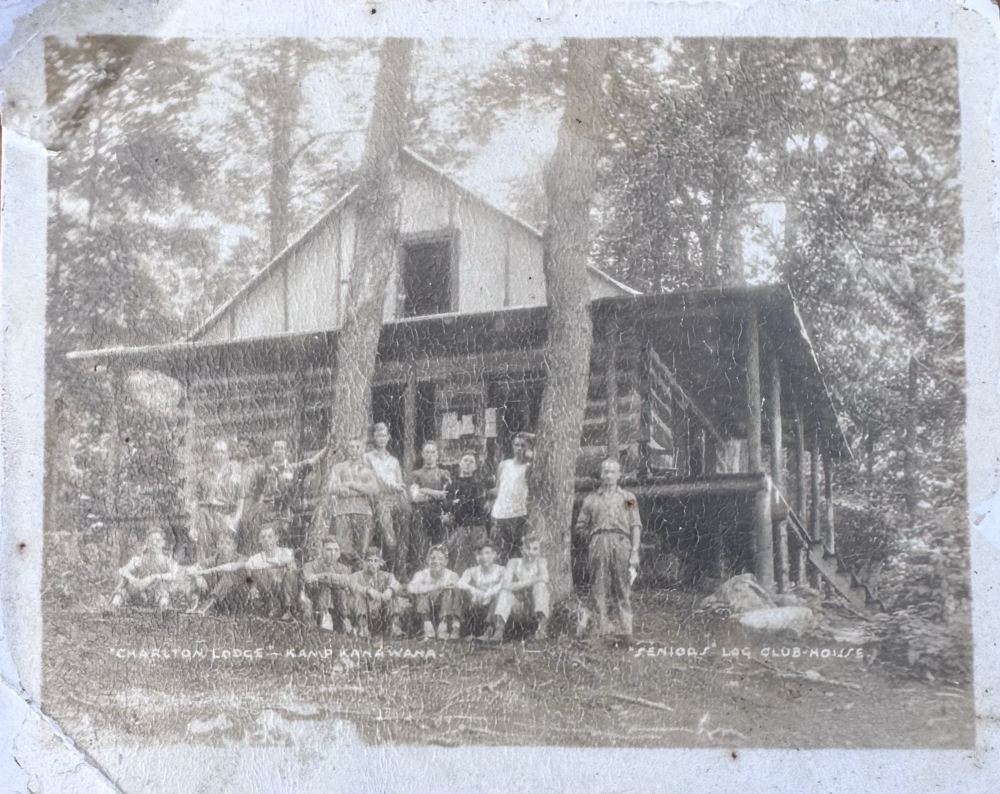

# The Lookout

*Status: draft | Sources: 19*
*Last Updated: 2026-09-24 (first treatment; the photograph, the 1923 notice, and the name traced to 1932;
extended memo with figures at `project-docs/memos/the-lookout-memo.docx`)*

## Overview

The Lookout is a log building standing on the slope above the swimming beach at Camp Kanawana, fifteen to
twenty metres up from the water and just above the lower road, in what is today the **Pathfinders** (senior
girls) section.^15 It is generally held at camp to be the **oldest building on the property**, and camp
tradition makes it the farmhouse in which the committee that found Kanawana sheltered from a storm in the
winter of 1910, looking out the next morning to see the lake for the first time.^15

A photograph supplied to this project in September 2026 gives it two names it has not carried in any other
source: **"Charlton Lodge"** and **"Seniors' Log Club-House."**^1 Both are traceable. The building is named
for **R. L. Charlton**, who chaired the committee that found the site, proposed the camp's name, and in 1923
was reported in the camp's own paper to be arranging a Senior Log Cabin.^2 ^3

The name **"the Lookout"** is documented continuously from **1932** to the present.^5 ^6 ^7 ^9 ^10 ^11 ^12 ^13
Its age is not. No document this project holds dates the building's construction, and the two readings of the
evidence, a pre-existing farmhouse converted in the 1920s or a building put up between 1923 and 1928, cannot
be separated from what has been read.

*"CHARLTON LODGE" — KAMP KANAWANA. "SENIORS' LOG CLUB-HOUSE." Undated; probably 1920s. Operator's
collection.^1*

## The photograph

A sepia print on a card mount, captioned in white ink along the lower edge in two places: **"CHARLTON
LODGE" — KAMP KANAWANA** at left, and **"SENIORS' LOG CLUB-HOUSE"** at right.^1

It shows a two-storey log building on a slope, its gable end toward the camera, with a **deep verandah**
running along the side under an overhanging roof and a flight of steps climbing to it at the right. Roughly
twenty people are arranged in front, standing and seated on the ground: young men in shirtsleeves, several
women or girls, and one figure at the right in breeches and high boots. Notices are pinned to the wall
behind the verandah rail. Mature trees rise through the frame on either side.

**Three details in the photograph match three separate documents.** The verandah matches the "veranda rail
of the Lookout at Senior Camp" of 1940;^6 the log construction matches the "Senior Log Cabin" of 1923;^2 and
the "Seniors'" in the caption matches the building's position inside the area the 1928 camp map labels
**Senior Camp**.^8

The caption is the only attestation of the name "Charlton Lodge" anywhere in this project. A search of all
1,020 cached source texts returns no other instance.

## Who R. L. Charlton was, and why a building carries his name

R. L. Charlton was a Montreal **marine surveyor**, elected founding Treasurer of the Canadian Board of Marine
Underwriters in March 1917, and described in that record as "an ardent YMCA worker"; he went to France with
the YMCA during the First World War.^14 His connection to this camp is not incidental. He was on the YMCA of
Montreal's Training Classes committee in 1892-93 alongside D. A. Budge and W. H. Ball; he **chaired the
Junior Department**, which is to say boys' work, in the year Camp Jubilee was founded in 1894; and he sat on
the first Summer Camp committee that same year with John W. Ross and E. J. Coyle.^14

Three things then make him the natural person for a building to be named after.

**He found the site.** The camp's own 1951 history: "Early in 1910 a Committee under the Chairmanship of Mr.
R. L. Charlton was constituted to look for a new site for the boys' camp... During the late winter months of
1910 Mr. Charlton and his Committee of Messrs. R. B. Ross Jr. and L. Cushing made a trip to the Laurentians
to choose the camp site. After some searching the group arrived at St. Sauveur and commenced to walk at night
over the hills to Lac Marois. **Running into a rain and snow storm the Committee lost its way and stayed
overnight at a farmhouse.** The next day the country was explored and Lake St. Louis, the present site, was
located."^3

**He named the camp.** The same document: "A great deal of thought was given to choosing a name for the camp.
Mr. Charlton suggested Kanawana which was like the name of a Furness Steamer."^3 See
[[traditions/myths-and-legends|Myths and Legends]] for the unresolved question of whether such a ship existed.

**He got this building.** *The Gas-Bag Extra*, the camp's official paper, Volume 13 Number 1, 1923, under the
heading **SENIOR CABIN**: "**Mr. R. L. Charlton reports that he hopes to complete arrangements for a Senior
Log Cabin. On rainy nights the Cabin, with a roaring fire throwing out its warmth and comfort, will be more
than welcome.**"^2

Charlton was still writing when the camp was fifty years old: his manuscript "Notes re Early Days of YMCA
Camps at Lake St. Joseph and Kanawana" (1943) survives, unread by this project, in the Concordia archives.^16
See [[people/rl-charlton|R. L. Charlton]].

## The name, traced from 1932

The building is called the Lookout in nine documents across ninety-three years. Four of them predate the
first map to carry the name.

| Year | Source | What it says |
|---|---|---|
| **1932** | *The Green Triangle*, 20 August^5 | "After determining and getting the course from **the Lookout**, ten valiant braves wandered their way past the ball field" |
| **1940** | *The Green Triangle*, 27 June^6 | "the **veranda rail of the Lookout at Senior Camp**"; "armchairs on **the Lookout veranda**"; "the Senior Section invites the whole camp to **the Lookout** for fun, games and stuff... and **the Lookout band**" |
| **1952** | YMCA of Montreal annual report^7 | "Kamp Kanawana: ...**new roof on gallery and new steps at the Lookout**" |
| **1962** | Camp map^9 | **"LOOK OUT"** on a signboard beside a building |
| **1974** | Camp orienteering map^10 | **"Lookout"** among the numbered features |
| **1976** | Director's report^11 | "repairing and replacing **balconies** on the chief's cabin, **lookout** and grand portage" |
| **1980–2001** | Site map^12 | **"LOOKOUT"**, above the Beach & Swimming Waterfront |
| **2007–2010** | Dining-hall plaques | **"Lookout"** as the senior girls' section name; a 2008 board reads "To the women that filled the lookout with love and friendship" |
| **2025** | Camp facilities list^13 | **F18, Lookout**, marked as restricted access |

Two things are worth drawing out. **The 1932 use is navigational**: a hiking party gets its *course* from the
Lookout, which is what you do from a vantage point, not from a clubhouse. That is the name behaving exactly
as the origin story says it should.

And **three separate records across thirty-six years describe the same architectural feature**: a veranda in
1940, a gallery in 1952, balconies in 1976. All three are the porch in the photograph.

## The two names, and a pattern this camp repeats

"Charlton Lodge" appears once, on a formal photographic caption. "The Lookout" appears in the campers' own
newspaper, the maintenance ledger, the maps and the plaques.

That split is familiar here. The dining hall was formally renamed **Salle Julien Tassé** after the camp's
caretaker of thirty-odd years died in the early 1990s, and, as this wiki records, "the name never entered
ordinary use; everyone went on calling it the dining hall."^15 A dedication name and a use name can live
side by side for decades, and the dedication name is usually the one that vanishes. Charlton Lodge appears to
have gone the same way, with one difference: it vanished so completely that until September 2026 this project
had never heard it.

## Where it stands, on five maps

*Kamp Kanawana, 1928. The building sits at the east end of the Senior Camp cluster, unnamed.^8*

Correlating the pictorial maps on two fixed features, **Snowshoe Lake** off the northeast corner and the
northeast shore of Lake Kanawana, puts the same structure in the same place on every sheet.

On the **1928 map** and its **1941 reissue** (the same plate, same artist, same border and inset), a
substantial gabled building with windows drawn on two faces stands at the east end of the **Senior Camp**
cluster, above the waterfront, east of the senior tent row, with open ground running east toward Snowshoe
Lake. It is the easternmost structure of the camp proper, and it is the only building in that cluster drawn
as architecture rather than as a tent. **It carries no name.**^8

That omission is meaningful, because the 1928 map names buildings when it wants to: "Craftshop" is lettered
beside its icon a few hundred feet west.

On the **1962 map** the **"LOOK OUT"** signboard stands beside a building in exactly that position: east of
the Woodsmen cluster, above Sandy Beach, the same open ground to the east. The 1962 map also carries a
**numbered legend of nine buildings** — 1 Craftshop, 2 Lodge, 3 Long House, 4 Dining Hall, 5 Business Office,
6 Chief's Cabin, 7 Pump House, 8 Windward Ho!, 9 Sanctam — and **the Look Out is not among them**. It is
signposted instead, in the style the map reserves for **Farewell Rock, Parliament Rock, Frog Bay, Lost Cabin
and Sandy Beach**. The cartographer treated it as a *place*, not as an item on the building list.^9

On the **1980–2001 site map** the Lookout is labelled directly up the slope from the Beach & Swimming
Waterfront, with the Lighthouse and Tee Pee to its west and the road between it and the shore.^12 On the
**2025 map** it is F18, at the east end between zone 6 (Pathfinders) and zone 7 (LIT), above the shore road,
drawn with the restricted-area symbol.^13

**Two buildings it is not.** The **Lodge** is number 2 in the 1962 central cluster and sits beside the Post
Office in the middle of camp on the later map; the camp's 1951 history dates "the lodge and museum" to
**1927**, and the 1928 annual report describes it as built "to take care of our library, museum, basketry
room, and leaders' room."^3 The **Long House** is number 3 in that same central cluster, at the waterfront,
and is the later name of what the 1951 history calls "the lower pavilion on the lake front built early."^3 ^15

## How old is it, and the two readings

Nothing read so far dates the building. What the record gives is a frame.

- **1913.** The association describes its new Saint-Sauveur property: "A dining room, kitchen, with tents,
  boats, etc., is now provided, and **the Committee is endeavoring to secure a pavilion for use as club and
  boat house.**"^4 No club house at Kanawana, and one wanted.
- **1921–1923.** The camp brochures describe two pavilions, one for dining and one for recreation in wet
  weather. No senior club house.^14
- **1923.** The *Pictorial Review* in the same issue of the *Gas-Bag Extra* as the Senior Cabin notice
  captions a photograph **"Senior Tent-site"** — white wall tents pitched among trees.^2
- **1923.** Charlton "hopes to complete arrangements" for a Senior Log Cabin.^2
- **1928.** A substantial building stands at the east end of Senior Camp.^8
- **1932.** "The Lookout" is a named place.^5

**Reading one: built or converted between 1923 and 1928.** The 1913 committee wanted a club house; the 1923
brochure and pictorial review show the seniors under canvas with no club; Charlton arranges one in 1923; by
1928 a building is there. On this reading the Lookout is not the oldest building at camp, and the "pre-existed
the camp" tradition is mistaken.

**Reading two: a Pagé farmhouse, standing since before 1910, converted in the 1920s.** The YMCA bought the
property from the **Pagé family** around 1910.^15 A farmhouse already on the land would appear in none of the
documents above, because each of them lists what the camp *provided* or *built*, and Charlton's word in 1923
is "**arrangements**," not construction — which is the right word for securing and converting an existing
structure, and the wrong one for raising a new building. On this reading the tradition is right, and the
building Charlton sheltered in during the 1910 storm is the building the camp later named for him.

**The two readings are compatible with every document this project holds, and nothing in the corpus separates
them.** One caution belongs with the second: the camp had its own term for a Pagé building, and it is not this
one. The 1969 annual report refers to "the unfinished playing field out by the **Pagé farmhouse**," meaning
the farm bought in 1960 "just outside the camp gate," which is probably today's Farmhouse at the east end.^19
If the Lookout was also a Pagé house, the camp acquired two of them fifty years apart and reserved the family
name for the later one.

## Why it matters

Camp Kanawana is the oldest residential summer camp in Quebec, founded in 1894 at Lake Saint-Joseph and
operating at Saint-Sauveur since 1910.^15 Almost nothing physical survives from the beginning. The dining
hall on the site today dates to 1920; the Lodge to 1927; the first cabins, the Bantams, to 1936.^3

If the tradition is right, the Lookout is older than the camp's presence on the land, and it is the only
building at Kanawana connected to the moment of the camp's founding rather than to its subsequent growth.
Even if the tradition is wrong, the building is named for the man who chaired the search that found the site
and who proposed the name the camp has carried for over a century, and it served as the senior section's
gathering place from at least 1940, with its own band.

## Open Questions

1. **[Critical]** When was the building put up, or converted? The **1915 hand-drawn property sketches** in
   Concordia P145/12B03 would settle it: a building on that knoll five years after purchase means the
   farmhouse reading, and its absence means construction in the 1920s.^17
2. **[Critical]** Do the **Ross & Macdonald drawings for "YMCA Boy's Camp buildings," 1913–1914** (CCA
   AP013.S1.D37) include a club house? Five working drawings, never examined.^18
3. **[Important]** Does Charlton's own 1943 manuscript describe the farmhouse he sheltered in, or the cabin he
   arranged? Concordia P145/12A, Box HA1881.^16
4. **[Important]** Was the farmhouse of the 1910 storm on the property at all? The 1951 history places the
   party walking "over the hills to Lac Marois" when they lost their way, and does not locate the farmhouse.^3
5. **[Nice-to-have]** When did "Charlton Lodge" fall out of use, and was it ever a formal dedication? No
   minute, plaque or programme naming it has been found.
6. **[Nice-to-have]** What is the building used for now, and why is it marked restricted on the 2025 map?^13

## Related Articles

- [[people/rl-charlton|R. L. Charlton]]
- [[people/page-family|The Pagé Family of Saint-Sauveur]]
- [[site/places-and-locations|Places and Locations at Camp Kanawana]]
- [[site/the-kanawana-site|The Kanawana Site]]
- [[history/founding-1894|The Founding, 1894]]
- [[traditions/section-names|Section Names]]

## Sources

1. **Photograph, "Charlton Lodge — Kamp Kanawana / Seniors' Log Club-House"**, undated, sepia print on card
   mount [src_photo_charlton_lodge_nd]. Supplied by the operator, 24 September 2026; image filed at
   `assets/images/historical/charlton-lodge-seniors-log-club-house.jpg`. The only attestation of the name
   "Charlton Lodge" in this project. See [f_5835] and [f_5836].
2. *The Gas-Bag Extra*, Kamp Kanawana's official paper, **Vol. 13 No. 1, 1923**
   [src_ymf_the_gas_bag_extra_vol_13_no_1], the SENIOR CABIN notice and the *Pictorial Review* plate. Cached
   at `sources/cache/ymca-montreal-fonds/the-gas-bag-extra-vol-13-no-1.txt`. Concordia P145/12B04. See
   [f_2167] and [f_5844].
3. **"Kamp Kanawana History"**, presented at a training course, 6 June 1951 [src_ia_kanawana_history_1951],
   the site-search narrative, the naming of the camp, and the building chronology. See [f_2373].
4. **YMCA of Montreal, annual report for the year ending 30 April 1913** [src_ymf_sgw_ymca_annual_report_1913],
   the Summer Vacation Camps paragraph.
5. *The Green Triangle*, **20 August 1932** [src_ymf_the_green_triangle_1932_08_20]. See [f_5837].
6. *The Green Triangle*, **27 June 1940** [src_ymf_the_green_triangle_1940_06_27], three mentions in one issue. See [f_5838].
7. **YMCA of Montreal, annual report 1952** [src_ymf_sgw_ymca_annual_report_1952], the capital works list.
8. **Kamp Kanawana map, 1928** [src_ymf_1928_kamp_kanawana_map], with the plate as reproduced in McMorris's
   thesis [src_mcmorris_thesis]. The 1941 map is the same plate reissued. Concordia P145/12B07, "Maps of
   Kanawana n.d." See [f_1811], [f_5840] and [f_5841].
9. **Kamp Kanawana map, 1962**, reproduced as Figure 2.6 in McMorris [src_mcmorris_thesis]. Concordia
   P145/12B07. See [f_1812] and [f_5839].
10. **Kamp Kanawana orienteering map, 1974** [src_ymf_kanawana_orienteering_map_1974].
11. **Kamp Kanawana Director's Report 1976** [src_ia_kanawana_directors_report_1976], maintenance section.
12. **Kamp Kanawana site map, 1980–2001**, Concordia historical album
    [src_flickr_kanawana_concordia_historical_album]. See [f_1573] and [f_1791].
13. **Camp Kanawana site map and facilities list, 2025** [src_kk_prep_guide_2025]. See [f_1801].
14. **Camp brochures 1922 and 1923** [src_brochure_1922, src_brochure_1923]; and for Charlton's career,
    Canadian Board of Marine Underwriters records and the YMCA of Montreal annual reports for 1891-92 and
    1893-94, as set out at [[people/rl-charlton|R. L. Charlton]].
15. **Oral history, the operator**, 24 September 2026 [src_oral_aronson_lookout_2026]: the building's location
    above the beach in the Pathfinders section; its standing as the oldest building at camp; the tradition
    that it is the farmhouse of the 1910 storm and that the committee "looked out" of it the next morning to
    see the lake; the Lodge as a separate central building; the lower pavilion as the later Longhouse. See [f_5842]. Also
    [src_oral_aronson] for the earlier statements at [f_1198] and [f_1201].
16. **Concordia University Archives, YMCA of Montreal fonds P145/12A**: R. L. Charlton, "Notes re Early Days
    of YMCA Camps at Lake St. Joseph and Kanawana" (1943), Box HA1881; Ralph Dawson, "History of Kamp
    Kanawana" (1933), Box HA2307; W. E. Cushing, "Historical sketches — Lake St. Joseph" (1943)
    [src_concordia_12L]. **None read.**
17. **Concordia University Archives, P145/12B03, "Land, facilities, equipment, supplies"**
    [src_concordia_12B03]: 1915 hand-drawn property sketches; 1919 dining/kitchen pavilion blueprint and
    letter and 1928 boathouse construction records; 1937 trail mapping; ice-house blueprints c.1929 (Box
    HA2313, with undated Lodge and boat-dock drawings); 1940 sleeping-cabins drawing, 1945 eight-boy cabin
    blueprint and 1952 proposed craft shop (Box HA2694); "KK land purchase — Pagé farm, 1960–1961." See
    [f_1787] and [f_1813]. **None examined page by page.**
18. **Canadian Centre for Architecture, Ross & Macdonald fonds AP013** [src_cca_ross_macdonald]:
    AP013.S1.D37 (CCA #48095), "YMCA Boy's Camp buildings," 1913–1914, five working drawings;
    AP013.S1.D46 (#48710), Dining and Kitchen Pavilion, 1919, six drawings; AP013.S1.D67 (#50576), Doctor's
    Cottage, 1921, three drawings. Fourteen drawings, all client YMCA, location Saint-Sauveur-des-Monts.
    **None examined.** See [f_1530] and [f_0573].
19. **Kamp Kanawana Annual Report 1969** [src_ia_kanawana_report_1969], the recommendation on "the unfinished
    playing field out by the Pagé farmhouse." See [f_5843].

## Research Notes

<!-- Raised 2026-09-24 from an operator request for a research report on the Lookout, prompted by a
photograph he supplied. The article is built from two facts that had been sitting in the KB as orphans,
cited by no article: f_2167 (Charlton arranging a Senior Log Cabin, 1923) and f_2373 (the 1910 site search
and the storm). Joining them required the photograph, which nobody had.

Three corrections made in the course of the work, all mine, all recorded because the reasoning was wrong
rather than only the conclusion:

1. I first concluded from the 1913 and 1923 evidence that the "pre-existed the camp" oral history (f_1201)
   was probably wrong. The operator then supplied the 1910 storm and Pagé details, and the 1951 history
   turned out to hold the storm account already. Both readings are now presented as live.

2. I reported that "no source uses 'Lookout' as a building name before the 1962 map." False. The name is in
   the Green Triangle in 1932 and 1940 and in the association's own annual report in 1952. The error was
   caused by piping my own grep through `head -20`, which cut the Kanawana hits below the fold. Third
   instance this session of reporting on a truncated view of my own output.

3. I called the 1928 map's Senior Camp building "unnamed" only after cropping and magnifying it; an earlier
   pass over the contact-scale image had missed the windows that mark it as architecture rather than a tent.

Map correlation method: the pictorial maps are not surveys and support no metric comparison. Correlation is
topological, anchored on Snowshoe Lake and the northeast shore of Lake Kanawana, both of which appear in the
same relation on the 1928, 1941 and 1962 plates.

Searches run and null: "Pathfinder" within 60 characters of cabin/lodge/house/club, zero matches across
1,020 cached texts; "Charlton Lodge", zero outside the photograph; "Log Club House", two matches, both the
1898 Lake St. Joseph building; McMorris thesis, zero for lookout, Charlton, or farmhouse. -->
