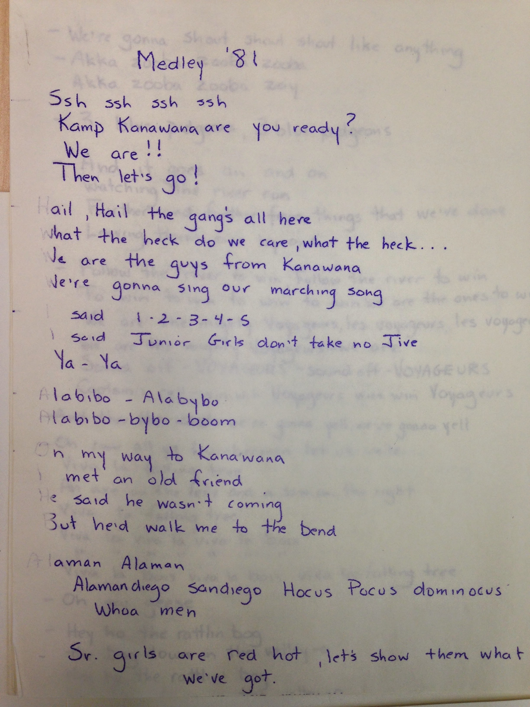

# Camp Songs, Cheers, and Musical Traditions

*Status: E1-reviewed | Sources: 19*
*Last Updated: 2026-08-14*

## Overview

Music and communal singing have been part of Camp Kanawana's culture since its earliest documented years. The 1923 *Gas Bag* describes "the evenings around the fire with their story-telling and their sing-songs" as among the most treasured camp memories.^1 By 1935, the camp held a "musicale" described as "without precedent in the annals of Kanawana" and "a fine effort much appreciated by the whole camp."^3 Over the decades, Kanawana developed a repertoire of camp-specific songs, cheers, and musical traditions, many of which remain part of camp life today. The YMCA Quebec website confirms that "sitting around a camp fire, singing call-and-response songs in the forest" remains a defining element of the contemporary Kanawana experience.^12

The camp's musical heritage is preserved in several archival collections at Concordia University, including song sheets and skits (1925, 1927), Kanawana song books (1941-1945), a Canadian YMCA song book, and the sole known audio recording: Richard Kerr's "On My Way to Kanawana."^5 ^6

## The Camp Song: "On My Way to Kanawana"

The official camp song, **"On My Way to Kanawana,"** was composed and performed by **Richard "Itch" Kerr**, a Kanawana alumnus who received the inaugural Pip Alumni Award circa 2007.^5 The song is preserved at Concordia University as **P145/SR0001** (Sound Recordings) on CD, with a duration of 4 minutes and 30 seconds. It accompanies the 1993/1996 YMCA film *Kamp Kanawana: The Experience that Lasts a Lifetime*, produced by Cathy Reeves (9 minutes, colour VHS).^5 It is the only known audio recording in the Kanawana archival collection.

**Kerr's own account of writing it survives, and it dates the song precisely.** Writing in the Kanawana alumni newsletter *The Lookout* in autumn 1993, he describes the closing banquet:

> "My invitation to this year's closing banquet was written at **summer's end 1977**. I wrote it myself late one night with some help from **three friends**. What we wrote was as spontaneous as love itself. One moment there was nothing the next, a song which payed tribute to friends, a place, an experience we loved. I had forgotten all about the song. Something as ethereal as a song at a summer camp should have easily vanished into the mists of time. Somehow, **the next summer it was remembered and it has been sung every summer since**. Much like the names on the ancient plaques that haunt the dining hall; my Kamp nickname has always accompanied any introduction to the song as the mysterious author of long ago."^19

So: written in one night at the end of summer **1977**, by Kerr with three unnamed collaborators; revived in **1978** and sung annually thereafter. Kerr was on the Kanawana staff in 1975 (filling in as a counsellor for a week), 1976 (taking over the CIT program mid-summer) and 1977 (CIT Director), and returned to run a song workshop at pre-camp in 1992.^19 **Note what this account does not support:** no contemporaneous 1977 or 1978 document naming Kerr as composer has been found. His own 1993 retrospective is the sole source, and it is a memoir written sixteen years after the fact — reliable on authorship, less so on detail.

The song held particular significance in camp culture. In 1967, a busload of Kanawana campers singing the camp song greeted the CCA Centenary Journey paddlers upon their arrival in Ottawa.^13 No lyrics, sheet music, or digital copy of the recording have been found in any online source. The Concordia Archives CD is the sole known copy. Its exact box number is now confirmed: Concordia's static finding-aid page for sub-sub-series 12B04 gives the catalog entry "On My Way to Kanawana. Song composed and performed by Richard Itch Kerr. CD. 4'30. - nd." at **Box HA2559**; the item is undated ("nd") in the finding aid itself.^16

### "Dear Old Kanawana" (Camp Song, pre-1967)

McMorris's thesis documents an earlier camp song, **"Dear Old Kanawana,"** sung to the tune of the **Battle Hymn of the Republic** (also known as "John Brown's Body"). The Council of Tribes ceremony script (c. 1925-1927) concludes with the Big Chief calling on the assembly to "sing the song of the tribes of Kanawana," identified as "Dear Old Kanawana."^13 This song predates the Richard Kerr composition and served as the primary camp song during the pre-war and mid-century periods. The lyrics are:^13

> Mine eyes have seen the glories of a thousand camps or more
> By placid inland waters and the ocean's mighty roar
> But now I've seen old Kanawana, I'll never wander more
> I'll ever camp right here.
>
> Glory, glory, Kanawana
> Dear old, good old Kanawana
> We the boys of Kanawana
> Will ever camp right here.

### "My Kanawana" (Thesis Epigraph)

The McMorris thesis uses the poem/song **"My Kanawana"** as the epigraph for Chapter 1. The full text reads:^13

> My Kanawana, Kamp of the free
> Spirit mind and body unite to proclaim democracy
> Our Kanawana — your Kamp and mine
> Lake and Hill and Sky unite to proclaim God's soul divine
> Wind thru' the pines — sunsets aglow — pals on the trail as on and up we go
> Our Kanawana — Kamp of the free
> Spirit body mind unite to proclaim democracy

The source and date of "My Kanawana" are not identified by McMorris. The text reflects the YMCA's "four-fold" development philosophy (spirit, mind, body) and the democratic citizenship values central to Kanawana's programming.^13

## The Kamp Kanawana Marching Song (The Kanawana Cheer)

The **Kamp Kanawana Marching Song** — also known simply as the **Kanawana Cheer** — is the most widely known camp cheer.^7 The full text as performed in the 2000s era, recorded from oral history:^14

> **Chief:** Shhh, shhh, shhh, shhh, shhh, shhh, shhh!
> Kamp Kanawana, are you ready?!
> **All:** We are!
> **Chief:** Then let's go!
>
> **All:**
> Hail, Hail, the gang's all here,
> What the heck do we care,
> What the heck? We're the guys from Kanawana,
> We're gonna sing our marching sooong-a!
>
> We're gonna shout, shout, shout like anything,
> And through the woods we're gonna yell!
> We're gonna yell!
>
> We're gonna sing, sing, sing, along the trail,
> And through the woods we'll give a rousing hail!
> We are the guys from Kanawana,
> So let's sing, sing, sing, siiiinng!
>
> Ringle, wrangle, jingle, jangle,
> What's the matter with the Green Triangle?
> Sis-boom-ba-ha, Sis-boom-ba-ha,
> Kanawana, Kanawana, Rah-rah-rah!
> K-A-N-A-W-A-N-A,
> K-A-N-A-W-A-N-A,
> YEAH!

### Origins and History

The Marching Song is **not original to Kanawana**. Research by [[people/matt-aronson|Matt Aronson]] (Spirit of Kanawana blog) traced the refrain "Hail, hail, the gang's all here" to the 1915 American popular song **"Alabama Jubilee"** (music by George L. Cobb, words by Jack Yellen, published under the pseudonym D. A. Esrom / Dolly Morse).^7 ^8 The melody itself derives from Arthur Sullivan's tune for the comic opera *The Pirates of Penzance*. The same refrain became the "fight song" of Glasgow Celtic football supporters.^7

The document in which the lost verses were rediscovered was **undated**, making it difficult to identify the author who adapted the song for Kanawana. Aronson proposed a theory connecting the adaptation to the tradition of the Green Triangle camp newspaper.^7

### Lost Verses

In **2006**, the original three-verse text of the Kanawana Marching Song was **rediscovered in the Kanawana Archives at Concordia University**.^7 Only the first verse survives in the modern cheer as it is known today; the second and third verses had been lost from oral transmission. The full text of the rediscovered verses has not been published online.

## The 1922 Camp Cheer: "Yo Triumphy!"

The earliest documented Kanawana cheer predates the Marching Song and comes from the 1922 brochure. The full text reads:^2

> "Yo Triumphy! Yo Triumphy!
> Hoben Sloben Rebecca Leeammour,
> De hoop de hoop de Shalla de Veer,
> De boom de rye de hye de pop,
> Whooneka Heeneka Waac de Waac,
> Hob Dob de Bowl de Bara,
> Con Slob de Hob Dob Rah,
> Kanawana---Rah!"

The cheer is entirely nonsensical, concluding only with the camp name. This structure — using pseudo-foreign or deliberately absurd syllables as a rallying cry — was characteristic of early twentieth-century camp yells. The origin and meaning of "Yo Triumphy" have not been identified. The cheer does not appear in any other known camp's repertoire.

## The 1938 broadcast set list

A CBM radio broadcast of 10 November 1938, "The Voice of Youth," was performed by the boys of Kanawana and its script survives — giving a set list of what the camp actually sang:^19

1. **"Kanawana Marching Song"** — a distinct title, not otherwise attested, and not necessarily the same as the "camp song" of 1933
2. **"Hi-Ho, Hi-Ho"**
3. **"My Old Kentucky Home"** — sung solo by twelve-year-old Sandy Spence
4. **"The World is Waiting for the Sunrise"** — chorus only
5. **"Johnny Verbec"** — introduced as Dick Abraham's "Kanawana song specialty," with guitar, and called "the sausage song"
6. **"Taps"** — to close

**"Johnny Verbec" is a second "Alabama Jubilee"-type lead.** It is the folk song usually spelled *Johnny Verbeck* or *Dunderbeck's Machine*, a comic song about a sausage-machine inventor with a long and traceable history outside camp — yet the script calls it a "Kanawana song specialty," exactly the way a borrowed song becomes a house song.

The same script records where singing happened — "those zippy camp sing-songs in the dining hall, at **Farewell Rock**, around the fire-rafts on the lake, and — of course — at our Saturday Night Shows" — and names **John Pearson** as the song leader, "waving his arms at us when leading the sing-songs."^19 A 1936 broadcast adds that there was a **daily** song-and-music period after dinner at which "new songs are learned."^19

## Four named songs from 1933

The *Green Triangle* of 29 July 1933 describes campers singing on the way up to camp and names four songs by title — **"Marois," "The Nonsense Song," "Sea-Side"** and **"Yo Triumphy"** — alongside an unnamed "the camp song" distinct from all four.^19 "Marois" is almost certainly connected to Lake Marois and to Marois Day, the 1935 season's most anticipated event; "Yo Triumphy" is the 1922 cheer below, still in the repertoire eleven years later, which is the only continuity this article can demonstrate between the 1920s and 1930s material.

**No lyrics survive for any of these.** Across the entire digitized corpus there are song *titles* and one complete *yell* text, and no camp-song lyrics whatsoever.

## The Pathfinder yell (1965)

This is the only complete Kanawana cheer text recovered from the corpus besides the 1922 brochure cheer. Printed in a 1965 camp publication, in capitals, with OCR damage — reconstructed here, with the raw text in the source note:^19

> Tents, trails, trees and tracks,
> Paths, paddles, pets and packs,
> We're the boys with the strongest backs,
> We're the boys who swing the axe.
> Here we are, there we are,
> Tripping men from near and far,
> Swish, swash, splish, splash,
> We're at Kamp to have a bash.
> **YEA, PATHFINDERS!**

The article printing it explains its function: "This yell, which was original to the Pathfinders in 1965, required maximum participation and group effort in order for it to sound really good **in the dining hall**." It gives the section's motto — "one for all and all for one" — and a closing call-and-response: "Pathfinders, ARE YOU READY?" answered "WE ARE." The dining hall was the venue for section yells generally: the 1970 season report notes a section that "seemed to act and react as one section most of the time (ie Pathfinder yell in the dining hall)," and an all-camp "Kanawana Yell" existed as early as 1932.^19

## Section Cheers

One section cheer has been recorded in a written source (see Revision History): the handwritten "Medley '81" cheer sheet (see Images below) records an actual Voyageurs sound-off chant ("Said 1-2-3-4-5 / Said Junior Girls don't take no jive / Ya-Ya") and a girls'-section cheer verbatim (f_1566). No further Voyageur, Lumberman, or other section cheers beyond what's on that one sheet have been recorded in any accessible archive or publication. The Color War / L&V Games tradition at YMCA camps across North America typically features team cheers, fight songs, and an "Alma Mater" presented during a culminating event called "Sing."^9 This framework almost certainly applies to the L&V Games at Kanawana.

*A possible model/common-origin lead: YMCA Camp Pine Crest (Muskoka, Ontario) has run a two-day "Lumbermen vs. Voyageurs" color-war competition, "The Pine Crest Games," every year since 1940 — a striking naming parallel to Kanawana's own "L&V Games" (Lumberman/Voyageur).^17 A centennial book, *Lumbermen & Voyageurs: The YMCA Pine Crest Story*, exists but its contents (including any cheer text) could not be retrieved online in this pass — worth a dedicated attempt via interlibrary loan or a slower/retried fetch.*

## Sing-Songs, Campfire Music, and Camp Shows

### Evening Sing-Songs (1920s)

The **sing-song** — communal singing around the campfire — was established as a central camp tradition by at least 1923. The *Gas Bag* describes "the evenings around the fire with their story-telling and their sing-songs" as defining memories.^1 A **"Sing-Sing Service"** was held around the Senior raft during the 1923 season, suggesting a vesper-style group singing event on the water.^1 The 1923 season also featured a Senior "Dumbell" Revue with performance elements including a Spanish dance.^1

Multiple original comic songs from the 1923 season survive in the *Gas Bag*:^1

- **"Sunny, How Long"** — A multi-verse comic song about the camp cook "Sunny" Hardy, structured with verses and a recurring chorus: "Oh, Sunny, How long, how long must I wait / Can't I have it now, or must I hesitate." Verses ribbed individual staff and campers (e.g., "Dave Hart thinks he can sing / Oh death, where is thy sting?").
- **"She Told Me So"** — A multi-verse comic song about a girl, with chorus: "And in my future life, she's going to be my wife / How in the world did you find that out? / She told me so!"
- **Ice Cream Parody** — Set to the tune of **"Yes, We Have No Bananas"** (a 1923 hit), parodying the dining hall's no-seconds-on-ice-cream policy: "Yes, no seconds on ice cream / No seconds on ice cream today."

The packing lists in both the 1921 and 1922 brochures include **"musical instruments"** and **"music"** among recommended items for campers to bring.^2 ^4

### Musicales and Formal Musical Events (1930s)

The **1935 musicale** — held during the eighth week of the season — was described as "a program without precedent in the annals of Kanawana" and "a fine effort much appreciated by the whole camp."^3 No further details about the program or performers have been recovered.

By **1938**, formal musical activity was well-established. **Benny Leshley**, identified as the organist of **Christ Church Cathedral** (Montreal), organized a **choir at the outdoor chapel** to lead singing.^10 The choir was still recruiting new members as of the July 29, 1938 *Green Triangle*.^10 Guest pianist **Brock Brace**, a Juvenile-section camper who also composed, performed in a musicale at the chapel, playing one of his mother's compositions and taking audience requests.^10 **Sammy Shashley** provided regular piano recitals.^10

### Radio Broadcasts (1936-1941)

The camp used **CFCF Radio** (Montreal, Canadian Marconi, est. 1922) for promotional broadcasts from **1936 to 1941**.^5 ^11 The June 26, 1941 broadcast transcript survives on the Internet Archive and describes the opening of the 48th season of Kamp Kanawana. While the transcript covers safety and leadership rather than music, the series represents the camp's engagement with broadcast media over a five-year period.

## "Live a Lot" (Closing Ceremony Song, 2000s-2020s)

**"Live a lot"** is a song traditionally sung at the closing ceremony of every Kanawana session, performed by then-Camp Director Sean Day (per a YouTube video titled "Live a lot- Camp YMCA Kanawana").^15 This is a distinct tradition from the historical camp songs above and from the Marching Song, specifically associated with the end-of-session send-off during Day's 2005/2008-2023 directorship (see [[people/directors-index|Directors and Staff of Camp Kanawana]] for the disputed start-date question). No lyrics have been transcribed from the video.

## Grace at Meals

A morning devotional practice at meals is documented from at least 1922. The brochure describes "a short morning devotional period at the breakfast table" as part of the religious program, along with "the quiet period before lights out led by the tent leader" and "Sunday services in the open-air chapel and around the fire."^2 The McMorris thesis identifies "Grace" as a continuing feature of camp life.^13

By the 2000s era, Grace was not a single fixed prayer but a rotation of several **sung graces**. Two identified graces are: (1) **"Johnny Appleseed"** — the folk grace widely used at North American camps ("Oh, the Lord is good to me, and so I thank the Lord..."); and (2) the lyrics of **"Joy to the World"** by Three Dog Night ("Jeremiah was a bullfrog...") adapted as a grace.^14

## Song Books and Archival Collections

The Concordia University Archives hold the following music-related materials in the Kanawana fonds (P145):^5 ^6

| Item | Date | Series / Box |
|------|------|--------|
| Song sheets and skits | 1925, 1927 | P0145/12B07 (Program), Box HA2315 |
| Kanawana song books | 1941-1945 | P0145/12B07 (Program), Box HA2315 |
| Canadian YMCA song book | 1941-1945 | P0145/12B07 (Program), Box HA2315 |
| KK pageant scripts | 1931-1932 | P0145/12B07 (Program), Box HA2315 |
| "On My Way to Kanawana" (CD) | undated | P145/SR0001 (Sound Recordings), Box HA2559 |
| Radio broadcast scripts | 1936-1941 | P0145/12B04 (Communications) |
| Promotional audiovisual materials | various | P0145/12B04 (Communications) |

These archival materials are the definitive source for documenting Kanawana's historical song repertoire and are not accessible online — the box numbers above are confirmed at the folder level via Concordia's static finding-aid pages, but no individual song titles or lyrics are itemized in the finding aid itself.^16 ^18 Physical access to Concordia University Archives is required.

## YMCA Camp Song Tradition: Context

Campfire singing is a foundational tradition across YMCA camps in North America. The American Camp Association traces the modern campfire song tradition to the late 19th century, coinciding with the rise of organized camping.^9 The Canadian YMCA had specific connections to this tradition: Gary Schofield, Boys' Work secretary at the Ottawa Canada YMCA, directed Camp On-Da-Da-Waks and was active in the Canadian Fellowship of YMCA Retirees.^9 The iconic camp song "Kum Bah Yah" was introduced at a YMCA National Conference at Green Lake, Wisconsin in the early 1950s.^9

The Color War tradition (known at Kanawana as the L&V Games) typically includes team cheers, fight songs, marches, and Alma Maters as central components, presented during a culminating event called "Sing."^9 Songs are commonly rewrites of popular tunes with team-specific lyrics. This provides the likely framework for L&V section cheers at Kanawana.

## Images

*A handwritten “Medley '81” sheet recording several camp cheers and chants verbatim (f_1566). Copyright All rights reserved by Kanawana.*

## Open Questions

1. [Critical, re-confirmed dead end 2026-07-09] What are the lyrics to "On My Way to Kanawana" by Richard Kerr? Is a digital copy of the P145/SR0001 CD available? The item's box number (HA2559) is now confirmed, but it remains undated ("nd") in the finding aid and inaccessible online; only a physical Concordia visit can resolve this.
2. [Critical, partially advanced 2026-07-09] What cheers are associated with the L&V Games (Voyageur cheer, Lumberman cheer, section cheers)? One section cheer (Voyageurs sound-off, girls'-section cheer) is in fact already documented on the "Medley '81" sheet (f_1566) — see the corrected Section Cheers note above. A possible model/common-origin lead surfaced: YMCA Camp Pine Crest's "Lumbermen vs. Voyageurs" games (since 1940) — its centennial book is an unread, worth-pursuing source.
3. ~~[Critical] What is the full text of the Kamp Kanawana Marching Song?~~ [Largely resolved] Full 2000s-era text recorded from oral history (f_1196).^14 Remaining: the rediscovered lost verses from Concordia (2006) for comparison against the modern version.
4. ~~[Important] What are the words of Grace as said at Kanawana?~~ [Partially resolved] Rotating sung graces: Johnny Appleseed and Joy to the World ("Jeremiah was a Bullfrog") identified (f_1195).^14 Remaining: any other graces in the rotation, and when the rotation replaced a single fixed grace.
5. [Important, re-confirmed dead end 2026-07-09] What songs are in the 1925/1927 song sheets and the 1941-1945 Kanawana song books? Box number now confirmed (HA2315, along with two previously undocumented adjacent items — "KK pageant scripts" 1931-32 and "Fire of Friendship, Kanawana show" 1939 — see [[traditions/traditions-and-culture|Traditions and Culture]]) but the finding aid is folder-level only; no song titles are itemized online.
6. [Important, re-confirmed dead end 2026-07-09] When was the "Yo Triumphy" cheer replaced by the Marching Song? Did both coexist? A 12+ query sweep across web search, the Spirit of Kanawana blog, and general camp-yell-history sources found no trace of "Yo Triumphy" (under any spelling variant) anywhere outside this wiki's own 1922 brochure citation. Only physical Green Triangle/Ka-News issues (1932-1982, Concordia) can resolve this.
7. [Nice-to-have] What songs were commonly sung at campfire sing-songs across different eras?
8. ~~[Nice-to-have] Did the camp song change over time, or has "On My Way to Kanawana" always been the primary camp song?~~ [Resolved] Yes — "Dear Old Kanawana" (to the Battle Hymn of the Republic) was the camp song during the pre-war and mid-century periods. "On My Way to Kanawana" by Richard Kerr is a later composition (date unknown).^13
9. [Nice-to-have, re-confirmed dead end 2026-07-09] Who adapted "Alabama Jubilee" into the Kanawana Marching Song, and when? Independently re-searched this session (web, LinkedIn/Facebook, the primary blog source) — only the famous pop songwriter Richard Kerr (co-writer of "Mandy") surfaces, with no documented YMCA/camp connection; the Kanawana alumnus "Richard Itch Kerr" has no trace anywhere online outside the Concordia catalog entry and Pip Award recipient lists. This is now independently confirmed exhausted across two separate sessions.

## Related Articles

- [[traditions/traditions-and-culture|Traditions and Culture at Kanawana]]
- [[traditions/myths-and-legends|Kanawana Myths and Legends]]
- [[traditions/pip-alumni-award|The Pip Alumni Award]]
- [[traditions/lv-games|The L&V Games]]
- [[site/council-ring|The Council Ring]]
- [[people/matt-aronson|Matt Aronson]]
- [[documents/green-triangle|The Green Triangle]]

## Sources

1. *The Gas Bag*, Kamp Kanawana official paper, 1923 [src_gas_bag_1923].
2. Camp brochure, 1922 [src_brochure_1922].
3. "History of Kamp Kanawana, 1935," YMCA of Montreal [src_history_1935].
4. Camp brochure, 1921 [src_brochure_1921].
5. Concordia University Archives, Kamp Kanawana Communications P0145/12B04; Sound Recordings P145/SR0001 [src_concordia_atom_12B04].
6. Concordia University Archives, Kamp Kanawana Program P0145/12B07 [src_concordia_atom_12B07].
7. Spirit of Kanawana (blog by Matt Aronson), https://kanawana.blogspot.com/ [src_spirit_kanawana_blog].
8. "Alabama Jubilee (song)," Wikipedia [src_wikipedia_alabama_jubilee].
9. "Camp Songs — History and Traditions," American Camp Association [src_aca_camp_songs_history].
10. *The Green Triangle*, July 29, 1938 [src_green_triangle_1938].
11. CFCF Radio Broadcast transcript, June 26, 1941 [src_cfcf_1941].
12. YMCA Quebec, "Camp YMCA Kanawana," https://www.ymcaquebec.org/en/summer-camp-kanawana [src_ymca_website].
13. Grace McMorris, "An Experience That Lasts a Lifetime," MA thesis, Concordia University, 2023 [src_mcmorris_thesis].
14. Oral history, Matt Aronson (2026) [src_oral_aronson].
15. "Live a lot- Camp YMCA Kanawana," YouTube [src_youtube_live_a_lot].
16. Concordia University Archives, static finding-aid page for sub-sub-series 12B04 (Communications) [src_concordia_ymca_fonds_12B04_finding_aid]. Direct fetch 2026-07-09: Box HA2559 (SR0001 catalog entry).
17. YMCA of Greater Toronto blog, "Celebrating Tradition with the Pine Crest Games" [src_ymcagta_pinecrest_games].
18. Concordia University Archives, sub-sub-series 12B07 (Program) [src_concordia_atom_12B07]. Direct fetch 2026-07-09: Box HA2315 (song sheets, song books, pageant scripts).

19. Kanawana material in the Concordia-digitized YMCA of Montreal fonds: *The Lookout* Vol. 1 No. 3, autumn 1993 (Richard "Itche" Kerr's first-person account of writing the camp song) [src_ia_the_lookout_1993]; the CBM "Voice of Youth" broadcast script, 10 November 1938; the CFCF broadcast of 1936; *The Green Triangle* of 29 July 1933 and 13 August 1932; the 1965 camp publication *The Chestnut*, for the Pathfinder yell; and the *Kamp Kanawana Annual Report 1970* [src_ia_ymca_montreal_fonds_collection, src_ia_kanawana_report_1970]. *OCR note: the Pathfinder yell survives only as damaged uppercase OCR ("TENTS, FRAILS, TREES AND TRACKS, / PATHS, PADOLES, PETS AND. PACKS, / LERE THE 30YS 1TH THE STRONGEST RACKS / SE'RE THE 30S SHO S"ING THE AXE..."). The reading given above is a reconstruction; the raw text is recorded here so the reconstruction can be checked.*

## Research Notes

### Revision History

- **2026-07-09** — Corrected an internal inconsistency: this article previously stated no section cheer had been recorded in any written source. The handwritten "Medley '81" cheer sheet (see Images) in fact records a Voyageurs sound-off chant and a girls'-section cheer verbatim (f_1566) — one section cheer is documented, not zero.

