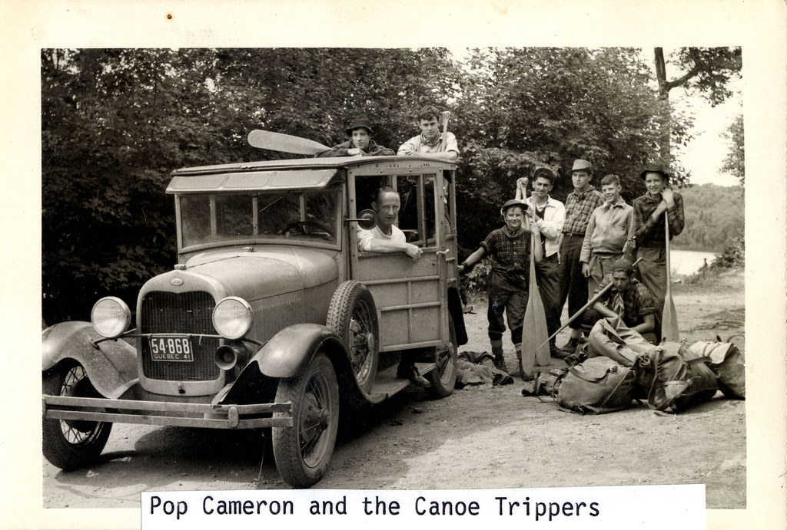
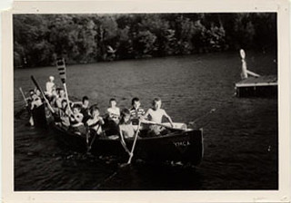
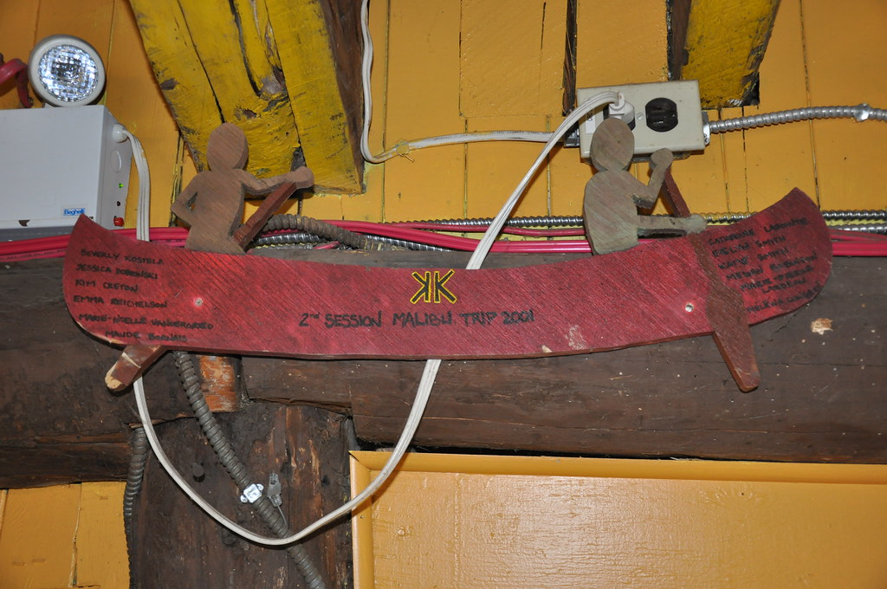
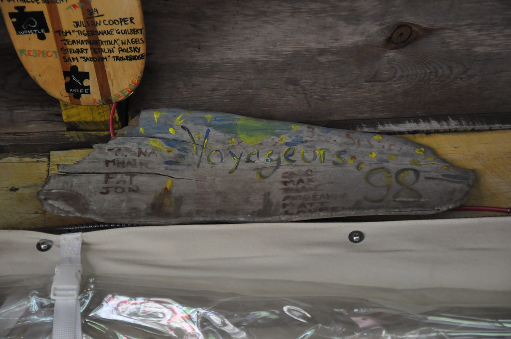
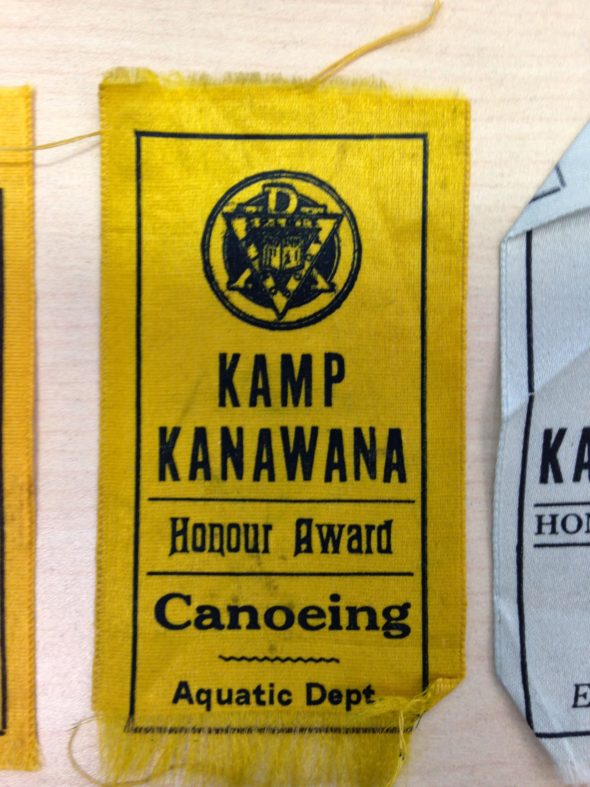

# Canoe Trips at Kanawana

*Status: E1-reviewed | Sources: McMorris (2023) Ch3, KB canoe_trips, YMCA Quebec website, src_ymca_kanawana_adventurers_pathfinders_2026, src_ymca_kanawana_explorers_pioneers_2026, src_wikipedia_lac_landron, src_reserve_laverendrye_history, src_radiocanada_sepaq_laverendrye_2022*
*Last Updated: 2026-07-09 (open-questions research pass: confirmed Lac Landron's real geography and the Reserve's canoe-camping administration history; circumstantial evidence the 1962-63 lease has lapsed, though not directly confirmed)*
*Last Updated: 2026-07-05 (named trip staff added from photo-mined canoe-trip plaques, p_191 ENRICH pass) — photo gallery added 2026-07-02*

Canoe trips were introduced to Kanawana's program in 1925, offered as an optional extra at $3.50 per camper on top of the regular camp fee. By 1928, the camp director was already proposing more ambitious expeditions, suggesting 10- to 12-day trips for senior campers.

The program expanded significantly through the 1930s. In 1936, trips began departing for the Lake Archambault region north of the camp, and by the following summer eight separate trips were heading to the Archambault area in a single season. The shift from short local paddles to multi-day wilderness expeditions marked a fundamental change in how Kanawana understood its relationship to the Laurentian landscape. Camp was no longer just a fixed site. The backcountry became part of the program itself.

By 1945, the routes were codified into a tiered system: a 3-day Lachute trip for beginners, 7-8 day trips to Île Perrot and Grenville for intermediates, and a 10-day Ottawa River trip for seniors.^mc The program continued to expand: by 1950, six canoe trips per week were departing, with routes extending beyond Archambault to include the Ottawa and Pembina rivers. Six trips per week meant that canoe tripping had become not a special activity but a core, ongoing feature of the summer, with groups constantly rotating through departure and return.

By 1962, the growth of cottager communities near Kanawana meant canoe trips had to drive over 150 km to reach suitable launch points.^mc The appetite for more remote territory led the camp committee to begin searching in 1956 for a northern site that could serve older, more experienced trippers. After three years of scouting, they chose La Vérendrye Park in 1959 as a base camp for campers aged 15 and older. The YMCA secured a 25-acre lease at Lac Landron as a base camp, and the program was formally named **"Les Voyageurs de La Vérendrye."**^mc That first summer, the Pathfinder section alone went on eighteen canoe trips — to the Rouge River, North River, Lake Kiamika, and Taureau.^mc By 1964, over twenty trips were departing each season.^mc The La Vérendrye canoe trip program, and the L&V Games competition that grew up alongside it, became inseparable from the camp's identity in the decades that followed.

## Coeducation and Later Developments

The first all-female Voyageur trip departed from Kanawana in 1972, a milestone in the camp's transition to coeducation.^3 In 1998, the one-month Adventurer Canoe Trip was introduced, extending the program's reach to the most committed young trippers.^3

Canoe-trip plaques recovered from the dining hall document a "Tripper" (trip leader) role distinct from the section directors who ran the camp-based program. Rob Shackell appears as Tripper across at least four documented trips between 2001 and 2010 — the 2001 Voyageurs 4th-session portage, the 2005 Swazi trip, the 2008 Missinaibi River 21-day Voyageurs Ultimate expedition, and the 2010 Ashuapmushuan River trip — the longest documented tripping tenure of any named individual in the plaque archive. Steve Wesley co-led the 2010 Voyageurs 3rd-session and Ashuapmushuan trips alongside Shackell. Other named trip leaders include Lorna McNeish, credited "Capitaine" of the 2000 Voyageurs cohort, and Mark Chamandy-Cook, Tripper on a 2009 Talahassee trip through the Papineau-Labelle wildlife reserve.

Today, canoe tripping remains central to the Kanawana experience. The 2026 program structure offers multiple expedition pathways: Adventurers Coureurs des Bois (boys and non-binary, 13–16) provides 4–6 day introductory canoe trips in La Vérendrye Wildlife Reserve; Adventurers Pathfinders (girls and non-binary, 13–16) offers the same format, with flat-water trips in La Vérendrye or white-water trips on Quebec and Ontario rivers; and Voyageurs Ultimate (15–17) runs a 26-day white-water canoe expedition.^4 ^5 The Explorers Pioneers program (girls and non-binary, 11–12) introduces younger campers to expedition travel with 3–4 day combined canoeing and hiking trips at Papineau-Labelle Wildlife Reserve.^6 A documented Papineau-Labelle route covers roughly 22 km over 4 days, with portages of 100–690 m linking Lac Saint-Denis, Lac du Crochet, and Lac Montjoie.^7

## Related Articles

- [[site/camp-otoreke|Camp Otoreke]]
- [[connections/institutional-lineage/canadian-camping-movement|The Canadian Camping Movement]]
- [[history/centennial-1967|Centennial Year (1967)]]
- [[history/coeducation-gender|Coeducation and Gender at Kanawana]]
- [[traditions/order-of-owens|The Order of Owens]]
- [[traditions/lv-games|The L&V Games]]
- [[traditions/programs-activities|Programs and Activities]]
- [[site/the-kanawana-site|The Kanawana Site]]
- [[people/a-ross-seaman|A. Ross Seaman]]

## Sources

- McMorris, Grace. *An Experience That Lasts a Lifetime: Building Modernity, Man, and Nation at the YMCA of Montreal's Kamp Kanawana, 1894-1967*. MA thesis, Concordia University, 2023. Chapter 3. [Spectrum](https://spectrum.library.concordia.ca/id/eprint/992763/)
- Concordia University Records Management and Archives, Fonds P145, Sub-series 12K: Les Voyageurs de la Vérendrye. Includes exploratory canoe trip logs (1958), La Vérendrye Park pilot project budget (c.1959), welcome document (1960s), Lac Landron lease (1962-63), program brochure (1963), camper records (1967-1980), and review booklet (1982).
- YMCA Kamp Kanawana Facts (undated). [Internet Archive](https://archive.org/details/ymca-kamp-kanawana-facts). Timeline confirms Voyageurs de la Vérendrye (1950s), first all-female Voyageur trip (1972), Adventurer program (1998).
- YMCA Kamp Kanawana Facts (undated). [Internet Archive](https://archive.org/details/ymca-kamp-kanawana-facts). Confirms first female Voyageur trip (1972) and Adventurer program (1998).
- YMCA Quebec, "Summer Camp Kanawana: Programs" (ymcaquebec.org). Confirms Voyageurs Ultimate section and ongoing canoe tripping.
- YMCA Quebec, "Adventurers Pathfinders: Canoe-Tripping" (ymcaquebec.org, 2026). Girls and NB 13–16; La Vérendrye or river trips.
- YMCA Quebec, "12-Day Explorers Pioneers" (ymcaquebec.org, 2026). Girls and NB 11–12; 3-4 day expedition to Papineau-Labelle Wildlife Reserve.
- ^7 Phase 2 research (recovered June 2026): Papineau-Labelle Adventurer route ~22 km/4 days, portages 100–690 m, Lac Saint-Denis–Lac du Crochet–Lac Montjoie.
- French Wikipedia, "Lac Landron" [src_wikipedia_lac_landron]; "Réserve faunique La Vérendrye" [src_reserve_laverendrye_history]. Radio-Canada/La Presse, SEPAQ canoe-camping administration transition, 2022 [src_radiocanada_sepaq_laverendrye_2022].
- *A History of Kamp Kanawana* (1935). Internet Archive. Mentions "Four-day trip to Otoreke," confirming canoe trips existed by 1935.
- Canoe-trip dining-hall plaques, photo-mined 2026-07-05 (f_1708, f_1719-f_1723): named Trippers and trip captains, 2000-2010.

### R3 Verification Notes

Core timeline (1925 introduction through 1959 La Vérendrye) sourced from McMorris citing P145 season reports. Modern continuity independently confirmed via YMCA Quebec website. 1935 canoe trip existence confirmed via Internet Archive source. Specific dates (1928 director proposal, 1936 Archambault, 1950 six trips/week, 1956 northern search) are single-source from McMorris's archival citations but grounded in primary season reports.

## Images

*“Pop Cameron and the Canoe Trippers.” Pre-1949 photograph — public domain in Canada.*

*A war-canoe group, 1940-1960. Copyright All rights reserved by Kanawana.*

*A canoe-shaped trip board marking the “2nd session Malibu Trip 2001,” with participants' names. Copyright All rights reserved by Kanawana.*

*A Voyageurs trip dining-hall plaque, 1998. Copyright All rights reserved by Kanawana.*

*An honour-award ribbon for Canoeing, Aquatic Dept., c.1920. Copyright All rights reserved by Kanawana.*

## Open Questions

- [Confirmed dead end, 2026-07-09] What routes did the earliest 1925 canoe trips follow? No source beyond McMorris's already-cited season-report citations found after 8+ additional queries.
- Who organized the first La Vérendrye scouting expedition in 1956?
- When did the La Vérendrye base camp transition from seasonal trips to a permanent satellite operation?
- [Advanced, still not directly confirmed, 2026-07-09] What is the current status of the 25-acre Lac Landron lease? Is it still active? Lac Landron is confirmed to be a real lake in the Zec Capitachouane, adjacent to (not inside) La Vérendrye Wildlife Reserve proper. Circumstantial evidence suggests the lease has lapsed: canoe-camping administration in the Reserve moved to the FQCC in 1993 and to full SEPAQ control by ~2022, and current official Kanawana canoe-trip program pages make no mention of Lac Landron or any private base camp — but no source states outright that the lease ended. Confirming this would require SEPAQ or Ministère des Forêts, de la Faune et des Parcs land-lease records, not indexed online.
- When was the formal name "Les Voyageurs de La Vérendrye" adopted and when did it fall out of common usage?
