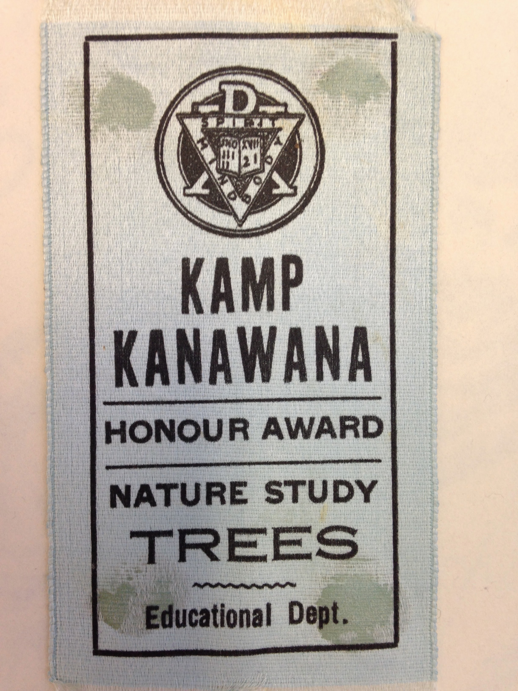

# Environmental Education and Stewardship at Kanawana

*Status: E1-reviewed | Sources: 35*
*Last Updated: 2026-09-04*

## Overview

Camp Kanawana has evolved from a traditional boys' recreation camp into what the YMCA describes as "Quebec's environmental education leader."^1 This transformation reflects broader shifts in the organized camping movement from character-building through nature to active environmental education and conservation. The camp's 550 acres of Laurentian forest, nature interpretation trails, and three private lakes provide both the setting and the subject matter for a program increasingly centred on ecological awareness and stewardship.^1 The Clivus Multrum project documentation describes it as a "year-round environmental education facility and summer camp."^2

The camp's environmental identity rests on three pillars: infrastructure investments that protect the natural site, programming that teaches ecological awareness and civic responsibility, and an institutional pipeline that has carried Kanawana's outdoor education philosophy into post-secondary education and professional practice.

## Environmental Infrastructure

### The Green Shift (2006–2012)

The camp's "virage vert" (green shift) began in 2006 with the goal of reducing Kanawana's ecological footprint and repositioning it as an outdoor education centre; every building renovated or constructed from 2006 onward was energy-efficient and incorporated educational elements.^17 The green shift enabled the camp to serve "four times more young people" than before, transforming it from a summer-only operation into a three-season environmental education facility.^22 In February 2009, Les Y du Québec announced a further revitalization phase with new accommodation facilities; environmental features documented at the time included green sanitary installations, heat exchangers, composting toilets, and an artificial wetland system (marais artificiel) for wastewater treatment.^17 In 2010, TELUS contributed $50,000 toward a three-season educational pavilion at the camp.^23

The Montreal YMCA's own annual reports, mined directly in 2026-07-07 (project-docs/research-log.md Campaign 25), give a year-by-year primary-source account of the project's scale and progress. The 2007 annual report frames it as a $5 million development, describing it as Quebec's first "green camp": by that spring, two eco-friendly sanitary buildings (low-flow taps and showers, heat-recovery systems) were already built and in use, and a garden/composting education program had launched in partnership with YMCA Pointe-Saint-Charles, pairing seniors and youth for seedling production, planting, and composting under a specialist gardener; 19% of Kanawana campers received financial assistance that year, a figure the report described as rising annually.^24 By December 2008, $1.48 million had been raised toward the $5 million goal.^25 By 2009, Phase I was nearly complete, with twelve new three-season cabins erected at the Saint-Sauveur site for campers aged 7–12 and their counsellors.^26 The project's environmental merit was recognized outside the YMCA itself: in December 2010, Kanawana received an honourable mention for environmental achievement at the City of Saint-Sauveur's annual Gala Méritas award.^27 Construction began in October 2011 on educational pavilions for nature classes and community groups,^27 and a new eco-educational pavilion opened in 2012.^28

### Composting System

The camp replaced its entire septic system with 16 commercial Clivus Multrum composting units accommodating 22,500 uses each per year, plus 32 dry toilets that save 576,000 gallons of water annually.^2 Two central buildings contain all bathroom and shower facilities. The system was installed specifically to protect Lake Kanawana from septic pollution.^2 The Grand Portage cabin was demolished around 2006 to make way for the new washroom buildings housing the system, and two green sanitary installations were tested during the summers of 2007 and 2008.^17 ^18

### Lake Monitoring

Lac Kanawana participates in Quebec's Réseau de surveillance volontaire des lacs (RSVL) as station 573 (Station 0573A; coordinates 45°51'07"N 74°11'37"W; Rivière du Nord watershed), with the YMCA itself as the volunteer participant.^3 ^22b Monitoring includes Secchi disk transparency measured every two weeks from June to October, and water samples analyzed for phosphorus, dissolved organic carbon, and chlorophyll a by the Centre d'expertise en analyse environnementale du Québec (CEAEQ).^3 The lake has a surface area of 0.2388 km², maximum depth of 12.4 metres, average depth 5.2 metres, and a drainage ratio of 21.95; 42% of the lake bottom is colonizable by macrophytes (maximum growth depth 4.3 metres).^22b Its volume and renewal time are recorded slightly differently across data vintages — 1,239,000 m³ / 0.36 years (RSVL/MELCCFP) versus 1,273,000 m³ / 0.43 years (earlier figures) — recorded as conflicts c_009 and c_010.^22b

Actual monitoring values were retrieved via operator browser access: in 2010 the summer means were total phosphorus 8.4 µg/L, chlorophyll a 7.2 µg/L, Secchi 2.5 m, and DOC 6.2 mg/L (trophic status **mesotrophe**); in 2011 they improved to phosphorus 7.5 µg/L, chlorophyll a 3.4 µg/L, Secchi 3.9 m, and DOC 3.4 mg/L (**oligo-mesotrophe**).^22b No RSVL monitoring is recorded after 2011, which conflicts with the earlier understanding of data "since at least 2013" (the 2013–2024 CRE Laurentides material may be separate technical-support reports rather than the RSVL dataset itself; conflict c_011).^22b The camp beach is formally listed on Swim Guide (ID 5490) and the Great Lakes Guide.^3

## Conservation Programming

### School Programs

Camp Kanawana hosts EMSB school groups for fall conservation education trips. Students from schools including Vincent Massey Collegiate and John F. Kennedy High School have spent overnight stays learning about modern conservation, nature, and team building, then planning community-based conservation action projects to implement throughout the year.^4 The Montreal YMCA's 2009 annual report documents this school-partnership program at scale: over 500 students from six schools and roughly ten community groups took part in Kanawana's nature classes that year, with educational content co-developed with the Commission scolaire de Montréal (CSDM) and the Clubs 4-H du Québec.^26

### Accessibility and Inclusion

The camp's 2019 annual report describes its inclusion program helping a camper living with autism, a recent immigrant from Brazil, build independence and become a full member of the camp community — one documented example of Kanawana's disability-inclusion programming alongside its financial-accessibility initiatives (see the "19% of campers received financial assistance" figure noted for 2007, above).^29

### C-Vert Program

YMCA Quebec runs the C-Vert environmental leadership program for ages 14–16, launched in 2005 in the Mercier-Hochelaga-Maisonneuve neighbourhood.^5 ^21 Youth become "eco-citizens" through bike trips, weekend camping at Kanawana, environmental workshops, and a remunerated July internship creating a community environmental project.^5 The program engages 120 teens per summer across Quebec and explicitly addresses "nature deficit disorder," aiming to reconnect urban youth with nature.^5 ^21

### Nature-Deficit Framing

A 2026 Postmedia article framed Kanawana's programming around addressing "nature-deficit disorder" (a term coined by Richard Louv in 2005), positioning the camp as an antidote to screen-dominated urban childhoods.^6 The camp enforces a no-cellphones and no-Wi-Fi policy, describing itself as an "unplugged camp."^6 A 2023 parent review independently corroborates the technology-free framing and describes the program as "fully bilingual with French and English."^32

### Pedagogical Framework and Biodiversity Monitoring

No source identifies a specific named pedagogical framework (place-based education, bioregionalism, forest-school pedagogy) behind Kanawana's environmental programming; an 18-query, 4-surface sweep (2026-07-10) found only the described-but-unattributed "tournée verte" (green tour) practice covering the camp's ecological infrastructure, plus Chris Adam's own "Nature as Mentor" philosophy, which is documented as his personal Dawson College/Earthvalues Institute brand connected to Kanawana biographically rather than as an adopted camp curriculum.^30 Separately, direct GBIF and iNaturalist API queries confirm real, geotagged citizen-science observations exist at "Ch du Lac-Kanawana, St-Sauveur" — Pickerel Frog, American Toad, Green Frog, beaver, and fisher among them, dated June 2026 — informal individual app-user records, not an institutional survey. No formal ecological survey, biodiversity inventory, or eBird hotspot under the Kanawana name was found.^31

## Institutional Connections

### Dawson College CRLT Pipeline

A. Ross Seaman, who served as Director of Camp Kanawana, became teacher and chairperson of the Community Recreation and Leadership Training (CRLT) program at Dawson College from 1974 to 1984, focusing on camping, leadership, and community organization.^7 The CRLT program's second-year "Environmental Leadership Experience" course focuses on recreation leadership in relation to the natural environment.^7 This institutional pipeline carried Kanawana's outdoor education philosophy into formal post-secondary education.

### Chris Adam and the Earthvalues Institute

Chris Adam, the 2017 [[traditions/pip-alumni-award|Pip Award]] recipient, spent 25 years at Dawson in the CRLT department and served as Coordinator of the Sustainability Office. He is Executive Director of the Earthvalues Institute, a non-profit using a "Nature as Mentor" philosophy.^8 Under his leadership, Dawson achieved carbon neutrality and won the International Green Gown Awards Sustainability Institution of the Year.^9

### McConnell Foundation

The McConnell Foundation provided $700,000 in funding (2023–2027) for major renovations at Camp Kanawana, explicitly describing it as a "3-season outdoor and environmental education centre."^10

### Desjardins Donation

In 2018, Desjardins donated $1 million to the YMCA for renovations at Camp Kanawana, including a new community pavilion to expand the camp's environmental education mission.^11

## Historical Antecedents

The camp's engagement with nature is not entirely modern. The 1918 summer season offered instruction in "nature study" alongside first aid, basket-making, and camp sanitation.^13 By 1922, the camp held a chartered tribe in the Woodcraft League of America, whose nature study and outdoor skills programming embedded ecological awareness in the badge system.^17b The broader Woodcraft and nature study traditions of the early camping movement provided the philosophical groundwork for contemporary environmental education.

A dedicated Nature Awareness program was created by Chris Adam (listed as "Chris Adams" in the 1980 *Ka-News*; from Vanier) in 1980, alongside new orienteering methods with a nature trail.^12 A Nature Nook / Nature Interpretation Area remains on the current site.^4 The 1980 initiatives mark the earliest identifiable moment when environmental education became a distinct programming stream rather than a diffuse element of outdoor camping.

### "Leave no trace" reaches Canadian camping, 1979

Nine years after Kanawana's own erosion confession, the association it belonged to printed a full statement of what would later be called leave-no-trace ethics — and aimed it squarely at camp tripping practice.^34 Kevin Redmond's "No Trace Camping" (March 1979) treats the received camping tradition itself as the problem: "**Beware of the traditions — axes, saws, elaborate latrines, garbage pits and material shelters, all of which can be found in camping texts.** Beware of the modern technological influence on camping — disposable lighters, aluminum foil, plastic sheeting… they are considered disposable by too many campers."

He sets out a **Wilderness Travellers Creed**: "I believe that man can travel through the wilderness and leave no trace. I will keep my groups small. I will not cut down trees or branches. I will not build fires or if I do I will keep them small and scatter their remains… **I will LEAVE NO TRACE.**" And a test — "**Will the next traveller, be he a couple of hours or years away, know that you have been there?**" — from which he rules out powered travel of every kind, including outboards on canoes and snowmobiles, leaving "foot travel and hand paddled canoe travel", with skis and snowshoes in winter.

The specifics are the part that would have changed practice at a camp like Kanawana. **Group size**: "Large groups do not belong in the wilderness. **The organization of trips with more than 20 people is bound to leave its mark on the ecology**… it is difficult to imagine how more than 10 people could spend a night in an undeveloped spot and leave no trace." **Fires**: never on the forest floor — find mineral dirt or rock, or lift and save the thin forest floor for replacement; keep the fire small enough that "any wood small enough to break with your hands" will do; and, because "**charcoal is pure carbon and will last forever, wood ashes on the other hand will dissolve in the soil with the next rain**," stop adding wood and scrape the embers together to burn out, then wet and scatter the ashes. **Human waste**: fifty feet from water, a hole eight by ten inches and "**not more than 6" to 8" deep, to stay within the biological disposer layer of soil**."

This is the ethical counterpart to the safety framework rebuilt in the same years (see [[traditions/canoe-trips|Canoe Trips at Kanawana]]): between 1975 and 1979 a Quebec camp running wilderness trips was told, by federal regulation, by its own association's editorials, and now by its own association's ethics, to change how it travelled. Kanawana's later environmental commitments — the 1980 Nature Awareness programme, and the Green Shift a generation on — arrive in a movement where this argument had already been made in print.

### Twenty environmental maintenance standards, June 1979

Three months after "No Trace Camping," the association printed a numbered code of **Environmental Maintenance Standards** for camp sites, taken from a Conference of Canadian Interpreters and reprinted from the Alberta association's newsletter.^35 It is the most systematic statement in the run of what environmental responsibility meant for a camp's own property, as against its wilderness trips, and its opening premise is one Kanawana's 1970 erosion confession illustrates exactly: "**Most of our camps have occupied the same site for many years, and will stay on the same site for many more years. Since large investments in buildings have been made on those sites, the protection of the environment of our camps must therefore be a major concern.**"

Several of the twenty are worth recording for what they show about 1979 practice:

- **Composting** of food and organic waste, and "developing a 'waste' awareness among all camp personnel."
- **Recycling** — "save tins, paper, aluminum, plastics, metal — store and arrange transport to recycling depots if practical" — and purchasing policies to match: "**can the use of paper dishes be justified**"; single-space administrative paper and use both sides; buy in bulk.
- **Privies over flush toilets.** "Privies and outhouses to be considered **one of the best ways of disposing of body wastes — superior to the flush toilet**. Decentralize urinals and 'educate' campers and staff to have different attitudes toward the disposal of body wastes."
- **Water as "a usable, but finite resource"** — leaky taps repaired, showers and baths "used with discretion."
- **Motor boats questioned outright**: "Question the use of motor boats in the camp program."
- **Campfires** — "plan alternatives to burning wood where it is scarce — avoid cutting living trees — use up and clear snags and dead wood."
- **"'Camping without a trace' may be a slogan that could be used more and more. Question the idea of permanent out-trip sites that tend to become over-used and very destructive to the environment."**
- **Trails as a system**, with provision "to 'rest' trails and paths when serious over-use occurs," alternative routes, and surfacing with sawdust, gravel and turf to let land recover.
- **Erosion**, treated as programme as well as problem: "**Erosion areas become a fine program area for campers to see the results of poor land management.**"
- **Reforestation** done "as part of the N.A. [nature awareness] program"; natural crafts practised without "using living trees and plants"; **noise pollution** reduced, with "**silent hikes and canoe trips**" proposed; natural areas on the property preserved with access planned so they stay natural; and off-season visits, because "seeing camp during all seasons will help develop a greater appreciation."

Read against Kanawana's own record, the code names, in 1979, several things the camp would come to in its own time — the erosion problem it had confessed in 1970, the trail resting and reforestation of the 1980 Nature Awareness programme, and the composting and waste separation of the Green Shift a generation later.

### The 1970 erosion crisis

The camp's environmental awareness did not begin with the 2006 Green Shift, and its most striking early statement is a confession rather than a programme. The *Kamp Kanawana Annual Report 1970* records:^33

> "Since we use only a small area of our 1,000 acres we have finally worn all the earth away. One section (Pioneers) is eroded so badly that there is no green area over most of the section… The main areas we use 90% of the time (camp proper) **do not look like a camp but a section of St. Catherine Street**."

That is a camp comparing its own grounds to a downtown Montreal shopping street, in its own internal report, thirty-six years before the "green camp" branding.

### 1987: restoration, and acid rain

Seventeen years later the same report series documents four camper-led restoration projects in a single season — a Junior Boys forest project planting 100 seedlings, a CIT reforestation project, a CIT stair-and-retaining-wall project specifically for erosion control, and path closures directed by the camp's naturalist, **Chris Adam**.^33 The erosion problem of 1970 was being worked on by campers, which is a more interesting institutional history than a policy adopted from above.

The same 1987 report records a problem the camp could not fix by itself:^33

> "Many of our large maples are dead or dying and the Tassés must cut more down each year. At this rate, **in 5-7 years there will be no large trees left**."

That is acid rain, at its Quebec peak, recorded from the ground by the people watching it happen. Whether the projection came true is not documented here, and would be worth checking against the present tree cover.

### Land area: an unresolved discrepancy

The camp's stated acreage varies by a factor of nearly seven across the record, and the 1989 document conceding the problem is the most useful one.^33

| Source | Area |
|---|---|
| 1936 CFCF broadcast | 150 acres |
| 1949–1959 annual reports | 600 acres |
| 1957 annual report | "a sixty acre site" — almost certainly an OCR or typographic error for 600 |
| 1964, 1969, 1970 reports | "approximately 1,000 acres," after a 1964 purchase of ~120 acres at the south end of Lake Wilson |
| 1989 (Royal LePage figure, in the 1988 report) | **455 acres land, 537 acres total** |

The 1964 purchase is itself notable: lot 215 was bought **jointly with the Boy Scouts' Camp Tamaracouta**, and lots 216–217 outright, expressly to block "a proposed summer colony of some 200 lots."^33 And the 1988 report contains the line that explains the whole table: **"There was no record found that showed the Kanawana site has ever been surveyed."**

## Alumni Environmental Impact

Several Kanawana alumni have built careers in environmental stewardship:

**[[people/edgar-smee|Edgar E. Smee]]** (camp counsellor 1930s) returned to Hamilton, Ontario, in 1968 after a 30-year absence, dismayed by pollution at Red Hill Creek, which he remembered as a pristine stream from childhood. He became a founding figure in Hamilton's environmental movement, serving as first Secretary of the Conserver Society of Hamilton & District and winning the Dr. Victor Cecilioni Environmentalist of the Year award in 1983.^14

**[[people/dave-twynam|G. David Twynam]]**, who directed Kanawana circa 1979, built an academic career in sustainable tourism research, publishing on the World Wide Fund for Nature Arctic Tourism Project, marine tourism, and the Heart of Gold sustainability collaboration between Vancouver Island University and Nanaimo, Japan.^15

**Chris Adam** (Pip Award 2017), former Kanawana staff member, founded the Sustainable Happiness Certificate program at Dawson College and led the college to carbon neutrality, winning the International Green Gown Awards Sustainability Institution of the Year.^9 His Earthvalues Institute uses a "Nature as Mentor" philosophy.^8 Adam holds a Master's in Education and has three years of experience in wildlife and fish management; he received the Governor General's Meritorious Service Medal for creating Dawson's "Living Campus" sustainability model.^19 ^20

These trajectories suggest that the camp's environmental culture predates its formal environmental programming — alumni carried stewardship values into professional practice long before the YMCA adopted explicit environmental education branding.

## Research Context

The Canadian Summer Camp Research Project (CSCRP, 2006–2011), conducted by the Canadian Camping Association and the University of Waterloo, interviewed over 50 camps across Canada and documented the relationship between camp experiences and developmental outcomes, including environmental awareness.^16 Sharon Wall's *The Nurture of Nature: Childhood, Antimodernism, and Ontario Summer Camps, 1920–55* (UBC Press, 2009) provides the most comprehensive academic treatment of how Ontario and Quebec camps evolved from anti-modern retreats to educational institutions, a trajectory that Camp Kanawana exemplifies.^16

## Images

*An honour-award ribbon for Nature Study — Trees, Educational Dept., c.1920. Copyright All rights reserved by Kanawana.*

## Open Questions

1. ~~[Important] When exactly within the 2006–2009 green shift was the Clivus Multrum system installed?~~ [Resolved] Grand Portage cabin demolished ~2006 to make way; two green sanitary installations tested summers 2007 and 2008; system operational by 2007.
2. ~~[Partially resolved] ... actual numeric water quality values could not be retrieved due to 403 blocks.~~ [Resolved] Operator browser access (June 2026) retrieved the values: 2010 phosphorus 8.4 µg/L, chlorophyll a 7.2 µg/L, Secchi 2.5 m (mesotrophe); 2011 phosphorus 7.5 µg/L, chlorophyll a 3.4 µg/L, Secchi 3.9 m (oligo-mesotrophe). No RSVL data after 2011. Minor conflicts on volume/renewal/monitoring-span recorded as c_009-c_011.
3. [Important, re-confirmed dead end 2026-07-10] Has the camp's environmental programming been influenced by specific pedagogical frameworks (e.g., place-based education, bioregionalism)? An 18-query sweep across job postings, academic literature, and francophone environmental-education sources found no named framework attributed to Kanawana specifically. Still worth trying: a direct inquiry to YMCA Quebec's program department, since full job-posting curriculum text sits behind an authenticated portal.
4. ~~[Nice-to-have] Is the 1980 "Chris Adams" who ran the Nature Awareness program the same person as the 2017 Pip Award recipient Chris Adam?~~ [Resolved] Very likely the same person: both from Vanier/Dawson area, both with wildlife/nature expertise, surname difference is a transcription variant in 1980 Ka-News.
5. [Nice-to-have, re-confirmed dead end 2026-07-10] Has the camp participated in any formal ecological surveys or biodiversity inventories? No formal survey found, but real informal citizen-science data exists: geotagged iNaturalist/GBIF observations (frogs, beaver, fisher) at the camp's own lake, logged by app users unconnected to any camp program.

## Related Articles

- [[history/timeline-overview|Timeline Overview: Camp Kanawana Decade by Decade]]
- [[site/the-kanawana-site|The Kanawana Site]]
- [[traditions/programs-activities|Programs and Activities at Kanawana]]
- [[people/notable-alumni/notable-alumni|Notable Alumni of Camp Kanawana]]
- [[people/a-ross-seaman|A. Ross Seaman]]
- [[connections/institutional-lineage/canadian-camping-movement|The Canadian Camping Movement]]
- [[people/edgar-smee|Edgar E. Smee]]
- [[people/dave-twynam|Dave Twynam]]
- [[people/j-w-mcconnell|J.W. McConnell]]
- [[traditions/pip-alumni-award|The Pip Alumni Award]]

## Sources

1. YMCA Quebec, Program Specialists job posting (via The Ladders). URL: https://www.theladders.com/job-listing/-8192005051324546834/program-specialists-camp-ymca-kanawana.htm
2. Clivus Multrum, Parks & Recreation projects. URL: https://clivusmultrum.com/parks-recreation-toilet-system-projects.php
3. Conseil régional de l'environnement des Laurentides (CREL), Lac Kanawana environmental data. URL: https://crelaurentides.org/lake/kanawana/
4. EMSB, "Camp Kanawana Experience." URL: https://www.emsb.qc.ca/emsb/articles/camping-experience
5. YMCA Quebec, C-Vert Environmental Engagement. URL: https://www.ymcaquebec.org/en/youth/leadership-engagement/environmental-engagement
6. Leonowicz, Ursula. "Rewilding childhood." Postmedia Content Works, March 4, 2026.
7. Dawson College CRLT, Outdoor and Environmental Education. URL: https://www.dawsoncollege.qc.ca/community-recreation-leadership-training-crlt/outdoor-and-environmental-education/
8. Dawson College, Chris Adam research page. URL: https://www.dawsoncollege.qc.ca/research/researchers/adam-chris/
9. CBC News, "Montreal's Dawson College wins international sustainability award" (2022). URL: https://www.cbc.ca/news/canada/montreal/montreal-dawson-college-wins-international-sustainability-award-1.6518120
10. McConnell Foundation, "The YMCAs of Quebec." URL: https://www.mcconnellfoundation.ca/funding-database/the-ymcas-of-quebec/
11. La Presse, "Un million pour les YMCA" (May 15, 2018).
12. Kanawana Alumni News (1980).
13. McMorris, Grace (2023). "An Experience That Lasts a Lifetime." MA thesis, Concordia University. 1918 activities list.
14. Edgar Smee biographical sources: Hamilton Spectator obituary; Conserver Society records; Ed Smee Environmental Fund.
15. Dave Twynam research publications: ResearchGate; Johnston, Twynam & Farrell (2006) sustainability research; Heart of Gold Project (2004).
16. Canadian Summer Camp Research Project (CSCRP, 2006–2011), CCA/University of Waterloo; Wall, Sharon, *The Nurture of Nature* (UBC Press, 2009).
17. Médiaterre, "Le camp Y Kanawana poursuit sa revitalisation et son virage vert," March 3, 2009. URL: https://www.mediaterre.org/canada-quebec/actu,20090303110253.html (retrieved via search excerpts, June 2026; direct fetch blocked).
17b. 1922 Kanawana brochure (Concordia Archives P0145): Woodcraft League of America chartered tribe, badge system.
18. Oral history, Matt Aronson (2026): Grand Portage cabin demolished ~2006 for Clivus Multrum washroom buildings.
19. Dawson College Newsroom, "Chris Adam to receive Governor General's Meritorious Service Medal." URL: https://www.dawsoncollege.qc.ca/news/dawsons-chris-adam-to-receive-governor-generals-meritorious-service-decoration/
20. Dawson College, Chris Adam researcher profile. URL: https://www.dawsoncollege.qc.ca/research/researchers/adam-chris/
21. Port of Montreal, "C-Vert — A green program that changes lives." URL: https://www.port-montreal.com/en/the-port-of-montreal/news/news/logbook/neighbours-c-vert
22. YMCA Quebec / Camp Kanawana promotional materials: green shift enabling "four times more young people."
23. TELUS Community Board, 2010: $50,000 contribution toward three-season educational pavilion at Camp Kanawana.
22b. CRE Laurentides / RSVL-MELCCFP — Lac Kanawana (Station 0573A) data, retrieved via operator browser access June 2026: morphometry, 2010-2011 water quality means, trophic status. See conflicts c_009 (volume), c_010 (renewal time), c_011 (monitoring period).
24. Les YMCA du Québec, Rapport Annuel 2007 (Wayback Machine, fetched directly 2026-07-07). f_1761.
25. Les YMCA du Québec, Rapport Annuel 2008 (Wayback Machine, fetched directly 2026-07-07). f_1762.
26. Les YMCA du Québec, Rapport Annuel 2009 (Wayback Machine, fetched directly 2026-07-07). f_1763.
27. Les YMCA du Québec, Rapport à la communauté 2011 (Wayback Machine, fetched directly 2026-07-07). f_1764.
28. Les YMCA du Québec, Rapport à la communauté 2012 (Wayback Machine, fetched directly 2026-07-07). f_1765.
29. Les YMCA du Québec, Rapport Annuel 2019 (Wayback Machine, fetched directly 2026-07-07). f_1766.
30. Médiaterre, "Le camp Y Kanawana poursuit sa revitalisation et son virage vert" [src_mediaterre_kanawana_2009]; Dawson College Chris Adam research page [src_dawson_chris_adam] (re-checked 2026-07-10, no named pedagogical framework found).
31. Direct GBIF and iNaturalist API queries for the Lac Kanawana area, 2026-07-10 — geotagged observations at "Ch du Lac-Kanawana, St-Sauveur."
32. Park Slope Parents, Camp YMCA Kanawana review, November 12, 2023 [src_parkslopeparents_2023]. Retrieved successfully 2026-07-10 after two earlier timeout attempts.
33. Kamp Kanawana season reports in the Concordia-digitized YMCA of Montreal fonds: *Annual Report 1964* [src_ia_kanawana_report_1964], *1969* [src_ia_kanawana_report_1969], *1970* [src_ia_kanawana_report_1970], *Director's Report 1987* [src_ia_kanawana_report_1987], and *Kanawana… A Place to Grow*, 1988 [src_ia_kanawana_place_to_grow_1988]; earlier acreage figures from the YMCA of Montreal annual reports and the 1936 CFCF broadcast [src_ia_ymca_montreal_annual_reports_collection, src_ia_ymca_montreal_fonds_collection].
34. Kevin Redmond, "No Trace Camping," *Canadian Camping* Vol. 31 No. 2 (March 1979), pp. 6-7, 12 [src_ia_canadian_camping_collection]. Found by the full word-for-word read of the run (`kb/reread/cc_findings.md`, issue 124). A statement of wilderness ethics circulated to every accredited Canadian camp, not a Kanawana document.
35. "Your Camp and Its Environment," *Canadian Camping* Vol. 31 No. 4 (June 1979), pp. 3, 12 [src_ia_canadian_camping_collection] — twenty Environmental Maintenance Standards developed at a Conference of Canadian Interpreters, reprinted from the Alberta Camping Association *Newsletter*, May 1979. Found by the same read (issue 126). A national code circulated to accredited camps, not a Kanawana document.

## Research Notes

### Revision History

- **2026-07-11** — Fixed a citation-numbering bug: the Sources list had two entries each numbered "17." and "22.", leaving inline ^17/^22 markers ambiguous. Disambiguated by renaming the second entry in each pair to "17b."/"22b." and updating the three inline markers that referred to the CRE Laurentides technical data (not the YMCA promotional-materials or Médiaterre entries) to point at the correct one. No source content changed, only the numbering.

