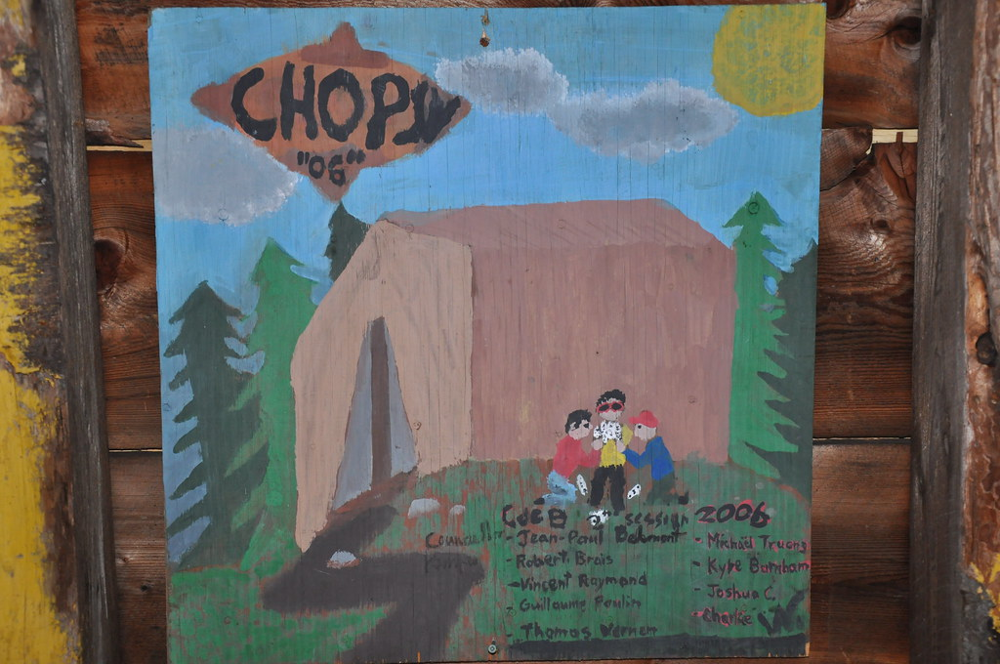
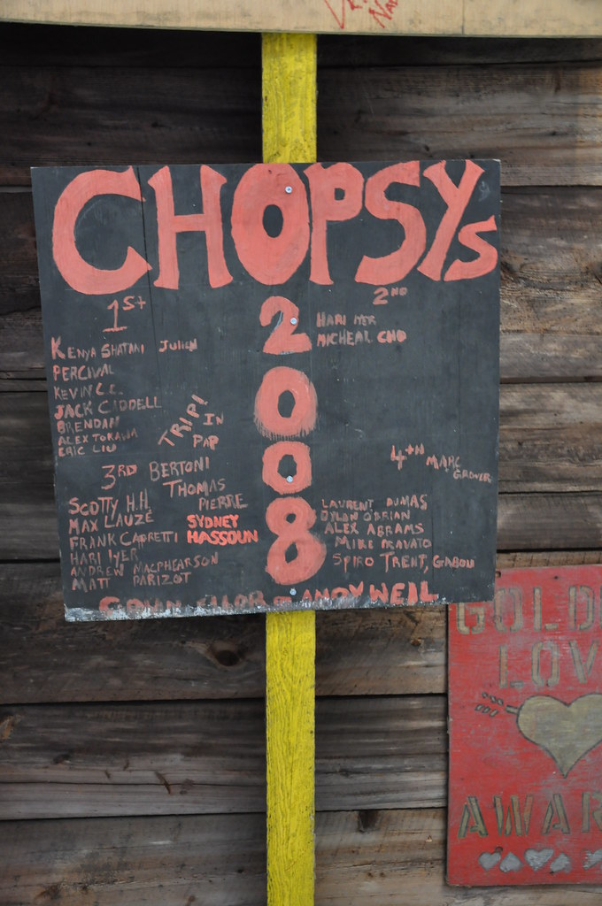

# Kanawana Myths and Legends

*Status: E1-reviewed | Sources: 30*
*Last Updated: 2026-09-05*

## Overview

Over more than 130 years of continuous operation, Camp Kanawana has accumulated a body of myths and legends that form part of its oral tradition. This article documents two categories of narratives: **Kanawana myths** -- popular stories about Kanawana that are partly or completely fabricated -- and **Kanawana legends** -- unverifiable narratives and camp ghost stories passed down through generations of campers and staff.

These stories are distinct from documented camp history. Where a myth relates to a verifiable historical claim, cross-references to the relevant wiki articles are provided.

## Kanawana Myths

Myths are stories about Kanawana that circulate as fact but are partly or entirely fabricated. They may contain a kernel of truth distorted through retelling, or may be wholly invented.

### Myth 1: "Oldest Camp in Canada"

Camp Kanawana is sometimes described as "the oldest camp in Canada." A 1993 YMCA promotional film, *Kamp Kanawana: The Experience that Lasts a Lifetime* (produced by Cathy Reeves), describes the camp as "the oldest camp in Quebec and second oldest in Canada" [src_concordia_atom_12B04]. The Quebec half of that is right. **The national half was carried in this article as fact until 2026-09-05 and has now been withdrawn** — not because a better ranking was found, but because the ranking turned out to rest on a single date that its own camp disputes.

**What is not in doubt:** Camp Kanawana, as Camp Jubilee in 1894, is **Quebec's oldest residential summer camp**, and it is among the oldest in Canada. No source contests either statement.

**What was withdrawn, and why.** The "second-oldest" claim depended on Big Cove YMCA Camp of Merigomish Harbour, Pictou County, Nova Scotia, being founded in 1889 [f_0411, src_wikipedia_big_cove] and on nothing else standing between them. Three things have since come out of the word-for-word read of *Canadian Camping*:

- **Big Cove's own date is unstable.** This wiki took 1889 from an encyclopaedic entry. CCA president Jack Pearse told the Nova Scotia association on its own ground on 25 May 1979 that Canadian children's camping "began in Nova Scotia in **1890**." And in 1987 **Kelley Byrne — Big Cove's own director and the president of the Camping Association of Nova Scotia** — wrote a commemorative history in the national magazine dating the first Maritime Boys' Camp to **1891** [f_4621, f_4622]. Three dates, the latest from the best-placed source.
- **A third claimant.** In the summer of 1987 **YM-YWCA Camp Stephens** on the Lake of the Woods stated twice in the same issue that it "has been providing resident camping experiences for youth **since 1891**," was "originally known in 1891 as the Lake of the Woods Institute," and was planning its centenary for 1991 [f_4665].
- **And this wiki's own contradiction of it.** [[people/t-duncan-patton|T. Duncan Patton]] — a Kanawana founder, writing about the Winnipeg association he served — dates his first visit to those islands to **July 1894**, with annual camps from then [f_4666, f_4667]. Two documented sources from inside one institution, ninety years apart. The reconciliation that would restore Kanawana's ranking — an 1891 men's encampment, youth camping from 1894 — is stated by neither, and it is not this wiki's place to invent the reading that flatters its own subject.

Camp Keewaydin in Ontario, founded in 1893, also predates Kanawana by one year; that sentence has stood here since the article was written but the KB holds no fact supporting it, and it is retained as an unverified carry-over pending a source. **Three of the four candidate dates for Canada's oldest camp now fall in 1889–1891, and Kanawana's 1894 follows all of them** [f_4668]. See conflict `c_031`.

This entry is worth keeping under "Myths" for a reason that has nothing to do with Kanawana's founders: **the withdrawn ranking was this wiki's own**, not a camp legend it inherited. It was stated as settled fact for months on the strength of one uncorroborated date. That is the same failure mode the rest of this article documents in others.

The Ottertooth.com list of Canada's oldest camps lists Kanawana as tied with Keewaydin, though other sources place Keewaydin at 1893. This discrepancy arises because some sources date Kanawana from 1894 (Camp Jubilee at Lake Saint-Joseph) while others use the 1910 Saint-Sauveur site acquisition. The YMCA's own website and the Kanawana Facts timeline both use 1894 [src_kanawana_facts, src_ymca_website].

### Myth 2: The Meaning of "Kanawana"

The meaning of the name "Kanawana" has been a subject of camp lore for over a century. According to a 1951 camp history document cited in the McMorris thesis, **"Kanawana" was said to mean "lots to eat"** in an Indigenous language [f_0248]. According to [[people/ralph-dawson|Ralph Dawson]]'s 1933 history, the meaning of "Kanawana" was not learned until years after the name was adopted [f_0249]. The specific Indigenous language for the name has never been identified in any known source [f_0250].

No authoritative linguistic source has been found to confirm or deny the "lots to eat" translation. McMorris's thesis examines the name in detail and concludes that "Kanawana" does not exist in Kanien'kéha (the Mohawk language), despite the camp's proximity to Kahnawá:ke. The closest attested Kanien'kéha term is "kanà:wa," meaning "swamp."^3 McMorris notes the phonetic similarity between "Kanawana" and "Kahnawá:ke" (the Mohawk community near Montreal), suggesting the name may have been loosely derived from or confused with the place name rather than being a genuine translation of any phrase.^3

The word does not appear in standard Algonquin language dictionaries or Algonquian word lists. The closest linguistically documented term is "kanawa," a Cariban/Arawakan word for "dugout canoe" (the root of the English word "canoe"), but this is from a South American language family unrelated to the Algonquian languages spoken in Quebec.

A possibly related toponym is "Kanawha," the name of a river in West Virginia, which is generally believed to mean "white rocks" in a Shawnee or Delaware language (though some sources suggest "new water" or "water way"). The relationship, if any, between "Kanawana" and "Kanawha" is unknown.

The naming may also reflect the broader practice of YMCA and summer camps adopting pseudo-Indigenous names in the early twentieth century, a practice examined at length in the McMorris thesis, whose stated subjects include religion, colonialism and nation-building at Kanawana [f_0931], and which documents the same "playing Indian" tradition at the neighbouring YWCA Camp Oolahwan from a 1970s photograph [f_1857]. (This sentence previously cited f_0339, a fact about an 1897 brochure in a Concordia scrapbook, which says nothing about the thesis or the practice; corrected 2026-09-05.) At the time the name was chosen (around 1910 when the camp moved to the Saint-Sauveur site), many camps across North America adopted names that sounded Indigenous regardless of linguistic accuracy.

A previously uncatalogued primary source, "Kamp Kanawana History" (presented at a training course, June 6, 1951, digitized on Internet Archive), adds a specific new claim not found anywhere else: "A great deal of thought was given to choosing a name for the camp. Mr. Charlton suggested Kanawana which was like the name of a Furness Steamer. At a later meeting the name Kanawana was adopted, which means in the Indian language lots to eat."^20 This independently confirms the "lots to eat" translation from a primary rather than secondary source, and identifies [[people/rl-charlton|R.L. Charlton]] as the person who personally proposed the name. No corroboration has been found of an actual ship named "Kanawana" in Furness Withy/Furness Bermuda Line vessel records: a 2026-07-11 search of two independent published Furness fleet lists, a general history of the wider Furness Withy fleet, and a full-text search of Lloyd's Register Foundation's digitized register collection all returned zero matches.^22 This does not rule out an unindexed register year or a smaller Furness subsidiary, but the claim remains uncorroborated.

### Myth 3: "Indian" Heritage and the Council Ring

Camp Kanawana's early decades featured extensive Indigenous-themed programming that was common across North American summer camps of the era but had no authentic connection to local Indigenous peoples. By 1922, Kanawana was a **chartered tribe in the Woodcraft League of America** [f_0304], with campers called "Braves" who met "in the Lodges around the Council Fire" [src_brochure_1922]. The Council Ring was built in 1922 [f_0231], and by 1923 the camp featured "Real Indian dancing at Council Ring" [src_gas_bag_1923]. A totem pole was added in 1927 [f_0233], and in 1935 the camp held a "Council of the Tribes of Kanawana" [src_history_1935].

This "playing Indian" tradition was common across Canadian camps of the era. Ernest Thompson Seton created the Indian Council Ring format at [[connections/institutional-lineage/taylor-statten|Taylor Statten]]'s camp in 1922, and it spread rapidly [f_0261, f_0262]. The McMorris thesis devotes an entire chapter to "playing Indian" at Kanawana, examining how "the overlapping currents of religion, colonialism, and national identity practice took shape" at the camp [f_0408]. An "Indian Grave" marking existed on the Kanawana camp map [f_0228], and Indian characters were depicted on camp maps [f_0229].

Today, the camp has moved away from these practices. The 2023 McMorris thesis and related academic work (e.g., Wilkes & Kennedy, "Transitioning Traditions: Rectifying an Ontario Camp's Indian Council Ring") examine how camps across Canada have grappled with this legacy.

### Myth 4: The Founding Narrative

The standard founding narrative -- "Billy Ball took a group of boys to camp on an island in Lake St. Joseph in 1894" -- is the official YMCA version and appears on the current YMCA Quebec website [src_ymca_website]. However, archival evidence suggests the story is more complex. A journal from 1893 documents the "first Montreal YMCA venture to explore the country round about St. Agathe with the view of securing a lake on which to establish a Summer Camp" [src_concordia_fonds], and the Permanent Camp Committee minutes begin in 1895 [src_concordia_fonds]. The relationship between [[people/da-budge|D.A. Budge]] (Secretary General), "[[people/billy-ball|Billy Ball]]," and the [[people/cushing-family|Cushing family]] in the founding remains incompletely documented. See [[history/founding-1894|Founding of Camp Kanawana (1894)]] for the documented history.

## Kanawana Legends

Legends are unverifiable narratives -- ghost stories, supernatural tales, and campfire lore -- that are understood by their tellers to be part of camp tradition rather than historical fact.

### The Haunted House

The 1935 camp history document mentions that the final week of camp began with an "eating-out day, when every camper went over to the haunted house and cooked his own supper" [f_0135, f_1185, src_history_1935]. The same day, the dam that had kept Lakes Kanawana and Wilson "at a desirable height" was opened before the assembled campers. The haunted house was therefore not merely a story setting but an established camp-wide cookout destination within walking distance of camp — by 1935 the name was casual, institutional vocabulary. Direct examination of the 1928 and 1962 camp maps (2026-07-09, via McMorris's thesis figures) confirms it as a real, specifically-drawn building, consistently located at the property's southwest corner next to a waterfall ("Falls"), near Round Lake, for at least 34 years [f_1810] — see [[site/places-and-locations|Places and Locations at Camp Kanawana]] for the map detail.

Internet Archive holds 38 digitized issues of *The Green Triangle*, spanning 1932-1982, and the tradition is documented across several of them (see Revision History). The July 8, 1933 issue describes a full, staged campfire tradition: "a reception was given by the ghosts of the haunted house to all Kanawana campers... a camp fire had been prepared... the Chief called the tribes together and put over a good program which consisted of some legends, a sing-song, and some stunts... a regular thunder of mock-knocking..." with a folkloric rule that "the spirits never appeared except when the wind blew from the east and when the moon and stars were invisible." The same issue mentions passing "the deserted village" en route to the site — an unexplained, unexplored detail. The tradition's continuity is further confirmed by a July 1937 photo caption ("The picnic at the Haunted House"), a July 1939 mention (supper "at the falls near the haunted house"), and a June 1940 mention (a "Haunted House treat" joined by the Juveniles).^21 What specific legends were told there beyond the generic 1933 description ("some legends") remains undocumented; the identity of a real, persistently-located *building* is resolved, but the *content* of its ghost stories still depends on oral history not yet obtained, or physical Concordia archival holdings.

### Ghost Stories and Campfire Traditions

**A whole-corpus null result, 2026-08-14.** The 634 digitized text items of the Concordia YMCA of Montreal fonds — roughly 870 KB of Kanawana-specific material spanning 1921 to 1993, including every surviving season report, newsletter, brochure, map and broadcast transcript — were searched for "Chopsy". **Zero hits.** A search for "Chops" returned one nineteenth-century usage unrelated to camp. Searches for *ghost*, *haunt*, *legend*, *myth* and *spirit* across every Kanawana file return the Haunted House material below and nothing else. This is a far stronger negative than the earlier 38-issue read: it is the whole digitized documentary record of the camp, and Chopsy is not in it.

That does not make the story late or invented, and one finding below cuts the other way. A full read of all 38 digitized *Green Triangle* issues confirms the Haunted House tradition above (1933-1940) is genuine ghost-story-adjacent content (see Revision History), though none of the 38 issues mention "Chopsy" or "Cropsy" by name, and none contain a specific ghost-story *narrative* beyond the generic Haunted House framing. No Kanawana-specific ghost story with a full narrative (comparable to Chopsy, below) has been found in the *Gas Bag* (1923), camp brochures, or online alumni accounts. This is consistent with the nature of camp ghost stories, which are overwhelmingly transmitted as oral tradition. A 2019 Slate article noted that scary stories at summer camps have been declining, with about a third of camps prohibiting them, though the tradition remains strong at camps that maintain it.

### How camp legends were made, said by the people who made them

This article has had to reason about the origin of Kanawana's own lore without a single contemporary statement of how such lore was produced. One now exists, from the neighbouring end of the same movement, and it is unusually blunt.

In the winter of 1987 the national magazine interviewed **Barbara and John Gilchrist**, who had taken over **Glen Bernard Camp** from **Mary S. Edgar** in 1956. Asked where the camp's Indigenous-themed programme came from, John Gilchrist traced it to the Mohawk poet Pauline Johnson, who had performed at Sundridge and stayed in the Edgar family home when Mary was a child, and then said this:^26

> "Pauline Johnson's type of writing inspired Mary to write legends, **Indian legends of her own, built around Lake Bernard and the tribes of Glen Bernard which, in fact, were make-believe but she made them sound the real thing in her story.**"

And of the storytelling bench in her cabin, the Wigwam, where campers came to ask for stories: "**How many of them were her own fertile imagination or she had read about was hard to say.**"

That is a camp's own successors describing the manufacture of its folklore, in print, naming both the method — legends written for the camp, sited on its own lake, attached to its own invented tribes — and the effect intended: that they "sound the real thing." The speaker is not a critic; he is the nephew who inherited the camp and is paying tribute.

**Nothing here concerns Kanawana, and nothing about Chopsy follows from it.** What it changes is the default. An undated camp legend of this period, with no documentary trace before living memory, need not be either a genuine local survival or a wandering variant of a regional archetype: **deliberate authorship dressed as tradition is a documented practice of the era, by a named and celebrated practitioner, at a camp of the same generation.** That is a third possibility to hold open alongside the two this article already weighs — and it is the one that would leave exactly the evidentiary trace Chopsy leaves, which is none.

**And it was taught, in print, a decade earlier than any of the above.** The Gilchrist testimony is
from 1987 and the hoax articles from 1971-72. But the *method* was being published in the national
magazine in the 1950s, by the most senior figures in the movement, as ordinary professional craft.

**Margaret Govan** — Director of Camp Onawaw and **President of the Ontario Camping Association** —
published "Stop Me If You've Heard This One" in **February 1958**, and it is a printed method for
manufacturing camp tradition. Her premise: "The average camper who adopts a camp as his second home
is very curious about what happened before 'I came along'," and "**Stories about the 'old days' do far
more than fill in an empty space of time; they strengthen the ties which bind the camper to camp;
they give a sense of continuity; and build a camp tradition.**" Her instruction to directors is
explicit about collection and control: "So a camp director begins to collect such stories, either to
tell himself or to pass on to the camp story teller. He uses his own memories, and those of other
staff members. Canoe trippers bring in tales of adventure, and 'old campers' make their contribution.
(In some cases these last stories may prove enlightening, if not startling to the director, and **may
require some censoring!**)"^28

She then walks through the local material a camp should mine — corduroy roads, a log cabin, a fire
tower, a mine, caves, a lumber camp, a Hudson's Bay post — and supplies her own worked examples: a
local Paul Bunyan who walked half a mile underwater rather than lose two hundred pounds of boom
chains, a canoe paddled by a doe with a fawn in the bow, a pony in the kitchen, two raccoons in the
detergent barrel. **The genre is stated without embarrassment: the tall tale, told as true, repeated
until it is the camp's.**^29

Two years earlier, **Kay McClelland** of Camp Oconto had given the same advice for songs: "When
introducing a new song be sure to **set a background whether true or fictitious**. Perhaps the
circumstances leading to your acquiring the song or a little about the country the song concerns,
anything to set the mood."^30 Printed as ordinary craft, in the association's own magazine, with no
suggestion that inventing a provenance required a defence.

**This matters for the dating.** The Chopsy telling places its events in **1945**. Every other item in
this section — the Gilchrist interview, the snark hunt, the Ponacka hoax how-to, the pre-camp
"traditions" curriculum — is from 1968 or later, and could be objected to as evidence about a
practice a generation after the fact. Govan and McClelland close that gap: **the deliberate
manufacture and curation of camp lore was being taught in print by an OCA president and a section
head in 1956 and 1958**, within a decade of the date Chopsy claims for itself. It remains true that
none of this is evidence about Chopsy, and that no source in the 1949-1988 run names it. What it
removes is the last reason to treat deliberate authorship as an anachronistic explanation.

### Why camp memory is reconstructed, from a psychologist who was also a camper

The problem this article keeps running into is not that alumni recollection is unreliable in the ordinary way; it is that this project has no account of *how* it goes wrong, and so no principled way to weight it. One exists, from an unusually well-placed source.

**Mary L. Northway** — research psychologist at Toronto's Institute of Child Study, a Glen Bernard camper from 1922, and the person who assembled the OCA and CCA archives at Trent — gave the Ontario Camping Association's banquet speech in 1968, and the national magazine reprinted it in the autumn of 1987, nine months after her death. Her subject was remembering:^27

> "**From the many events going on in the external or internal environment at any one moment, we select from among the millions of possibilities those which our perceptual equipment is capable of receiving and from these, those which have most meaning for or bring most satisfaction to us. In doing so, we stamp them with our own qualities. They become our experience.** Indeed, '**We see things not as they are, but as we are**'. As time passes, our past experience becomes transformed and modified, for **remembering is in essence a creative process**, by which we continually recreate past experiences into novel forms that have importance for us in the present here and now… **It is not what really happened that matters; it is what we have reconstructed out of it and what we make out of it** — what is useful, significant, important or what-have-you to us now."

And on the camp memory in particular: "our return is not to the blue lake and rocky shore as they were; they are to **what we have created from them** as the years moved forward… **Our present campfire is always aglow with all the campfires we have known in the past.**"

**Note what this is and is not.** It is not a warning that people misremember, which needs no authority. It is a claim about mechanism: that recollection is *selected* for present usefulness and then *reconstructed*, by a process indistinguishable from the inside from simple recall. Northway was addressing camp directors about their own camps, and she plainly did not mean it as a debunking — the speech is a celebration.

For this article it cuts in a specific direction. A camp legend transmitted orally for decades will have been reshaped at every telling toward whatever the tellers needed it to be, and **the confidence of a recollection is no evidence at all of its fidelity**. That is not a reason to discard alumni testimony about Chopsy, which remains the only evidence there is. It is a reason to treat a vivid, consistent, deeply-felt memory of the story as evidence that the story mattered — which is worth knowing — rather than as evidence about when it started or what it originally said. It is also the clearest statement of why this project's standing rule, that oral history yields to documents where the two conflict, is not merely an archivist's preference.

### The Cropsey Legend: The "Maniac in the Woods" Archetype

The **Cropsey Maniac** legend is the most well-documented camp ghost story archetype in northeastern North America. First academically studied by folklorists Lee Haring and Mark Breslerman, who surveyed 11 New York City informants in the fall of 1966 (published in *New York Folklore* 3, 1977, pp. 15-27), the legend is consistently set at summer camp and involves a respected community member who goes insane after the accidental death of his family -- typically caused by a fire started by campers -- and returns to stalk and murder campers with an axe [f_0535].

The core story has multiple documented name variants, each localized to where the informant first heard it: **George Cropsey** (a judge or businessman), **Jack Cropsey** (a caretaker or handyman), **Judge Cropsey** (a scout leader who lost his hand to a misused axe), **Old Man Cropsey** (a farmer or escaped prisoner), and **Cropsy** (as adapted in the 1981 film *The Burning*) [f_0536]. The 1982 film *Madman* renamed its killer **Madman Marz** after discovering that *The Burning* was already using the Cropsey concept -- two films working the same material a year apart, one of which had to give the character a different name [f_0536].

Some versions connect to the **Hook Man** legend: Judge Cropsey gets his severed hand replaced by a hook, merging the two stories into what folklorists at USC describe as "an almost oicotype super-legend." Urban versions (especially on Staten Island) portray Cropsey as an escaped mental patient from the abandoned Willowbrook State School, while rural camp versions cast him as a vengeful caretaker or groundskeeper with an axe [f_0526, f_0527].

The legend gained real-world notoriety when Andre Rand, a former janitor at Willowbrook, was convicted of kidnapping children on Staten Island in the 1970s-80s. The 2009 documentary *Cropsey* examines how the campfire legend and real events became intertwined [f_0526, f_0527].

A parallel example is the **"Stumpy"** ghost story, documented by John Kotula, featuring a one-armed psycho killer whose arm was severed in an axe accident. He threatens campers with "I'm going to chop you!" The story has been told at camps "for at least half a century" and exists in many versions [f_0538].

Folklorists have established that the "maniac in the woods" archetype serves key social functions at camp: it reinforces rules about not wandering into the woods alone at night, builds community through shared fear, and allows counselors to establish authority. Bill Ellis studied this in "The Camp Mock-Ordeal Theater as Life" (*Journal of American Folklore*, 1981), and Leslie Paris examined campfire storytelling in her history of American summer camp culture [f_0539].

### The Legend of Anson Minor: Canada's Own Camp Ghost Story

While Cropsey dominates in the northeastern United States, the most widespread camp ghost story in **Canada** is the **Legend of Anson Minor**. Documented by folklorist Edith Fowke (York University) in "The Tale of Anson Minor: An Ontario Camp Legend" (*Ethnologies* 3:1, 1981, pp. 3-15), the legend follows a strikingly similar pattern to Cropsey but with distinctly Canadian elements [f_0540].

The core narrative: Anson Minor was a farmer who owned the land where a summer camp now stands. He suffered a gruesome accident — in the most common version, his leg was caught in farm machinery (a thresher or plough) and had to be amputated, leaving him with a wooden leg and a terrible limp. Unable to work, he lost his farm to financial ruin. He carried his lantern into the barn, climbed a ladder, and hanged himself. When the sheriff found his body dangling in the greenish glow of the lantern and went to report the discovery, the body and lantern vanished. His ghost now haunts the camp grounds, limping through the fields and along the tree line, carrying a green-glowing lantern [f_0541].

The legend is told at camps across Ontario and Nova Scotia. **Camp White Pine** in Ontario is cited as one of the camps where a well-developed version exists, and **Camp Kadimah** has a documented variant (with Anson Minor's gangrene, preference for the colour green, and the number 13). Fowke's 1981 study presented multiple previously unpublished versions, questioned the legend's historicity, and described the broader pattern of camp ghost stories in North America [f_0540].

The *Fireside Canada* podcast (Episode 35, September 26, 2024, hosted by David Williams) devoted a 38-minute episode to the legend, tracing its origins "back through the decades to the original camp that spawned the story, and the tragic series of events that inspired it" [f_0542]. The legend also appeared in the 2013 film *Bunks*, where Anson Minor is a zombie summoned from a book of campfire stories.

The Anson Minor legend is especially relevant to Kanawana because it demonstrates how Canadian camps develop their own localized ghost stories following the same structural pattern as American camp legends. The Chopsy legend at Kanawana (see below) shares this structural pattern — a disfigured figure, an accident origin, escalating hauntings — while being a significantly more elaborate narrative than most documented variants.

### "Chopsy" at Kanawana

**"Chopsy"** is a ghost story told at Camp Kanawana — an hour-long, three-act narrative with named characters, a specific origin year, and details tied to Kanawana's physical site. No published or online documentation of the story has been found; it exists entirely in oral tradition. Over 30 web searches returned zero results for the name [f_0534].

**The Story.** According to oral tradition recorded from a 2000s-era alumnus:^11 In the summer of 1945, **Charles de Grandprix** — a WWI veteran who worked on the kitchen staff — was nicknamed "Chopsy" for his exceptional skill with knives. He had a habit of taking long walks in the woods. One day he came upon two Senior boys who had sneaked off to practice throwing stolen axes from the Hike and Trip Department's equipment room, known as "**the Cave**." Chopsy hid behind the tree they were throwing at, intending to scare them. He waited for two axes to hit the tree, then jumped out — not realizing there was a third. The third axe severed his arm. He grabbed the severed limb, shoved it in his satchel, and fled into the woods. The camp searched but could not find him, and he was declared dead.

Over the following winter, strange occurrences were reported at the camp. The next spring, a group of boys on a hike found a makeshift cabin in the woods and, nearby, a car stolen from a local town, inexplicably wedged between trees so it could not be driven out. Over the summer, dead animals were found in the woods, apparently mauled. Near the end of summer, a solitary senior boy — withdrawn and prone to wandering despite warnings — disappeared. A search found nothing. A counsellor thought to check the car: the trunk, which had been open the last time anyone looked, was now locked. They broke it open and found the missing boy's body, killed with an axe. The body was still warm. Chopsy was never seen again, but for years afterward people claimed to hear the sound of someone chopping wood deep in the woods late at night [f_1186, f_1187].

The full telling takes approximately an hour and contains considerably more detail than this summary [f_1188].

**One detail inside the story checks out.** The narrative turns on axes stolen from "the Hike and Trip Department's equipment room, known as **the Cave**." The Cave is real, and it is exactly that. The *Kamp Kanawana Director's Report 1987* records: "The entire **cave** was stripped of all **hike and trip equipment**, scrubbed, painted and repaired… re-built new steps leading up to the cave."^23 An oral legend that no document mentions is nonetheless embedded in the camp's real working geography, using the right name for the right building with the right function. That is what a genuine camp legend looks like from the outside — it is not evidence the events happened, and not evidence of the story's age, but it is evidence the story was told by people who knew the place.

**A question the corpus raises.** The Haunted House has thirteen years of contemporaneous documentation (1928–1940) including a ghost legend with its own rule about when the spirits appear. Chopsy has none. The two have never been connected in any source, and the operator's telling places Chopsy's origin in 1945 — after the Haunted House references stop. Whether Chopsy is a later name for the Haunted House ghost, a successor tradition, or wholly unrelated is worth asking directly rather than assuming; it is now Open Question 8.

**Performance and Setting.** The story was traditionally told at the actual physical locations it describes: the wreckage of an old car in the woods (known as "**Chopsy's Car**") near an abandoned cabin (known as "**Chopsy's Cabin**," now destroyed). The car and cabin thus serve a dual function — they are both the narrative's climactic setting and the venue for its performance, collapsing the boundary between story and physical reality for the listener [f_1192]. This site-specific storytelling technique is a powerful variant of what folklorist Bill Ellis called "camp mock-ordeal theater": the audience is brought to the evidence before hearing the story, or arrives at it during the telling.

The telling opens with a formulaic oral tradition chain: *"I'm going to tell you a story my counsellor told me, and that he said his counsellor told him, his counsellor's counsellor told his counsellor, and that they say has been passed down just like this since the summer it happened, right here, at Camp Kanawana... It began in the summer of 1945..."* [f_1193]. This frame explicitly presents the story as an inherited counsellor-to-counsellor tradition, anchors it to the physical site, and positions the listener within the chain of transmission before the narrative begins. At least one 2000s-era teller added an embellishment referencing the real Concordia University Archives: *"and I've looked it up in the Kanawana archives at Concordia, and it's all documented there... you can go check and see for yourself..."* — lending verisimilitude by pointing to a verifiable institution [f_1194].

**Analysis.** The story shares structural elements with the American "Cropsey" archetype — a figure disfigured in an accident who haunts the woods near a camp — and the naming pattern parallels Cropsey/Cropsy, Stumpy, and Madman Marz [f_0537, f_1191]. However, the Chopsy legend is a significantly more developed narrative than most documented Cropsey variants: it provides a named character with a backstory (WWI veteran, kitchen staff), a specific origin year (1945), a sympathetic accident rather than madness, and a plot structure with escalating incidents culminating in a locked-car-trunk reveal and an ambiguous coda. These elaborations suggest either extended local development over decades or an unusually skilled original storyteller — or both. Whether the story derives from the Cropsey tradition or arose independently at Kanawana remains unknown.

**The camp hoax as a documented practice, and what it says about how a story like Chopsy survives.** The Chopsy legend has been treated here mainly as a question of origins. The Canadian camping literature of the early 1970s answers a different and more tractable question — how such a story is built, taught and kept alive — and it answers it from the inside, in the trade's own national magazine.^24

Three items in *Canadian Camping* across two issues describe the same practice from three angles. The Rev. David Hartry, then president of the Canadian Camping Association, wrote up his own camp's "snark hunt" in Fall 1971: a creature invented at the Anglican Youth Camp outside Halifax in 1968, hunted only "at 3 in the morning on a foggy night," with a purpose-built prop floated off the wharf by campers who had been let in on the secret the previous year. Bob Attfield of Camp Ponacka followed in Spring 1972 with a how-to for the camp hoax generally — a piece whose own headline, "Camp Hoax Costs Director $25,000 in Legal Damages," is a hoax on the reader, admitted in the first paragraph. And in the same Spring 1972 issue Walter Greenway, also of Ponacka, listed the objectives of a camp's pre-camp staff training week. Objective three is "To pass on traditions and established practices": "one of the camp's most precious possessions, its traditions, should be explained and discussed with the staff. Whether it is celebrating birthdays with the Saturday morning throw-in, **a hoax**, or an Indian Programme, the staff must be ready to participate actively to make them a success."

That last quotation is the useful one. A hoax was not an outbreak that a camp tolerated; at least at some camps it was curriculum, handed over deliberately each spring to a new cohort of counsellors so that it would outlast them. Attfield adds the corresponding technique for the campers: begin with "a whispering campaign," and where the oldest campers are too sharp to fool, "for goodness sake let them in on the action, or they will destroy the whole show" — which converts the seniors from debunkers into co-custodians. Hartry supplies the evidence that it works, reporting that within three years campers were asking each summer "When will the snark hunt be?" and inventing vocabulary of their own for the invented ritual. Hartry independently supplies one more parallel: his staff found in the camp library "a book actually called 'Snark Hunting'… we showed this to the children and this made our fictitious story even more convincing!" — the same move as the Kanawana teller who cited the Concordia archives.

**And the profession was not agreed about it.** Eighteen months after Hartry's snark hunt, the same magazine printed the case against, from the most authoritative source available. **Mary L. Northway** — co-author of *The Camp Counsellor's Book*, the standard Canadian text, which the Canadian Camping Association's own publications service was selling in the same issues — wrote in Summer 1973 that a counsellor who ridicules a child's fears only teaches the child to repress them, and then stated the rule flatly: "**Supernatural fears from spooky stories and myths about malicious ghosts have no place in the young camper's life, nor have unnecessary fears of night raids or hazing. There are enough things to be afraid of in the civilized, atomic world, that there is no need to produce artificial terrors.**"^25

So within a year and a half the national magazine carried a how-to for the camp hoax, a director listing "a hoax" among the traditions a camp teaches its staff, and the country's leading authority on camp counselling saying ghost stories had no place at camp at all. Hartry and Attfield had both volunteered the same caution about frightening children; Northway made it a prohibition. A camp telling a Chopsy in this period was doing something its own profession was actively arguing about — which is a more useful thing to know than either approval or disapproval on its own, and it may bear on why the story is remembered as a senior-camper tradition rather than an all-camp one.

None of this is evidence about Chopsy specifically. No item in the 1949–1988 run of *Canadian Camping* mentions Kanawana in this connection, or the name Chopsy. What it establishes is that the transmission chain the Chopsy telling asserts about itself — counsellor to counsellor, deliberately, year on year — is exactly the mechanism the profession was describing in print at the time, and that both the site-specific staging and the fake documentary corroboration were standard craft rather than local invention. Both of Hartry's and Attfield's dated hoaxes were founded in 1968, within the period when Chopsy is likely to have been in circulation, though the Kanawana story places its own events in 1945.

**Creative Elaboration: The Backstory of Charles de Grandprix.** At least one 2000s-era teller ([[people/matt-aronson|Matt Aronson]]) wrote an extended creative backstory for Chopsy that was incorporated into the telling. In this elaboration, Charles de Grandprix's father Louis came from Kahnawake and his grandfather had been a *hivernant* voyageur for the Hudson's Bay Company — rooting the character in the same Laurentian landscape as the camp. Charles grew up destitute in Montreal's Old Port after his mother died in childbirth and his father drank himself to death. He enlisted in the Canadian Expeditionary Forces in August 1914, lying about his age. At the Second Battle of Ypres, his Ross Mark II rifle jammed and he killed enemy soldiers with a captured hatchet; he subsequently became feared for hand-to-hand combat during No Man's Land patrols, wielding first a bayonet, then a kitchen knife. The Germans called him *Der Hirsch Schlachter* (the Stag Slaughterer), but it was his own comrades who gave him the name "Chopsy." He was eventually captured and spent the rest of the war as a POW [f_1209].

This backstory demonstrates the legend's vitality as a living tradition: individual tellers actively develop and historicize it, weaving in real Canadian military history and local geography. The Kahnawake connection also echoes the documented phonetic link between "Kanawana" and "Kahnawá:ke" identified by McMorris [f_1210].

### Quebec Campfire Folklore Context

Quebec has a rich folklore tradition that would have influenced campfire storytelling at Kanawana. The most relevant legends include:

- **La Chasse-Galerie** (The Flying Canoe): Lumberjacks make a pact with the devil to fly home in a canoe on New Year's Eve; the canoe soars over the Laurentians. Given Kanawana's canoe culture and Laurentian setting, this legend has natural resonance.
- **Le Loup-Garou**: A person who misses Mass for seven consecutive Sundays is cursed to transform into a beast at night [f_0569]. Unlike the European werewolf, which transforms through a bite, the Quebec version results from religious transgression. The *Quebec Gazette* reported a werewolf attack on July 21, 1766, at St. Rock near Cap Mouraska — one of the earliest documented "sightings" in North American journalism [f_0569].
- **Le Beau Danseur**: The devil appears at a village dance disguised as a handsome stranger, with over 200 versions across Quebec.
- **La Dame Blanche** (White Lady of Montmorency Falls): The ghost of a bride whose fiancé was killed at the Battle of Beauport (1759), seen wandering the falls in her wedding dress [f_0570].
- **La Corriveau** (Marie-Josèphe Corriveau, 1761): One of Quebec's most enduring ghost stories. Corriveau was convicted of murder and her body was publicly displayed in an iron gibbet, inspiring centuries of legend [f_0570].

These Quebec folk traditions are strong candidates for Kanawana campfire storytelling, though no direct evidence of any being told at Kanawana has been found. Ghost storytelling was, however, an active tradition at Laurentian summer camps of the era: around 1948–49, an 18-year-old William Shatner worked as a volunteer counsellor at Camp B'nai Brith in Sainte-Agathe-des-Monts (approximately 30 km from Kanawana), where he earned campers' respect specifically by acting out ghost stories bunk to bunk each night [f_0568].

## Images

*A painted “Chopsy '06” cabin sign, 2006. Copyright All rights reserved by Kanawana.*

*A “Chopsys” cabin plaque, 2008. Copyright All rights reserved by Kanawana.*

## Open Questions

1. ~~[Critical] What is the "Chopsy" legend as told at Camp Kanawana?~~ [Largely resolved] Full narrative recorded from oral history (f_1186–f_1191): Charles de Grandprix, WWI veteran kitchen staffer, 1945 origin, three-act structure. Remaining: when and where was it told (Council Ring, cabin, canoe trip?), was there a jump-scare or performance element, and from whom did the informant first hear it?
2. ~~[Important] What was "the haunted house" referenced in the 1935 camp history?~~ [Largely resolved 2026-07-09] It was the destination of the final-week "eating-out day" cookout (f_1185) — the 1928 and 1962 camp maps both draw and label it at the same spot (property's southwest corner, near "Falls" and Round Lake), confirming it as a real, persistently-located building. What stories were told about it remains unknown; routed to the oral history instrument for that part.
3. [Important] What ghost stories or supernatural narratives are told at Camp Kanawana? Are any tied to specific locations (Lake Wilson, the Council Ring, the woods)? (June 2026: no online trace; routed to oral history instrument. 2026-07-10: a full read of all 38 digitized Green Triangle issues found only the generic Haunted House framing, not a specific narrative — still routed to oral history.)
4. [Important, re-confirmed dead end 2026-07-10] What popular claims about Kanawana's history circulate among alumni that may be exaggerated or inaccurate? A 14-query sweep across Facebook, Instagram, Reddit, Quora, CampRatingz, and Park Slope Parents found nothing beyond the already-documented "oldest camp" myth above. Reddit has zero indexed discussion of the camp under any query tried.
5. ~~[Nice-to-have] Does the McMorris thesis full text contain information about the meaning of "Kanawana" or the naming process?~~ [Resolved] Yes — McMorris examines the name in detail. The word does not exist in Kanien'kéha (Mohawk); the closest term is "kanà:wa" (swamp). McMorris notes the phonetic similarity to Kahnawá:ke.^3
6. ~~[Nice-to-have] Does the Ralph Dawson 1933 history or the R.L. Charlton 1943 "Early Days" account contain the specific explanation of the name?~~ [Advanced 2026-07-10] Both remain confirmed undigitized (Concordia's own 12A finding-aid page lists them as description-only, Box HA2307; zero hits in an Internet Archive API search). However, a related, previously uncatalogued 1951 primary source was found instead — see Myth 2 above (R.L. Charlton personally proposed the name, per analogy to a Furness steamship).
7. ~~[Nice-to-have] Do any camp myths appear in the *Green Triangle* newsletters or other camp publications?~~ [Resolved 2026-07-10] Yes — see the corrected Haunted House and Ghost Stories sections above. 38 issues (1932-1982) are actually digitized, not just one; five contain Haunted House content spanning 1933-1940.
9. [**New 2026-08-14, Important — for the oral history instrument**] Is "Chopsy" connected to the Haunted House? The Haunted House is documented at camp from 1928 to 1940, with a real building on the maps, an annual cookout pilgrimage, and a ghost legend carrying its own rule (the spirits appear only when the wind is from the east and the moon and stars are invisible). Chopsy appears in **no** document at all, and its telling places its origin in 1945 — just after the Haunted House references stop. Successor tradition, renaming, or unrelated? This is a question for the operator, not for further searching: the documentary record has been exhausted on it.
10. [**New 2026-08-14, Nice-to-have**] What is "the deserted village" the 1933 *Green Triangle* describes campers passing on the way to the Haunted House? Still unexplained, and it is the kind of detail that usually has a real local-history answer.
8. [Nice-to-have, re-confirmed dead end 2026-07-10] Are there myths or legends shared with other YMCA camps (Pine Crest, John Island) or with the broader Canadian camping tradition? A 9-query sweep found no published, camp-specific ghost story matching Kanawana's for any comparable camp checked (Pine Crest, John Island, Weredale — independently reconfirmed as not a YMCA-of-Montreal camp, Ouareau). An American Camp Association message-board thread on camp ghost stories confirmed the same generic archetypes already documented here, with no Canadian or YMCA-specific references.

## Related Articles

- [[traditions/traditions-and-culture|Traditions and Culture at Kanawana]]
- [[site/the-kanawana-site|The Kanawana Site]]
- [[site/lake-wilson|Lake Wilson]]
- [[site/council-ring|The Council Ring]]
- [[history/founding-1894|Founding of Camp Kanawana (1894)]]
- [[connections/institutional-lineage/canadian-camping-movement|The Canadian Camping Movement]]
- [[people/matt-aronson|Matt Aronson]]
- [[people/rl-charlton|R.L. Charlton]]

## Sources

1. YMCA Quebec, "The Kanawana Story" (current website) [src_ymca_website].
2. Concordia University Archives, Kamp Kanawana sub-series P0145/12B, Communications sub-sub-series P0145/12B04 [src_concordia_atom_12B04].
3. Grace McMorris, "An Experience That Lasts a Lifetime: Building Modernity, Man, and Nation at the YMCA of Montreal's Kamp Kanawana, 1894-1967," MA thesis, Concordia University, 2023 [src_mcmorris_thesis].
4. "Kamp Kanawana: The Experience that Lasts a Lifetime," film produced by Cathy Reeves, 1993/1996.
5. "History of Kamp Kanawana, 1935," YMCA of Montreal [src_history_1935].
6. *The Gas Bag*, Kamp Kanawana official paper, 1923 [src_gas_bag_1923].
7. Camp brochure, 1922 [src_brochure_1922].
8. Wikipedia, "Big Cove YMCA Camp" [src_wikipedia_big_cove].
9. YMCA Kamp Kanawana Facts timeline, 1894-1998 [src_kanawana_facts].
10. Concordia University Archives, YMCA of Montreal Fonds P0145, Series 12A [src_concordia_fonds].
11. Oral history, Matt Aronson [src_oral_aronson].
12. Joshua Zeman and Barbara Brancaccio, *Cropsey* (documentary film), 2009.
13. Lee Haring and Mark Breslerman, "The Cropsey Maniac," *New York Folklore* 3, 1977, pp. 15-27 [src_haring_breslerman_1977].
14. USC Digital Folklore Archives, "Cropsey" and "Judge Cropsey Legend" entries [src_usc_folklore_cropsey].
15. "The Cropsey Maniac: The Forgotten Origins," Puzzle Box Horror [src_puzzlebox_cropsey_origins].
16. John Kotula, "The Story of Stumpy: Every Camp Needs a Good Ghost Story," Medium.
17. Edith Fowke, "The Tale of Anson Minor: An Ontario Camp Legend," *Ethnologies* 3:1, 1981, pp. 3-15 [src_fowke_anson_minor_1981].
18. *Fireside Canada* podcast, Episode 35: "The Legend of Anson Minor," hosted by David Williams, September 26, 2024 [src_fireside_canada_anson_minor].
19. *Fireside Canada* podcast, Episode 5: "La Chasse-Galerie" (Parts 1 & 2), hosted by David Williams, 2021 [src_fireside_canada_chasse_galerie].
20. "Kamp Kanawana History," presented at Training Course, June 6, 1951, Internet Archive [src_1951_kamp_kanawana_history]. Verified genuine via archive.org metadata API and direct OCR text fetch, 2026-07-10.
21. *The Green Triangle*, full digitized run 1932-1982 (38 issues), Internet Archive [src_ia_green_triangle_collection]; July 8, 1933 issue specifically [src_green_triangle_1933_07_08]. Read in full 2026-07-10.
22. Furness Line fleet list (GGA Archives); Furness Bermuda Line fleet roster; Wikipedia, "Furness Withy"; Lloyd's Register Foundation digitized collection (Internet Archive). Five-surface search, zero matches, 2026-07-11.
23. *Kamp Kanawana Director's Report 1987* (Internet Archive), documenting "the cave" as the hike-and-trip equipment store [src_ia_kanawana_report_1987]; and the whole-corpus null search across the digitized YMCA of Montreal fonds [src_ia_ymca_montreal_fonds_collection].
24. *Canadian Camping* magazine: David Hartry, "Snark Hunting," Vol. 24 No. 1 (Fall 1971); Bob Attfield (Camp Ponacka), "Camp Hoax Costs Director $25,000 in Legal Damages," Vol. 24 No. 3 (Spring 1972), pp. 18-19; Walter Greenway (Camp Ponacka), "Pre-Camp Training, The Critical Period," Vol. 24 No. 3 (Spring 1972). Read in full during the word-for-word pass over the cached 1949-1988 run [src_ia_canadian_camping_collection].
25. Mary L. Northway (Brora Centre, Toronto), "Camp Counsellors Should Be Camp Counsellors," *Canadian Camping* Vol. 25 No. 4 (Summer 1973), pp. 18-19. Found by the full word-for-word read of the run (`kb/reread/cc_findings.md`, issue 99).
26. "Personality Profile — Mary S. Edgar," interview with Barbara and John Gilchrist, *Canadian Camping Magazine* Vol. 38 No. 3 (Winter 1987), pp. 9-15 [src_ia_canadian_camping_collection]. Found by the word-for-word re-read of the digitized run (issue 160). Movement context, not a Kanawana document.
27. Mary Northway, "Blue Lake and Rocky Shore," her Ontario Camping Association banquet speech of 1968, reprinted in *Canadian Camping Magazine* Vol. 39 No. 2 (Fall 1987), p. 17, nine months after her death [src_ia_canadian_camping_collection]. Found by the word-for-word re-read of the digitized run (issue 163).
28. Margaret Govan, "Stop Me If You've Heard This One," *Canadian Camping* Vol. 10 No. 3 (February 1958) [src_ia_canadian_camping_collection]. Found by the word-for-word re-read of the digitized run (`kb/reread/cc_findings.md`, issue 37). See [f_2801].
29. Govan, "Stop Me If You've Heard This One," February 1958 — the local-material list and worked examples [src_ia_canadian_camping_collection]. See [f_2802].
30. Kay McClelland, "Campfire Time," *Canadian Camping* Vol. 8 No. 4 (June 1956) [src_ia_canadian_camping_collection]. Found by the re-read (issue 31). See [f_2724].

## Research Notes

### Revision History

- **2026-07-10** — Discovered Internet Archive holds 38 digitized *Green Triangle* issues (1932-1982), not just the single 1938 issue this article previously assumed. A full read found Haunted House ghost-story content dating to July 1933 — two years earlier than previously known — and confirmed that genuine (if generic) ghost-story-adjacent content does exist in this source, correcting an earlier claim that none had been found. No specific narrative beyond the generic "Haunted House" framing was found in any of the 38 issues, and none mention "Chopsy" or "Cropsy" by name.
- **2026-07-10** — A previously uncatalogued 1951 primary source ("Kamp Kanawana History") named R.L. Charlton as the person who proposed the name "Kanawana," by analogy to a Furness steamship, and independently confirmed the "lots to eat" translation from a primary rather than secondary source (see Myth 2).

- **2026-09-05** — Citation aim corrected in the Cropsey section (p_401). This article had stated "Both films derive from the same campfire tradition [f_0536]," which f_0536 does not say: the fact records the name variants and that *Madman* renamed its killer once *The Burning* was found to be using the Cropsey concept. The sentence now says only that, which is the evidence the fact actually carries. Dropped with it was an uncited backstory for Madman Marz (a farmer who massacred his family and was lynched) that appears in no KB fact and had no source here.
- **2026-09-04** — The word-for-word read of the cached *Canadian Camping* run reached Spring 1972 and produced three contemporaneous trade-press accounts of the camp hoax as a deliberate, taught practice (Hartry 1971; Attfield and Greenway 1972). Added as "The camp hoax as a documented practice." This does not touch the Chopsy narrative itself, which remains undocumented outside oral tradition; it documents the mechanism the telling claims for itself. Note that Attfield's article title is itself a hoax on the reader — there was no lawsuit and no damages award, and the title should not be cited as a legal fact.
