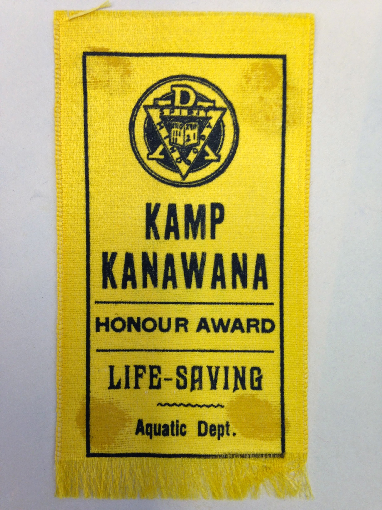
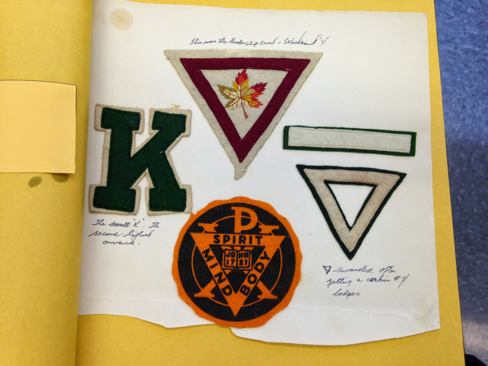
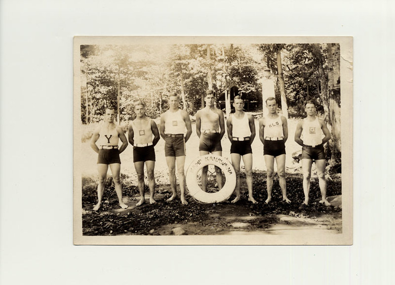

# Programs and Activities at Kanawana

*Status: E1-reviewed | Sources: 0*
*Last Updated: 2026-09-06 (p_386 lifesaving changeover; diabetic children at Kanawana, from outside the camp)*

## Overview

Kanawana's programming has undergone continuous transformation since 1894, moving from rudimentary lakeside camping to a multi-tiered system of age-graded sections, wilderness canoe expeditions, leadership training, and year-round outdoor education. What makes the arc interesting is not just the accumulation of new offerings but the way each era's programming reflected broader cultural preoccupations: muscular Christianity in the early decades, wilderness nationalism through the mid-century, outdoor education professionalism in the 1970s, and inclusive community-building in the contemporary period.

## First Camps at Lake St. Joseph (1894-1909)

The first season in 1894, when Billy Ball took 20 boys to an island in Lake St. Joseph near Sainte-Agathe (the camp was called Camp Jubilee), was closer to a supervised outing than a structured program. The YMCA purchased the island (and two others) for leadership training, but the archival record for this early period is thin. A report from an 1893 scouting trip to St. Agathe and a journal from the 1895 camp are among the earliest surviving documents in the Concordia archives, along with Permanent Camp Committee minutes from 1895-1896. Records from this earliest period are held in Concordia archives sub-series 12L (Lac St-Joseph/Camp Jubilee).

Whatever programming existed in these years was almost certainly informal: swimming, fishing, campfires, and what the 1935 anonymous season chronicle would later describe as the basic elements of camp life. The Permanent Camp Committee correspondence and financial records from 1899-1901 suggest an organization slowly formalizing its operations.

## The Saint-Sauveur Era Begins (1910-1920s)

The move to the Saint-Sauveur site in 1910, acquired from the Page family, gave the camp a property that could support more structured programming. By 1918, Kanawana recorded its largest attendance to that point, with 110 members in one weekend; that season's offerings included first aid, basket-making, camp sanitation, wrestling, tumbling, and nature study. A visit from the secretary of the Woodcraft League of New York the same year suggests the camp was already connected to the broader outdoor education movement.

By 1922, the camp held a chartered tribe in the Woodcraft League of America, and its honour system offered 32 instructional subjects with the Large K as the highest award. The McMorris thesis (re-mined via a full-PDF extraction) quotes Kanawana's own 1925 season report describing the Woodcraft League program as "easily adapted to camp." The national Woodcraft League organization itself grew to roughly 5,000 members at its 1920s-30s peak before declining amid WWII-era militarism and dissolving entirely in 1946 after founder Ernest Thompson Seton's death -- general context, though no source found gives a Kanawana-specific charter-lapse date.^wl The section system divided campers by age into Juniors (12-14) and Seniors (14-17), each with distinct activities. The 1921 and 1922 brochures (both surviving in the Concordia archives and cached in the project source files) are the earliest detailed descriptions of what campers actually did; the 1922 brochure included the camp yell, section structure, and references to the Gas Bag newspaper. By 1923, the badge system had grown to 42 subjects, including the Small k (requiring Life-Saving, Bible Study, Altruism, and Hike groups), the Triangle (8 badges across 4 categories), and the KLS (Kanawana Life Saver, based on the RLSS Award of Merit).

The 1923 Gas Bag, the camp's first known in-house publication, provides a camper's-eye view of daily life in this period. In 1925, canoe trips were introduced at Kanawana for the first time, at an extra charge of $3.50. That same year, camp councils called "Kickers and Knockers," elected for two-week periods, gave campers a formal voice in camp governance.

The Camp Leaders' Training Class, documented in the Concordia archives with evaluations and charting from 1922-1927 and 1930, represents an early formalization of the idea that camp should produce leaders, not just entertain children. This training infrastructure would later evolve into the CIT programme.

## Interwar Programming (1930s-1940s)

By 1930, the sections had evolved to Juveniles (10-12), Juniors (12-14), and Seniors (14-17), lowering the minimum age. By the early 1940s, the structure had expanded further to Bantam, Juvenile/Junior, Junior/Intermediate, and Senior divisions. The 1938 weekly program reveals a structured rhythm: Monday and Thursday were project days, Tuesday and Friday were waterfront days, and Wednesday was set aside for hikes.

The 1935 anonymous season chronicle (not to be confused with Ralph Dawson's 1933 founding history, which remains accessible only at Concordia) describes a camp with established routines: scheduled swim periods, craft activities, evening campfires, and organized games. That season opened with 31 campers on June 23 and endured 11 consecutive days of rain, a new record. The Green Triangle newsletter, published 1932-1940, provides a camper perspective on activities across this period.

In 1937, the St-Jean Ambulance Association sent a qualified instructor to Kanawana beginning July 1 to deliver a formal first aid course, continuing a tradition of first aid instruction documented as early as 1918.^ld37

The Council Ring tradition, analyzed in a separate wiki article, was well established by this era, with its blend of Indigenous-inspired ceremony and YMCA moral instruction forming a central ritual element of camp life.

In 1947, the Lumbermen and Voyageur Games were introduced, inspired by YMCA Camp Pine Crest's similar tradition (Muskoka, Ontario). The history of the L&V tradition at Pine Crest is documented in the book "Lumbermen & Voyageurs: The YMCA Pine Crest Story.". The L&V Games quickly became Kanawana's signature competitive event, dividing the entire camp into two teams for a multi-day competition. As of 2025, the games have run for 78 editions (with one year skipped, likely 2020 due to COVID-19). The L&V Games are covered in detail in a separate wiki article.

## The Voyageur and CIT Programmes (1950s-1960s)

Two programme additions in this period transformed Kanawana from a single-offering camp into a tiered system:

The Voyageurs de la Verendrye programme, introduced in the 1950s according to the Facts sheet, took older campers on extended canoe-camping expeditions. The programme drew on the romanticized voyageur tradition that Grace McMorris identifies as central to Kanawana's mid-century identity. By 1950, Kanawana was running six canoe trips per week to Lake Archambault, the Ottawa River, and the Pembina River. In 1956, a committee began searching for a more remote northern canoe trip site; by 1959, La Vérendrye Park had been chosen as a base camp for campers aged 15 and older, with six trips going out in the first summer. A 1964 brochure in the Concordia archives covers "Kamp Kanawana, Les Voyageurs de la Verendrye, Kanawana Training Camp, Family vacation camping" as four distinct offerings, confirming that by the mid-1960s the camp was marketing multiple programme streams.

The Counsellor-in-Training (CIT) programme, introduced in the 1960s per the Facts sheet, formalized the leadership pipeline that the Camp Leaders' Training Class had begun in the 1920s. The CIT programme gave older teenagers a structured path from camper to staff, cementing the multi-generational attachment that characterizes Kanawana alumni culture.

By 1962, the YMCA was planning "bigger and better" citizenship training and educational programs for youth and young adults, to be delivered across Kamp Kanawana, its eight city branches, and Sir George Williams University.^we62 The emphasis on citizenship training alongside traditional camp activities reflected a mid-century broadening of the YMCA's educational ambitions.

The 1965 Concordia archives listing includes "The Pathfinder program Summer Summary," suggesting at least one additional programme stream was being tested in this period.

## Coeducation and Reorganization (1968-1970s)

The arrival of girl campers in 1968 or 1969 (sources differ; see the coeducation article for detailed analysis) necessarily affected programming. The first all-female Voyageur canoe trip in 1972 marked the extension of the camp's most demanding programme to girls within three years of formal coeducation.

In the summer of 1971, Kanawana served as the venue for "Noosphere," an international development education simulation. A pre-event newspaper account (*Le Soleil*, July 7, 1971) described it as organized by Perspective-Jeunesse for approximately 100 young Canadians aged 16 to 19, modeled on a "Third World Village" organized in Winnipeg the previous year and the first such experience attempted in Quebec.^ls71 A second newspaper account appeared in *Montreal-matin* on August 24, 1971.^mm71 The event was the subject of a 1973 McGill MA thesis by Gabor Zinner, "Noosphere — an experiment in simulation" (Department of Political Science) — read in full 2026-07-08 after its host platform migrated to mcgill.scholaris.ca, having previously been access-gated.^zinner

Zinner's own account gives the final, actual figures rather than the pre-event estimate: 46 participants aged 15–20 (not ~100 aged 16–19), organized under a "Noosphere Committee" funded by the federal "Opportunities for Youth" grant program. The thesis itself explains the gap — organizers "had hoped to attract nearly double the number of participants that were in fact engaged," meaning the ~100 figure reported in July was a recruitment target rather than a final headcount. Participants arrived August 22 and were divided into three villages by language: an English village ("Cannabis," 12 people) housed in an electrified farmhouse with a kitchen and indoor plumbing, a bilingual village ("Slide dans Slutch," 17 people) in tents on platforms, and a French village ("Triquenimo," 16 people, its name drawn from the first syllables of Trois-Rivières, Québec, Nicolet, and Montreal — the home regions of its members) in ground tents with the crudest facilities of the three. The farmhouse-plus-tents arrangement matches Front Camp's documented Farmhouse. The scenario's central turning point came on August 27, when a "capitalist" faction in the English village staged an in-game coup — killing six opposing members with coloured water pistols and co-opting the one neutral holdout — after the village had briefly voted to abolish money. The thesis's acknowledgements credit Pierre Devrud as co-author of the scenario and game master, and Professor Harold M. Waller (McGill Political Science) as Zinner's thesis adviser. Notably, the 176-page thesis never names Camp Kanawana, the YMCA, or Saint-Sauveur anywhere in its text — it describes the venue only as "a summer camp...in the Laurentian Mountains near Montreal," rented for three weeks; the Kanawana identification rests entirely on the newspaper coverage.^zinner

The event remains notable as an early instance of Kanawana's facilities being used for externally organized programming with an international scope, anticipating the camp's later role as a year-round conference and retreat site.

Y camp counsellors received three-day leader training courses at Camp Kanawana in 1972, formalizing the pre-season staff preparation that had been part of camp operations in various forms since the 1920s.^sr72

The Concordia archives show institutional restructuring through this period. A "Camping and Outdoor Education Branch Director's Report" from 1972, a "Report of the Staff Task Group on Outdoor Education in the Montreal YMCA" from 1974, and "Camping and Outdoor Education planning 1974-1975" all point to a professionalization of programme design. The rebranding from "camping" to "outdoor education" reflected a broader trend in the camp industry toward educational justification for what had previously been framed as character-building recreation.

The Concordia archives also list Director's Reports from the 1970s (1973, 1975, 1977, 1978) and a "Proposed two-site operation, Kanawana and Weredale" document from 1977, suggesting that programming decisions in this era were made in the context of a multi-site camping operation.

### Diabetic children at Kanawana, from a source outside the camp

Nothing in this project's own records mentions diabetic campers. A Montreal memoir does.^mk

**Michael Kutz** — born 1930, a Holocaust survivor who settled in Montreal — describes his fraternal
work there: "[We visited the children] at the **Montreal Children's Hospital**, bringing them toys and
refreshments and singing songs with them. Every December, we arranged a party for the children, most of
whom were bedridden or in wheelchairs, **as well as for diabetic children from Camp Kanawana**. Our
organization's donations helped create one of the largest science libraries at the hospital. Through the
**Knights of Pythias**, I also visited hundreds of war veterans…"

The phrase is "diabetic children **from** Camp Kanawana", which reads as a standing group rather than an
incident — but the passage gives no year, does not say whether they came as a session or as individuals,
and does not say whether the December party was at the hospital or at camp. Kutz settled in Canada after
the war and died in 2018, so the period is somewhere in the second half of the twentieth century.

The context this project already holds makes the claim easy to believe and worth pursuing. Canada had
**exactly two diabetic camps in 1954** [f_2673], and the first diabetic children's camp in Quebec ran from
18 to 28 August 1958 at **Camp Jackson Dodds** [f_2849], organised by a medical committee drawn from Montreal's
English-speaking hospitals and sponsored by **The Montreal Children's Hospital** — the same hospital
Kutz names. A YMCA camp taking diabetic children, with a fraternal order paying and a teaching hospital
behind it, is exactly the shape those arrangements took. **Whether Kanawana was one of them is now a
specific question with two institutions to ask**: the Montreal Children's Hospital and the Knights of
Pythias.

### The aquatic award system, and the 1976 changeover

Any swimming award named in a Kanawana staff list, plaque or camper's memory belongs to one of three national schemes, and in the mid-1970s the relationship between them changed. Doug Dent, past director of Camp Wabanaki, set the whole system out for camp directors in the January 1976 issue of *Canadian Camping*, in a column that opens with the division of labour: "**The Red Cross and YMCA are basically involved in swimming and water safety instruction, and the RLSS, in lifesaving programs**," the three bodies working towards "a cohesive, well developed national aquatic program" with standardization as the objective.^dd76

The change is in his first sentence: "**First of all, the YMCA lifesaving program was revamped, and in its place the RLSS program (Bronze Medallion and upwards) has been adopted.**"^dd76 So by January 1976 the YMCA no longer ran a lifesaving scheme of its own; a YMCA camp's swimmers were graded on YMCA **Star** levels for swimming and then handed to the Royal Life Saving Society for lifesaving. In the same reorganisation the RLSS dropped its own Elementary and Intermediate levels and replaced them with **Life Saving I, II and III**.

Dent's three-column chart is what makes an award datable. Pre-Beginner and Beginner are common to the YMCA and Red Cross; **Star I** stands level with Red Cross **Junior** and RLSS **Life Saving I**; **Star III** with **Intermediate** and **Life Saving II**; **Star V** with **Senior** and **Life Saving III**; then Star VI, Masters, Bronze Medallion, Bronze Cross, Assistant Instructor or Leaders, and the **Award of Merit** at the top. Star II covers synchronised swimming and Star IV diving. The age floors are fixed: Senior Red Cross at 12, Bronze Medallion and Bronze Cross at 14, and Red Cross Leaders, YMCA Assistant Instructor and the Award of Merit at 15.^dd76 An award named without a date can therefore be placed on a scale, and a **Star** level dates a swimmer to the YMCA scheme while a **Life Saving I, II or III** dates them after the RLSS renumbering.

One thing about Kanawana itself is worth setting beside this. The camp's own top water award of 1923, the **KLS — Kanawana Life Saver — was keyed to the RLSS Award of Merit**, as recorded above. That is half a century before the YMCA nationally handed its lifesaving over to the same society. It does not show that Kanawana was ahead of its parent body, and nothing here says what the camp taught in the intervening decades; what it does show is that the Royal Life Saving Society was the standard a Montreal YMCA camp reached for when it wanted its own award to mean something, long before 1976 made that the YMCA's official answer.

## The Kanawana Outing Club and Winter Programming

Resolved 2026-07-09: the "Kanawana Outing Club," previously known only from a felt badge, is confirmed via direct fetches of the Concordia finding aid (sub-sub-series 12B03, 12B04, and 12B07) as a distinct WINTER-season hiking/trail program, with its own trail system ("Kanawana Outing Club trails"), promotional poster, and printing artwork, running at least from the 1970s through 1979 per the archivist's own bracketed dating on the 12B07 item. The same finding aid lists earlier winter-camping precedents than previously known: a "Winter ski camp" (1945-1947) and a one-off "Winter camp" (January 28-29, 1961) -- whether either is the same program as the later Winter Outdoor Family Camping is not confirmed, only a plausible link. Separately, a 1969 "Working paper on year-round use" (12B01) shows the YMCA formally studying year-round use of the site 27 years before the 1996 year-round programming launch, directly preceding the 1994-95 leadership restructuring into a year-round Executive Director plus a three-season on-site Camp Director.^oc

## Contemporary Programmes (1990s-Present)

The 1990s brought significant programme expansion:

In 1996, Kanawana began offering year-round residential programming, extending the camp's operational calendar beyond the traditional summer season. In 1997, the Kanawana-Be programme was introduced for children aged 5-6, lowering the entry age. In 1998, the Adventurer programme launched as a one-month canoe camping trip, representing the most intensive wilderness offering in the camp's history.

The current programme structure, as described on the YMCA Quebec website, includes Pioneers (ages 7-12, cabin-based), Voyageur canoe-camping trips, and leadership programmes for older teens. The Voyageurs Ultimate program runs approximately July 20 to August 14 (26 days) for ages 15–17, representing the most intensive current Voyageur stream. The Rangers program (ages 15-16) provides DAFA certification from the Conseil québécois du loisir. The Trailblazers CIT (Counsellor-in-Training) programme is a 48-day commitment across four 12-day sessions, during which participants complete over 200 hours of workshops covering creative programming, risk management, team building, and effective communication; the programme includes a 5-day canoe trip and certifications in Standard First Aid/CPR and a CIT certificate from the Association des camps certifiés du Québec.^tb The 2022 Mountaineer programme added an all-gender tent option for transgender, non-binary, and gender non-conforming campers. Kanawana operates as a technology-free camp with no cellphones or Wi-Fi permitted.^pm The camp describes itself as an English camp that is accessible to children who speak many other languages including French.^pm International campers are actively recruited, with airport transfer services offered. Pre-COVID enrollment was approximately 900 campers per year. Programs for ages 7-17 are offered in regular, leadership, and expedition streams lasting between 12 and 48 days.^pm Financial assistance is available through the YMCA's financial assistance program.^pm

A distinctive element of Kanawana's daily programming is "Creatives" — counsellor-designed activities created from scratch rather than drawn from the camp's standard program areas. Examples include pirate-themed overnights with a search for buried treasure, counsellor makeovers, paint twister, and surprise birthday parties. Alumni consistently describe Creatives as among their most treasured camp memories.^le

Beyond summer programming, the camp hosts school groups for overnight outdoor education experiences. EMSB schools (Vincent Massey Collegiate, JFK High School, École Secondaire Louis Joseph Papineau) send students to Kanawana for activities including archery, rock climbing, canoeing, nature interpretation, and woodworking.^emsb The camp's current summer activity menu includes water trampolining, paddle boarding, archery, axe throwing, rope courses, rock climbing, theatre, music, arts and crafts, nature exploration, dance, survival techniques, and woodworking.^pm The daily schedule features "Interest Groups," cabin/tent group time, and "General Swim." Environmental education, including stewardship and conservation action projects, is woven through the programming. As of fall 2025, the YMCAs of Québec discontinued all day camp programs (including holiday and spring break camps); Kanawana continues to operate as an overnight summer camp only.

Current job postings document a "Companion" staff role providing dedicated one-on-one inclusion support: the Companion supervises one assigned camper with special needs all day (meals, activities, personal care), sleeps in that camper's cabin/tent, and plans shared activities across the four 12-day sessions.^comp A separate job listing title, "Director, Outdoor Education Centre Kanawana," suggests a distinct off-season directorship for the Outdoor Education Centre operation, though this is unverified beyond a search-engine snippet (the direct listing page returned a 403 error).^oed

An annual municipal event, "Journée plein air" (Outdoor Day), is hosted at Camp YMCA Kanawana as a partnership between the Ville de Saint-Sauveur and the Club Optimiste de la Vallée de Saint-Sauveur. The 2023 edition (Sunday, August 27, 2023) offered guided hiking, archery, fishing, free canoe/kayak/paddleboard use, rock climbing, and beach access, with a free shuttle from Mont-Habitant. The event historically focused on trout fishing and has expanded in scope since approximately 2022.^jpa

### The Site as a Venue for Outside Programmes

Kanawana is also used by organizations with no institutional tie to the YMCA, a pattern that predates
the current rentals business and is documented from at least the early 2010s. In September 2011 the
girls' physical-activity organization FitSpirit (Fillactive) held a weekend at the camp for "une
cinquantaine d'adolescentes de 13 à 17 ans," divided into four groups rotating through "du yoga, du
canot, de l'hébertisme et de la randonnée." *La Presse*, reporting on 14 October 2011, noted the
organizers' governing principle — "aucune activité n'est compétitive" — and that the weekend closed
with "un énorme gâteau, un feu de camp et un party zumba."^fs

*Hébertisme*, one of the four activities in that rotation, has a documented origin specific to
Quebec camping, which is worth recording because the term appears in Kanawana's programming
without explanation. It descends from the "méthode naturelle" of **Georges Hébert** (Paris,
1875 – ), a French naval officer of 1895–1903 who became responsible for the physical training
of the French Navy and demonstrated his method at the French Physical Education Congress in
1913; opposed to gymnasium apparatus and analytical exercise, he built a system on ten
fundamental human movements — walking, running, quadrupedy, crawling, climbing, jumping,
balancing, throwing, lifting and carrying — performed in the open air on natural or
locally-built obstacles.^cc82 It reached Canada through **Father Raoul Cloutier and Georges
Gauvreau**, both Canadian Army officers who encountered French physical education while
stationed in France during the Second World War; about 1948 they founded **Camp-École
Trois-Saumons**, 70 miles east of Quebec City, and installed what was, so far as the 1969
account knows, "the first *piste d'hébertisme* to be introduced in America."^cc82 By spring
1969 there were **over fifty such courses across the province**, mostly at camps but some at
schools and playgrounds with a ravine or bush nearby, and Quebec camp directors ranked it "the
main activity after the waterfront programme" — while it remained unknown in American camps
and in Canadian camps outside Quebec.^cc82 No source yet consulted says when Kanawana itself
built one; the camp's present rope courses and climbing programme are not documented as
descending from it, and no such claim is made here.^fs In spring 2013 a family outdoor-education
programme, "Familles en nature: 4 saisons de plaisir," ran an activity at the camp pairing a forest
hike on spring flora and fauna with canoeing and a campfire dinner.^fn Both fit the camp's
environmental-education positioning without originating from it.

## Related Articles

- [[traditions/lv-games|The L&V Games]]
- [[traditions/canoe-trips|Canoe Tripping at Kanawana]]
- [[traditions/section-names|Section Names and Age Groups]]
- [[history/coeducation-gender|Coeducation and Gender at Kanawana]]
- [[site/council-ring|The Council Ring]]
- [[history/founding-1894|Founding of Camp Kanawana (1894)]]
- [[traditions/traditions-and-culture|Traditions and Culture at Kanawana]]
- [[connections/related-camps/quebec-camp-landscape|The Quebec Camp Landscape]]
- [[traditions/winter-programming|Winter and Year-Round Programming]]

## Images

*An honour-award ribbon for Life-Saving, Aquatic Dept., c.1920. Copyright All rights reserved by Kanawana.*

*Felt awards including a Westmount-Y leadership crest and Spirit-Mind-Body crest, 1940s. Copyright All rights reserved by Kanawana.*

*The swim team, 1914-1940. Pre-1949 photograph — public domain in Canada.*

## Open Questions

1. What specific activities were offered in the 1894-1909 Lake St. Joseph period? The 1893 scouting journal and 1895 camp journal at Concordia might describe early programming.
2. [Confirmed dead end for online sources, 2026-07-09] When did the Woodcraft League charter (documented 1922) lapse, and how did the badge system evolve after the 1920s? A 1925 season-report quote ("easily adapted to camp") and national context (dissolved 1946) were found, but no Kanawana-specific lapse date exists in any online source.
3. How did the move from "camping" to "outdoor education" branding in the 1970s affect actual programme content?
4. [Partially resolved 2026-07-09] When did the Family Vacation Camping programme (mentioned in the 1964 brochure) begin and end? Still a confirmed dead end — brochure listings from 1965-2003 give only years, no content descriptions. When did Winter Outdoor Family Camping (1970s) begin and end? See the new "Kanawana Outing Club and Winter Programming" section above — earlier winter-camping precedents (1945-1947, 1961) were found, though not confirmed to be the same program.
5. ~~[Nice-to-have] What was the "Kanawana Outing Club" referenced in a poster in the Concordia archives?~~ [Resolved 2026-07-09] A distinct winter-season hiking/trail program with its own badge, trail system, and poster, running at least [197-]-1979. See the "Kanawana Outing Club and Winter Programming" section above.
6. [Advanced 2026-07-09] How did year-round programming (1996) affect the camp's staffing model and physical infrastructure? A 1969 "Working paper on year-round use" shows the idea was studied 27 years earlier, directly preceding the 1994-95 leadership restructuring — but no source documents the specific staffing/infrastructure changes (e.g. Front Camp winterization) that accompanied the 1996 launch itself; confirmed dead end for that specific detail.
7. What programmes existed in the 1980s? The Ka-News newsletter (1976, 1978-1982) in the Concordia archives may document this period.
8. What was the Pathfinder program Summer Summary (1965 archives listing)? Was it the existing boys' section (est. 1959) or something new?

## Sources

- YMCA Kamp Kanawana Facts sheet (undated institutional document).
- McMorris, Grace. "An Experience That Lasts a Lifetime: Building Modernity, Man, and Nation at the YMCA of Montreal's Kamp Kanawana, 1894-1967." MA thesis, Concordia University, 2023. [Spectrum](https://spectrum.library.concordia.ca/id/eprint/992763/)
- Anonymous. Season chronicle, 1935. [Internet Archive](https://archive.org/details/a-history-of-kamp-kanawana-1935) (cached in project source-documents folder).
- The Gas Bag, 1923 Re-union Number. [Internet Archive](https://archive.org/details/gas-bag-1923) (cached in project source-documents folder).
- Camp brochure, 1921. Concordia University Archives (cached in project source-documents folder).
- Camp brochure, 1922. [Internet Archive](https://archive.org/details/kamp-kanawana-1922) (cached in project source-documents folder).
- YMCA Quebec. "Summer Camp Kanawana." https://www.ymcaquebec.org/en/summer-camp-kanawana
- YMCA Quebec. "Summer Camp Kanawana: History." https://www.ymcaquebec.org/en/summer-camp-kanawana/history
- Concordia University Archives, YMCA of Montreal fonds, sub-series 12A and sub-sub-series 12B04.
- CFCF Radio Broadcast Script, June 26, 1941. [Internet Archive](https://archive.org/details/1941-06-26-ymca-kamp-kanawana-broadcast-station-cfcf)
- Reeves, Cathy (dir.). "Kamp Kanawana: The Experience that lasts a lifetime." Film, 1993 (released as VHS 1996, 9 min). Concordia archives.
- [pm] Leonowicz, Ursula. "Rewilding childhood: How one summer camp is tackling nature-deficit disorder among Montreal youth." Postmedia Content Works (on behalf of YMCAs of Québec), March 4, 2026.
- [emsb] EMSB school outdoor education programs at Camp YMCA Kanawana (web search results, 2026).
- [ld37] "La St-Jean Ambulance." *Le Droit* (Ottawa), June 25, 1937. BAnQ numérique.
- [we62] "Y Plans Bigger, Better Citizen Training." *The Westmount Examiner*, November 16, 1962. BAnQ numérique.
- [ls71] "Le 'Noosphère' au Camp Kanawana." *Le Soleil* (Québec), July 7, 1971. BAnQ numérique.
- [sr72] "Y Camp Counselors Get Leader Training." *The Sherbrooke Record*, July 21, 1972. BAnQ numérique.
- [mm71] *Montreal-matin*, August 24, 1971. BAnQ numérique: https://numerique.banq.qc.ca/patrimoine/details/52327/4512657
- [zinner] Zinner, Gabor. "Noosphere — an experiment in simulation." MA thesis, McGill University, Department of Political Science, 1973. https://mcgill.scholaris.ca/items/070685e4-ddbd-4a34-9110-8420d80720aa (read in full 2026-07-08).
- [tb] YMCA Quebec, "Trailblazers CIT (Ages 16-17) – 48 days." URL: https://www.ymcaquebec.org/en/summer-camp-kanawana/trailblazers-counsellor
- [le] Leigh Evans, "Camp" blog post. URL: https://leighcevans.wordpress.com/about/camp/
- [comp] "Companion" job posting, Indeed (expired) [src_indeed_companion_job].
- [oed] "Director, Outdoor Education Centre Kanawana" job listing, Glassdoor [src_glassdoor_outdoor_ed_director].
- [jpa] "La Ville invite les citoyennes et citoyens à son événement annuel Journée plein air au Camp YMCA Kanawana," Ville de Saint-Sauveur [src_vss_journee_plein_air].
- [wl] Wikipedia, "Woodcraft League of America" [src_wikipedia_woodcraft_league].
- [fs] *La Presse*, report on the FitSpirit (Fillactive) weekend at Camp Kanawana, 14 October 2011 [src_lapresse_fitspirit_2011]. See [f_2249].
- [fn] "Familles en nature: 4 saisons de plaisir," Awesome Foundation project record [src_awesome_foundation_familles]. See [f_1117].
- [cc82] Cousineau, Claude (Department of Recreology, University of Ottawa). "Hebertisme." *Canadian Camping*, Vol. 21 No. 3, Spring 1969, pp. 62-67, 82. Found by the full word-for-word read of the run (`kb/reread/cc_findings.md`, issue 82).
- [oc] Concordia University Archives, YMCA of Montreal fonds, sub-sub-series 12B01, 12B03, 12B04, 12B07 [src_concordia_p0145_12b01_finding_aid, src_concordia_12B03, src_concordia_atom_12B04, src_concordia_atom_12B07].
- [dd76] Doug Dent (Past Director, Camp Wabanaki), "Aquatics, Water Safety & Watercraft," The Business of Camping series, *Canadian Camping* Vol. 28 No. 2 (January 1976), p. 9 [src_ia_canadian_camping_collection]. Carries the YMCA-to-RLSS lifesaving changeover and the three-column YMCA / Red Cross / RLSS equivalence chart with its age prerequisites. Cached at `sources/cache/canadian-camping/canadiancampingmagazine_vol28_no2_1976january.txt`. See [f_4929].
- [mk] Michael Kutz, *If, By Miracle* (Azrieli Foundation, 2013), Internet Archive scan leaf 190; the book's own index gives the printed page as 87 [src_kutz_if_by_miracle]. **One passage only**, reconstructed 2026-09-06 from seven overlapping Open Library search-inside queries; the book is lending-restricted and has not been read, and the opening words in square brackets are supplied because the window begins mid-sentence. Cached with its queries at `sources/cache/openlibrary-search-inside/2026-09-06-abrams-kutz-memoir-passages.txt`. See [f_4938]. The Quebec context is at [f_2673] (Canada had exactly two diabetic camps in 1954) and [f_2849] (the diabetic children's camp at Camp Jackson Dodds, 18-28 August 1958, sponsored by The Montreal Children's Hospital), both from the *Canadian Camping* run [src_ia_canadian_camping_collection].

## Research Notes

<!-- RALPH process log (informal, not reader-facing). -->
<!-- R3 VERIFY pass (2026-02-19) corrected and expanded the R1 draft: removed an unsupported "85 campers" claim (replaced with sourced 1918 enrollment data, f_0437); added 1918 activities (f_0437, f_0438, f_0440), the 1922-1923 badge system (f_0304, f_0305, f_0314-f_0319), 1925 canoe trips and camp councils (f_0236, f_0207), section-structure evolution (f_0214, f_0215, f_0140), canoe-trip development history (f_0240-f_0243), the Rangers/DAFA program (f_0465), and contemporary details (technology-free policy f_0380, pre-COVID enrollment f_0464, environmental mission f_0477, daily schedule f_0379); expanded source list with URLs; resolved the 1920s extraction gap in Open Questions. -->

