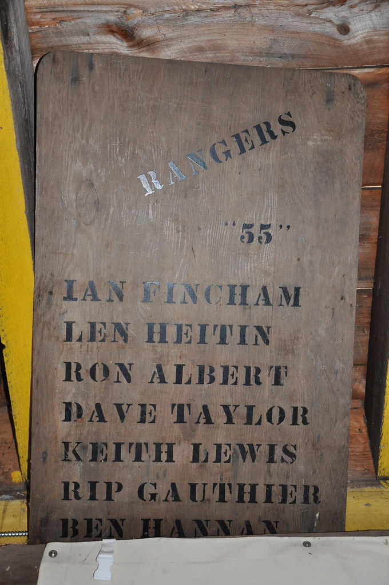
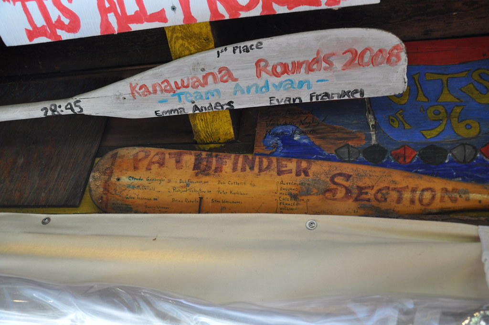
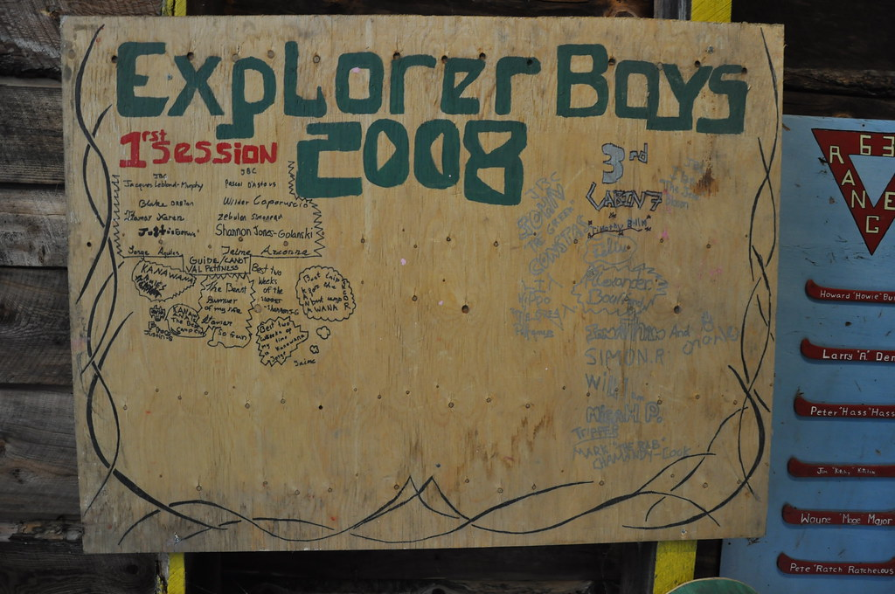
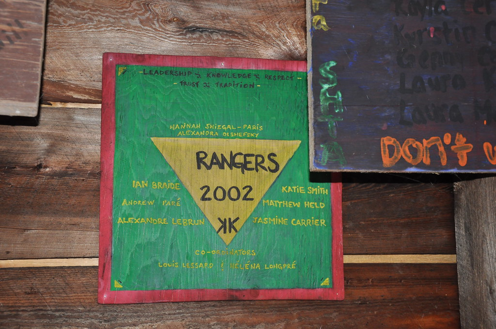
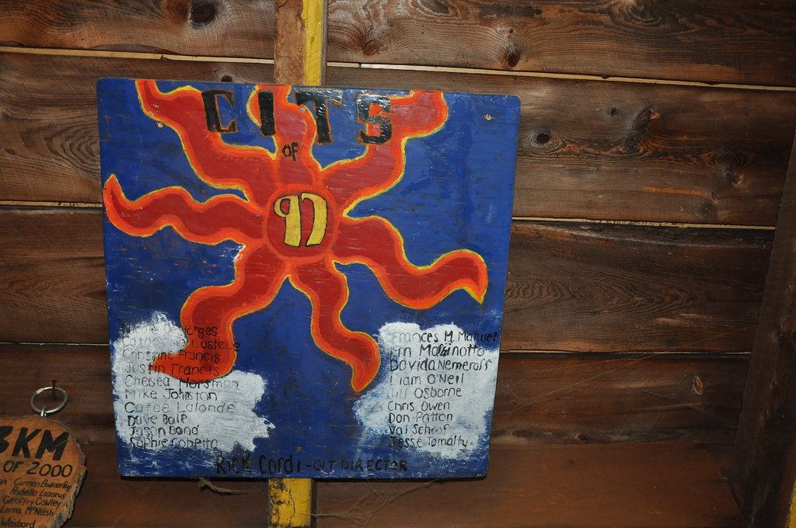

# Section Names at Kanawana

*Status: E1 Reviewed | Sources: McMorris (2023) Ch1, KB section_names, YMCA Quebec website (2026)*
*Last Updated: 2026-07-09 (Batch 6 research pass: Rangers confirmed to predate the 1959 renaming rather than follow it; a specific 1974 Gazette clipping identified as a lead for the gender-reassignment date, though paywalled)*

Kanawana's original age groupings were straightforward: Juniors (12 to 14) and Seniors (14 to 17). Two groups, one dividing line. By 1930, the camp had added a Juveniles section for boys aged 10 to 12, recognizing both the demand from younger families and the practical reality that a ten-year-old and a sixteen-year-old do not belong in the same program. The 1935 staff list reflects this three-section structure, with separate directors for Juveniles (Lorne Hamilton), Juniors (Ernie Taylor), and Seniors (Howie Langille).

In 1930, ten-year-olds were admitted for the first time and the Juvenile section (ages 10 to 12) was created.^mc The age range continued to creep downward; by the early 1940s, eight-year-olds were allowed and the youngest campers had their own section: Bantams, covering ages 8 to 10.^mc This brought the total to four sections, roughly dividing the camp population into two-year age bands from 8 through 17. The names at this stage were functional rather than evocative. Bantam, Juvenile, Junior, Senior. They told you where a boy stood in the camp hierarchy and nothing more.

That changed in 1959, when the camp renamed all four sections. The new names drew on the imagery of the Canadian wilderness and the fur trade: Pioneers (8 to 9 year olds), Woodsmen (10 to 11), Coureurs de Bois (12 to 13), and Pathfinders (14 to 15). The shift was deliberate. Where the old names were bureaucratic age-sorting labels, the new ones placed each camper within a narrative of frontier experience, from the cautious beginner (Pioneer) to the seasoned traveller (Pathfinder). The renaming coincided with the camp's expansion into La Verendrye Park for its canoe trip program that same year, and the two developments share a common impulse: an intensified identification of Kanawana with the voyageur tradition and backcountry competence.

The 1959 names survived. More than six decades later, all four are still in use at the camp, though the age ranges and organizational logic have shifted considerably. Where the original system sorted boys by age into two-year bands, the current structure — in place since at least the early 1980s — uses the same names to organize campers by gender. Pioneers encompasses girls aged 7 to 12, while Woodsmen covers boys in the same age range. These two make up the Junior sections, housed in cabins. In the Senior sections (platform tents), Coureurs de Bois serves boys aged 13 to 15, while Pathfinders covers girls of the same age. The Mountaineers section, established in 2022, provides a gender-neutral Senior section for campers aged 13 to 15. Beyond the core sections, the camp runs specialized programs: Voyageurs (an all-gender long canoe trip program), Trailblazers (the CIT/Leaders-in-Training program, ages 16-17), and Foresters (canoe trip leader specialization).

The persistence of names like Pioneers and Coureurs de Bois, even as their meaning has been remapped onto entirely different organizational principles, is itself a small piece of evidence about how camp traditions work. The words outlast the systems they were designed to label.

The "Rangers" program name is absent entirely from the McMorris thesis, which exhaustively documents Kanawana's 1894-1967 primary sources and the four core 1959 section names in detail — confirming Rangers was never one of them. Combined with the earliest dated Rangers artifact in the archive (a 1955 plaque), this means Rangers was already an established, separately-named program four years *before* the 1959 renaming, not introduced after it as previously assumed. "Trailblazers" and "Foresters" remain entirely undated: neither appears in the McMorris thesis or any pre-1980s primary source checked, only in current (2026) YMCA program pages.

## Section and Program Directors

Beyond the Camp Director who ran the whole operation, individual sections and programs had their own named leadership, documented on the dining-hall and canoe-trip plaques campers made each summer. The Rangers program (see Programs and Activities) was run by a rotating cast of "co-ordinators" or "Masters": John Lummis in 1959, Louis Lessard and Hélène Longpré in 2002, François Goulet-Lessard and [-] Tanguy in 2003, Jen Kaufman and Liz Kolinski in 2004, and Julian Dobie, Hannah S-Paris, and Matt Iviott in 2005. The CIT (Counsellor-in-Training) program had a documented "Directress" or "Director" in most seasons from the 1970s onward: Lynne Robinson (1975), Sophie Caisse and Simon Heller (1993), Simon Heller again with Paula Cussen and Wendy (1995), Rick Cordi (1997), and Maria English (1999-2000, alongside a separately credited "CIT Program Director: Manuel"). Reiko Webster, credited "Our Beloved Director" in 1992, had herself been a named CIT on the 1986 plaque six years earlier — one of several camper-to-CIT-director career arcs the plaques preserve. The Leaders-in-Training (LIT) program was directed by Avigail Aronoff and David Leduc in 2002, the year before Leduc went on to a one-summer stint as on-site Camp Director. Voyageurs had a "Capitaine" (Lorna McNeish, 2000) and later a titled "Section Director" (Matt Hamerman, 2006); JBC (Junior Boys' Camp) and the Senior Girls/Lookout section each had a titled "S.D." in 2007 and 2008 respectively (Durga Chew-Bose and Bex Finnigan Reisler). The full roster, with sources, is in the Section and Program Directors table of the [[people/directors-index|Directors and Staff of Camp Kanawana]] index.

## Related Articles

- [[history/coeducation-gender|Coeducation and Gender at Kanawana]]
- [[traditions/programs-activities|Programs and Activities]]
- [[traditions/traditions-and-culture|Traditions and Culture at Kanawana]]
- [[people/a-ross-seaman|A. Ross Seaman]]

## Sources

- McMorris, Grace. *An Experience That Lasts a Lifetime: Building Modernity, Man, and Nation at the YMCA of Montreal's Kamp Kanawana, 1894-1967*. MA thesis, Concordia University, 2023. Chapter 1. [Spectrum](https://spectrum.library.concordia.ca/id/eprint/992763/)
- YMCA Quebec, "Summer Camp Kanawana" (ymcaquebec.org, 2026). Confirms Pioneers, Woodsmen, Coureurs de Bois, Pathfinders still in active use with current age/gender assignments. [YMCA Quebec](https://www.ymcaquebec.org/en/summer-camp-kanawana)
- YMCA Kamp Kanawana Facts (undated). [Internet Archive](https://archive.org/details/ymca-kamp-kanawana-facts). Confirms 1969 coeducation.
- KB: staff_1935 (section directors named by section), section_names (full evolution timeline).
- Dining-hall and canoe-trip plaques, photo-mined 2026-07-05 (f_1569-f_1739): Rangers, CIT, LIT, and Voyageurs section/program directors, 1959-2008. See [[people/directors-index|Directors and Staff of Camp Kanawana]] for the full table.
- Montreal Gazette, "Summer Camps – Kanawana" (April 18, 1974), Newspapers.com [src_gazette_1974_summer_camps_clipping]. Located but paywalled; requires operator account to read.

### R3 Verification Notes

The 1959 renaming and the four section names are sourced from McMorris citing P145 season reports (single scholarly pathway, primary archival source). Modern continuity independently confirmed via YMCA Quebec website, which lists all four names with current programming details. The earlier section structure (Juniors/Seniors by 1920s, Juveniles by 1930, Bantams by early 1940s) is corroborated by both McMorris and the 1935 staff list in the KB. The 1938 Green Triangle newsletter independently confirms the three-section structure (Junior, Juvenile, Senior) for that year.

Note: The YMCA Quebec website spells it "Coureurs des Bois" (with des). The historical term is "coureurs de bois" (with de). This article uses the historical spelling.

YMCA Quebec website (checked Feb 2026) confirms: Pioneers and Woodsmen are Junior sections (cabins); Coureurs de Bois and Pathfinders are Senior sections (platform tents). Gender split: Pioneers/Pathfinders = girls; Woodsmen/Coureurs de Bois = boys. Mountaineers (est. 2022) = gender-neutral Senior section. Specialized programs: Voyageurs (all-gender canoe trip), Trailblazers (Leaders-in-Training, age 16), Foresters (canoe trip leader specialization). Operator correction (2026-06-22): "Senior Kanawanians" is NOT a section name; this was an extraction error from the YMCA website. The four-section gender-split structure dates to at least the early 1980s.

Note: An earlier draft incorrectly stated Woodsmen covered ages 13-16. The YMCA website clearly places Woodsmen as a Junior section (7-12), parallel to Pioneers.

## Images

*The earliest Rangers section plaque in the archive, 1955. Copyright All rights reserved by Kanawana.*

*A Pathfinder section plaque, 1984. Copyright All rights reserved by Kanawana.*

*An Explorer Boys section plaque, 2008. Copyright All rights reserved by Kanawana.*

*The 2002 Rangers plaque, naming co-ordinators Louis Lessard and Hélène Longpré (f_1677). Copyright All rights reserved by Kanawana.*

*The 1997 CIT plaque, crediting Rick Cordi as CIT Director (f_1616). Copyright All rights reserved by Kanawana.*

## Open Questions

- [Re-confirmed dead end 2026-07-09, one lead found] The camp became coeducational in 1969 (per YMCA Kamp Kanawana Facts sheet). When were the section names reassigned along gender lines? The McMorris thesis explicitly places the post-1967 co-ed period outside its own scope. A specific, dated lead was found: a Montreal Gazette clipping titled "Summer Camps – Kanawana" (April 18, 1974) exists on Newspapers.com and could plausibly describe the section structure mid-transition, but it is paywalled (HTTP 403 to automated fetch) and requires the operator's own Newspapers.com account to read.
- [Partially resolved 2026-07-09] When were the additional section names (Rangers, Trailblazers, Foresters, etc.) introduced? Rangers is now confirmed to predate the 1959 core-section renaming — it is absent from the McMorris thesis's exhaustive 1894-1967 coverage, and the archive's earliest dated Rangers plaque is from 1955, four years before 1959. Trailblazers and Foresters remain entirely undated, confirmed dead ends for online research beyond current program pages.
- ~~Did the Bantam name fall out of use at the 1959 renaming, or was it replaced later?~~ [Resolved] McMorris confirms the Bantam section was replaced at the 1959 renaming, when all four sections received new names (Pioneers replacing Bantams, Woodsmen replacing Juveniles, Coureurs de Bois replacing Juniors, Pathfinders replacing Seniors).^mc
