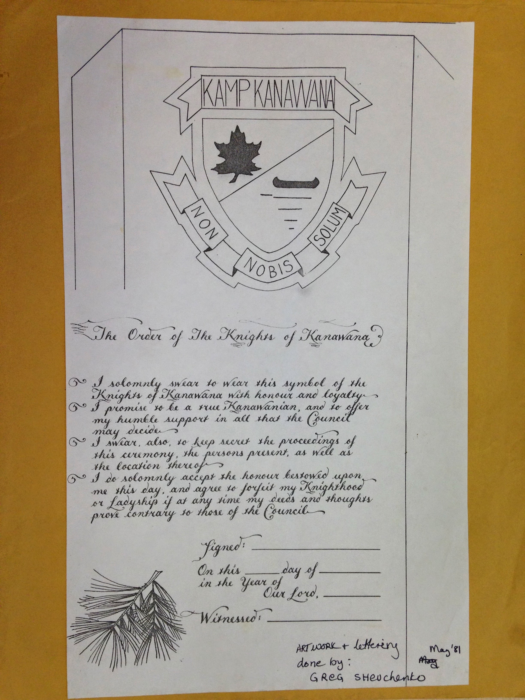
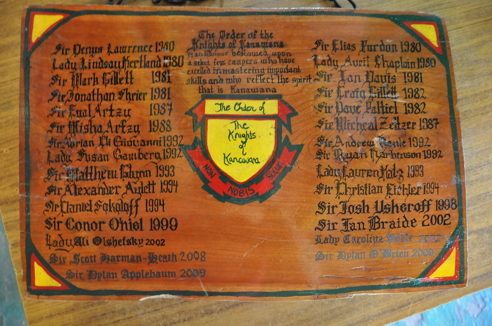
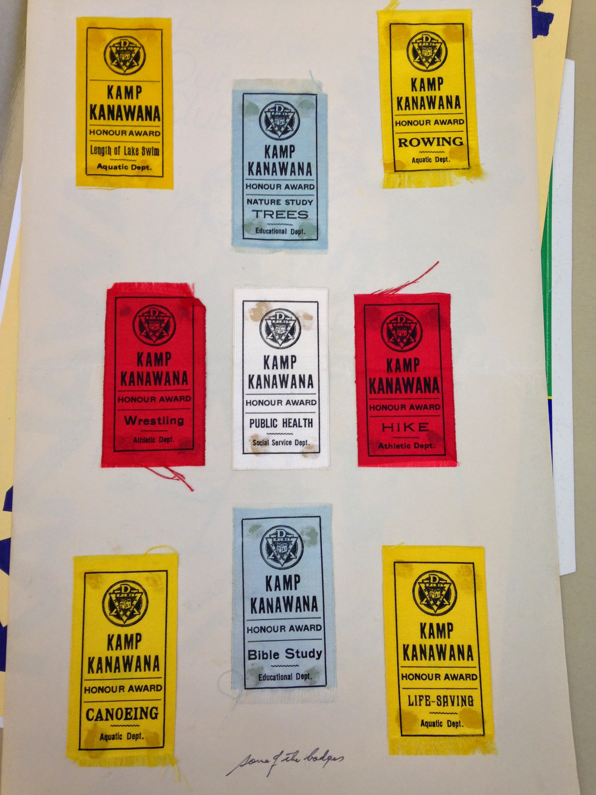
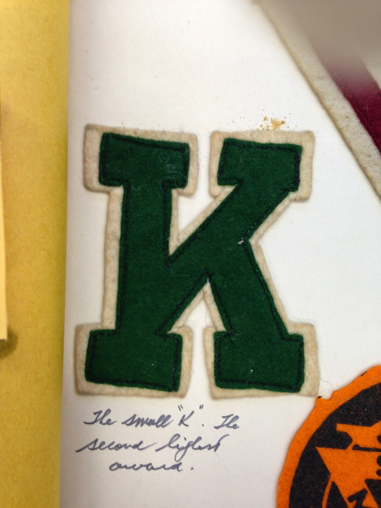
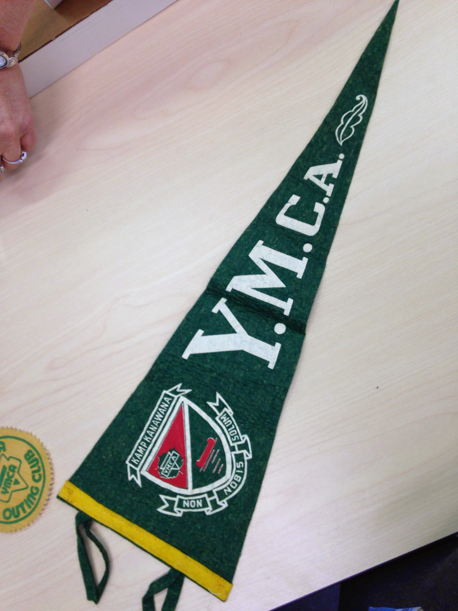

# Traditions and Culture at Kanawana

*Status: E1-reviewed | Sources: 40*
*Last Updated: 2026-09-06 (a last-day ritual the camp never printed, from an American family's memoir of the late 1920s)*

## Overview

Camp Kanawana developed a distinctive cultural identity over more than 130 years, combining YMCA "four-fold" development philosophy (physical, intellectual, social, spiritual) with camp-specific traditions, ceremonies, and lore. The camp motto "Non Nobis Solum" (Latin: "Not For Ourselves Alone"), derived from Cicero's *De Officiis* 1:22,^1 replaced an earlier motto, "Each for all and all for each," documented in the 1922 brochure.^2 A saying sometimes attributed to Kanawana captures the intensity of the camp experience: "If you have never been, you can not understand it and if you have been, you can not explain it."^20 The L&V Games, the Council Ring, the camp song, and the Pip Alumni Award form the core of the modern tradition, while archival records preserve extensive documentation of earlier practices.

## Camp Identity and Motto

The 1922 brochure recorded the camp cheer as "Yo Triumphy! Yo Triumphy! Hoben Sloben Rebecca Leeammour..." — a nonsensical chant that served as a rallying cry — and the motto as "Each for all and all for each."^2 The motto "Each for all and all for each" is also documented in a 1927 source.^4 At some point, the camp adopted the Latin motto "Non Nobis Solum" from Cicero's *De Officiis* 1:22 (44 BC), which reads in full: "non nobis solum nati sumus ortusque nostri partem patria vindicat, partem amici" ("not for us alone are we born; our country claims a share of our origin, and our friends a share").^1 ^15 Cicero was himself translating a passage attributed to Plato's letter to Archytas.^15 The camp uses the abbreviated two-word form rather than the full Ciceronian quotation; the motto is unique to Kanawana within the YMCA system worldwide — no other YMCA camp or branch uses it.^15 ^16 The earliest attestation of the Latin motto at Kanawana is in the 1993 YMCA video *Kamp Kanawana: The Experience that Lasts a Lifetime*.^3 ^4 The exact date of transition from the English to the Latin motto remains undocumented. Notably, Lower Canada College (founded 1909 in Montreal) uses the identical motto "Non Nobis Solum," adopted by founder Charles Sanderson Fosbery from his family crest; whether Kanawana adopted the motto independently or through an LCC connection is unknown.^17 Stuart McLean, who attended LCC for high school before working at Kanawana from 1969, is the only documented individual confirmed to have belonged to both institutions — a personal bridge, though not evidence of the adoption pathway.^17 LCC's founder Charles Sanderson Fosbery (headmaster 1909-1935), a classics graduate of Trinity College Dublin, adopted the motto from his family crest — the same heraldic arms borne by Lt.-Col. George Vincent Fosbery VC (1832-1907).^23 The LCC school song "Non Nobis Solum" was first sung at the 1936 return-to-school assembly, making the Latin phrase recognizable in anglophone Montreal decades before it appeared at Kanawana.^23

Research has established that the earlier English motto "Each for all and all for each" was not unique to Kanawana but a shared early YMCA camping tradition. At least two other YMCA camps used the same phrase: Camp Becket (Becket-Chimney Corners YMCA, Massachusetts, est. 1903) as one of eight camp mottos linked to director Henry Gibson (1904-1927), and Camp Hayo-Went-Ha (Central Lake, Michigan, est. 1904) as its primary rallying cry — both still in use today.^24 Kanawana's switch to the distinctive Latin motto was therefore an act of differentiation, adopting a phrase with deeper intellectual roots (Cicero) and possible local cultural resonance through the LCC connection. Carol Skinner, the 2016 Pip Award recipient, captured the motto's significance: "Never has Non Nobis Solum left my heart. I live it every day."^18 The tagline "The Experience That Lasts a Lifetime" is attested from at least 1993, when Cathy Reeves produced a nine-minute film of that name for the camp.^3

### "Kamp" to "Camp": the spelling change

For most of its history — attested continuously from a 1913 *Montreal Gazette* article through the 1921-1923 brochures, the 1941 CFCF radio broadcast, the 1979 Twynam-era Concordia correspondence, and the camp's own 1993 documentary title — the institution spelled itself "**Kamp Kanawana**," with a K.^25 A 1960s-70s staff t-shirt reading "KAMP KANAWANA / YMCA / STAFF" and a set of 1920 cloth "KAMP KANAWANA HONOUR AWARD" ribbons confirm this was the camp's own branding, not just an archival convention.^26

The switch to "**Camp Kanawana**" can be dated precisely from the camp's own website. Wayback Machine snapshots of ymcakanawana.com (fetched directly 2026-07-07) show the page title reading "YMCA **Kamp** Kanawana | Home" as of March 24, 2005, and "YMCA **Camp** Kanawana | Home" by the very next snapshot, May 10, 2005 — a six-week window. The domain's earliest snapshot (February 12, 2005) was itself a redirect stub pointing to `ymcamontreal.qc.ca/kk/kampkanawana_en.html`, whose filename preserves the old spelling right up to the switch.^27 The Montreal YMCA's own annual reports corroborate the same timing from the corporate side: the FY2001-2002 through FY2003-2004 reports consistently use "Kamp," while the 2007 report and every annual report checked through 2012 consistently use "Camp," with zero exceptions in either direction — though no 2005 or 2006 annual report has been found to confirm the transition at that level directly.^27 Every ymcakanawana.com snapshot checked through 2015 — a full decade — continues to use "Camp," with no reversion found.

A systematic search for post-2005 "Kamp Kanawana" usage (2026-07-07) found no genuine ongoing official use of the old spelling. What does surface is either a citation of an object whose own original title used it (the 1993 documentary, still catalogued and uploaded under its original name by Concordia's archives and on YouTube) or a third-party directory listing that appears never to have been updated after the camp's own rebrand (a MySummerCamps.com listing, a Saint-Sauveur tourism-directory entry, a Wikimapia place label).^28 This dates the *institutional* spelling change firmly to spring 2005 — a decade earlier than one operator recollection placed it (mid-to-late 2010s). That may reflect the informal, colloquial "Kamp" persisting in camp culture, merchandise, or staff/alumni usage well after the official website and annual reports switched — a real and common pattern where an institution's internal culture lags its own rebrand — but no dated evidence of that specific persistence has been found yet; it remains an open question.

## Spiritual Life

The YMCA's Christian character shaped daily routines throughout the camp's early decades. Morning devotions were held around the flagpole, and evening vespers provided a contemplative close to each day.^4 An open-air chapel held its first service of the 1935 season on June 30, with an organized choir documented in the 1938 Green Triangle.^5 ^6 On final nights of the camp season, conversion commitments were sought from campers.^4 The extent to which formal spiritual observances continue in the modern camp is undocumented.

## Annual Events and Competitions

The camp calendar was punctuated by recurring competitive and social events:

- **Shawbridge Meet**: An annual athletic competition involving a hike to Shawbridge, with the J. Earl Birks Trophy awarded. As of 1922, it had been running for ten years (since approximately 1912).^2 ^7 Still documented in 1935.^5
- **Silver Trophies**: Annual inter-branch competition awards; in 1923, Westmount won Athletics and Aquatics for the third consecutive year.^7
- **Boating Carnival** and **All-Camp Regatta**: Documented in 1935.^5
- **Marois Day and Marois Regatta**: Events connected to the nearby Marois lake area.^5
- **Annual Circus**: Raised $5 in proceeds during the 1935 season.^5
- **Fancy Dress Ball**: Documented in the 1938 Green Triangle.^6
- **Pyjama Parade**: An annual procession to the post office.^5
- **Eating-Out Day**: At a "haunted house" location, documented in 1935.^5
- **Torch Ceremony for World Friendship**: Held in 1935, this was part of a YMCA-wide interwar peace tradition.^5 ^22 The movement originated at a 1926 international YMCA conference where representatives from 52 nations lit a "Fire of Friendship" and passed torches to the younger generation, who declared: "We leave this fire with a vision of a great Christian fellowship, conscious of difference but resolved to love."^22 YMCA Camp Fuller (Providence) held a similar "World-Wide Friendship" ceremony in 1932.^22

## L&V Games

The L&V (Lumbermen vs. Voyageurs) Games have been held at Kanawana since 1947, adopted from YMCA Camp Pine Crest in Ontario where they originated in 1940.^8 The games occupy the final week of the camp season, dividing the entire camp into two teams: Voyageurs (symbol: paddle) and Lumbermen (symbol: axe). Alumna Leigh Evans described it as "a 3-day event in which every person, camper and staff alike, is placed on either the Lumberman or Voyageur team and every activity at camp becomes a competition."^20 By 1958, teams were decided on Friday with captains picked that evening and competition running through the week.^8 Campers made model paddles or axes to wear around their necks.^8 The role of "Capitaine" — leader of the Voyageur team — is considered one of the highest honours a staff member can receive.^9 The 78th edition of the L&V Games was held in 2025.^8

## Camp Publications

- **The Green Triangle**: A camp newsletter published from 1932 to 1940. Only the July 29, 1938 issue has been digitized.^6 ^10
- **Ka-News**: Revived from the Green Triangle tradition in 1976 and again in 1978–1982.^10
- **The Gas Bag**: A 1923 "Re-union Number" documenting the 14th season — the earliest surviving camp publication.^7
- **The Look Out**: A 1994 publication.^10
- **The Chestnut**: A 1965 publication.^10

## Ceremonial Traditions

The **Council of the Tribes of Kanawana** was newly introduced in 1935, reflecting the camp's engagement with woodcraft and "playing Indian" programming.^5 A totem pole was erected in 1927 under director Harold Cross and was still visible in 1970s photographs.^4

Documented ceremonies from the archives include:^10 ^11

- **Firelighting ceremony** (1936): Catalogued in the Concordia archives (Box HA2315) but no detailed description has been recovered.^30
- **Fire of Friendship** (1938, described): *The Green Triangle* of **2 June 1938** gives the only known description of the ceremony in performance, where the archive holds only a catalogue title: "The **Fire of Friendship** in the centre of the council ring was kindled by the torches of campers representing the **Spirits of Work, Play, Co-operation and the True Spirit of Kanawana** in a very impressive ritual. The serious part of the programme was followed by several rollicking songs led by Chief and Norm Wallace. Following the singing of 'Abide With Me' the campers slowly wended their ways through the trail to their respective tents."^35 Three of the four torch-bearing Spirits — Work, Play, Co-operation — are a plain restatement of the YMCA's developmental scheme in ritual form, with the camp's own spirit added as a fourth.
- **Firelighting by chemical flash** (1940): *The Green Triangle* of **21 July 1940** describes the mechanics: "around the rocks, an Indian brave came into view; he prayed to **Wakonda** to light the fire. Suddenly with a bright blue flash and a great hissing sound, the fire flared up."^35 The same deity name closes the c. 1925–27 Council Ring script ("Wakonda, dhe-dhu, wapdhin atonhe"), so the invocation persisted across at least fifteen years — and the blue flash and hissing show it was staged with a chemical accelerant. See [[site/council-ring|The Council Ring]].
- **Fire of Friendship / Kanawana Show** (1939): A combined ceremony and performance event, catalogued at Box HA2315.^30 In 1942, the Fire of Friendship programme was used to welcome the Boys of Tamaracouta (a Scout camp), featuring fire-lighting, hymns, and prayers.^4 The thesis's full text adds that the suggested programme itself was designed "to be used at the end of a Boy Scout day" — indicating it was adapted directly from Boy Scout ceremonial material rather than composed originally for Kanawana.^4
- **KK pageant scripts** (1931–1932): Theatrical performances for campers and visitors.
- **Council Ring closing and time capsule**: A season-end gathering where a record of the season's activities was buried, followed by a "Leaders Grand Feed."^7 Oral history confirms this tradition continued into the 2000s era: a "time capsule" containing the summer's record of important people, events, and moments is burned at the Closing Fire, then dug up the following year to be read aloud at the Opening Fire. The tradition is believed to be very old, possibly dating to the 1920s or 1930s.^21
- **Dam release**: The dam was opened at the end of the 1935 season as a ceremonial close.^5 By the mid-1980s, this ceremony was no longer practiced.^21

End-of-season traditions included all-season camper banquets (1938 and 1939), Best Camper Shields, and time capsule burials.^5 ^11

**And one the camp itself never printed.** Everything above comes from Kanawana's own paper — programmes, newsletters, catalogue titles, a thesis working from the fonds. A book about something else entirely gives a ceremony none of them mentions. Jan Elvin's *The Box from Braunau: In Search of My Father's War* (2009), describing her father's Quebec boyhood, says that at the end of a session "**early in the morning, all the campers observed the camp ritual of jumping into the cool lake bare naked**."^37 Her father and his brother went "every summer" after the family moved to Drummondville in 1926, so this is the Harold Cross years.

It is worth being plain about why this is not in the camp's own record. A camp writing to parents prints the 6.30 morning dip with its physical exercises, which this project has from the camp's own early literature, and does not print the naked one on the last morning. That is not concealment; it is what a brochure is for. The consequence for anyone using this wiki is that **the absence of a tradition from the camp's publications is not evidence that it did not exist**, and the way to find the rest of them is books by people who were not writing for the camp.

## The Camper's Oath

Every camper and their parent/guardian must read and sign a formal bilingual "Serment du campeur / Camper's Oath," explicitly tied to the motto Non Nobis Solum. Recovered copies from 2010 and 2013 are nearly word-for-word identical, indicating a stable, standardized text across at least that period. The oath commits campers to respect the natural environment, treat campers and staff with respect and courtesy, use appropriate language, respect others' belongings, follow all safety regulations (on camp and on canoe trip expeditions), abstain from alcohol, illegal substances, and tobacco during their stay or expedition, and contribute to the camp community through joy, enthusiasm, and humour. Breach of the safety provisions can result in immediate dismissal from camp or from a canoe trip expedition. The signed copy is kept on file at the camp office.^29

## The Kanawana Song

"On My Way to Kanawana" was composed and performed by Richard "Itche" Kerr.^3 The song is archived at Concordia University as catalogue item P145/SR0001 and accompanies the 1993/1996 Cathy Reeves film.^3 It was sung by a busload of Kanawana campers who greeted the CCA Centenary Journey paddlers upon their arrival in Ottawa in 1967.^12 Camp song books from 1941–1945 and song sheets/skits from 1925 and 1927 are preserved in the Concordia Archives.^11

## Honour System and Badges

The 1922 brochure documented a 32-subject Honour System, with the Large K as the highest award.^2 By 1923, this had expanded to 42 badges organized in a structured hierarchy:^7

- **Triangle Badge**: Required 8 badges across 4 categories (Athletic, Educational, Aquatic, Social Service)
- **Small k**: Required Life-Saving + 2 Aquatic, Bible Study + 2 Educational, Altruism + 2 Social Service, Hike + 2 Athletic
- **Large K**: Required 2nd-year camper, hold the Small k, instruct 3 weeks, complete 2 activities, attend Sunday service
- **Altruism Badge**: The highest badge, awarded by Director/Leaders, could not be "tried for"
- **KLS (Kanawana Life Saver)**: Based on the RLSS Award of Merit
- **The Green Triangle**: Described as "the coveted Green Triangle" in a Reader's Digest account, this award was given to campers who accomplished a specified series of feats. Charles "Smillie" Buckland was the first recipient.^19

### The M. E. Williams cups (1917–1922)

A competition this wiki had no record of, with a winners roll thirty years older than the L&V trophy's. The *Gas Bag* "Extra, Vol. 13 No. 1" of 1923 asks "**Which branch will win the M. E. Williams cups?**" and prints a two-column table of winners for **Aquatics** and **Athletics**, 1917 through 1922.^34

Crucially it was an **inter-branch** competition — North Branch, Central and Westmount contending against each other — not the intra-camp two-team format the [[traditions/lv-games|L&V Games]] adopted from 1947. Kanawana in this period drew from several YMCA branches, and the cups pitted them against one another at camp.

| Year | Aquatics | Athletics |
|---|---|---|
| 1917 | North Branch | Westmount |
| 1918 | " | Central |
| 1919 | " | " |
| 1920 | Central | " |
| 1921 | Westmount | Westmount |
| 1922 | " | " |

So in full: **Aquatics** — North Branch 1917–19, Central 1920, Westmount 1921–22. **Athletics** — Westmount
1917, Central 1918–20, Westmount 1921–22.

**Confirmed from the page image, 2026-09-06.** This table previously carried its repeats as
*[ditto]* with a note that the reading was an inference, because the OCR renders the marks as "sf", "s",
"ce", "ef" and "es". The page was fetched and read directly: the marks are plain double quotes and the
inference was right.^36 The heading above the table is a question, not a record — "Which branch will win
the M. E. Williams cups?" — so 1923 itself is not a result.

**Who M. E. Williams was is still unknown, and there are four Williamses to keep apart.** The name occurs
**exactly once** in this project's entire source cache: here. The annual reports for 1917 through 1924
mention no cup, trophy or shield in a camp context, so neither the gift of the cups nor their lapse is
documented. The reports do carry a **George E. Williams** — on the board 1913–18, an advisory member of
the Italian Y.M.C.A. board from June 1915, chairman of the committee for Work Amongst Foreigners from
January 1916 — whose initials are *G. E.*, not M. E., and none of whose recorded work is camp work. He is
a candidate on dates alone and is not identified here. Two more Williamses are traps: **Sir George
Williams**, the YMCA's founder, died in 1905 and gave his name to Sir George Williams College; and
**C. T. Williams** was the association's President around 1899–1902.^36

### Two lost honours, recovered 2026-08-14

The season reports and camp newsletters document two further Kanawana awards that appeared nowhere in this wiki.

**The Order of the Red Feather** ran from at least 1940 to at least 1965 and was tied to the Council Ring ceremonies. It worked by degrees: the *Green Triangle* of 29 July 1940 reports under "RED FEATHER TESTS PASSED" that "Alec Cherney has finally succeeded in passing his **third degree**, thus entitling him to become a full member of the Order of the Red Feather. This coveted honour is very rare indeed, and to attain it requires a good deal of hard industrious work."^33 The order survived the collapse of the camp's "Indian lore" programming: a 1965 camp publication still refers to "the man in the Red Feather" and to "a Red Feather Revue."^33 What the three degrees tested, and when the order lapsed, are undocumented.

**The Golden Arrow** was instituted in 1965 — the report announcing it explains both the award and, unusually, what it was designed *not* to be: "At the closing camp fire he was presented with a 'Golden Arrow' which is an award that has been instituted at camp this summer and presented at the discretion of the staff to any boy in camp who shows extraordinary personal achievement during his stay. **This is not a 'popularity poll'** but an award that is given on recommendation only."^33 The first recipient described is a boy named Gordon — a foster child, almost totally blind, who "learned to go off the high dive at camp."

Both belong to a pattern this wiki can now see across a century: Kanawana kept inventing named honours. The Large K and Altruism badge (1922–23), the Green Triangle, the Red Feather (by 1940), the Golden Arrow (1965), [[traditions/order-of-owens|the Order of Owens]] (1976), the Knights of Kanawana (1979), and the Walden Solos (1982) are seven distinct recognition systems, most of which ran for decades and then quietly stopped.

## The Pip Alumni Award

The Pip Alumni Award was established in 2007 in memory of Philip "Pip" Caddell (1913–2004), a Kanawana camper in 1928, WWII Canadian Army officer, and community volunteer, and his grandson James Caddell (1973–2005), a camper and counsellor from 1983 to 1991 who became a UN Peacekeeper and public servant before dying of altitude sickness in Bolivia.^13 The award recognizes alumni who embody camp values.

Known recipients include: Richard "Itche" Kerr (2007, composer of the camp song), Richard Patten (2008, former Ontario cabinet minister), Stuart McLean (2009, CBC broadcaster), Bruce Netherwood (2011), John Cleghorn (2012, former CEO of the Royal Bank), the late Sam Lazarus and family (2013, posthumous), Jeniene Phillips Birks (2014), Terry "Aislin" Mosher (2015), Carol Skinner (2016), Chris Adam (2017), Marina Sharpe (2018), and Dr. James Orbinski (2024). No 2010 recipient is documented.^13 ^14

### The Order of the Knights of Kanawana

The Knights of Kanawana was proclaimed, in the charter's own words, "in this Year of Our Lord Nineteen Hundred and Eighty," establishing "a select group of Kanawanians who upon proving themselves worthy, will then become Ladies and Knights of the Land." Aspirants would be "challenged Aquatically and Terrestrially, Morally and Intellectually," judged by a council only after every challenge had been met, and invested "in a secret ceremony, at the discretion of the council." Those invested "shall retain their positions of honour forever."^32

**The founding year is 1979, not 1980.** The camp's own 1988 report dates it under Programme Highlights: "**1979** Knights of Kanawana is instituted. This is a recognition of campers who have acquired an advanced level of various outdoor skills."^33 The charter's "Year of Our Lord Nineteen Hundred and Eighty" is the year the charter document was drawn up, one season after the order itself began — the same 1988 list separately dates the Order of Owens to 1976 and the **Walden Solos** to 1982 ("a programme that enables CITs to participate in a 48 hour controlled solo experience"), and adds that as of 1988 "all the programmes and activities listed here are still in effect at Kanawana." An Arthurian all-camp day, "Sir Kay, or Arthur's Lost Knight," ran in 1987 — presumably built on the Knights' framing, and rated by the director as "slightly less than mediocre."^33

The charter sets out **six challenges**, documented here for the first time — the KB previously held the order's oath text and its 1980–2009 roll of knights, but not the criteria by which they were earned:^32

1. Participate in at least **two five-day canoe trips**, displaying leadership in trip preparation and planning, en route, and in the campsite.
2. Achieve one **A** and one **B** in kampcraft and canoeing, plus **C**-level standing in other approved areas — sailing, orienteering, archery, rock climbing among those named.
3. Complete a **distance swim of at least two miles**.
4. **Assist in teaching an interest group** throughout an entire session.
5. **Contribute something of permanence to camp** — the charter's own examples are "a substantial part of a totem pole, or a bridge."
6. Learn something of the environment: be able to **identify six different trees and three edible plants**.

Taken together these criteria are notable for how closely they track the camp's documented programming — canoe tripping, the badge/skill grading system, the Council Ring and totem-pole construction tradition, and environmental education — making the Knights less a ceremonial honour than a capstone assembled from the camp's own curriculum. Challenge 5 in particular ties the order directly to the physical fabric of the site.

Two further details are legible on the charter itself.^32 First, challenge 2 shows the camp operating a **lettered A/B/C skill-grading system** across named activity areas — sailing, orienteering, archery and rock climbing are listed by name, alongside kampcraft and canoeing — a more granular scheme than the count-based badge system otherwise documented here, and the clearest surviving statement of how camp skills were ranked. Part of that clause, including what appears to be a ball-game activity name and an equivalence notation, is not legible in the available photograph.

Second, the charter spells the camp "**Kamp**" in challenge 5 ("contribute something of permanence to Kamp"), consistent with the K-spelling being the camp's own usage in 1980–81 and with the transition to "Camp" not occurring until spring 2005 as established above.

The charter is a **birchbark sheet**, not paper: a painted black lake-and-island scene with conifers and a lone standing dead tree occupies the upper half, pressed maple and fern leaves run down both margins, the proclamation and challenges are hand-lettered in two columns below, and a drawn log carrying further lettering closes the foot of the sheet, signed and dated 1981. The medium is itself in keeping with challenge 5's ethic — the document is made of the woods it describes.

The order overlaps in membership with [[traditions/order-of-owens|the Order of Owens]]: Denys Lawrence was an Owens recipient in 1977 and among the first knights in 1980, and Dylan Applebaum was knighted in 2009 and received the Owens in 2010. Whether the two honours are formally related is undocumented.

**The roll itself.** Twenty-nine people were invested between 1980 and 2009, each named on a dining-hall board with their year and the title Sir or Lady. This wiki recorded three of them until the [[meta/plaque-audit|plaque audit]] of August 2026 recovered the full list. The roll, the cross-references it opens up, and what its considerable gaps might mean are set out in **[[traditions/knights-of-kanawana|The Order of the Knights of Kanawana]]**.

## "We are all Kanawanians": a counsellor's account, 2004-05

The YMCA of Greater Montreal's annual report for 2004-2005 profiles **Ayunda Dube**, and it is the
only first-person account of arriving at Kanawana as a counsellor that this project holds from any
year. A native of **Zimbabwe**, he came to Montreal as a refugee at nineteen and found "his first
home away from home and contacts at the Downtown YMCA"; three years later he was asked to become a
counsellor at the camp and agreed "without hesitation".^38

What he says about the first day is the part worth keeping, because the camp's own literature never
puts it this way. **"After having said 'yes', I was scared — scared of being the only black guy at
the camp — and of not being accepted by the other counsellors."** He had never been to a summer
camp. On the first day the fear "was immediately dispelled": the counsellors "came from all over in
the world. There were no racial or cultural distinctions in the group. **At Kanawana, the only
culture that exists is the camp culture. We are all Kanawanians.**"^38

**Two cautions.** This is a testimonial published by the association in its own annual report, so it
is the camp describing itself through someone it chose to profile, and it reads as such. And it is
one person's account of one year, which is what makes it valuable and also what limits it: nothing
here says the counsellor body was as diverse in any other season, and this project has no other
account to set beside it.

## Images

*The 1981 induction document for “The Order of the Knights of Kanawana” (artwork and lettering by Greg Shevchenko, May 1981), giving the full oath text (f_1567). Copyright All rights reserved by Kanawana.*

*A dining-hall roll board listing knighted campers by year, 1980-2009 (f_1565). Copyright All rights reserved by Kanawana.*

*A group of c.1920 honour-award ribbons spanning several departments. Copyright All rights reserved by Kanawana.*

*The felt “small K” — the second-highest honour award, 1940s. Copyright All rights reserved by Kanawana.*

*A felt YMCA pennant bearing the camp crest and the motto “Non Nobis Solum.” Copyright All rights reserved by Kanawana.*

## Open Questions

1. [Critical, re-confirmed dead end 2026-07-09] When did the camp adopt the Latin motto "Non Nobis Solum" in place of "Each for all and all for each"? The English motto is documented in the 1922 and 1927 brochures. The Latin motto is first attested in the 1993 documentary. Even the McMorris thesis, with full archival access, could not narrow this window. A concrete physical-archive target now exists: Concordia's Box HA1874 holds individually itemized (but undigitized) camp brochures from 1950, 1959, [1960s], 1964, 1965, [1968?], [197-], 1978, 1982, and 1983 — inspecting these, particularly the pre-1993 ones, is very likely the only way to narrow the transition window.^30 Note: "Each for all — all for each" is also the motto of Camp Becket (Becket-Chimney Corners YMCA, est. 1903), suggesting a shared YMCA camping tradition.
2. ~~[Critical] Which pre-WWII traditions survived into the modern era?~~ [Partially resolved] Oral history (2026-06-13) confirms: the Council Ring ceremonies (Opening/Closing/L&V fires), the time capsule burial/retrieval tradition, the section system (renamed 1959), and the Kanawana Marching Song all survived. The dam ceremony did not survive past ~1985. The Shawbridge Meet, Pyjama Parade, and Eating-Out Day/Haunted House status are unknown.
3. ~~[Important] What was the "Torch Ceremony for World Friendship"?~~ [Resolved] Part of a YMCA-wide interwar peace tradition originating at a 1926 international conference. Camp Fuller (1932) and Kanawana (1935) both held versions.
4. [Important, re-confirmed dead end 2026-07-09] When did the Shawbridge Meet end? It ran from ~1912 through at least 1935. A direct fetch of Concordia's 12A finding aid (1895-1982) and QAHN's dedicated Shawbridge-history article both confirm zero mentions of the meet; the McMorris thesis full text likewise contains zero "Shawbridge" mentions. This is now a confirmed dead end for free online sources — only a BAnQ numérique login/library-card search of the Montreal Star/La Presse (blocked to this tool by paywall) or a direct Concordia annual-report request for the 1936-1946 range could resolve it.
5. [Important, re-confirmed dead end 2026-07-09] What are the details of the firelighting ceremony (1936) and fire of friendship (1939)? Both are confirmed to be catalog-title-only entries in Concordia's Box HA2315, with no descriptive content in the finding aid itself.^30 One new detail was found: the Fire of Friendship's suggested programme was designed "to be used at the end of a Boy Scout day," per the McMorris thesis (see Ceremonial Traditions above) — but the 1936 firelighting ceremony itself remains wholly undescribed online.
6. [Nice-to-have, re-confirmed dead end 2026-07-09] Are there other issues of the Green Triangle beyond the 1938-07-29 copy? The full run 1932–1940 is in the Concordia Archives (Box HA1874), but the public finding aid lists it only as a single undifferentiated box-level entry — individual issue dates are not itemized online. Only five total items from this collection are digitized on Internet Archive (the 1923 brochure, 1935 chronicle, the one 1938 Green Triangle issue, the 1941 CFCF broadcast, and a previously uncited May 1980 "Ka-News" issue, which contains no motto/Shawbridge-relevant content). A direct request to Concordia Records Management for the box's item list is the only remaining path.
7. [Nice-to-have, re-confirmed dead end 2026-07-09] Did "Kamp Kanawana" persist informally (merchandise, staff/alumni culture, signage) after the official spring-2005 spelling change to "Camp"? A fresh sweep across Facebook, Instagram, TikTok, Reddit, Etsy, eBay, Worthpoint, and Wikimapia found no dated evidence of post-2005 informal "Kamp" usage — every hit is either a citation of an object whose own original title used the old spelling, or an unrelated legacy URL slug. One operator recollection places the change in the mid-to-late 2010s — a decade after the documented institutional switch — which may reflect informal persistence not yet found in any dated source, but this remains unconfirmed after two independent search passes.

**The staff turned the motto into an organisation, and it reached Haiti.** The Montreal YMCA's
annual report for the year ended 31 May 2003: "The Kamp's summer staff founded a **volunteer group
called Non Nobis Solum** (Kanawana's motto, which means 'not for ourselves alone') whose goal is to
**organize community outreach projects and raise funds to sponsor youth in our partner YMCA in
Haiti**."^39 Nothing else in this project mentions the group, a Haitian partner YMCA, or what became
of either. It is the only instance found so far of Kanawana staff constituting themselves as a body
outside the camp's own structures.

**And the Haitian partner has a name and a date.** The previous year's report announces it: under
"**International Programs — Inauguration of the YMCA of Haiti**", "the new YMCA in **Port-au-Prince**
began its activities with the opening of the **Konbit Youth Centre**", the Creole word *konbit*
meaning the pooling of community resources.^40 So the association opened a YMCA in Port-au-Prince in
2001-02, and Kanawana's summer staff formed a group the following year to raise money for youth
there. **The two reports are one year apart and this article joins them; neither says the other's
name**, and no source read here follows the group or the partnership past 2003.

**Two more things the same "Year of Firsts" records**, neither of them anywhere else in this
project. In November, "a large number of the summer campers met up again at the **Westmount YMCA**
for **Kamp Kabaret** — an evening of songs, skits and laughs", an off-season reunion of campers.
And "**Kanapalooza** was another first for the camp that could well become an annual event.
**Monitors past and present staged a benefit concert at Club Soda and raised $2,000** for Kamp
Kanawana."^40 Whether either was ever held again is not known here.

## Related Articles

- [[traditions/programs-activities|Programs and Activities at Kanawana]]
- [[traditions/lv-games|L&V Games (Lumbermen vs. Voyageurs)]]
- [[site/council-ring|The Council Ring]]
- [[traditions/section-names|Section Names and Age Groups]]
- [[people/directors-index|Directors of Camp Kanawana]]
- [[history/centennial-1967|The 1967 Centennial and Kanawana]]
- [[traditions/camp-songs-cheers|Camp Songs, Cheers, and Musical Traditions]]
- [[traditions/myths-and-legends|Kanawana Myths and Legends]]
- [[traditions/order-of-owens|The Order of Owens]]

## Sources

1. YMCA Quebec, "Camp YMCA Kanawana," https://www.ymcaquebec.org/en/summer-camp-kanawana
2. Kamp Kanawana Brochure 1922, Internet Archive.
3. Concordia University Archives, YMCA of Montreal Fonds P145/12B04 (Communications).
4. McMorris, Grace (2023). "An Experience That Lasts a Lifetime." MA thesis, Concordia University.
5. "A History of Kamp Kanawana" (1935 Season Chronicle), Internet Archive.
6. The Green Triangle, July 29, 1938, Internet Archive.
7. The Gas Bag, 1923 Re-union Number, Internet Archive.
8. Pine Crest Encyclopedia Entry; YMCA Kamp Kanawana Facts.
9. Blog post on Kanawana L&V Games Capitaine role.
10. Concordia University Archives, YMCA of Montreal Fonds P145/12B04 (Communications).
11. Concordia University Archives, YMCA of Montreal Fonds P145/12B07 (Program).
12. McMorris thesis (Ch. 3).
13. YMCA Quebec, Carol Skinner Pip Award (2016); Pip Award establishment details.
14. YMCA Quebec Pip Award press releases: Mosher (2015), Adam (2017), Sharpe (2018), Orbinski (2024).
15. Wikipedia, "Non nobis solum." Cicero, *De Officiis* 1:22 (44 BC).
16. YMCA Camp Kanawana Facebook page; YMCA Quebec website. No other YMCA camp uses the motto.
17. Lower Canada College history; McMorris thesis discussion of LCC–Kanawana connections.
18. YMCA Quebec, "Carol Skinner Receives Camp YMCA Kanawana Pip Alumni Award" (2016). URL: https://www.ymcaquebec.org/en/news/als-advocate-carol-skinner-receives-camp-ymca-kanawana
19. Reader's Digest, "Camp Shapes Lives." Charles "Smillie" Buckland account of the Green Triangle award.
20. Leigh Evans blog, reflections on Camp Kanawana experience.
21. Oral history, Matt Aronson (2026) [src_oral_aronson].
22. YMCA Europe, "Relight the Fire: The Friendship Torch Story"; Camp Fuller Archive Project, "Camp Fuller During the Great Depression."
23. LCC Lion Magazine, Fall 2024; Wikipedia, "George Vincent Fosbery"; Fosbery family heraldic records. Charles Sanderson Fosbery (BA classics, Trinity College Dublin) adopted family crest/motto for LCC in 1909. School song first sung 1936.
24. Camp Becket (Becket-Chimney Corners YMCA, est. 1903) — "Each for all and all for each" one of 8 mottos, linked to director Henry Gibson (1904-1927). Camp Hayo-Went-Ha (Central Lake, MI, est. 1904) — same phrase as primary rallying cry.
25. Montreal Gazette, July 7, 1913 (f_0607); 1921-1923 camp brochures; CFCF Radio Broadcast, June 26, 1941; Concordia 12B01 finding aid, "Camp director Dave Twynam-correspondence — 1979" (f_1748); Reeves, Cathy (dir.), "Kamp Kanawana: The Experience that Lasts a Lifetime" (1993).
26. 1960s-70s "KAMP KANAWANA / YMCA / STAFF" t-shirt and 1920 "KAMP KANAWANA HONOUR AWARD" ribbon set, photo-mined 2026-07-05 (f_1570, f_1581).
27. ymcakanawana.com homepage, Wayback Machine snapshots 2005-2015, fetched directly 2026-07-07 (f_1767, f_1768); Montreal YMCA annual reports FY2001-2002 through 2012 (f_1749-f_1751, f_1759-f_1765).
28. WebSearch sweep for post-2005 "Kamp Kanawana" mentions, 2026-07-07 (f_1770).
29. "Serment du campeur / Camper's Oath," Camp YMCA Kanawana (2010, 2013 versions), recovered via Wayback from the predecessor ymcakanawana.ca domain [src_camper_oath_2010_2013].
30. Concordia University Archives, static finding-aid pages for sub-sub-series 12A (Committees), 12B04 (Communications, Box HA1874), and 12B07 (Program, Box HA2315) [src_concordia_atom_12A, src_concordia_ymca_fonds_12B04_finding_aid, src_concordia_atom_12B07]. Direct fetch 2026-07-09.
31. QAHN, dedicated Shawbridge local-history article; Internet Archive, "Ka-News," May 1980 [src_ka_news_1980]. Both checked directly 2026-07-09, no Shawbridge/motto content found.
32. Photograph of the birchbark charter of the Order of the Knights of Kanawana (proclaimed 1980; document dated 1981), supplied by the operator 2026-08-14 [src_photo_knights_charter_challenges]. Source of the six challenges and the proclamation text.
33. Kamp Kanawana season reports and newsletters in the Concordia-digitized YMCA of Montreal fonds: *The Green Triangle*, 29 July 1940 (Red Feather); the 1965 camp publication *The Chestnut* (Golden Arrow, Red Feather Revue); *Kanawana… A Place to Grow*, 1988 (founding dates for the Order of Owens, Knights of Kanawana and Walden Solos); *Kamp Kanawana Director's Report 1987* [src_ia_ymca_montreal_fonds_collection, src_ia_kanawana_place_to_grow_1988, src_ia_kanawana_report_1987].
34. *The Gas Bag*, "Extra, Vol. 13 No. 1" (1923), Kamp Kanawana official paper (Internet Archive, Concordia-digitized fonds) [src_ia_ymca_montreal_fonds_collection].
35. *The Green Triangle*, issues of 2 June 1938 and 21 July 1940 [src_ia_green_triangle_collection]. Full-text read of the verified 38-issue corpus, 2026-08-25. See [f_2281].
36. The 1923 *Gas-Bag Extra*, page 1, **read from the page image** on 2026-09-06 [src_ymf_the_gas_bag_extra_vol_13_no_1]; and the YMCA of Montreal annual reports 1913–1924 for the Williams disambiguation [src_ia_ymca_montreal_annual_reports_collection]. See [f_4925], [f_4926].
37. Jan Elvin, *The Box from Braunau: In Search of My Father's War* (New York: AMACOM, 2009), Internet Archive scan leaf 296 [src_elvin_box_from_braunau_2009]. **One passage only**, reconstructed 2026-09-06 from thirty-eight overlapping Open Library search-inside queries and walked to a subject boundary in both directions; the book is lending-restricted, page images return HTTP 403, and it has not been read. Cached with its queries at `sources/cache/openlibrary-search-inside/2026-09-06-two-family-memoirs-elvin-and-torge.txt`. See [f_4952].
38. YMCA of Greater Montreal annual report 2004-2005 [src_ymf_sgw_ymca_annual_report_2004_2005], the "People with Strong Values" profile of Ayunda Dube. Read 2026-09-06 under p_454. A SELF-AUTHORED PUBLISHED TESTIMONIAL, given by name to the association for its own annual report, not a third-party assessment of a private individual, so the embargo procedure for personal assessments does not apply.
39. Montreal YMCA annual report 2002-2003, year ended 31 May 2003 [src_ymf_sgw_ymca_annual_report_2002_2003]: the Non Nobis Solum staff volunteer group. Read 2026-09-06 under p_454.
40. Montreal YMCA annual report 2001-2002 [src_ymf_sgw_ymca_annual_report_2001_2002], "YMCA Kamp Kanawana - A Year of Firsts" and the International Programs page. Read 2026-09-06 under p_454.
