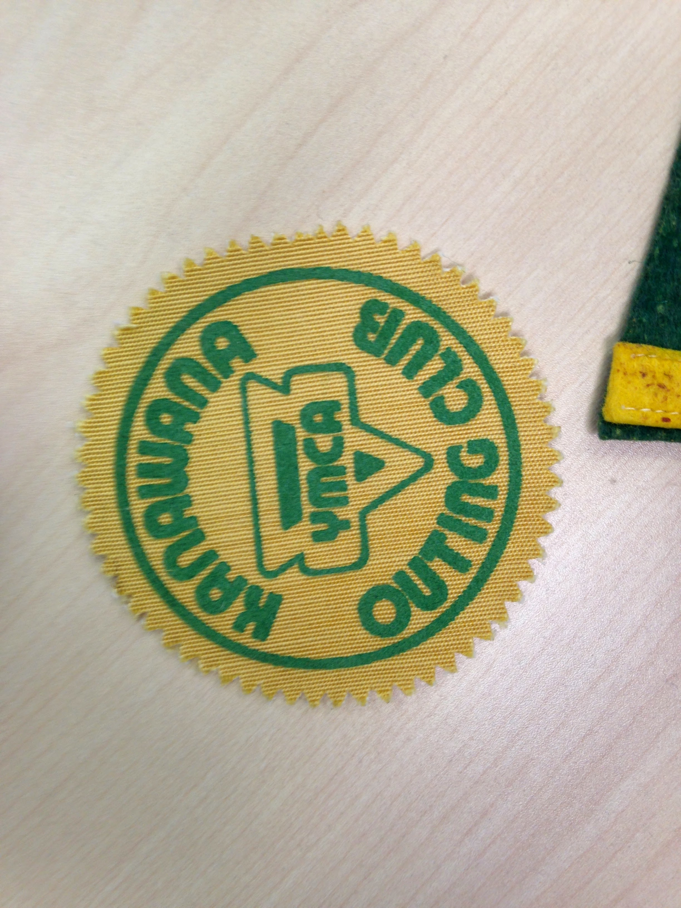

# Winter and Year-Round Programming

*Status: E1-reviewed | Sources: 19*
*Last Updated: 2026-09-06 (a family ski day at capacity in the winter of 1969-70)*

## Overview

Camp Kanawana's winter activity is usually described — including by earlier versions of this article — as beginning in the 1970s. That is where the *narrative* evidence starts, and until 2026-09-06 the 1971-72 ski tow below was the earliest step this project could describe. **It no longer is** — see the section immediately below, where the association's annual reports describe the 1940s ski camp the finding aid only names. But the Concordia finding aid lists **"Winter ski camp records — 1945-1947"** inside Kanawana's own Program sub-sub-series (P0145/12B07), twenty-five years earlier, and a **"Kanawana [Winter] Outing Club"** file running to 1979 beside it.^10 A finding-aid title proves the records exist and are filed as Kanawana programme material; it does not prove where the skiing happened, and the files themselves have not been read. So the framing here has changed: winter use is documented from the 1940s and *described* from the 1970s, and the gap between those two statements is a reading task, not a fact.

*(A fragment reading "and by 1996 it offered year-round residential operations" sat at this point in the paragraph, left behind by an earlier revision with no sentence in front of it. Removed 2026-09-06; the 1996 claim is made properly, and with its two readings distinguished, in the Timeline below.)*

The camp's "green shift" (2006-2009) repositioned it as a three-season environmental education facility, and the YMCA claims the transformation enabled it to serve "four times more young people" than before.^1

## The 1940s ski camp, now described rather than merely listed

The finding-aid title above has a matching description in the association's own annual reports, which turns a file name into an account of what happened.

Of the winter of 1944-45, the report for the year ending 31 March 1945 says only that "**several parties of skiers used the camp in winter**."^15 Two years later there is detail: "**Considerable use was made of the camp property during the winter for skiing. Eighteen boys and leaders spent a week at camp during the Christmas vacation, and 45 boys in several small parties spent week-ends enjoying the skiing on the hills around camp.**"^15

Sixty-three boys and leaders across one Christmas week and a run of weekends is not a winter programme in the sense the 1970s built one — no lift, no groomed slopes, no fee schedule, and the reports name no staff. But it is organised winter use of the site by the camp's own constituency, described by the association in its own annual report, a quarter of a century before the ski tow. The claim that the 1971-72 tow is "the earliest step this project can describe" no longer holds; what the tow marks is the beginning of winter operations as *infrastructure*.

## Winter 1969-70: a family ski day, already full

Between the 1940s ski camp and the ski tow of 1971-72 sits a programme this article did not have, and it was not the camp's. The Montreal YMCA's bilingual news bulletin of 29 January 1970 runs it under the heading "It's mainly because of the soup":

> West Island Branch seems to have come up with a real winner. **Its family ski program, running Saturdays at Kamp Kanawana, just can't handle anybody else.**
>
> Here's the package. **A network of cross-country trails. Firmly-packed hills for downhill runs and instructions. Skiing lessons. A well-equipped nursery, supervised by experienced baby sitters. Facilities for preparing lunch. Free soup.**^16

The French column of the same bulletin says the same: "Ce programme fonctionne déjà à pleine capacité."

**A third document, and the programme has grown to weekends.** The annual report for the year ended 31 May 1971 says it twice, once in each language: "West Island Y **ski school involved 2,137 different persons**... **Family ski weekends at Kanawana at capacity**," and "Les week-end de ski familial à Kanawana fonctionnent à pleine vapeur."^18

Two things to keep straight there. The programme has gone from **Saturdays** in the January 1970 bulletin to **weekends** by the year to May 1971. And the 2,137 is the **branch's ski school**, not Kanawana's attendance — the two sit in the same sentence and are not the same number.

So three separate documents now put an at-capacity family ski programme at Kanawana across the winters of 1969-70 and 1970-71, before the ski tow of 1971-72.

**And the camp opened the Long House that winter for families who could not pay.** Two months earlier, the bilingual release of 28 November 1969 announced it in its French column: "Poursuivant sa politique **d'aide aux familles désavantagées**, le Kamp Kanawana **ouvrira les portes de 'Long House' cet hiver**. Les préparatifs sont déjà complétés."^17

So the winter of 1969-70 had two distinct programmes running at Kanawana, and this article had neither. One was a popular Saturday ski day run by a city branch and oversubscribed. The other was the [[site/places-and-locations|Long House]] — the 1952 waterfront recreation hall, demolished in 1978 — opened under a stated policy of aid to disadvantaged families. The release gives no numbers, no dates and no organiser for it, only that the preparations were finished.

So in the winter of 1969-70 there were groomed downhill runs at Kanawana, ski instruction, a supervised nursery, and more demand than the programme could take — run by a **city branch**, not by the camp. The Timeline below dates a ski tow to 1971-72 and Winter Outdoor Family Camping to 1972-73. Those entries stand: the 1972-73 report describes *infrastructure*, a lift and two groomed slopes, which this bulletin does not mention, and "Winter Outdoor Family Camping" may be a distinct named programme. What does not stand is the shape of the story. Organised, advertised, oversubscribed winter family programming was happening here three years before the date this article gives for its beginning.

## Winterized Facilities

Front Camp houses the Farmhouse and Blockhouse, which are winterized facilities with fully equipped kitchens, living space, and electricity.^2 These two buildings enable year-round use of the site for groups of 6-26 persons during the winter months (approximately late October to May).^3

## Timeline

- **1971-72**: A ski tow was installed "to broaden the scope of winter programming," per the YMCA of Montreal's own Annual Report — the earliest documented step toward winter operations.^9
- **1972-73**: Resolved precise dating (2026-07-09) for what had only been broadly dated to "the 1970s": that year's Annual Report states a ski lift was installed, two slopes groomed for downhill runs, miles of cross-country/snowshoe trails marked, all-ages instructional courses offered, and a babysitting service enabled parents with toddlers to participate. This is the specific "Winter Outdoor Family Camping" program.^9
- **1975 to 1980-81**: Camper counts recorded in annual reports: **475 campers in 1975** ("second
  highest registration in 25 years," despite a national decline in resident camping); a
  capital-planning process for new facilities began in 1976-77; over 750 children attended by
  1980-81.^9 ^11
  *Corrected 2026-09-06: this entry read "475 campers in 1974-75", taken from the association's
  annual report for that fiscal year. The camp's own 1975 director's report says "This summer, we
  worked with 475 different children" and gives camper weeks of 1,356 for 1975 against 1,264 for
  1974, so the 475 is the **1975** season's and 1974 was the lower year. The association's
  June-to-May fiscal year is what made a report labelled 1974-75 read as a 1974 figure. The same
  correction was made in [[meta/attendance-series|the attendance series]] on 2026-09-05; this
  article had been left behind.*
- **1976**: The Outing Club is described in a **commercial Montreal guidebook**, which is the first account of it
  written for people outside the camp. Bonnie Buxton and Betty Guernsey, *Montréal Inside Out* (1976), under
  cross-country skiing: "**Kanawana Outing Club, operated by the YMCA near St-Sauveur, has 20 miles of blazed trails,
  a clubhouse and babysitting. Instruction and rentals available.**"^12 Four things follow. The club had **twenty
  miles of blazed trails** and a **clubhouse** — a size and a building this project had from nowhere. It **rented
  equipment and taught**, so the camp kept a stock of skis for public hire. It offered **babysitting**, which is the
  first thing to connect the Outing Club to the babysitting service the 1972-73 Annual Report describes for Winter
  Outdoor Family Camping — the two have been treated as separate programmes here. And it was **advertised to the
  general Montreal public** in a book people bought, not to campers' parents.
- **1977**: The club is listed by name and address in *Les pistes de ski de fond au Québec*, a provincial
  cross-country ski guide, among **clubs** rather than among camps: "**Kanawana Outing Club Y.M.C.A., 882,
  Montmorency, Châteauguay, Québec J6J 1S5**", printed between Club Mont Plante of Val-David and the
  **McGill Outing Club**.^13 Two things follow, and the second is the one worth chasing. The register it
  belongs to is a register of ski clubs, alongside McGill's — which is what the 1976 guidebook entry above
  already implied and this confirms from a different publisher. And **its mailing address is neither the camp
  nor 1441 Drummond**. It is a house in Châteauguay, forty kilometres the other side of Montreal from
  Saint-Sauveur, which on a club list means an officer's or a secretary's home. That is the **second**
  independent sighting of a Châteauguay connection: Lovell's Montreal City Directory for 1976 carried a
  second Kanawana listing under Châteauguay at **692-2801**, and 514-692 is the Châteauguay exchange (see
  [[site/the-kanawana-site|The Kanawana Site]]). Across at least 1976 and 1977 the Outing Club was run from a
  private address by somebody this project cannot name — and a Châteauguay street directory or voters' list
  for those years would name them.
- **Through 1979**: The "Kanawana Outing Club," a distinct winter hiking/trail program with its own badge (pictured below) and trail system, ran at least through 1979 (see [[traditions/programs-activities|Programs and Activities]]). A systematic check of every annual report from 1980 through 1988 found no further mention of the Outing Club, winter programming, or skiing at Kanawana — its exact wind-down date after 1979 is a confirmed dead end for online sources.^9
- **1991**: Kanawana is listed at **Saint-Sauveur**, under the YMCA of Montreal's own telephone number, in
  *Guide plein air Québec*, among the province's outdoor and camp centres.^14 A small thing on its face, and
  it took four controls to say even that: the OCR scrambles the guide's columns, and read straight the row
  puts Kanawana at **Mont-Laurier**. The rows only settle once three telephone numbers are traced to their
  institutions — the YMCA's 849-5331, the YM-YWHA's 737-6551, and a Mont-Laurier exchange — and the 'Y'
  Country Camp beside it is pinned to Huberdeau by the *Directory of Canadian Camps* for 1974. The straight
  reading fails all three rows at once.
- **1996**: The camp's own Annual Report states "this was the first time that programs were offered to groups other than summer campers" — a group of 50 Korean students spent four days in-season (summer) doing traditional camp activities. This is a genuine 1996 diversification milestone, but it describes an in-season international-group visit, not necessarily the same thing as "year-round RESIDENTIAL programming" (see below) — the two claims may be related but are not shown to be identical.^9
- **1996 (per McMorris thesis)**: Year-round residential programming began, extending the camp's operational calendar beyond the traditional summer season.^5
- **2006-2009**: The "virage vert" (green shift) transformed the camp into a three-season environmental education facility with new accommodation facilities, green sanitary installations, heat exchangers, composting toilets, and an artificial wetland system.^1
- **2010**: TELUS contributed $50,000 toward a three-season educational pavilion.^6
- **Current**: The camp offers a winter experience package (January to March) that includes snowshoeing adapted to group levels.^7

## Seasonal Rental Windows

Camp Kanawana has five distinct seasonal rental windows:^3
1. May 21-June 23: full camp package
2. June 23-August 20: summer camp season
3. August 20-October 13: fall package
4. October 13-November 22: pre-winter
5. November 22-May 21: winter (limited capacity, 6-26 persons)

## Management

David Leduc managed Camp Kanawana's summer and winter programs, including recruitment, training, and supervision of 75 employees serving 800 participants.^8

## Images

*A “Kanawana Outing Club” YMCA cloth badge, c.1960s — evidence of an off-season/outing program. Copyright All rights reserved by Kanawana.*

## Open Questions

1. ~~[Important] When exactly did Winter Outdoor Family Camping begin in the 1970s? What did it involve?~~ [Resolved 2026-07-09 as to the named programme; **qualified 2026-09-06** — a West Island Branch family ski day was running Saturdays at Kanawana and already at capacity in the winter of 1969-70, three years earlier; see the section above and [f_5101]] Winter 1972-73, per the YMCA's own Annual Report: ski lift, two groomed downhill slopes, cross-country/snowshoe trails, all-ages courses, toddler babysitting service — one year after an initial 1971-72 ski tow.
2. [Important, advanced 2026-07-09] How did year-round programming (1996) affect the camp's staffing model? A 1969 Concordia "Working paper on year-round use" shows the idea was studied 27 years earlier, directly preceding the camp's 1994-95 leadership restructuring into a year-round Executive Director plus a three-season on-site Camp Director — but no source documents the specific staffing/infrastructure changes that accompanied the 1996 launch itself; confirmed dead end for that specific detail. **[Advanced again 2026-09-06: the idea was not only studied, it was written up. The annual report for the year ended 31 May 1973 carries an item headed "All-year proposal made for Kanawana" and says "a **comprehensive proposal for expanding all season operations at Kamp Kanawana has been completed**."^19 That is twenty-three years before 1996, and it is a completed proposal rather than a working paper. The proposal itself is not in this project and the report does not summarise it — finding it is the next step. See [f_5111].]**
3. [Nice-to-have] What environmental education programming runs during the winter months specifically?
4. [Nice-to-have] How many groups use the camp annually outside the summer season?

## Related Articles

- [[traditions/environmental-history|Environmental Education and Stewardship]]
- [[traditions/programs-activities|Programs and Activities]]
- [[site/the-kanawana-site|The Kanawana Site]]
- [[site/places-and-locations|Places and Locations at Kanawana]]

## Sources

1. YMCA Quebec / Camp Kanawana promotional materials; Mediaterre (2009).
2. YMCA Kamp Kanawana Facts (undated), Internet Archive.
3. YMCA Quebec, Camp Kanawana rental information (2026).
4. *[Superseded 2026-09-06. This entry cited a knowledge-base fact id — `f_0326`, "winter outdoor family camping introduced in the 1970s" — rather than a source, and no marker in the text ever pointed to it. The claim is carried precisely, and to the documents themselves, by note 9. The entry is kept in place rather than deleted so the numbering of notes 5 to 10 does not shift under the markers already in the text.]*
5. McMorris, Grace (2023). "An Experience That Lasts a Lifetime." MA thesis, Concordia University.
6. TELUS Community Board, 2010.
7. YMCA Quebec, Camp Kanawana winter experience package (2026).
8. David Leduc LinkedIn profile.
9. YMCA of Montreal Annual Reports, 1971-72, 1972-73, 1996 [src_ia_ymca_annual_1971_72, src_ia_ymca_annual_1972_73, src_ia_ymca_annual_1996].
10. Concordia University Records Management and Archives, YMCA of Montreal fonds, Kamp Kanawana Program sub-sub-series P0145/12B07 [src_concordia_atom_12B07], as recorded in the cached full finding aid `sources/cache/web-pages/concordia-atom-kanawana-full.txt`. See [f_2379], [f_2380].
11. Kamp Kanawana director's report for 1975 [src_ia_kanawana_report_1975], and the 1970s attendance series assembled from the camp's own directors' reports. See [f_4843], [f_2434]. Cited here for the 1974/1975 correction above.
12. Bonnie Buxton and Betty Guernsey, *Montréal Inside Out* (Ottawa: Waxwing Productions, 1976), Internet Archive scan leaf 296 [src_buxton_guernsey_montreal_inside_out_1976]. **One entry only**, reconstructed 2026-09-06 from six overlapping Open Library search-inside queries; the book is lending-restricted and has not been read, and the telephone number is cut off at "849-". Cached with its queries at `sources/cache/openlibrary-search-inside/2026-09-06-mclean-notebooks-and-montreal-inside-out.txt`. See [f_4942].

13. *Les pistes de ski de fond au Québec* (1977), Internet Archive scan leaf 294 [src_veillette_pistes_ski_fond_quebec_1977]. **One club-list run only**, reconstructed 2026-09-06 from six overlapping Open Library search-inside queries; the book is lending-restricted, page images return HTTP 403, and it has not been read. The list's alignment was checked rather than assumed — J0T 2N0 is Val-David's postal code, J6J 1S5 is Châteauguay's, and 3480 McTavish is McGill's own address, and all three land on the rows the plain reading gives them. Cached with its queries at `sources/cache/openlibrary-search-inside/2026-09-06-two-outdoor-guides-1977-and-1991.txt`. See [f_4955].
14. *Guide plein air Québec* (1991), Internet Archive scan leaf 200 [src_guide_plein_air_quebec_1991]. **One run only**, and one whose columns the OCR scrambles; an earlier attempt the same day recorded nothing from it, correctly. The alignment was settled by four controls documented from inside the same corpus, all set out in the cache file above, and only then was the entry used. Lending-restricted, page images 403, not read. See [f_4956].
15. YMCA of Montreal annual reports for the years ending 31 March **1945** and **1947** [src_ymf_sgw_ymca_annual_report_1945, src_ymf_sgw_ymca_annual_report_1947]. Under the 31 March rule (f_5039) these describe the winters of 1944-45 and 1946-47. Camps sections read 2026-09-06 under p_441. See [f_5075], [f_5076].
16. Montreal YMCA bilingual news bulletin, **29 January 1970** [src_ymf_p0145_news_release_1970_01_29], the item headed "It's mainly because of the soup." Cached at `sources/cache/ymca-montreal-fonds/p0145-news-release-1970-01-29.txt`; read 2026-09-06 under p_451. See [f_5101].
17. Montreal YMCA bilingual news release, **28 November 1969** [src_ymf_news_release_1969_11_28], French column. Cached at `sources/cache/ymca-montreal-fonds/news-release-1969-11-28.txt`; read 2026-09-06 under p_451. See [f_5104].
18. YMCA of Montreal annual report for the year ended **31 May 1971** [src_ymf_sgw_ymca_annual_report_1970_1971] — the bilingual highlights spread. Its season is the winter of 1970-71 and the summer of 1970. Read 2026-09-06 under p_441. See [f_5110].
19. YMCA of Montreal annual reports for the years ended **31 May 1972** and **31 May 1973** [src_cache_sgw_ymca_annual_report_1971_1972, src_cache_sgw_ymca_annual_report_1972_1973]. Read 2026-09-06 under p_441. See [f_5111].

## Research Notes

<!-- Created as stub 2026-06-24 from existing KB facts (Phase 2 autonomous spawning). Advanced stub → draft → R3-verified 2026-06-26: VERIFY pass confirmed every claim carries an inline citation to a cached/verified KB source (f_0029, f_0326, f_0451, f_0591, f_0755, f_0853, f_1076, f_1111, f_1113, f_1478, f_1497, f_1508, f_1510); dates cross-checked (1970s winter family camping; 1996 year-round; 2006-2009 green shift; 2010 TELUS). All source facts derive from prior RALPH cycles. Remaining for E1: cross-link reciprocity check and a dedicated REVIEW pass.
E1 REVIEW PASS 2026-09-06 (p_219). Four findings, all fixed in place and all visible in the text:
 (1) a sentence fragment in the Overview, "and by 1996 it offered year-round residential operations",
     left by an earlier revision with nothing in front of it;
 (2) the 475-camper figure still dated 1974-75 here after the attendance series corrected it to 1975 on
     2026-09-05 -- the article had been left behind by its own project's correction, which is the exact
     failure the SPAN rule was written for in a different form;
 (3) source entry 4 was a KB fact id, not a source, and no marker pointed to it; kept in place, marked
     superseded, so notes 5-10 keep their numbers;
 (4) NO reciprocity: none of the four articles in Related Articles linked back. All four now do.
Every other claim was checked against its note. Advanced R3-verified -> E1-reviewed. -->
